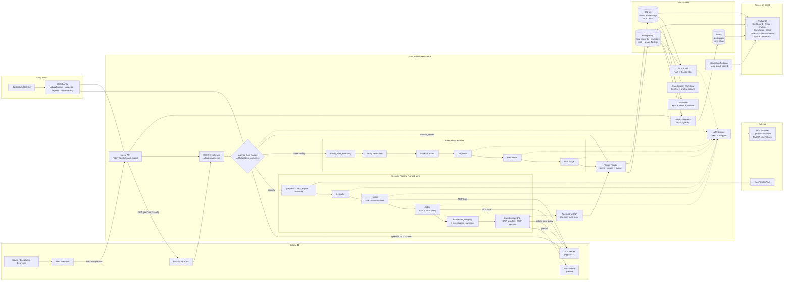

# Architecture diagram

High-level integration and data flow for the **ThinkingSOC Lite Agentic Ops Router**.

## Data flow summary

| Step | Mechanism |
|------|-----------|
| **Alert handoff** | Splunk webhook → `POST /api/v1/alerts/splunk-ingest` (sid + sample row) |
| **Full job rows** | Splunk REST `GET /services/search/v2/jobs/{sid}/results` |
| **Multi-row ingest** | Per HTTP row analysis with storage `sid` suffix (`…-1`, `…-2`) when `TSOC_INGEST_AUTO_ANALYZE=true` |
| **Classification** | LLM-only router (full alert payload + optional MCP metadata) → **Security** or **Observability** (exclusive); `manual_review` when LLM unavailable |
| **Inventory enrichment** | After routing: PostgreSQL `tsoc_users` / `tsoc_assets` / `tsoc_relationships` → `enrich_from_inventory` + risk context inside the chosen pipeline |
| **Security pipeline** | LangGraph: prepare → risk_engine → virustotal → Defender → Hunter → Judge → framework_mapping → investigation_questions → root_cause_spl |
| **Observability pipeline** | enrich_from_inventory → Entity resolution → Impact context → Diagnoser → Responder → Ops Judge |
| **VirusTotal** | IOC extraction in `virustotal` graph node → VT API v3 → compact threat intel for LLM context |
| **MCP integration** | JSON-RPC at `/services/mcp` — `splunk_get_metadata`, `splunk_run_query`, `saia_*` tools |
| **Hunter / Judge evidence** | MCP live hunt queries + SAIA ask before LLM reasoning |
| **Investigation SPL** | SAIA REST `/predict` → LLM review → MCP execute (All Time) → refine loop |
| **Admin org GAP** | Post-Security analysis: one organizational question when inventory/escalation context is missing |
| **Triage** | Priority scoring (critical/high/medium/low) + review verdict + analyst queue |
| **Correlation** | Neo4j alert graph + `graph_findings` in PostgreSQL — entity co-occurrence, campaign detection, Smart Attack Discovery |
| **SOC Chat** | RAG (Qdrant + FastEmbed) + Text-to-SQL (PostgreSQL) + session history |
| **Dashboard** | KPIs, 14-day activity timeline, triage charts, health score, system resources |
| **Investigation workflow** | Timeline reconstruction + analyst acknowledge / escalate (human-in-the-loop) |
| **Integration wizard** | Post-install Splunk/LiteLLM/MCP setup → `backend/.env` + Splunk Connection UI |
| **Devtools SDK** | Python SDK / CLI — same REST APIs as UI (`/analysis/route`, `/agents/triage`, etc.) |
| **Storage** | PostgreSQL `tsoc_records` JSONB — typed audit trail (`splunk_ingest`, `soc_analysis`, `observability_analysis`, `agentic_ops_analysis`, `soc_investigation_*`, `investigation_analyst_action`, …) |
| **LLM service** | LiteLLM wrapper — multi-provider, error classification, thinking extraction, context budget |

## Detailed documentation

| # | Document | Topic |
|---|----------|-------|
| 00–03 | [docs/](docs/README.md) | Overview, system, integration boundaries, architecture |
| 04 | [Agents & Pipelines](docs/04-agents-and-pipelines.md) | Router, Security/Observability pipelines |
| 06–07 | [HLD](docs/06-hld-high-level-design.md) / [LLD](docs/07-lld-low-level-design.md) | High/low level design |
| 08 | [Triage](docs/08-triage-priority-layer.md) | Priority scoring and queue |
| 09 | [VirusTotal](docs/09-virustotal-threat-intel.md) | IOC enrichment |
| 10 | [SOC RAG](docs/10-soc-vector-rag.md) | Chat, RAG, Text-to-SQL |
| 11 | [Environment](docs/11-environment-configuration.md) | All env variables |
| 12 | [Correlation](docs/12-correlation-graph-service.md) | Neo4j graph, findings, explorer |
| 13 | [Investigation SPL](docs/13-cim-investigation-spl-mcp.md) | SPL generation and execution |
| 14 | [Inventory](docs/14-inventory-service.md) | Users, assets, relationships |
| 15 | [Splunk MCP](docs/15-splunk-mcp-integration.md) | MCP client and SAIA tools |
| 16 | [Dashboard](docs/16-dashboard.md) | Analyst overview UI |
| 17 | [Observability](docs/17-observability-pipeline.md) | Observability pipeline detail |
| 18 | [LLM Service](docs/18-llm-service-layer.md) | LiteLLM, errors, thinking, budget |
| 19 | [Storage](docs/19-storage-persistence.md) | PostgreSQL persistence layer |
| 20 | [Investigation](docs/20-investigation-workflow.md) | Timeline and analyst actions |
| 22 | [Developer SDK](docs/22-developer-sdk.md) | Python SDK, CLI, evaluation runner |
| 23 | [Integration wizard](docs/23-post-install-integration-wizard.md) | Post-install Splunk/LiteLLM/MCP setup |
| — | [Architecture Views](docs/architecture-views.md) | 8 multi-perspective Mermaid diagrams |
