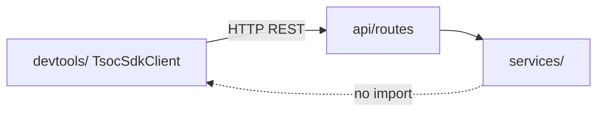
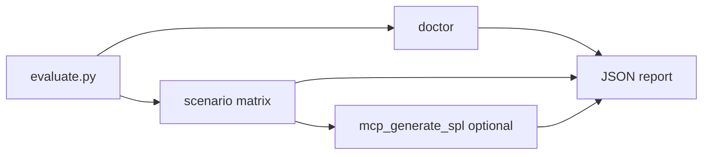

# ThinkingSOC Developer SDK

Typed Python SDK, CLI, and evaluation runner for **all** hackathon backend APIs. Product logic lives in `backend/services/`; this folder is a thin HTTP wrapper only — safe to use without changing runtime behavior.

**Full reference:** [docs/22-developer-sdk.md](../../docs/22-developer-sdk.md) (includes Mermaid architecture diagrams)

## Isolation from product runtime

The SDK is **not imported** by `services/`, `api/`, or `main.py`. It only calls the backend over HTTP.



See [architecture diagrams](../../docs/22-developer-sdk.md#architecture-position) in the full doc.

## What is included

| File | Purpose |
|------|---------|
| `client.py` | `TsocSdkClient` (sync) |
| `async_client.py` | `AsyncTsocSdkClient` (async) |
| `cli.py` | CLI for every SDK method |
| `workflows.py` | `doctor` report, `run_full_investigation` packaging |
| `transport.py` | Shared HTTP helpers (list GET, PATCH, DELETE) |
| `evaluate.py` | Scenario matrix scoring + connectivity |
| `errors.py` | `TsocAuthError`, `TsocNotFoundError`, `TsocTimeoutError`, `TsocApiError` |
| `examples/` | JSON payloads + `demo_e2e.py` |

## Quickstart

```python
from devtools import TsocSdkClient

client = TsocSdkClient(
    base_url="http://127.0.0.1:9876",
    ingest_token="your-token",  # or TSOC_INGEST_TOKEN env
)

# One-shot demo readiness
print(client.doctor()["ready_for_demo"])

# Splunk webhook equivalent
client.ingest_alert({"sid": "1.2", "normalized": {"user": "jdoe"}, "search_name": "Failed login"})

# Full chain: classify → triage → SPL → MCP status
result = client.run_full_investigation({
    "normalized": {"user": "jdoe", "host": "web-prod-01"},
    "operator_goal": "confirm lateral movement",
})
```

## Splunk MCP helpers

```python
client.mcp_run_query("search index=main | head 5")
client.mcp_saia_ask("What indexes have auth events?", additional_context="user=jdoe")
client.mcp_generate_spl({"query": "failed logins for jdoe", "index": "main"})
```

## API coverage (summary)

- **Analysis:** classify, route, run, run-by-sid, observability, agent triage, SPL suggest
- **Webhook:** `ingest_alert`
- **MCP:** status, generate, call, `mcp_run_query`, `mcp_saia_ask`
- **Connectivity:** `health`, `llm_status`, `doctor`, `run_full_investigation`
- **SOC Chat:** chat, status, conversation CRUD
- **Investigation:** timeline, analyst actions, triage queue
- **Storage / dashboard:** events, dashboard overview
- **Admin GAP:** `gap_suggest`
- **Inventory:** full CRUD + enrich
- **Integrations:** settings CRUD (admin token)
- **Graph:** health, findings, topology, attack tree, discover, operation status

See the [complete method index](../../docs/22-developer-sdk.md#complete-method-index) in the public doc.

## CLI

```bash
python backend/devtools/cli.py --help
python backend/devtools/cli.py doctor
python backend/devtools/cli.py ingest --body backend/devtools/examples/ingest.json
python backend/devtools/cli.py investigate --body backend/devtools/examples/agent.json
python backend/devtools/cli.py mcp-query --spl "search index=main | head 5"
python backend/devtools/cli.py inventory-enrich --body backend/devtools/examples/inventory_enrich.json
python backend/devtools/cli.py graph-health
```

Token: `--token` or `TSOC_INGEST_TOKEN`. Admin routes also accept `TSOC_ADMIN_TOKEN` when set.

## Evaluation (demo evidence)

```bash
python backend/devtools/evaluate.py \
  --matrix backend/devtools/examples/eval_matrix.json \
  --check-mcp \
  --out backend/devtools/examples/eval_report.json
```

Scores per-scenario agent quality, platform connectivity (`doctor`), and optional MCP SAIA SPL generation.



## End-to-end demo

```bash
cd backend && python devtools/examples/demo_e2e.py
```

## Tests

```bash
cd backend && source .venv/bin/activate
python -m pytest tests/test_devtools_sdk.py -q
```

## Optional install

```bash
cd backend/devtools && pip install -e .
```

## Notes

- Typed Pydantic models from `backend/models/`.
- Retries on 5xx/timeout only; auth errors fail immediately.
- No changes to backend services when using the SDK — HTTP client only.
