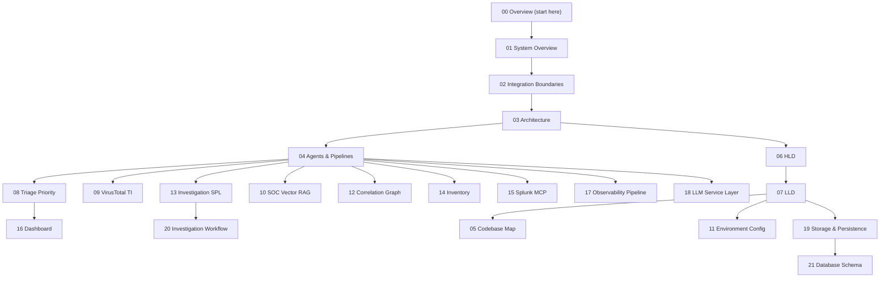

# Documentation guide (start here)

This folder is the **public structure documentation** for the ThinkingSOC Splunk hackathon repository. It explains what the system is, how Splunk and the external application connect, how analysis runs, and how the codebase is organized.

**Repository:** [github.com/Sepideh-Asadollahi/ThinkingSOC-splunk-hackathon](https://github.com/Sepideh-Asadollahi/ThinkingSOC-splunk-hackathon)

**Audience:** judges, contributors, and operators who need a clear mental model without reading every source file first.

## Reading order

| # | Document | What you learn |
|---|----------|----------------|
| **00** | [00-overview.md](./00-overview.md) | This guide — how docs fit together |
| **01** | [01-system-overview.md](./01-system-overview.md) | Problem, solution, components, repository map |
| **02** | [02-integration-boundaries.md](./02-integration-boundaries.md) | Splunk ↔ app contracts (webhook, REST, MCP, inventory) |
| **03** | [03-architecture.md](./03-architecture.md) | Runtime layers, request lifecycle, design principles |
| **04** | [04-agents-and-pipelines.md](./04-agents-and-pipelines.md) | Router, Security/Observability pipelines, AI stack |
| **05** | [05-codebase-map.md](./05-codebase-map.md) | Code graph, communities, critical flows, navigation |
| **06** | [06-hld-high-level-design.md](./06-hld-high-level-design.md) | HLD — services and end-to-end data flow |
| **07** | [07-lld-low-level-design.md](./07-lld-low-level-design.md) | LLD — APIs, schemas, sequences |
| **08** | [08-triage-priority-layer.md](./08-triage-priority-layer.md) | Post-analysis triage — priority queue, scoring rules, UI |
| **09** | [09-virustotal-threat-intel.md](./09-virustotal-threat-intel.md) | VirusTotal API v3 enrichment and threat-intel in SOC analysis |
| **10** | [10-soc-vector-rag.md](./10-soc-vector-rag.md) | SOC vector RAG — Qdrant, persisted SOC chat, session RAG, Text-to-SQL, correlation in chat |
| **11** | [11-environment-configuration.md](./11-environment-configuration.md) | Environment variables — `backend/.env` and `frontend/.env.local` reference |
| **12** | [12-correlation-graph-service.md](./12-correlation-graph-service.md) | Correlation — alert graph, findings, Graph Explorer, API |
| **13** | [13-cim-investigation-spl-mcp.md](./13-cim-investigation-spl-mcp.md) | Investigation SPL — SAIA `/predict`, MCP execute (All Time), LiteLLM refine, UI |
| **14** | [14-inventory-service.md](./14-inventory-service.md) | Inventory — users, assets, relationships, enrichment, demo seed |
| **15** | [15-splunk-mcp-integration.md](./15-splunk-mcp-integration.md) | Splunk MCP — JSON-RPC client, tool registry, Hunter/Judge evidence, SAIA |
| **16** | [16-dashboard.md](./16-dashboard.md) | Dashboard — KPIs, triage charts, activity timeline, health score, system resources |
| **17** | [17-observability-pipeline.md](./17-observability-pipeline.md) | Observability pipeline — Entity, Impact, Diagnoser, Responder, Ops Judge |
| **18** | [18-llm-service-layer.md](./18-llm-service-layer.md) | LLM service — LiteLLM wrapper, error classification, thinking extraction, context budget |
| **19** | [19-storage-persistence.md](./19-storage-persistence.md) | Storage — PostgreSQL tsoc_records, record types, persist/query, dashboard stats |
| **20** | [20-investigation-workflow.md](./20-investigation-workflow.md) | Investigation — timeline reconstruction, analyst acknowledge/escalate, human-in-the-loop |
| **21** | [21-database-schema.md](./21-database-schema.md) | Database schema — PostgreSQL tables, Qdrant collection, Neo4j graph, indexes, init flow |
| **22** | [22-developer-sdk.md](./22-developer-sdk.md) | Developer SDK — typed Python client, CLI, evaluation runner |
| **23** | [23-post-install-integration-wizard.md](./23-post-install-integration-wizard.md) | Post-install wizard — Splunk / LiteLLM / MCP, smoke test, `.env` summary |
| **24** | [24-demo-postgresql-data.md](./24-demo-postgresql-data.md) | Demo PostgreSQL moment snapshot — `install.sh` load, export, CSV fallback |

**Diagrams:** [architecture_diagram.md](../architecture_diagram.md) (repo root, Devpost integration view) · [architecture-views.md](./architecture-views.md) (8 multi-perspective Mermaid diagrams).

## Demo data vs documentation

| Path | What it is |
|------|------------|
| **`backend/data/demo/`** | Bundled **PostgreSQL demo data** (pg_dump, JSON snapshot, CSV) — loaded by `install.sh` / `setup.py` |
| **[24-demo-postgresql-data.md](./24-demo-postgresql-data.md)** | How demo data is exported, restored, and committed |
| **[12-correlation-graph-service.md](./12-correlation-graph-service.md)** | Correlation feature docs (Graph Explorer, Neo4j, findings API) |

Do not put demo **data** under `docs/` — that folder is for architecture and design Markdown only.

## What lives outside `docs/`

| Location | Role |
|----------|------|
| [README.md](../README.md) | Quick start, `install.sh`, license |
| [install/README.md](../install/README.md) | Installer modes (systemd vs background) + post-install wizard |
| [docs/23-post-install-integration-wizard.md](./23-post-install-integration-wizard.md) | Splunk / LiteLLM / MCP wizard and smoke test |
| [backend/README.md](../backend/README.md) | Run API, `.env`, Docker Postgres |
| Per-folder `README.md` | Short index for each directory (see root README) |
| `project-engineering/` | Internal build notes (gitignored, not on GitHub) |

## System in one paragraph

Splunk **10+** fires an alert and sends a **webhook** with `sid` and a sample row. The **FastAPI backend** loads full job results via **REST**, enriches alerts from **PostgreSQL inventory** (users, assets, relationships), **classifies** the alert into Security and/or Observability tracks, runs **LangGraph pipelines** with **LiteLLM** (and optional **Splunk MCP** for metadata, Hunter/Judge live evidence, and investigation SPL execute), and persists structured JSON in **PostgreSQL**. The Splunk app is webhook + index only (no CSV lookups). The product UI is external (`frontend/`).

## Conventions in these documents

- **Structural** focus: components, boundaries, and flows — not step-by-step operator runbooks (those are in `backend/README.md` and `setup.py`).
- **Splunk 10+** assumed for REST v2 job results and webhook alert actions.
- **Judge / Ops Judge** are always the final decision stages in their respective pipelines.
