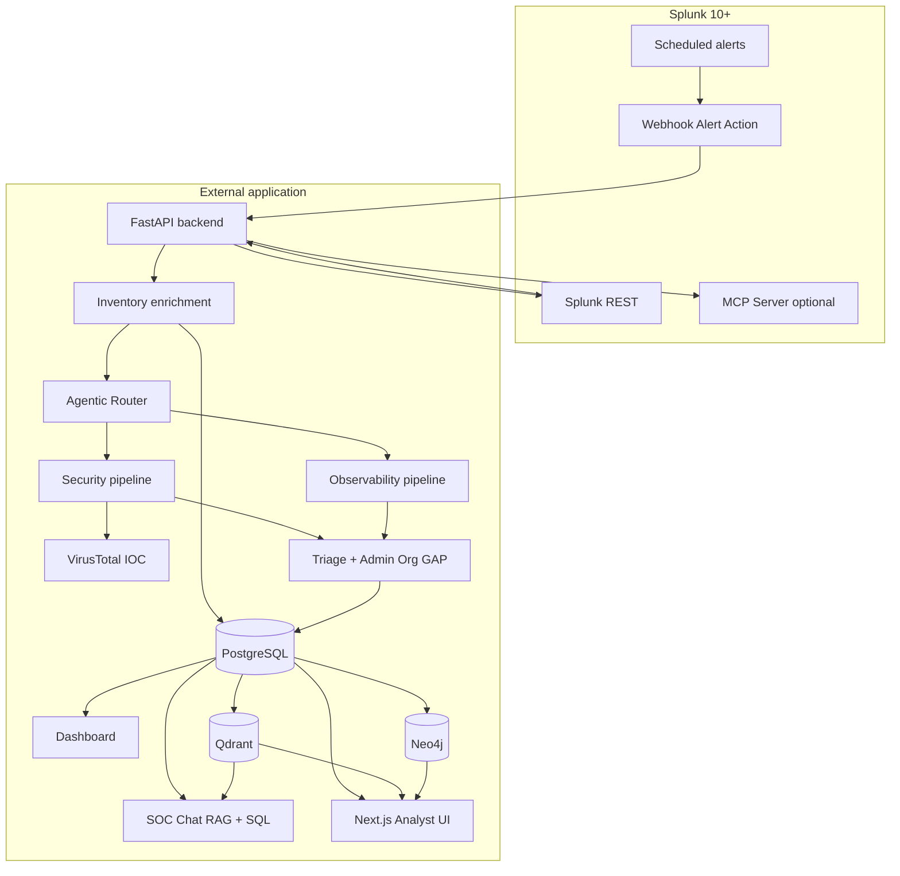

# System overview

**ThinkingSOC Lite Agentic Ops Router** is an external application that receives Splunk alerts, enriches them with full search results, resolves entities against inventory, routes each alert to **either** the **Security** **or** **Observability** agent pipeline (never both), and returns a structured verdict with optional SPL for follow-up investigation.

**Platform:** Splunk Enterprise or Cloud **10+** (webhook alert actions, REST v2 job results, optional Splunk MCP Server).

## Problem and approach

| Challenge | How this demo addresses it |
|-----------|----------------------------|
| Alert payloads are thin | Webhook carries `sid`; backend loads **all job rows** via REST |
| SOC vs Ops triage is manual | **Agentic router** (LLM) classifies into Security, Observability, or manual review — **one pipeline per alert** |
| Context is scattered | **Inventory enrichment** maps alert fields to users/assets via PostgreSQL |
| Verdicts lack structure | **Judge** (Security) and **Ops Judge** (Observability) produce final, auditable outputs |
| Org context is missing from data | **Admin org GAP** suggests one question for an administrator after SOC analysis |
| Splunk-native AI is separate | **REST `/predict`** (UI path) for investigation SPL; optional **MCP** for execute, metadata, and **Hunter/Judge live evidence** |

This repository is a **hackathon demonstration** — credible end-to-end flow, open-source friendly — not the full commercial ThinkingSOC Lite product.

## Logical components

| Component | Responsibility |
|-----------|----------------|
| **Splunk platform** | Indexes data, runs saved searches, fires alerts, exposes REST and optional MCP |
| **`ThinkingSOC_Hackathon_Splunk_App/`** | Minimal app: index metadata, webhook — **no** CSV lookups or product dashboards |
| **`backend/`** | Ingest, REST/MCP clients, inventory enrichment, classification, LangGraph pipelines, storage APIs |
| **`correlation/`** | Graph Correlation demo — Neo4j alert graph, findings, Smart Attack Discovery (`/api/v1/graph`) |
| **PostgreSQL** | Inventory tables + typed JSON audit (`tsoc_records`) + **`graph_findings`** |
| **Neo4j** | Alert / entity / incident graph for Correlation explorer (optional; docker-compose) |
| **Qdrant** | Vector embeddings for SOC Chat RAG (FastEmbed; model via `TSOC_EMBEDDING_MODEL`, default `bge-base` / `BAAI/bge-base-en-v1.5`) |
| **`frontend/`** | Next.js analyst UI (dashboard, triage, analysis, correlation, SOC chat, inventory) |
| **`setup_tool/`** | Automated venv, dependencies, Postgres, schema, inventory seed |

## End-to-end flow (detailed)

1. **Alert fires** in Splunk (scheduled search or correlation search).
2. **Webhook** posts JSON to `POST /api/v1/alerts/splunk-ingest` with at least `sid`, `search_name`, and `result` (first row).
3. **Normalize** — `normalize_splunk_ingest_payload()` builds `SplunkAlertIngest` with a stable `normalized` dict (`user`, `src`, `dest`, `host`, severity, etc.).
4. **Row buffer** (default `TSOC_INGEST_ROW_BUFFER=true`) — webhook POSTs per `sid` are deduped and debounced (`TSOC_INGEST_ROW_BUFFER_SECONDS`, default 3s) before flush.
5. **REST enrich** — on buffer flush (or immediately when buffering is off), `enrich_alert_from_splunk()` calls Splunk **v2** job results for the full row set.
6. **Persist ingest summary** — optional write to `tsoc_records` (`splunk_ingest`); optional webhook→Neo4j alert upsert when correlation is enabled.
7. **Background triage** (when `TSOC_INGEST_AUTO_ANALYZE=true` in `backend/.env`, default after `install.sh`) — inventory enrichment → classify → run **one** pipeline per row → admin-org GAP (Security path) → store analysis records.
8. **Response** — `202 Accepted` with `status: "buffered"` (default path) or `202` after enrich when auto-analyze is on; `200` when ingest-only. Configuration is **not** overridable via URL query parameters (forbidden keys → `400`).

Operators can also drive the same logic via direct API calls (`/analysis/route`, `/agents/triage`, `/analysis/run`) without a new Splunk alert.

## Repository map

| Path | Structural role |
|------|-----------------|
| `backend/main.py` | FastAPI app assembly, router mounts, startup `init_store()` |
| `backend/api/routes/` | HTTP endpoints by domain (ingest, analysis, inventory, MCP, …) |
| `backend/services/` | Domain logic in subpackages: `alert/`, `soc_analysis/`, `triage/`, `inventory/`, `splunk_json_store/`, `platform/`, … |
| `backend/splunk/client/` | Splunk REST (job results by `sid`) |
| `backend/splunk/mcp/` | MCP JSON-RPC client |
| `backend/models/` | Pydantic contracts (handoff, analysis, identity) |
| `backend/db/schema.sql` | PostgreSQL DDL |
| `backend/tests/` | Pytest coverage for ingest, inventory, MCP, pipelines |
| `correlation/` | Neo4j graph CRUD, findings, alert-centric explorer API, demo seed |
| `docs/12-correlation-graph-service.md` | Correlation architecture, API, and UI reference |
| `architecture_diagram.md` | Canonical Mermaid integration diagram |
| `setup.py` | One-command environment + database setup |
| `install.sh` | Full stack installer (Docker, backend, frontend, systemd) |
| `install/modules/post_configure/` | Post-install wizard — Splunk, LiteLLM, MCP, smoke test ([23-post-install-integration-wizard.md](./23-post-install-integration-wizard.md)) |

Each major directory has its own **`README.md`** (see [../README.md](../README.md)).

## Deployment topology (typical demo)

| Tier | Runs where | Notes |
|------|------------|-------|
| Splunk | Customer Splunk host / Cloud | Webhook URL points to backend; post-install wizard installs `ThinkingSOC_Hackathon_Splunk_App` + MCP 7931 |
| Backend API | Host venv (`backend/.venv`) | `python run.py` — not in Docker in default layout |
| PostgreSQL + Qdrant + Neo4j | Docker (`backend/docker-compose.yml`) | Postgres `5432`, Qdrant `6333`, Neo4j `7687` |
| Frontend | Optional `npm run dev` | Not required for API-only demo |

## Security and observability tracks (product meaning)

| Track | Question answered | Final authority |
|-------|-------------------|-----------------|
| **Security** | Is this a threat / intrusion / identity abuse? | **Judge** — verdict, priority, next step |
| **Observability** | Is this a service degradation / SRE incident? | **Ops Judge** — operational verdict |

The router selects **exactly one** track per alert. If an alert could fit both domains, the LLM chooses the **primary purpose** of the detection (rule name + event semantics). Dual/both routing is not supported.

## Scope boundary

| In scope (this repo) | Out of scope |
|----------------------|--------------|
| Webhook ingest + REST enrichment | Full Splunk ES/SOAR replacement |
| PostgreSQL inventory + rules | Enterprise SSO / multi-tenant product UI |
| LangGraph + LiteLLM pipelines | Proprietary non-REST Splunk data channels |
| Splunk CSV inventory lookups | Heavy Splunk Web dashboards for analysis |
| Developer SDK under `backend/devtools/` | Production hardening checklist (separate ops docs) |

## Related documents

- [02-integration-boundaries.md](./02-integration-boundaries.md) — wire-level contracts  
- [03-architecture.md](./03-architecture.md) — runtime and request lifecycle  
- [04-agents-and-pipelines.md](./04-agents-and-pipelines.md) — router and pipeline internals  
- [06-hld-high-level-design.md](./06-hld-high-level-design.md) · [07-lld-low-level-design.md](./07-lld-low-level-design.md)  
- [17-observability-pipeline.md](./17-observability-pipeline.md) — Observability pipeline detail  
- [18-llm-service-layer.md](./18-llm-service-layer.md) — LLM service layer  
- [19-storage-persistence.md](./19-storage-persistence.md) — storage and persistence  
- [20-investigation-workflow.md](./20-investigation-workflow.md) — investigation timeline and analyst actions  
- [21-database-schema.md](./21-database-schema.md) — database schema (PostgreSQL, Qdrant, Neo4j)
