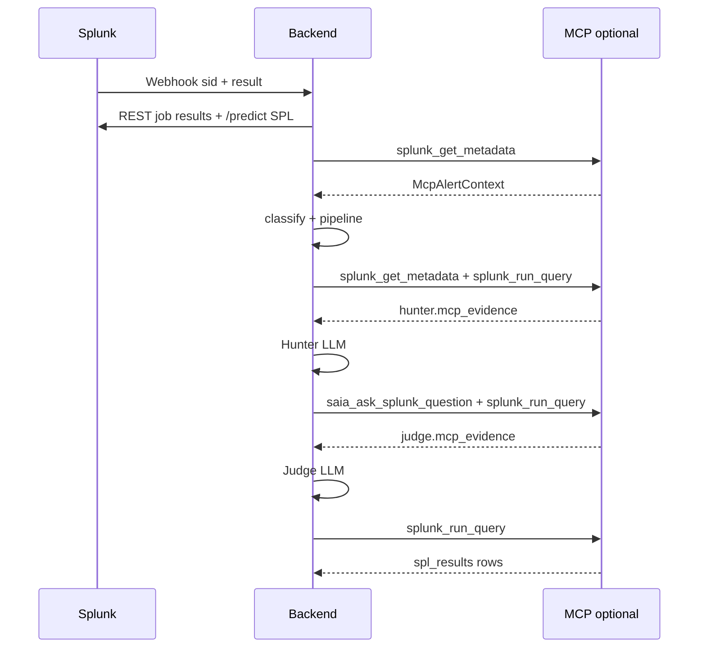
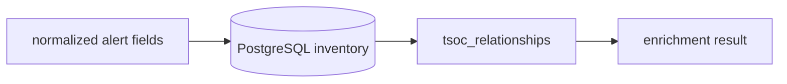

# Integration boundaries

Structural view of how **Splunk** and the **external application** connect: transports, contracts, trust boundaries, and failure modes. Runtime URLs and secrets are configured in `backend/.env` (see [backend/README.md](../backend/README.md)).

## Boundary diagram

```
┌─────────────────────────────────────────────────────────────────┐
│ Splunk 10+                                                       │
│  • Scheduled / correlation alerts                                  │
│  • Built-in Webhook Alert Action  ──HTTP POST JSON──►             │
│  • REST management API :8089      ◄──GET job results──           │
│  • MCP Server (app 7931, opt.)    ◄──JSON-RPC /services/mcp──    │
│  • ThinkingSOC_Hackathon: index + webhook (no inventory CSV)  │
└─────────────────────────────────────────────────────────────────┘
                              │
                              ▼
┌─────────────────────────────────────────────────────────────────┐
│ External application (backend/)                                  │
│  • Ingest API          normalize + enrich                        │
│  • Inventory enrich    PostgreSQL users / assets / relationships │
│  • Agentic router      Security **or** Observability (exclusive) │
│  • Pipelines           LangGraph + LiteLLM (+ MCP assist)        │
│  • Storage             PostgreSQL tsoc_records + inventory       │
└─────────────────────────────────────────────────────────────────┘
```

## Splunk → application (alert handoff)

### Transport

| Item | Value |
|------|--------|
| Mechanism | Splunk **ThinkingSOC_Hackathon** modular alert action (or generic Webhook with same URL) |
| Method | `POST` |
| Path | `/api/v1/alerts/splunk-ingest` |
| Auth | Optional `Authorization: Bearer <TSOC_INGEST_TOKEN>` — required only when the token is set in `backend/.env` |
| Content-Type | `application/json` |
| Query string | **Not used for configuration.** Env-style or legacy toggle params (e.g. `?auto_analyze=true`, `?TSOC_INGEST_*`) are rejected with HTTP `400`. |
| Success responses | `202` when `TSOC_INGEST_AUTO_ANALYZE=true` (default); `200` when ingest-only |

The repo ships **`ThinkingSOC_Hackathon`** with `bin/thinkingsoc_hackathon.py` so the alert action appears in Splunk UI under a clear name (not the generic **Webhook** action). See [ThinkingSOC_Hackathon/README.md](../ThinkingSOC_Hackathon/README.md).

### Ingest token (`TSOC_INGEST_TOKEN`)

Shared secret configured in `backend/.env`. Not issued by an API — generate with `openssl rand -hex 24` or the post-install wizard (`scripts/configure-integration.sh`).

| Backend token | Splunk Bearer field | Outcome |
|---------------|---------------------|---------|
| Empty | Empty | ✅ Accepted (default) |
| Set | Empty | ❌ `401` — no ingest |
| Set | Same value | ✅ Accepted |

When enabled, `frontend/.env.local` must use the **same** value (UI proxy). Full guide: [11-environment-configuration.md](./11-environment-configuration.md#tsoc_ingest_token-optional-ingest-auth).

### Minimum payload contract

The backend accepts flexible JSON; `normalize_splunk_ingest_payload()` extracts:

| Field | Required | Role |
|-------|----------|------|
| `sid` | **Yes** (for enrichment) | Search job ID — key for REST `GET .../jobs/{sid}/results` |
| `search_name` | Recommended | Saved search / alert name — primary classifier context |
| `result` or `results` | Recommended | First triggered row(s) — seeds `normalized` fields |
| `orig_sid` | No | Original job if different from `sid` |
| `app`, `owner` | No | Splunk context for auditing |
| `server_uri` | No | Hint for multi-Splunk (future) |

### Normalized field set

After normalization, `SplunkAlertIngest.normalized` commonly includes:

`_time`, `host`, `src`, `dest`, `user`, `severity`, `signature`, `signature_id`, `service`, `status_code`, `latency_ms`, `error_rate`, `cpu`, `memory`, `disk`

These fields feed **inventory enrichment** (match to users/assets) and the **LLM classifier** (full payload alongside all REST-loaded `splunk_results` rows).

### Example webhook body (illustrative)

```json
{
  "sid": "scheduler__admin__search__RMD123abc_at_1715000000.1",
  "search_name": "Suspicious login - demo",
  "result": {
    "_time": "2026-05-16T12:00:00Z",
    "user": "alice",
    "src": "203.0.113.10",
    "dest": "vpn-gateway",
    "signature": "Failed password"
  }
}
```

### Configuration (server-side only)

Runtime behavior is controlled **only** by `backend/.env` (and admin-authenticated integration settings). **URL query parameters cannot override configuration** — `RejectConfigQueryParamsMiddleware` returns HTTP `400` for env-style or legacy toggle query keys.

Post-ingest triage:

| Setting | Effect |
|---------|--------|
| `TSOC_INGEST_AUTO_ANALYZE=true` | After enrich, run triage in background; HTTP `202` (**default** in `.env.example` and `install.sh`) |
| `TSOC_INGEST_AUTO_ANALYZE=false` | Persist ingest summary only; HTTP `200` |
| `TSOC_INGEST_AUTO_ANALYZE_PIPELINE` | `triage` \| `route` \| `none` when auto-analyze is on |

Implementation: `backend/middleware/reject_config_query.py`.

## Application → Splunk (data enrichment)

### REST — full job results (primary)

| Item | Detail |
|------|--------|
| API | Splunk **10+** `GET /services/search/v2/jobs/{sid}/results` |
| Client | `backend/splunk/client/` |
| Purpose | Attach **all** alerting rows to analysis (not only webhook’s first row) |
| Failure | Ingest returns `502` if REST fails; classifier may still run on thin data if called offline |

### Inventory (PostgreSQL only)

Users, assets, and user–asset **relationships** are stored in PostgreSQL. The UI (`/inventory`, `/relationships`) and pipelines load inventory via `load_inventory_tables()` — there is **no** Splunk CSV lookup sync.

| Item | Detail |
|------|--------|
| Source | `TSOC_POSTGRES_DSN` (required for inventory CRUD and enrichment) |
| Demo seed | `backend/data/demo/*.csv` loaded once when tables are empty (`setup.py`); relationships auto-inferred from users/assets (`owner` → user/department) with optional CSV overrides |
| Offline tests | Pass inline `users`, `assets`, and `relationships` in API bodies |

### MCP — Splunk-native AI (optional)

| Endpoint | Role |
|----------|------|
| `/services/mcp` on Splunk (MCP Server app, typically port **7931**) | JSON-RPC tool host |
| `splunk_get_metadata` (and related) | Extra signals for classification / triage context |
| `splunk_run_query` | **Execute** investigation SPL; **Hunter** correlation hunts; **Judge** verification query |
| `saia_ask_splunk_question` | **Judge** — SAIA answers before final verdict (when MCP + AI Assistant enabled) |
| `saia_generate_spl` | **Debug only** — `POST /api/v1/mcp/spl-generate` (not the main investigation path) |
| `saia_optimize_spl` / `saia_explain_spl` | Optional post-steps for `/mcp/spl-generate` and investigation SPL review |

MCP is **optional** for execute. SPL **generation** uses Splunk REST **`/predict`** (UI `write_spl` path), then LiteLLM or rule-based `search` fallback. See [13-cim-investigation-spl-mcp.md](./13-cim-investigation-spl-mcp.md). Status: `GET /api/v1/mcp/status`.

**Investigation SPL:** `/predict` per question → parser validate → MCP execute (All Time) → LiteLLM refine on error/0 rows (max 2). See [13-cim-investigation-spl-mcp.md](./13-cim-investigation-spl-mcp.md).

**Hunter / Judge MCP (SOC LangGraph):** When `TSOC_MCP_ENABLED` and `TSOC_MCP_HUNTER_JUDGE_ENABLED` are true, the Security pipeline gathers live Splunk evidence **before** the Hunter and Judge LLM stages (`backend/splunk/mcp/hunter_judge_context.py`):

| Stage | MCP tools | Purpose |
|-------|-----------|---------|
| **Hunter** (pre-LLM) | `splunk_get_metadata`, `splunk_run_query` | Sourcetypes for alert index; up to 2 correlation hunts (host / user / src pivots) |
| **Judge** (pre-LLM) | `saia_ask_splunk_question`, `splunk_run_query` | Two SAIA questions (TP vs benign; reconcile Defender/Hunter); host sourcetype verification |

Results are injected into the LLM user message and returned on the API as `hunter.mcp_evidence` and `judge.mcp_evidence`. See [04-agents-and-pipelines.md](./04-agents-and-pipelines.md).



## Splunk app boundary (`ThinkingSOC_Hackathon/`)

| Contains | Does not contain |
|----------|------------------|
| `default/indexes.conf` — demo index metadata | Product dashboards or analysis views |
| Webhook alert action **ThinkingSOC_Hackathon** (modular alert in `bin/`) | CSV lookups or inventory sync |
| Permissions in `metadata/default.meta` | Product dashboards or analysis views |

**Install path:** `$SPLUNK_HOME/etc/apps/ThinkingSOC_Hackathon/`  
**Demo inventory:** `setup.py` seeds PostgreSQL from `backend/data/demo/*.csv` when tables are empty.

## Inventory boundary



| Concept | Implementation |
|---------|----------------|
| Storage | `tsoc_users`, `tsoc_assets`, `tsoc_relationships` in PostgreSQL |
| UI | External app: Inventory + Relationships pages |
| Alert matching | Built-in field maps (`host`, `user`, `src`, …) in `enrichment_resolver.py` |
| Cross-link | Relationships fill missing user or asset when one side matched |
| Output model | `EnrichmentResult` on analysis (`enrichment` field) |
| Downstream use | `risk_context` for Security **Judge**; weak linkage triggers **admin org GAP** question suggestion |

Enrichment is **independent** of ingest transport: same logic for webhook, `POST /inventory/enrich`, and pipeline-internal calls.

### Admin organizational GAP (application boundary)

| Direction | Contract |
|-----------|----------|
| After SOC analysis | `SocAnalysisResult.admin_org_gap` — see [07-lld-low-level-design.md](./07-lld-low-level-design.md) §5 |
| Standalone | `POST /api/v1/admin-org/gap-suggest` |
| Storage | `tsoc_record_type=admin_org_gap_suggest` (audit); also nested on `soc_analysis` |
| UI | Investigation detail — no Splunk-side admin form in this hackathon |

## Trust and security boundaries

| Boundary | Control |
|----------|---------|
| Ingest | Optional shared secret (`TSOC_INGEST_TOKEN`); `401` if set and header missing, `403` if wrong |
| Splunk REST | Service account token or username/password in env — never in repo |
| LLM | API keys via LiteLLM env — backend exposes `/llm/status` without secrets |
| PostgreSQL | DSN in `.env`; schema applied by `setup.py` |
| Splunk MCP | Splunk-side auth as configured on MCP Server |

## Failure modes (structural)

| Failure | Typical behavior |
|---------|------------------|
| Missing `sid` | `400` on ingest or skip REST enrich |
| REST timeout / 403 | `502` on ingest; logged with request id |
| Ingest auth mismatch | `401` / `403` on ingest; Splunk alert action logs failure; no PostgreSQL record |
| Empty inventory | Enrichment returns unresolved; Judge may still run with lower context |
| LLM unavailable | Classifier returns `manual_review`; pipeline stages use template/rule fallbacks |
| MCP unavailable | Skip MCP signals; SPL via LiteLLM or rules |

## Related documents

- [07-lld-low-level-design.md](./07-lld-low-level-design.md) — full API list and table schemas  
- [04-agents-and-pipelines.md](./04-agents-and-pipelines.md) — what happens after handoff  
- [14-inventory-service.md](./14-inventory-service.md) — inventory enrichment  
- [15-splunk-mcp-integration.md](./15-splunk-mcp-integration.md) — MCP client and SAIA tools  
- [21-database-schema.md](./21-database-schema.md) — full database schema  
- [architecture_diagram.md](../architecture_diagram.md) — single-page diagram
