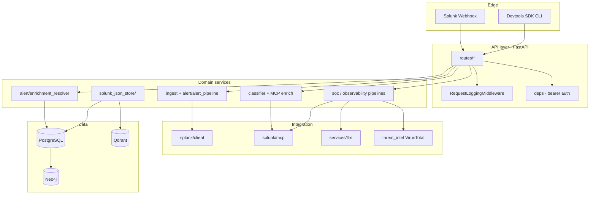
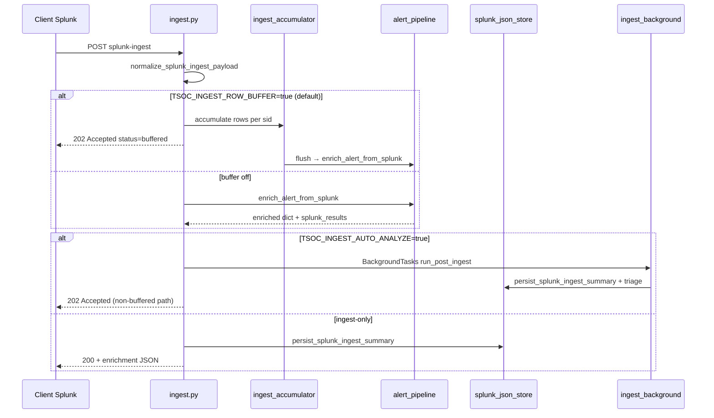

# Architecture

Runtime architecture of the external application: layers, request lifecycle, persistence, and design rules.

**Canonical diagram:** [`architecture_diagram.md`](../architecture_diagram.md)

## Layered view

| Layer | Location | Responsibility |
|-------|----------|----------------|
| **Edge** | Splunk, operators, SDK | Trigger work via HTTP |
| **API** | `backend/api/` | Validation, auth, HTTP mapping, OpenAPI |
| **Domain** | `backend/services/` | Business logic, pipelines, no raw HTTP |
| **Integration** | `backend/splunk/`, LiteLLM | External system protocols |
| **Data** | `backend/db/`, `splunk_json_store` | Schema, queries, record typing ([doc 19](./19-storage-persistence.md), [doc 21](./21-database-schema.md)) |

## Runtime components

| Component | Technology | Structural role |
|-----------|------------|-----------------|
| Splunk | Webhook + REST + optional MCP | Alert source, job results, native AI tools |
| Ingest API | FastAPI | Accept handoff, normalize, trigger enrich |
| REST client | `httpx` / Splunk SDK | Load full job rows by `sid` (v2 API) |
| Inventory enrichment | PostgreSQL + `alert/enrichment_resolver` | Map alerts to users/assets via built-in field maps |
| Router | LLM classifier + optional MCP metadata | Select **Security** or **Observability** (exclusive) |
| Security pipeline | LangGraph (`soc_analysis_graph`) | Defender → Hunter → **Judge** |
| Observability pipeline | LangGraph / service modules | Diagnoser → Responder → **Ops Judge** |
| Storage | `asyncpg` via `splunk_json_store` | Typed JSON in `tsoc_records` ([doc 19](./19-storage-persistence.md)) |
| Qdrant | Vector DB (docker-compose) | SOC Chat RAG embeddings ([doc 10](./10-soc-vector-rag.md)) |
| Neo4j | Graph DB (docker-compose) | Alert correlation graph ([doc 12](./12-correlation-graph-service.md)) |
| SOC Chat | RAG + Text-to-SQL | Analyst chat with context retrieval ([doc 10](./10-soc-vector-rag.md)) |
| Dashboard | Platform overview | KPIs, triage charts, health score ([doc 16](./16-dashboard.md)) |
| Devtools | Python SDK / CLI | Same APIs for scripts and evidence |

## Request lifecycle (webhook path)

| Phase | Module(s) | Output |
|-------|-----------|--------|
| Normalize | `models/handoff.py` | `SplunkAlertIngest` |
| Enrich | `services/alert/alert_pipeline.py` | `splunk_results[]`, metadata |
| Store ingest | `services/splunk_json_store/` | `tsoc_records` type `splunk_ingest` |
| Agent triage (orchestration) | `services/alert/ingest_background.py`, `services/alert/agent_triage.py` | Classify + pipelines + route records |
| Post-analysis triage (priority) | `services/triage/triage_priority.py`, `api/routes/triage.py` | `TriageOutcome` on analysis + `GET /triage/queue` — see [08-triage-priority-layer.md](./08-triage-priority-layer.md) |
| Admin org GAP (Security only) | `services/soc_analysis/admin_org_gap.py` | `admin_org_gap` on `SocAnalysisResult` + `admin_org_gap_suggest` audit — see [07-lld-low-level-design.md](./07-lld-low-level-design.md) §5 |

## Request lifecycle (API-driven path)

Operators and SDK clients can skip Splunk and call:

| Endpoint | Use case |
|----------|----------|
| `POST /classification/alert` | Classify only |
| `POST /analysis/route` | Classify + run selected pipeline + persist |
| `POST /analysis/run` | Security pipeline with inventory load |
| `POST /admin-org/gap-suggest` | Organizational GAP question (also runs automatically after SOC analysis) |
| `POST /agents/triage` | Full agent-style orchestration response |
| `POST /inventory/enrich` | Inventory enrichment only |
| `GET /dashboard/overview` | Platform KPIs and health |
| `GET/POST /investigation/records/{id}/…` | Investigation timeline and analyst actions |
| `GET/POST /integrations/settings` | Runtime integration overrides (admin token) |
| `GET /api/v1/graph/*` | Correlation graph (when `TSOC_CORRELATION_ENABLED=true`) |

Same domain services as ingest — **no duplicate pipeline implementations** per entry point.

## Configuration surface (categories)

Configuration is environment-driven (`backend/.env` from `.env.example`):

| Category | Examples | Affects |
|----------|----------|---------|
| HTTP | `TSOC_HTTP_HOST`, `TSOC_HTTP_PORT` | `run.py` bind |
| PostgreSQL | `TSOC_POSTGRES_DSN` | All persistence |
| Splunk REST | `TSOC_SPLUNK_*`, tokens | Job results, SPL parser |
| Ingest | `TSOC_INGEST_TOKEN`, `TSOC_INGEST_AUTO_ANALYZE` | Webhook auth and background triage (`.env` only — not URL) |
| Inventory | `TSOC_POSTGRES_DSN` | PostgreSQL only |
| LLM | `LITELLM_*` | Pipeline and classifier |
| Classifier | `TSOC_CLASSIFIER_LLM` | LLM-only alert routing (see [04-agents-and-pipelines.md](./04-agents-and-pipelines.md)) |
| MCP | MCP host / enable flags | Metadata and SPL path |

`GET /api/v1/llm/status` and `GET /api/v1/mcp/status` expose **non-secret** capability flags to clients.

## Persistence model

| Table | Purpose |
|-------|---------|
| `tsoc_records` | Append-only JSON audit (`tsoc_record_type`, `sid`, `payload`) |
| `tsoc_users`, `tsoc_assets` | Inventory CRUD |
| `tsoc_relationships` | User–asset links for enrichment |
| `tsoc_rag_documents` | SOC vector RAG document index (PostgreSQL) |
| `tsoc_chat_conversations`, `tsoc_chat_messages` | Persisted SOC chat sessions |
| `graph_findings` | Correlation findings (PostgreSQL; schema via correlation startup) |

Record types include: `splunk_ingest`, `agentic_ops_analysis`, `enrichment_resolve`, `soc_analysis`, `soc_analysis_audit`, `soc_analysis_batch`, `observability_analysis`, `ingest_background_error`, `admin_org_gap_suggest`, `llm_chat_audit`, `investigation_analyst_action`, `soc_investigation_*` (phase shards), `soc_investigation_evidence_chain`.

Indexes support query by `sid` and `tsoc_record_type` + time — see `backend/db/schema.sql`.

## Concurrency and performance

| Pattern | Where |
|---------|--------|
| Async FastAPI handlers | All route modules |
| `asyncpg` connection per operation | `splunk_json_store`, inventory |
| Background ingest analysis | `BackgroundTasks` + `run_post_ingest` |
| LangGraph sync nodes | SOC graph runner invoked from async routes |

Demo scale assumes **single backend process** and local Postgres; no horizontal scaling story in this repo.

## Design principles

| Principle | Implication |
|-----------|-------------|
| **Thin Splunk app** | Index metadata and webhook only; no product UI in Splunk |
| **REST-only deep read** | Full alert content via documented Splunk REST — no side channel |
| **External Judge** | Final verdict always in application pipelines, not Splunk UI |
| **Pluggable AI** | LiteLLM gateway; optional MCP; deterministic fallback |
| **Single domain core** | Routes are thin; logic in `services/` |
| **Auditable outputs** | Structured Pydantic models persisted as JSON |

## Observability of the backend itself

| Mechanism | Role |
|-----------|------|
| `RejectConfigQueryParamsMiddleware` | Rejects URL query params that look like config overrides (`400`) |
| `RequestLoggingMiddleware` | Request id + path logging |
| `http_rid` on routes | Correlate log lines per request |
| `tsoc_records` | Replay ingest and analysis payloads |
| `GET /storage/events` | Query stored records by `sid` / type |

## Related documents

- [06-hld-high-level-design.md](./06-hld-high-level-design.md) — service-level HLD  
- [07-lld-low-level-design.md](./07-lld-low-level-design.md) — API and schema LLD  
- [02-integration-boundaries.md](./02-integration-boundaries.md) — Splunk contracts  
- [04-agents-and-pipelines.md](./04-agents-and-pipelines.md) — pipeline stages  
- [05-codebase-map.md](./05-codebase-map.md) — navigate source via code graph  
- [17-observability-pipeline.md](./17-observability-pipeline.md) — Observability pipeline detail  
- [18-llm-service-layer.md](./18-llm-service-layer.md) — LLM service layer  
- [19-storage-persistence.md](./19-storage-persistence.md) — storage and record types  
- [21-database-schema.md](./21-database-schema.md) — full database schema
