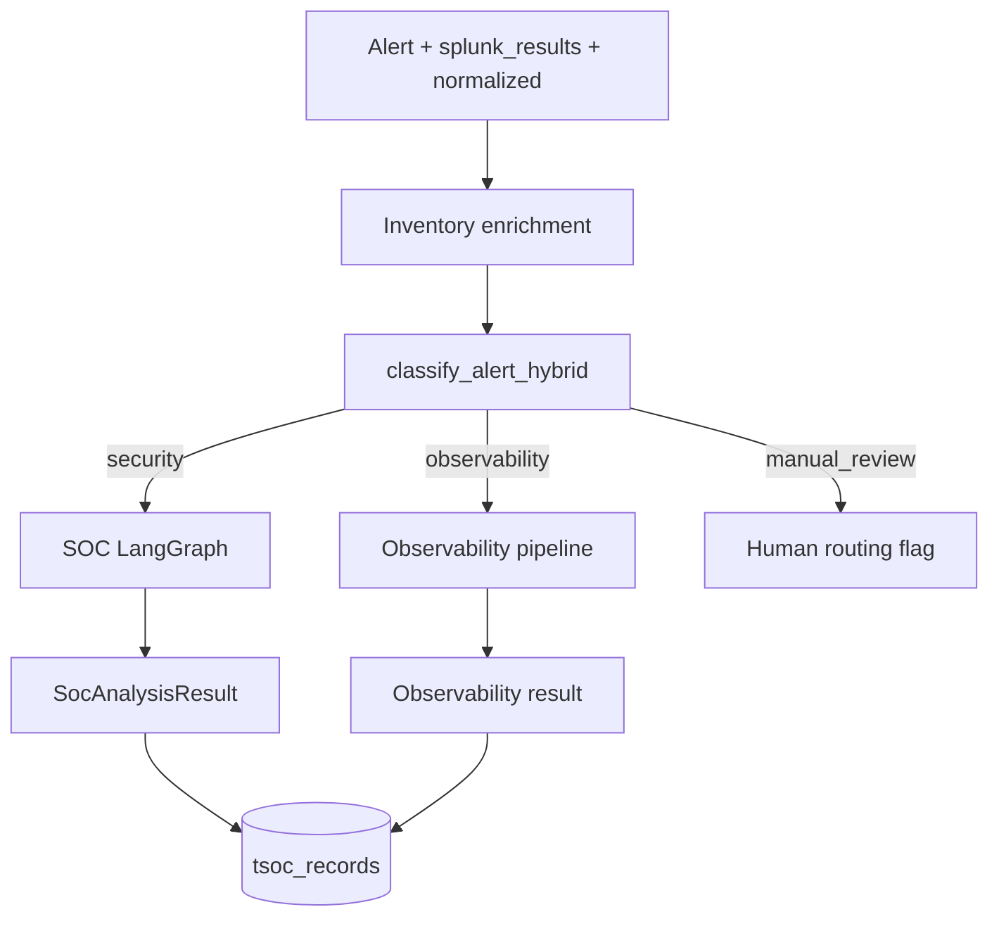
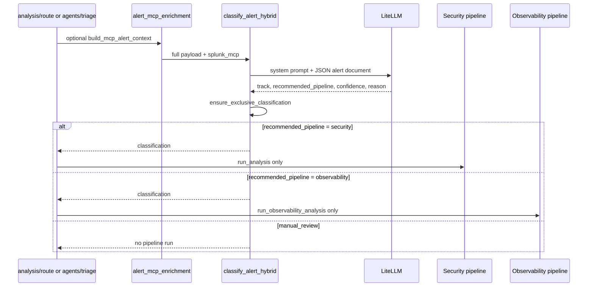
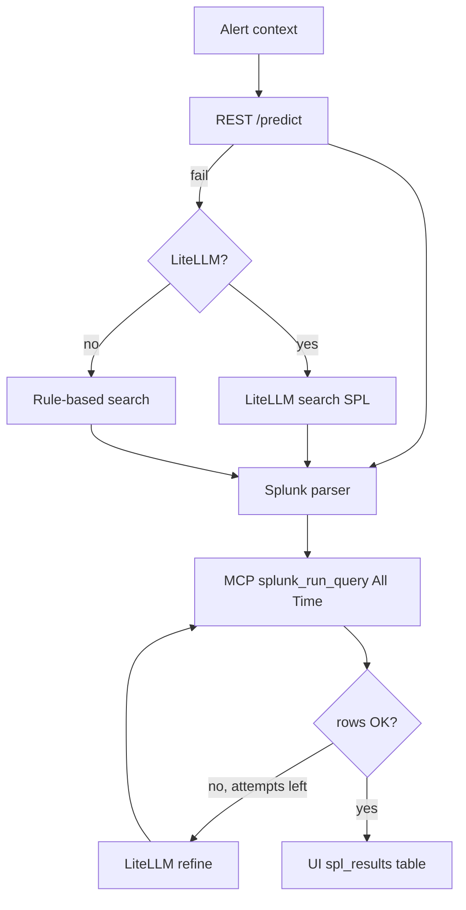

# Agents and pipelines

How alerts become structured Security and Observability outcomes inside `backend/services/`: classification, LangGraph orchestration, LLM usage, and persistence.

## Pipeline entry points

The same core logic is reachable from multiple APIs:

| Entry | Typical caller | Flow |
|-------|----------------|------|
| Webhook `POST /alerts/splunk-ingest` | Splunk | normalize → enrich → optional `run_post_ingest` → triage when `TSOC_INGEST_AUTO_ANALYZE=true` |
| `POST /analysis/route` | UI / SDK | classify → run pipeline(s) → persist route record |
| `POST /agents/triage` | SDK / automation | Full triage bundle (classification + pipelines + SPL hints) |
| `POST /analysis/run` | Security-only tools | SOC pipeline with inventory load |
| `POST /observability/run` | Ops tools | Observability pipeline |



## Agentic router (classification)

The **Agentic Ops Router** decides whether an alert belongs to the **Security** or **Observability** pipeline. Each alert is routed to **exactly one** pipeline. Dual/both routing is **not** supported.

### Design principles

| Principle | Implementation |
|-----------|----------------|
| **LLM-only routing** | No keyword lists or rule scoring. LiteLLM reads the full alert document. |
| **Full context** | All `normalized` fields, every `splunk_results` row, `search_name`, `sid`, optional MCP metadata. |
| **Exclusive pipeline** | `security` → SOC LangGraph only; `observability` → Ops pipeline only; never both. |
| **Safe fallback** | When LLM is off or fails → `manual_review` (`needs_human_routing=true`). |
| **Legacy `both`/`dual` rejected** | If the model returns dual, code coerces to a single track via `ensure_exclusive_classification()`. |

### End-to-end flow



### LLM payload (what the model sees)

Built by `build_alert_classification_payload()` in `services/alert/alert_classifier_llm.py`:

| Field | Source | Notes |
|-------|--------|-------|
| `search_name` | Request / webhook | Saved search or alert title |
| `sid` | Request / webhook | Splunk job ID |
| `normalized` | Ingest normalization | All normalized alert fields |
| `splunk_results` | REST enrich or request body | **All** job rows (not truncated) |
| `splunk_result_count` | Computed | Row count for transparency |
| `splunk_mcp` | Optional MCP enrich | Indexes, sourcetypes, correlation summary, instance info |
| `extra_metadata` | Internal | Legacy/debug only |

**Prompt file:** `services/prompts/prompt_alert_classifier_system.md`

**Entry point:** `classify_alert_hybrid()` → called from `classify_with_optional_mcp()` used by:

- `POST /api/v1/analysis/route`
- `POST /api/v1/agents/triage`
- `POST /api/v1/classification/alert`
- Background ingest when `TSOC_INGEST_AUTO_ANALYZE_PIPELINE` is `triage` or `route`

### Classification output

Model: `AlertClassificationResult` (`models/agentic_ops.py`)

| `track` | `recommended_pipeline` | Pipeline executed |
|---------|------------------------|-------------------|
| `security` | `security` | SOC LangGraph only |
| `observability` | `observability` | Observability pipeline only |
| `unknown` | `manual_review` | None — analyst must choose |

| Field | Meaning |
|-------|---------|
| `confidence` | 0.0–1.0 from LLM |
| `reason` | One-sentence rationale |
| `signals` | Short tags explaining the decision (not raw field names) |
| `classification_source` | `llm` on success; `rules` on fallback (manual_review only) |
| `needs_human_routing` | `true` when track is `unknown` / pipeline is `manual_review` |

**Note:** `track=both` and `recommended_pipeline=dual` may still appear in **historical** stored records from older versions; the current router never runs both pipelines for one alert.

### Fallback when LLM is unavailable

`services/alert/alert_classifier.py` provides `classify_alert_unavailable()` only:

- `track=unknown`, `recommended_pipeline=manual_review`
- No keyword inference

Triggered when:

- `TSOC_CLASSIFIER_LLM=false`
- LiteLLM not configured (`LITELLM_MODEL` / API key missing)
- LLM call fails or returns invalid JSON

**Defender/Hunter/Judge** and Observability stages use LiteLLM when configured; on failure they fall back to rule-based behavior. The alert classifier is independent (`TSOC_CLASSIFIER_LLM`).

### MCP enrichment (classification)

`services/alert/alert_mcp_enrichment.py` calls Splunk MCP **before** classification when configured. MCP output is embedded as structured `splunk_mcp` in the LLM payload (not merged as keyword signals).

### Configuration

| Variable | Default | Effect |
|----------|---------|--------|
| `TSOC_CLASSIFIER_LLM` | `true` | Enable LLM classification |
| `LITELLM_MODEL` | — | Model id for classifier + pipelines |
| `LITELLM_API_KEY` / `LITELLM_API_BASE` | — | Provider credentials |

See [11-environment-configuration.md](./11-environment-configuration.md).

### Code map

| Module | Role |
|--------|------|
| `services/alert/alert_classifier_llm.py` | Payload build, LLM call, exclusive-track guard |
| `services/alert/alert_classifier.py` | `manual_review` fallback only |
| `services/alert/alert_mcp_enrichment.py` | MCP metadata → classifier payload |
| `services/prompts/prompt_alert_classifier_system.md` | Classifier system prompt |
| `api/routes/analysis.py` | `POST /analysis/route` — `if security` / `elif observability` |
| `services/alert/agent_triage.py` | Same exclusive routing for triage bundle |

## Inventory enrichment (cross-cutting)

**Module:** `services/enrichment_resolver.py`  
**API:** `POST /api/v1/inventory/enrich`

| Input | Processing | Output |
|-------|------------|--------|
| `normalized` alert dict | Match built-in alert field → user/asset columns | `EnrichmentResult` |
| `tsoc_relationships` | Fill missing user **or** asset when only one side matched | `matched_relationship_ids`, linked ids |
| Inventory rows | Loaded from PostgreSQL or inline in request | Used for `build_risk_context()` |

Enrichment runs inside SOC/Observability analysis so **Judge** receives `risk_context` (asset criticality, user/asset risk scores, department).

Inventory + relationships CRUD: `backend/api/routes/inventory.py` + `services/inventory/`.

## Security pipeline (LangGraph)

**Package:** `backend/services/soc_analysis_graph/`  
**Runner:** `run_soc_analysis_langgraph()`  
**HTTP:** `POST /api/v1/analysis/run`, also invoked from route/triage

### Graph node order

```
prepare → risk_engine → virustotal → defender → hunter → judge
       → framework_mapping → investigation_questions → root_cause_spl → END
```

| Node | Role |
|------|------|
| **prepare** | Build canonical JSON context from alert + identity (empty risk slot) |
| **risk_engine** | Compute `risk_context`; rebuild canonical prefix for downstream LLMs |
| **virustotal** | VirusTotal API v3 IOC lookup on **allowlisted CIM fields** only → compact `threat_intel` in System Context ([09-virustotal-threat-intel.md](./09-virustotal-threat-intel.md) §4) |
| **defender** | LLM — benign / alternate-hypothesis advocacy (vs Hunter attack expansion) |
| **hunter** | **MCP hunt evidence** (optional) → LLM — investigation expansion, hypotheses |
| **judge** | **MCP SAIA + verification** (optional) → LLM — **final verdict**, priority, next step, confidence |
| **framework_mapping** | MITRE-style mapping pass |
| **investigation_questions** | Follow-up questions for analysts (text only) |
| **root_cause_spl** | Passes questions to assembly; SPL built in finalize (see [13-cim-investigation-spl-mcp.md](./13-cim-investigation-spl-mcp.md)) |

State object: `SocAnalysisGraphState` — carries canonical text, per-stage outputs, and errors.

**After the graph:** `services/soc_analysis/runner.py` attaches **triage** and **admin-org GAP** (`attach_admin_org_gap`) before persisting — these are not LangGraph nodes.

### Security output shape (`SocAnalysisResult`)

Key sections persisted and returned to clients:

| Section | Purpose |
|---------|---------|
| `defender` | Defense-advocate bullets (not IR playbook) |
| `hunter` | Hunting steps and search ideas; optional `mcp_evidence` (live MCP hunt queries) |
| `judge` | **Authoritative** verdict block; optional `mcp_evidence` (SAIA answers + verification query) |
| `enrichment` | Inventory match (user/asset IDs, confidence) |
| `risk_context` | User/asset risk framing |
| `admin_org_gap` | One suggested **admin** question when organizational context is missing ([LLD §5](./07-lld-low-level-design.md)) |
| `framework_mapping` | ATT&CK / framework tags |
| `investigation_questions` | Per-question SPL + optional `spl_results` (MCP SAIA + CIM `tstats`) |
| `root_cause_spl` | Legacy single SPL field; investigation flow uses `investigation_questions` |
| `evidence_refs` | Pointers to Splunk fields |
| `threat_intel` | Compact VT findings (`last_analysis_stats`, reputation, tags) when enrichment ran |
| `evidence_chain` | Structured lineage from request/data sources → reasoning path → final decision |

When LiteLLM is unavailable, pipeline nodes degrade to template/rule behavior where implemented (including admin-org GAP fallback rules).

### Hunter / Judge MCP enrichment (Security)

**Module:** `backend/splunk/mcp/hunter_judge_context.py`  
**Wiring:** `services/soc_analysis_graph/nodes_llm.py` (inside `hunter` and `judge` graph nodes)

When Splunk MCP is configured (`TSOC_MCP_ENABLED`, token, `TSOC_MCP_HUNTER_JUDGE_ENABLED=true`), the pipeline runs **live Splunk tool calls before** the Hunter and Judge LiteLLM stages. MCP failures are non-fatal — the graph continues with LLM-only reasoning.

| Stage | When | MCP tools | API output |
|-------|------|-----------|------------|
| **Hunter** | After Defender, before Hunter LLM | `splunk_get_metadata` (sourcetypes), `splunk_run_query` (≤2 correlation hunts from host/user/src) | `hunter.mcp_evidence` — `tools_called`, `hunt_queries[]`, `metadata_sourcetypes`, `notes` |
| **Judge** | After Hunter, before Judge LLM | `saia_ask_splunk_question` (2 alert-specific questions), `splunk_run_query` (host sourcetype verification) | `judge.mcp_evidence` — `tools_called`, `saia_answers[]`, `verification_queries[]`, `notes` |

Hunter MCP context is also passed into the Judge LLM user message so the verdict can cite hunt row counts and SAIA guidance together.

**Models:** `McpHunterEvidence`, `McpJudgeEvidence` in `backend/models/mcp.py`; attached to `HunterSection` / `JudgeVerdict` in `backend/models/analysis.py`.

**Tests:** `backend/tests/test_hunter_judge_mcp.py` (mocked JSON-RPC).

### Admin organizational GAP (post-SOC)

**Module:** `services/admin_org_gap.py`  
**Trigger:** Automatically after every `run_analysis` (ingest triage, `/analysis/run`, `/analysis/route` security path, batch-by-sid).  
**Not run** for Observability-only pipelines.

| Input | Source |
|-------|--------|
| Alert | `normalized`, `sid`, `search_name` |
| Identity | `enrichment` on the SOC result |
| Analysis excerpts | `defender`, `hunter.narrative`, `judge.verdict`, `judge.rationale`, `risk_context` |

| Output | Persistence |
|--------|-------------|
| `AdminOrgGapSuggestResponse` on `SocAnalysisResult.admin_org_gap` | Nested under `soc_analysis` payload `analysis` |
| Same response | Separate `tsoc_record_type=admin_org_gap_suggest` audit row |

**Standalone:** `POST /api/v1/admin-org/gap-suggest` for callers that only need the gap step.

**UI:** Investigation detail shows an **Admin** tab and overview card when `should_suggest_question` is true (`AdminOrgGapPanel` in `frontend/components/structured-data/soc-analysis-view.tsx`). It also shows an **Evidence chain** tab when `analysis.evidence_chain` exists, exposing request/data-source/reasoning/decision lineage for analyst audit. Older records without embedded gap can be enriched via `GET /storage/events?record_type=admin_org_gap_suggest&sid=...`.

**Out of scope (hackathon):** collecting admin answers, ticket queue, RAG, multiple questions per alert.

## Observability pipeline

**Package:** `backend/services/observability_analysis/`  
**Runner:** `run_observability_analysis()`  
**HTTP:** `POST /api/v1/observability/run`

| Stage | Role |
|-------|------|
| **Diagnoser** | Symptom clustering, likely root causes |
| **Responder** | Mitigation and operational steps |
| **Ops Judge** | **Final** operational verdict and next action |

Outputs include `entity_resolution`, `impact_context`, and structured diagnoser/responder blocks — parallel concept to Security but tuned for SRE/ops signals (latency, errors, resource metrics).

## SPL suggestion chain

### Investigation questions (SOC analysis)

Full design: **[13-cim-investigation-spl-mcp.md](./13-cim-investigation-spl-mcp.md)**.

After the graph produces investigation **questions**, `finalize_investigation_questions_for_verdict`:

1. **REST `/predict`** per question (`TSOC_SPL_USE_REST_PREDICT`) — same path as Splunk UI `write_spl`
2. **LiteLLM** fallback per question if predict fails
3. **Rule-based `search`** if both above fail
4. **Splunk parser** validation
5. **MCP `splunk_run_query`** (All Time: `earliest=0` `latest=now`) — fills `spl_results`; REST oneshot fallback
6. **Refine loop (max 2)** — on **error** or **0 rows**: LiteLLM execution refine → re-execute (`TSOC_SPL_EXECUTE_REFINE_MAX_ATTEMPTS`)

See [13-cim-investigation-spl-mcp.md](./13-cim-investigation-spl-mcp.md) for full detail, `notes` tags, and troubleshooting.

### Standalone assistant (`/assistant/spl-suggest`)



`POST /api/v1/assistant/spl-suggest` uses `suggest_spl_for_alert()` (predict → execute) without running the full Security graph.

## Post-analysis Triage (priority queue)

After SOC or Observability pipelines finish, **`services/triage_priority.py`** computes a **`TriageOutcome`** (DeeperSplunk-inspired) and attaches it to analysis results for sorting and review.

**Full specification:** [08-triage-priority-layer.md](./08-triage-priority-layer.md) — scoring rules, API, persistence, UI, examples.

Summary:

- `GET /api/v1/triage/queue` — analyst queue sorted by `triage_score`
- UI: `/analysis` (triage queue table) and Triage section on investigation detail
- Response fields on `/agents/triage`: `security_triage`, `observability_triage`

## Agent triage orchestration

**Module:** `services/agent_triage.py`  
**API:** `POST /api/v1/agents/triage`

Combines in one response:

- Classification result  
- Identity resolution  
- Selected pipeline output(s)  
- `security_triage` / `observability_triage` when pipelines ran  
- SPL / MCP status hints  

Used by **background ingest** when `TSOC_INGEST_AUTO_ANALYZE_PIPELINE=triage`.

## AI technology stack

| Layer | Technology | Location |
|-------|------------|----------|
| HTTP / validation | FastAPI + Pydantic | `api/`, `models/` |
| Orchestration | LangGraph `StateGraph` | `soc_analysis_graph/graph.py` |
| LLM calls | LiteLLM | `services/llm/litellm_service.py` ([doc 18](./18-llm-service-layer.md)) |
| Splunk-native tools | MCP JSON-RPC | `splunk/mcp/`, `splunk_mcp_service.py` |
| Fallback | Template/rule-based stages when LiteLLM fails or is not configured | SOC/Obs prompt modules; classifier → `manual_review` |

Prompt text lives under `services/prompts/` and SOC-specific prompt helpers.

## Persistence coupling

| Event | `tsoc_record_type` | Writer |
|-------|-------------------|--------|
| Webhook received | `splunk_ingest` | `persist_splunk_ingest_summary` |
| Security run | `soc_analysis` | SOC runner / route handler |
| Admin org GAP (after SOC) | `admin_org_gap_suggest` | `attach_admin_org_gap` in SOC runner |
| Observability run | `observability_analysis` | Observability runner |
| Route decision | `agentic_ops_analysis` | `persist_agentic_ops_route_to_splunk` |
| Identity call | `identity_resolve` | `persist_identity_resolve_to_splunk` |
| LLM chat | `llm_chat_audit` | LiteLLM wrapper |
| SOC evidence chain phase | `soc_investigation_evidence_chain` | `persist_soc_investigation_phases` |

Query via `GET /api/v1/storage/events?sid=...&record_type=...`.

## Configuration knobs (pipelines)

| Variable | Effect |
|----------|--------|
| `LITELLM_MODEL`, `LITELLM_API_KEY` | Model selection (required for LLM analysis) |
| `TSOC_CLASSIFIER_LLM` | LLM-only alert router (full payload) |
| `TSOC_INGEST_AUTO_ANALYZE` | Webhook background triage (`true` default; `.env` only) |
| `TSOC_INGEST_AUTO_ANALYZE_PIPELINE` | `triage` / `route` / `none` |

## Related documents

- [03-architecture.md](./03-architecture.md) — layers and request lifecycle  
- [07-lld-low-level-design.md](./07-lld-low-level-design.md) — API and output contracts  
- [02-integration-boundaries.md](./02-integration-boundaries.md) — Splunk MCP and REST  
- [05-codebase-map.md](./05-codebase-map.md) — find modules in the graph  
- [09-virustotal-threat-intel.md](./09-virustotal-threat-intel.md) — VirusTotal IOC enrichment (allowlisted fields, skip rules, demo samples)    
- [13-cim-investigation-spl-mcp.md](./13-cim-investigation-spl-mcp.md) — investigation SPL pipeline  
- [15-splunk-mcp-integration.md](./15-splunk-mcp-integration.md) — MCP client and SAIA tools  
- [17-observability-pipeline.md](./17-observability-pipeline.md) — Observability pipeline detail (Entity, Impact, Diagnoser, Responder, Ops Judge)  
- [18-llm-service-layer.md](./18-llm-service-layer.md) — LLM service layer (error classification, thinking, budget)  
- [19-storage-persistence.md](./19-storage-persistence.md) — persistence and record types  
- [20-investigation-workflow.md](./20-investigation-workflow.md) — investigation timeline and analyst actions
