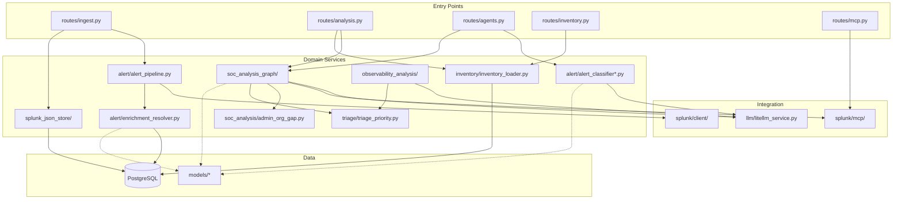

# Codebase map

How to navigate the repository using the **code graph**, directory layout, and known **execution flows**. The graph is machine-generated; this document explains how to use it and where critical logic lives.

| Artifact | Link |
|----------|------|
| **Interactive graph** | [code-graph/graph.html](code-graph/graph.html) |
| **Community wiki** | [code-graph/communities/index.md](code-graph/communities/index.md) |
| **Build stats** | [code-graph/graph-status.txt](code-graph/graph-status.txt) |

## Graph snapshot

| Metric | Value |
|--------|------:|
| Indexed files | 419 |
| Nodes | 2,675 |
| Edges | 22,608 |
| Communities | 89 |
| Languages | Python, SQL |

**Indexed paths:** `backend/`, `ThinkingSOC_Hackathon_Splunk_App/`, tests. Excluded: `node_modules`, `.venv`, `frontend/`, `project-engineering/`, generated caches.

Regenerate after large refactors:

```bash
bash scripts/build-code-graph.sh
```

**Note:** Community wiki pages under `code-graph/communities/` are auto-generated snapshots and may list stale flat paths (`services/triage_priority.py` vs `services/triage/triage_priority.py`). Hand-written docs in `docs/*.md` and per-package `README.md` files are authoritative. See [code-graph/README.md](code-graph/README.md).

## How to use the interactive graph

1. Open [graph.html](code-graph/graph.html) in a browser (offline-capable).
2. Search for a symbol (e.g. `splunk_ingest`, `run_soc_analysis_langgraph`).
3. Follow **edges** — imports, calls, and data flow hints between files.
4. Open the matching **community page** for a prose summary of a cohesive region.

Communities are clusters of files that change together — useful when onboarding to a feature area.

## Module dependency overview



## Directory → concern map

| Directory | Primary concern | Start reading |
|-----------|-----------------|---------------|
| `backend/api/routes/ingest.py` | Webhook ingest, row buffer, env-driven auto triage | First for Splunk handoff |
| `backend/middleware/reject_config_query.py` | Block config overrides via URL query | Security edge |
| `backend/api/routes/analysis.py` | Classify, route, SOC run-by-sid | Router + pipelines |
| `backend/api/routes/agents.py` | Triage orchestration | End-to-end agent response |
| `backend/api/routes/dashboard.py` | Platform overview KPIs | Analyst dashboard |
| `backend/api/routes/investigation.py` | Timeline + analyst actions | Human-in-the-loop |
| `backend/api/routes/integrations.py` | Integration settings CRUD | Post-install overrides |
| `backend/api/routes/inventory.py` | Users, assets, relationships CRUD + enrich | Inventory admin |
| `backend/api/routes/mcp.py` | MCP status, SPL generate, tool proxy | Splunk MCP integration |
| `backend/api/routes/soc_chat.py` | SOC chat + RAG | Analyst chat |
| `backend/services/alert/alert_pipeline.py` | REST enrich | After ingest normalize / buffer flush |
| `backend/services/alert/ingest_accumulator.py` | Per-sid row buffer + dedup | Default ingest path |
| `backend/services/alert/alert_classifier_llm.py` | Routing | LLM-only Security vs Observability (exclusive) |
| `backend/services/alert/alert_classifier.py` | Routing | `manual_review` fallback when LLM unavailable |
| `backend/services/alert/enrichment_resolver.py` | Enrichment engine | Alert → user/asset via inventory |
| `backend/services/inventory/inventory_loader.py` | PostgreSQL load | Pipeline inventory source |
| `backend/services/soc_analysis_graph/` | SOC LangGraph | Defender/Hunter/Judge |
| `backend/services/observability_analysis/` | Ops pipeline | Diagnoser/Responder/Ops Judge |
| `backend/services/splunk_json_store/` | PostgreSQL records | All persistence |
| `backend/services/correlation_integration.py` | Neo4j graph API mount | `/api/v1/graph/*` |
| `backend/splunk/client/` | REST job results | Splunk 10+ v2 API |
| `backend/splunk/mcp/` | MCP JSON-RPC | SAIA / metadata / Hunter-Judge evidence |
| `backend/models/` | Contracts | Handoff + analysis shapes |
| `backend/devtools/` | SDK + CLI | External automation |
| `backend/data/demo/` | Demo snapshot + CSV | PostgreSQL seed when tables empty (`install.sh` / `setup.py`) |

Per-folder **`README.md`** files under `backend/`, `frontend/`, `correlation/`, and the Splunk app describe local layout and entry points. Update them when you add or rename major packages or routes.

## Major communities (structural areas)

| Community | Nodes | What it represents |
|-----------|------:|---------------------|
| [routes-endpoint](code-graph/communities/routes-endpoint.md) | 86 | FastAPI routes, ingest, triage, storage HTTP |
| [tests-mcp](code-graph/communities/tests-mcp.md) | 78 | MCP and integration tests |
| [services-load](code-graph/communities/services-load.md) | 64 | Core services: analysis, MCP, inventory loaders |
| [inventory-identity](code-graph/communities/inventory-identity.md) | 39 | Inventory tables, relationships, PG store |
| [devtools-classify](code-graph/communities/devtools-classify.md) | 38 | SDK models and CLI commands |
| [services-report](code-graph/communities/services-report.md) | 27 | Batch runners and reporting helpers |
| [client-client](code-graph/communities/client-client.md) | 10 | Splunk REST HTTP client |
| [soc-analysis-graph-*](code-graph/communities/soc-analysis-graph-soc.md) | 2–6 each | Individual LangGraph nodes |

Full index: [code-graph/communities/index.md](code-graph/communities/index.md).

## Critical execution flows

Flows are ranked by graph **criticality** (how central the path is to the system). Use these as reading order for code archaeology.

| Flow | Criticality | Path (conceptual) |
|------|-------------|-------------------|
| `splunk_ingest` | 0.75 | `ingest.splunk_ingest` → `normalize_splunk_ingest_payload` → `enrich_alert_from_splunk` → store |
| `agent_triage_endpoint` | 0.74 | `agents` route → `run_agent_triage` → classify + pipelines |
| `assistant_spl_suggest` | 0.73 | `assistant` route → MCP SAIA / LiteLLM SPL |
| `run_routed_analysis_endpoint` | 0.73 | `analysis.route` → classifier → pipeline runners |
| `admin_org_gap_suggest` | 0.80 | Org context GAP suggestion (admin) |

### Flow: `splunk_ingest` (detail)

```
middleware/reject_config_query.py  (reject config query params → 400)
routes/ingest.py::splunk_ingest
  → models/handoff.py::normalize_splunk_ingest_payload
  → services/alert/alert_pipeline.py::enrich_alert_from_splunk
       → splunk/client (REST results)
  → when TSOC_INGEST_ROW_BUFFER=true (default): 202 status=buffered immediately
  → buffer flush → enrich_alert_from_splunk
  → when TSOC_INGEST_AUTO_ANALYZE=true: BackgroundTasks run_post_ingest
       → services/alert/ingest_background.py → services/alert/agent_triage.py
  → else: persist_splunk_ingest_summary only
```

### Flow: Security analysis (detail)

```
routes/analysis.py (run or route)
  → services/inventory/inventory_loader.py::load_inventory_tables
  → services/soc_analysis/runner.py::run_analysis
       → services/soc_analysis_graph/graph.py::run_soc_analysis_langgraph
            → nodes: prepare → risk_engine → … → judge → root_cause_spl
       → services/soc_analysis/admin_org_gap.py::attach_admin_org_gap
  → splunk_json_store (persist soc_analysis + admin_org_gap_suggest)
```

## Tests as structural documentation

| Path | Covers |
|------|--------|
| `backend/tests/test_ingest_background.py` | Env-driven auto triage + rejected config query params |
| `backend/tests/test_sid_row_format.py` | `format_row_sid` / `splunk_job_sid` / `raw_alert` storage sid |
| `backend/tests/test_agent_triage_all_rows.py` | Sequential per-row ingest triage |
| `backend/tests/test_ingest_row_shape.py` | Multi-row detection + `ingest_row_shape` console logs |
| `backend/tests/test_reject_config_query.py` | Config query middleware |
| `backend/tests/test_inventory_api.py` | Inventory REST |
| `backend/tests/test_*mcp*` | MCP client behavior |
| `backend/tests/fixtures/` | Sample payloads |

Running tests (fast by default): `cd backend && .venv/bin/pytest` (after `setup.py`).

- Unit/API tests do **not** run external startup (Splunk login, embeddings warmup, correlation startup).
- Opt-in real FastAPI lifespan tests: `pytest -m real_startup -v -s`
- Opt-in live Splunk tests: `TSOC_RUN_SPLUNK_LIVE=1 pytest -m splunk_live -v -s`

## Models worth memorizing

| Model | File | Used for |
|-------|------|----------|
| `SplunkAlertIngest` | `models/handoff.py` | Webhook normalization |
| `AlertClassificationResult` | `models/agentic_ops.py` | Router output |
| `EnrichmentResult` | `models/enrichment.py` | Inventory enrichment output |
| `SocAnalysisResult` | `models/analysis.py` | Security pipeline response |

OpenAPI at `/docs` when the API is running lists request/response JSON schemas.

## Splunk app (minimal)

| Path | Role |
|------|------|
| `backend/data/demo/postgres_snapshot/` | JSON fallback demo (inventory + up to 4 newest `tsoc_records`); primary seed is `postgres_dump/tsoc_demo.sql` |
| `backend/data/demo/*.csv` | CSV fallback seed when snapshot manifest absent |
| `default/indexes.conf` | Demo index definition |
| `bin/thinkingsoc_hackathon.py` + `default/alert_actions.conf` | Modular alert action (not generic Webhook) |

## Related documents

- [00-overview.md](./00-overview.md) — documentation index  
- [04-agents-and-pipelines.md](./04-agents-and-pipelines.md) — pipeline behavior  
- [03-architecture.md](./03-architecture.md) — runtime layers  
- [architecture_diagram.md](../architecture_diagram.md) — integration diagram  
- [07-lld-low-level-design.md](./07-lld-low-level-design.md) — API reference tables  
- [17-observability-pipeline.md](./17-observability-pipeline.md) — Observability pipeline code map  
- [18-llm-service-layer.md](./18-llm-service-layer.md) — LLM service code map  
- [19-storage-persistence.md](./19-storage-persistence.md) — storage layer code map  
- [21-database-schema.md](./21-database-schema.md) — database schema
