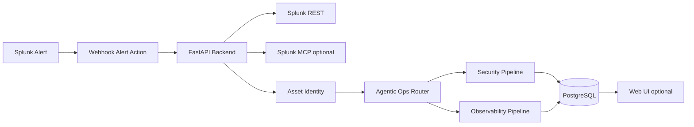

# HLD — High-Level Design

High-level architecture for the **ThinkingSOC Agentic Ops Router** hackathon demo (Splunk **10+**).

**Diagram:** [`architecture_diagram.md`](../architecture_diagram.md)

## 1. Architecture summary

The system splits into two integration zones:

| Zone | Responsibility |
|------|----------------|
| **Splunk** | Alert source, scheduled searches, REST job results, optional MCP Server (app 7931) |
| **External application** | Ingest API, identity, routing, Security/Observability pipelines, storage, optional web UI |

Splunk delivers alert handoff via the **built-in Webhook Alert Action**. The application uses the alert `sid` to load full job rows through **Splunk REST**. Investigation SPL uses SAIA REST **`/predict`**; optional **Splunk MCP** runs **`splunk_run_query`** (All Time). Structured outputs persist in **PostgreSQL**.

## 2. Logical components

## 3. Major services

| Service | Role |
|---------|------|
| Ingest API | Receives Splunk webhook payloads; normalizes handoff |
| Splunk REST client | Fetches full job results by `sid` |
| Splunk MCP client | JSON-RPC to `/services/mcp` (`splunk_*`, `saia_*` tools) |
| Asset Identity | Maps alert entities to `tsoc_users` / `tsoc_assets` via rules |
| Agentic Ops Router | LLM classifies alert → **Security** or **Observability** (one pipeline) or manual review |
| Security pipeline | Defender → Hunter → **Judge** (final verdict) |
| Observability pipeline | Diagnoser → Responder → **Ops Judge** |
| Assistant SPL | Analyst-ready SPL (REST `/predict`, then MCP execute; LiteLLM / rule fallback) |
| Storage | PostgreSQL: typed JSON records + inventory tables |
| Developer tools | SDK / CLI for triage and evidence (optional demo path) |
| **SOC vector RAG** | Qdrant + Postgres: persisted SOC chat, session RAG, Text-to-SQL, correlation in chat, similar alerts — [10-soc-vector-rag.md](./10-soc-vector-rag.md) |

## 4. End-to-end data flow

1. Splunk alert fires.
2. Webhook sends `sid`, `search_name`, and first result row.
3. Backend normalizes payload → `SplunkAlertIngest`.
4. REST loads all rows for `sid`.
5. Optional MCP metadata enriches classifier / triage.
6. Asset Identity resolves users/assets.
7. Router selects **one** pipeline: Security **or** Observability (never both).
8. Pipeline produces structured sections (Judge / Ops Judge is final).
9. SPL suggestion attached for investigation.
10. Results stored in PostgreSQL; API and future UI read back.

## 5. Security pipeline (conceptual)

| Stage | Purpose |
|-------|---------|
| **Defender** | Benign / alternate-hypothesis advocacy (court “defense” — not IR runbooks) |
| **Hunter** | Investigation expansion and search hypotheses |
| **Judge** | Final verdict, priority, next step, confidence |
| **Admin org GAP** (post-pipeline) | When inventory/org context is insufficient, suggest **one question** for an administrator |

Judge is always the **final decision layer** for Security track output. Admin org GAP is a **separate post-step** (not a fourth agent persona) — see [07-lld-low-level-design.md](./07-lld-low-level-design.md) §5.

## 6. Observability pipeline (conceptual)

| Stage | Purpose |
|-------|---------|
| **Entity resolution** | Map host/service to inventory asset |
| **Impact context** | Severity + asset criticality + metric thresholds → impact score |
| **Diagnoser** | Root-cause hypotheses |
| **Responder** | Operational response plan |
| **Ops Judge** | Final operational verdict and recommended next step |

## 7. Storage model

| Store | Content |
|-------|---------|
| `tsoc_records` | Typed JSON audit trail (`splunk_ingest`, `soc_analysis`, `observability_analysis`, etc.) |
| `tsoc_users` / `tsoc_assets` | Inventory |
| `tsoc_relationships` | User–asset mapping for enrichment |

## 8. Scope and demo priorities

This repository is a **credible end-to-end demo**, not the full commercial ThinkingSOC product. Splunk holds alerts and raw data; analysis and inventory live in the external app.

For judging, the demo should show:

- Alert handoff from Splunk
- REST enrichment by `sid`
- Automatic route selection
- Security or Observability pipeline output with final Judge verdict
- Admin organizational GAP question on investigation UI when ownership/escalation context is missing
- SPL suggestion for next investigation
- Optional SDK/CLI and evidence pack

## 9. Related documents

| Document | Topic |
|----------|--------|
| [07-lld-low-level-design.md](./07-lld-low-level-design.md) | Contracts, APIs, sequences |
| [03-architecture.md](./03-architecture.md) | Runtime layers and principles |
| [02-integration-boundaries.md](./02-integration-boundaries.md) | Splunk ↔ application contracts |
| [04-agents-and-pipelines.md](./04-agents-and-pipelines.md) | Router and pipeline stages |
| [01-system-overview.md](./01-system-overview.md) | Repository map |
| [10-soc-vector-rag.md](./10-soc-vector-rag.md) | SOC vector RAG (Qdrant + FastEmbed) |
| [17-observability-pipeline.md](./17-observability-pipeline.md) | Observability pipeline detail |
| [18-llm-service-layer.md](./18-llm-service-layer.md) | LLM service layer |
| [19-storage-persistence.md](./19-storage-persistence.md) | Storage and persistence |
| [21-database-schema.md](./21-database-schema.md) | Full database schema |
