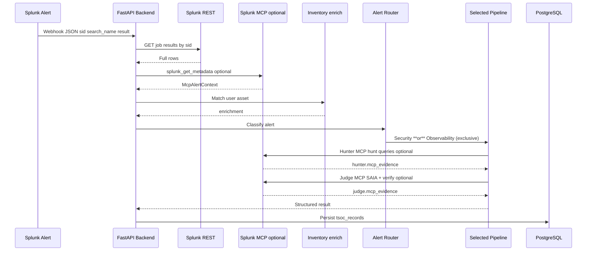

# LLD — Low-Level Design

Implementation contracts, data shapes, API surface, and operation sequence for this repository.

**HLD:** [06-hld-high-level-design.md](./06-hld-high-level-design.md) · **Diagram:** [architecture_diagram.md](../architecture_diagram.md)

## 1. Repository layout

| Path | Role |
|------|------|
| `ThinkingSOC_Hackathon_Splunk_App/` | Minimal Splunk app (index metadata, webhook) — install under `$SPLUNK_HOME/etc/apps/` |
| `backend/data/demo/` | Demo PostgreSQL snapshot + CSV fallback — see [24-demo-postgresql-data.md](./24-demo-postgresql-data.md) |
| `backend/` | FastAPI application, services, Splunk clients, PostgreSQL access |
| `backend/db/schema.sql` | PostgreSQL DDL |
| `frontend/` | Next.js analyst UI (inventory, analysis, investigation — not in Splunk) |
| `setup.py` + `setup_tool/` | Venv, dependencies, Postgres, schema, seed |

Splunk install target (typical): `/opt/splunk/etc/apps/ThinkingSOC_Hackathon_Splunk_App/`

## 2. Minimal Splunk app structure

```text
ThinkingSOC_Hackathon_Splunk_App/
├── bin/
│   └── thinkingsoc_hackathon.py    # modular alert action
├── default/
│   ├── app.conf
│   ├── alert_actions.conf
│   ├── indexes.conf
│   └── data/ui/alerts/thinkingsoc_hackathon.html
└── metadata/
    └── default.meta

backend/data/demo/
├── postgres_snapshot/     # manifest.json + table JSON (primary seed)
│   ├── tsoc_users.json
│   ├── tsoc_assets.json
│   ├── tsoc_relationships.json
│   ├── tsoc_identity_rules.json   # legacy demo seed only — enrichment uses built-in field maps
│   ├── tsoc_records.json   # up to 6 newest rows by id
│   └── graph_findings.json # newest correlation finding
└── tsoc_*.csv             # fallback + scenario packs
```

Product UI, inventory, relationships, and analysis views live in the **external application**, not Splunk Web.

## 3. Inventory data (PostgreSQL)

### `tsoc_users`

| Field | Required | Description |
|-------|----------|-------------|
| `user_id` | yes | Unique user/account ID |
| `display_name` | no | Display name |
| `email` | no | Contact email |
| `department` | no | Department |
| `risk_score` | yes | User risk score |
| `description` | no | Notes |

### `tsoc_assets`

| Field | Required | Description |
|-------|----------|-------------|
| `asset_id` | yes | Unique asset ID |
| `asset_type` | yes | server, endpoint, app, network, etc. |
| `hostname` / `fqdn` | conditional | At least one host identifier when used for matching |
| `ip` | conditional | IP when used for matching |
| `owner` | no | Service owner |
| `criticality` | yes | low / medium / high / critical |
| `risk_score` | yes | Asset risk score |

### `tsoc_relationships`

| Field | Required | Description |
|-------|----------|-------------|
| `relationship_id` | yes | Unique relationship ID |
| `user_id` | yes | FK to `tsoc_users.user_id` |
| `asset_id` | yes | FK to `tsoc_assets.asset_id` |
| `description` | no | Notes |

Unique constraint on `(user_id, asset_id)`.

### Default relationships (auto-generated)

When the relationships table is empty but users and assets exist, the backend infers links from inventory fields (`services/inventory/default_relationships.py`):

| Rule | Example |
|------|---------|
| `asset.owner` equals `user.user_id` | `owner=jdoe` → user `jdoe` |
| `asset.owner` team label maps to `user.department` | demo: `ops` → IT, `dba` → Finance |

On first demo seed (`install.sh` / `setup.py` / empty PostgreSQL), **`restore_postgres_snapshot_if_empty()`** loads the bundled snapshot when `postgres_snapshot/manifest.json` exists; otherwise **`seed_inventory_from_csv_if_empty()`** loads CSVs and merges explicit `tsoc_relationships.csv` with generated defaults (CSV wins on the same user+asset pair). `ensure_default_relationships()` also runs at API startup for existing deployments that have inventory but no links yet.

### Enrichment pipeline (alert → risk context)

1. **`enrich_from_inventory()`** (`services/alert/enrichment_resolver.py`) matches alert `normalized` fields to `tsoc_users` / `tsoc_assets` (built-in field map).
2. If only **user** or only **asset** is resolved, **`tsoc_relationships`** fills the missing side (highest criticality asset or highest user `risk_score` when multiple links exist).
3. SOC / Observability runners call **`build_risk_context()`** with resolved ids + full inventory rows → `risk_context` string (criticality, risk scores, department) fed to LangGraph / Judge.
4. **`POST /inventory/enrich`** exposes the same logic for UI/tests; analysis persists `enrichment` on `SocAnalysisResult`.

## 4. Webhook handoff contract

Splunk **built-in Webhook Alert Action** → `POST /api/v1/alerts/splunk-ingest`

| Field | Description |
|-------|-------------|
| `sid` | Search job ID (required for REST enrichment) |
| `orig_sid` | Optional original SID |
| `search_name` | Saved search / alert name |
| `server_uri` | Optional Splunk server reference |
| `result` | First / primary result row |
| `results` | Optional array of **all** job rows (sent by `ThinkingSOC_Hackathon_Splunk_App` when `results.csv.gz` has 2+ rows) |
| `app`, `owner` | Optional Splunk context |

Backend normalizes into `SplunkAlertIngest` (`result` or `results[]`). Optional bearer: `Authorization: Bearer <TSOC_INGEST_TOKEN>` when configured.

**Splunk app:** `ThinkingSOC_Hackathon_Splunk_App/bin/thinkingsoc_hackathon.py` reads Splunk’s gzip results file (`results.csv.gz`) and includes every row in `results` when present.

**No URL configuration:** do not append query parameters to the ingest URL (e.g. `?auto_analyze=true`). Behavior is controlled by `TSOC_INGEST_AUTO_ANALYZE` in `backend/.env`. Forbidden query keys return HTTP `400`.

| Response | When |
|----------|------|
| `202 Accepted` | `TSOC_INGEST_AUTO_ANALYZE=true` (default after install) — triage runs in background |
| `200 OK` | `TSOC_INGEST_AUTO_ANALYZE=false` — ingest summary persisted only |
| `400 Bad Request` | Request includes config-style query parameters |

### Multi-row jobs

Splunk may return multiple statistics/events for one search (e.g. `| stats … | head 2`).

**Ingest path (default):**

1. Webhook POST(s) → optional **row buffer** per `sid` (`TSOC_INGEST_ROW_BUFFER`, debounce `TSOC_INGEST_ROW_BUFFER_SECONDS`).
2. On flush → **REST enrich** loads/confirms all job rows (`enrich_alert_from_splunk`).
3. `run_post_ingest` → `run_agent_triage_all_rows` loops rows **in order** (await per row).
4. Each row: classify → Security or Observability pipeline → **one** `soc_analysis` persist (`run_analysis`).
5. Storage `sid` = `{job_sid}-{n}` when `n > 1` rows exist (`n` is **1-based**); single-row jobs keep `sid` as-is.
6. Cap: `TSOC_INGEST_AUTO_ANALYZE_MAX_ROWS` (default 50).

`raw_alert.splunk_job_sid` preserves the Splunk REST job id; strip row suffix before `GET .../jobs/{sid}/results`.

## 5. Analysis output contracts

### Security (`soc_analysis`)

| Section | Content |
|---------|---------|
| `summary` | Short summary (optional) |
| `defender` | Defense-advocate narrative (benign hypotheses, signal weakness — not containment runbooks) |
| `hunter` | Investigation hypotheses and search suggestions; optional `mcp_evidence` (MCP hunt queries + metadata) |
| `judge` | **Final** verdict, priority, next step, rationale, confidence; optional `mcp_evidence` (SAIA + verification) |
| `enrichment` | Inventory match result (user/asset IDs, confidence) |
| `risk_context` | User/asset risk context |
| `framework_mapping` | MITRE or similar (when available) |
| `evidence_refs` | References to Splunk fields / data |
| `investigation_questions` | List of `{ question, spl, cim_datamodel, explanation, time_window, pivots, notes, validation, spl_results }` — per-question REST `/predict` + MCP `splunk_run_query` (`search`-only execution; `cim_datamodel` is optional metadata) ([13](./13-cim-investigation-spl-mcp.md)) |
| `root_cause_spl` | Legacy single SPL object (assistant/triage); SOC UI prefers `investigation_questions` |
| `threat_intel` | Optional compact VirusTotal findings ([09-virustotal-threat-intel.md](./09-virustotal-threat-intel.md)) |
| `triage` | Post-analysis priority queue outcome ([08-triage-priority-layer.md](./08-triage-priority-layer.md)) |
| `admin_org_gap` | Organizational knowledge gap: whether to ask an admin, summary, and **one** suggested question (see below) |
| `evidence_chain` | Structured object: `request`, `data_sources`, `reasoning_path`, `decision`, `trace` for audit/explainability |

### Admin organizational GAP (`admin_org_gap`)

After every successful Security analysis (`run_analysis`), the backend runs **admin-org GAP** and attaches the result to `SocAnalysisResult.admin_org_gap`. It also persists a separate audit row `admin_org_gap_suggest` when PostgreSQL is configured.

| Field | Type | Description |
|-------|------|-------------|
| `should_suggest_question` | boolean | `true` only when missing org context materially affects interpretation |
| `gap_summary` | string | What is unknown in organizational terms (ownership, policy, escalation, …) |
| `question_for_admin` | string | Single concrete question for an administrator (empty when not suggested) |
| `notes` | string (optional) | Short note for the SOC (e.g. fallback reason) |

**Hackathon scope:** suggestion only — no admin answer workflow, queue, RAG, or persistent knowledge base.

**When it runs:** `attach_admin_org_gap` is called after **every** successful `run_analysis` path (LangGraph LLM and rule fallback), before persistence.

**Rule hints (fallback + LLM guard):** Even when `resolved_asset_id` is set, suggest a question when the alert shows **ambiguous process/policy** context (e.g. `osk.exe`, LOLBAS-style execution from PowerShell). Plain host linkage without suspicious process fields may still yield `should_suggest_question: false`.

**Standalone API:** `POST /api/v1/admin-org/gap-suggest` — same logic with alert + optional Defender/Hunter/Judge excerpts (for tools that do not run the full SOC graph).

**Implementation:** `services/soc_analysis/admin_org_gap.py` (`rule_based_admin_org_gap`, `suggest_admin_org_gap`, `attach_admin_org_gap`); prompt `services/prompts/prompt_admin_org_gap_system.md`.

### Observability (`observability_analysis`)

| Section | Content |
|---------|---------|
| `entity_resolution` | Resolved operational entity |
| `impact_context` | Service and user impact |
| `diagnoser` | Root-cause hypotheses |
| `responder` | Operational response plan |
| `ops_judge` | **Final** operational verdict |

## 6. Operation sequence



## 7. HTTP API surface (`/api/v1`)

All paths are relative to the FastAPI app base URL (default `http://127.0.0.1:9876` per `TSOC_HTTP_PORT`).

### Ingest and health

| Method | Path | Role |
|--------|------|------|
| `GET` | `/health` | Liveness |
| `POST` | `/alerts/splunk-ingest` | Splunk webhook ingest (`202` or `200`; no config query params) |
| `POST` | `/alerts/splunk-ingest-debug` | Debug ingest (when enabled) |

### Classification, routing, analysis

| Method | Path | Role |
|--------|------|------|
| `POST` | `/classification/alert` | LLM classification only (full payload) |
| `POST` | `/analysis/route` | Classify (LLM) and run **one** pipeline (Security **or** Observability) |
| `POST` | `/analysis/run` | Security pipeline |
| `POST` | `/analysis/run-by-sid` | Batch Security analysis by `sid` |
| `POST` | `/observability/run` | Observability pipeline |
| `POST` | `/observability/run-by-sid` | Batch Observability analysis by `sid` |
| `POST` | `/agents/triage` | Classify + run **one** pipeline + triage bundle |
| `GET` | `/triage/queue` | Priority-sorted analyst queue (`track`, `limit`) |
| `POST` | `/admin-org/gap-suggest` | Suggest one organizational GAP question for an admin |

### Alert classification contract

`POST /classification/alert` and the classification step inside `/analysis/route` return `AlertClassificationResult`:

| Field | Values | Notes |
|-------|--------|-------|
| `track` | `security` \| `observability` \| `unknown` | Exclusive — not `both` |
| `recommended_pipeline` | `security` \| `observability` \| `manual_review` | Not `dual` |
| `confidence` | `0.0`–`1.0` | From LLM |
| `classification_source` | `llm` \| `rules` | `llm` on success; `rules` = fallback manual_review |
| `needs_human_routing` | `bool` | `true` when pipeline is `manual_review` |

**LLM input:** full JSON payload (`search_name`, `sid`, `normalized`, all `splunk_results`, optional `splunk_mcp`). See [04-agents-and-pipelines.md](./04-agents-and-pipelines.md) § Agentic router.

**Routing rule:** `/analysis/route` and `/agents/triage` use `if security` / `elif observability` — never run both pipelines for one alert.

### Inventory

| Method | Path | Role |
|--------|------|------|
| `GET` | `/inventory/status` | PostgreSQL inventory configured |
| `POST` | `/inventory/enrich` | Match alert → users/assets (optional offline body) |
| `GET` / `POST` | `/inventory/users` | List / create users |
| `GET` / `PATCH` / `DELETE` | `/inventory/users/{user_id}` | CRUD user |
| `GET` / `POST` | `/inventory/assets` | List / create assets |
| `GET` / `PATCH` / `DELETE` | `/inventory/assets/{asset_id}` | CRUD asset |
| `GET` / `POST` | `/inventory/relationships` | List / create relationships |
| `GET` / `PATCH` / `DELETE` | `/inventory/relationships/{relationship_id}` | CRUD relationship |

### Assistant, MCP, storage, LLM

| Method | Path | Role |
|--------|------|------|
| `POST` | `/assistant/spl-suggest` | Generate suggested SPL |
| `GET` | `/mcp/status` | MCP connectivity and `saia_available` |
| `POST` | `/mcp/spl-generate` | Debug SAIA SPL generation |
| `POST` | `/mcp/tools/call` | Generic MCP tool proxy |
| `GET` | `/storage/events` | List `tsoc_records` (filter by `sid`, `record_type`) |
| `GET` | `/storage/events/{record_id}` | Single record by PostgreSQL id |
| `GET` | `/llm/status` | LiteLLM configuration status |
| `POST` | `/llm/chat` | Direct LLM chat (audit logged) |
| `GET` | `/soc/chat/status` | Postgres + Qdrant health, document count, correlation Neo4j flag |
| `GET` | `/soc/chat/conversations` | List persisted chat sessions (newest first) |
| `POST` | `/soc/chat/conversations` | Create empty conversation (returns `id`) |
| `GET` | `/soc/chat/conversations/{id}` | Load conversation + all messages |
| `DELETE` | `/soc/chat/conversations/{id}` | Delete conversation and messages |
| `POST` | `/soc/chat` | Chat body: `messages` + optional `conversation_id`; persists turns; routes narrative → RAG or statistical → Text-to-SQL |
| `POST` | `/soc/rag/backfill` | Re-index from `tsoc_records` + inventory + **correlation** (Neo4j + `graph_findings`) |

### Dashboard, investigation, integrations

| Method | Path | Role |
|--------|------|------|
| `GET` | `/dashboard/overview` | Platform KPIs, triage charts, health score |
| `GET` | `/investigation/records/{record_id}/timeline` | Chronological investigation steps |
| `GET` | `/investigation/records/{record_id}/analyst-actions` | List analyst acknowledge/escalate actions |
| `POST` | `/investigation/records/{record_id}/analyst-actions` | Record analyst action |
| `GET` | `/integrations/settings` | List integration overrides (admin bearer) |
| `GET` | `/integrations/settings/{setting_id}` | Get one setting |
| `POST` | `/integrations/settings` | Create setting |
| `PATCH` | `/integrations/settings/{setting_id}` | Update setting |
| `DELETE` | `/integrations/settings/{setting_id}` | Delete setting |

### Correlation graph (`TSOC_CORRELATION_ENABLED=true`)

Mounted at `/api/v1/graph` via `services/correlation_integration.py`:

| Method | Path | Role |
|--------|------|------|
| `GET` | `/graph/health` | Neo4j + Postgres connectivity |
| `GET` | `/graph/findings` | List correlation findings |
| `GET` | `/graph/findings/{finding_id}` | Finding detail |
| `GET` | `/graph/topology/{finding_id}` | Graph topology for explorer |
| `GET` | `/graph/attack-tree/{finding_id}` | Attack tree view |
| `POST` | `/graph/analysis/discover-attack-paths` | Smart Attack Discovery |
| `POST` | `/graph/internal/correlate` | Internal correlate hook |

Route modules: `backend/api/routes/`. OpenAPI: `/docs` when the API is running.

## 8. PostgreSQL record types (`tsoc_records.tsoc_record_type`)

Examples persisted in `payload` JSONB:

| Type | Purpose |
|------|---------|
| `splunk_ingest` | Normalized webhook + enrichment metadata |
| `soc_analysis` | Security pipeline output |
| `observability_analysis` | Observability pipeline output |
| `agentic_ops_analysis` | Combined router / triage output |
| `enrichment_resolve` | Inventory enrichment audit (`POST /inventory/enrich`) |
| `ingest_background_error` | Background ingest/triage failure audit |
| `soc_analysis_batch` | Batch Security analysis by `sid` summary |
| `soc_analysis_audit` | Pipeline timing, tokens, model metadata |
| `investigation_analyst_action` | Human acknowledge/escalate decision |
| `llm_chat_audit` | LLM call audit |
| `admin_org_gap_suggest` | Admin org-gap request/response audit (also embedded on `soc_analysis` as `analysis.admin_org_gap`) |
| `soc_investigation_evidence_chain` | Investigation phase record with the same `evidence_chain` object for timeline/audit |

SOC vector RAG: table `tsoc_rag_documents`, Qdrant collection `tsoc_soc_rag` — [10-soc-vector-rag.md](./10-soc-vector-rag.md). `soc_analysis` may include `similar_alert_context` when RAG is enabled.

**SOC Chat persistence** (same PostgreSQL DSN):

| Table | Purpose |
|-------|---------|
| `tsoc_chat_conversations` | Session metadata (`conversation_id`, `title`, `created_at`, `updated_at`) |
| `tsoc_chat_messages` | Ordered turns (`role`, `content`, `seq`, optional `metadata` e.g. `sql_meta`) |

DDL is created on first use by `services/soc_rag/chat_store.py` (`ensure_chat_schema`). See [10-soc-vector-rag.md](./10-soc-vector-rag.md#persisted-conversations).

## 9. Security and configuration

- No secrets in the repository; use `backend/.env` (from `.env.example`).
- Splunk credentials: `SPLUNK_MGMT_URL`, `SPLUNK_USERNAME`, `SPLUNK_PASSWORD`, `SPLUNK_VERIFY_SSL`.
- Splunk MCP: `TSOC_MCP_ENABLED`, `SPLUNK_MCP_URL`, `SPLUNK_MCP_TOKEN` — see [02-integration-boundaries.md](./02-integration-boundaries.md).
- Investigation SPL: `TSOC_SPL_USE_REST_PREDICT`, `TSOC_SPL_PREDICT_TIMEOUT_SECONDS`, `TSOC_EXECUTE_INVESTIGATION_SPL`, `TSOC_SPL_EXECUTE_VIA_MCP`, `TSOC_INVESTIGATION_SPL_TIME_WINDOW` — see [13-cim-investigation-spl-mcp.md](./13-cim-investigation-spl-mcp.md).
- MCP/SAIA trace: `TSOC_MCP_TRACE_LOG`, `TSOC_SAIA_TRACE_LOG`, `TSOC_TRACE_LOG_FILE` (optional) — see [13-cim-investigation-spl-mcp.md](./13-cim-investigation-spl-mcp.md).
- PostgreSQL: `TSOC_POSTGRES_DSN`.
- Optional ingest protection: `TSOC_INGEST_TOKEN`.
- LLM keys via LiteLLM / provider env vars.

## 10. UI scope (external app)

Implemented pages in `frontend/app/(app)/`:

| Page | Purpose |
|------|---------|
| `dashboard` | Platform overview KPIs and health |
| `inventory` | Users and assets |
| `relationships` | User–asset mapping UI |
| `analysis` | Pipeline results and integrated triage queue |
| `analysis/investigation/[id]` | Security investigation tabs — **Admin** and **Evidence chain** when present |
| `analysis/ops-investigation/[id]` | Observability investigation detail |
| `triage` | Priority-sorted analyst queue |
| `correlation` | Graph correlation explorer |
| `correlation/explorer` | Graph Explorer detail view |
| `soc-chat` | SOC chat with RAG + Text-to-SQL |
| `splunk-connection` | Integration settings (Splunk REST, MCP, LiteLLM, …) |

No product UI is implemented inside Splunk Web for this hackathon.

### TriageOutcome (post-analysis)

See [08-triage-priority-layer.md](./08-triage-priority-layer.md). Compact JSON shape:

```json
{
  "review_verdict": "NEEDS_HUMAN_REVIEW",
  "investigation_priority": "high",
  "triage_score": 72,
  "confidence_score": 0.65,
  "priority_rationale": "…",
  "signals": ["classifier_needs_human_routing"],
  "needs_human_review": true,
  "source_track": "security",
  "mapped_from": {
    "judge.verdict": "needs_investigation",
    "judge.priority": "high",
    "judge.confidence": "medium",
    "review_verdict_raw": "NEEDS_HUMAN_REVIEW"
  }
}
```

Stored on `soc_analysis` / `observability_analysis` payloads as `triage` (and nested under `analysis.triage`).

## 11. Related documents

| Document | Topic |
|----------|--------|
| [06-hld-high-level-design.md](./06-hld-high-level-design.md) | High-level architecture |
| [02-integration-boundaries.md](./02-integration-boundaries.md) | Splunk integration detail |
| [04-agents-and-pipelines.md](./04-agents-and-pipelines.md) | Pipeline internals |
| [08-triage-priority-layer.md](./08-triage-priority-layer.md) | Triage scoring and queue API |
| [05-codebase-map.md](./05-codebase-map.md) | Code graph and module map |
| [backend/README.md](../backend/README.md) | Run and configure the API |
| [10-soc-vector-rag.md](./10-soc-vector-rag.md) | SOC vector RAG modules, APIs, deployment |
| [14-inventory-service.md](./14-inventory-service.md) | Inventory service API and data models |
| [16-dashboard.md](./16-dashboard.md) | Dashboard API and data models |
| [17-observability-pipeline.md](./17-observability-pipeline.md) | Observability pipeline data models |
| [19-storage-persistence.md](./19-storage-persistence.md) | Storage API and record types |
| [20-investigation-workflow.md](./20-investigation-workflow.md) | Investigation API contracts |
| [21-database-schema.md](./21-database-schema.md) | Full database schema |
