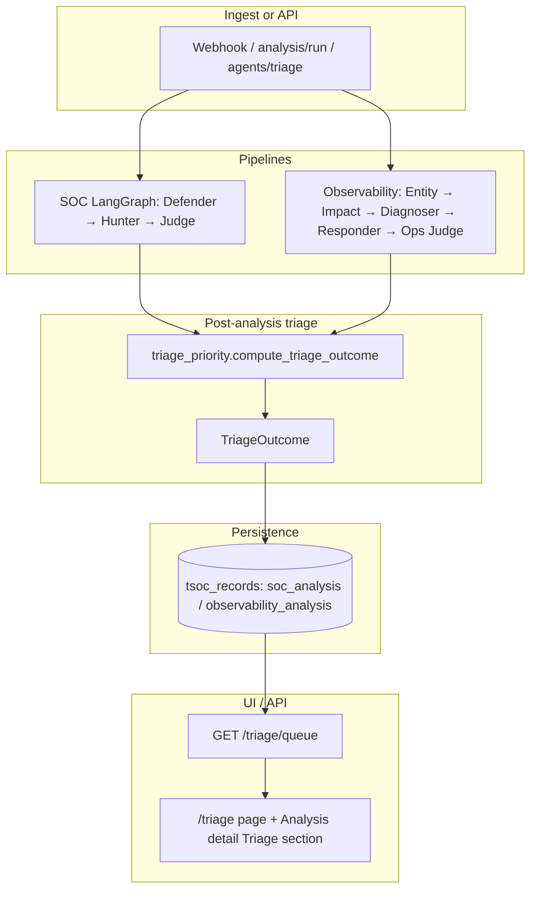

# Post-analysis Triage and priority queue

This document describes the **analyst triage layer**: how ThinkingSOC Lite turns pipeline outputs (SOC Judge / Ops Judge) into a **sortable review priority** and a **closed verdict taxonomy** for the operator UI and APIs.

**Related:** [04-agents-and-pipelines.md](./04-agents-and-pipelines.md) (pipelines), [07-lld-low-level-design.md](./07-lld-low-level-design.md) (HTTP contracts).  
**Inspiration:** [DeeperSplunk](https://github.com/iliasarmenakis/DeeperSplunk) — adversarial SOC triage with `TRUE_POSITIVE` / `FALSE_POSITIVE` / `NEEDS_HUMAN_REVIEW` and low-confidence escalation. ThinkingSOC Lite implements a **post-processing** layer on the existing Judge (no separate MCP server).

## Two meanings of “triage” in this repo

| Term | What it is | Entry point |
|------|------------|-------------|
| **Agent triage** | Orchestration: classify → run **one** pipeline (Security **or** Observability) → SPL hints | `POST /api/v1/agents/triage`, `services/alert/agent_triage.py` |
| **Post-analysis triage** (this doc) | Priority scoring **after** Judge/Ops Judge completes | `services/triage/triage_priority.py`, `TriageOutcome` |

Agent triage **includes** post-analysis triage in its response (`security_triage`, `observability_triage`).

## Problem and goal

Judge outputs use **free-form** `verdict` and `priority` strings. That is enough for narrative review but not for:

- A **consistent queue** sorted by urgency
- **Demo-friendly** badges (`TRUE_POSITIVE`, etc.)
- **Automatic escalation** when the model is not confident enough to auto-close a ticket

The triage layer answers: *“Given this analysis finished, how soon should a human look at it, and what class of decision is it?”*

## End-to-end flow



## Data model: `TriageOutcome`

**Module:** `backend/models/triage.py`

| Field | Type | Description |
|-------|------|-------------|
| `review_verdict` | `TRUE_POSITIVE` \| `FALSE_POSITIVE` \| `NEEDS_HUMAN_REVIEW` | Normalized review class |
| `investigation_priority` | `critical` \| `high` \| `medium` \| `low` | Human-readable urgency band |
| `triage_score` | `int` 0–100 | **Queue sort key** (higher = review sooner) |
| `confidence_score` | `float` 0–1 | Derived from Judge `confidence` (high/medium/low) |
| `priority_rationale` | `string` | Short explanation for analysts |
| `signals` | `string[]` | Machine tags (see below) |
| `needs_human_review` | `bool` | True when verdict is `NEEDS_HUMAN_REVIEW` or classifier requested human routing |
| `source_track` | `security` \| `observability` | Which pipeline produced the Judge block |
| `mapped_from` | `object` | Traceability (`judge.verdict`, `judge.priority`, `review_verdict_raw`, …) |
| `report` | `TriageReport` | Structured analyst report: `headline`, `why_verdict`, `why_priority`, `recommended_action`, `factors[]`, `signal_notes[]` |

Embedded on:

- `SocAnalysisResult.triage`
- `ObservabilityAnalysisResult.triage`
- `AgentTriageResponse.security_triage` / `observability_triage`

## Scoring rules (`services/triage/triage_priority.py`)

### Step 1 — Map Judge verdict → `review_verdict`

Uses `services/soc_verdict.py` for false-positive-like strings (`likely_benign`, `false_positive`, `fp`, …).

| Judge-style input | `review_verdict` |
|-------------------|------------------|
| FP / benign family | `FALSE_POSITIVE` |
| `true_positive`, `malicious`, `confirmed`, … | `TRUE_POSITIVE` |
| Everything else (`needs_investigation`, `insufficient_data`, …) | `NEEDS_HUMAN_REVIEW` |

### Step 2 — Confidence numeric

| Judge `confidence` | `confidence_score` |
|--------------------|--------------------|
| `high` | 0.85 |
| `medium` | 0.65 |
| `low` | 0.40 |
| missing / other | 0.55 |

### Step 3 — Conviction gate (DeeperSplunk-style)

If `review_verdict` is `TRUE_POSITIVE` or `FALSE_POSITIVE` and `confidence_score < 0.75`, force **`NEEDS_HUMAN_REVIEW`**.

Signal added: `low_confidence_conviction_gate`.

### Step 4 — `triage_score` (0–100)

| Component | Points |
|-----------|--------|
| Base: `TRUE_POSITIVE` | +75 |
| Base: `NEEDS_HUMAN_REVIEW` | +55 |
| Base: `FALSE_POSITIVE` | +15 |
| Judge `priority` contains `critical` / `high` / `medium` | +15 / +10 / +5 |
| Inventory `risk_score` (user or asset, max capped) | +0…+10 |
| Observability `impact_level` critical / high / medium | +15 / +10 / +5 |
| Identity confidence `low` / `medium` / missing | −10 / −5 / −5 |
| Classifier `needs_human_routing` | +12 |
| Final review is `NEEDS_HUMAN_REVIEW` | +8 |

Score is clamped to `[0, 100]`.

### Step 5 — `investigation_priority` from score

| `triage_score` | `investigation_priority` |
|--------------|---------------------------|
| ≥ 80 | `critical` |
| ≥ 60 | `high` |
| ≥ 40 | `medium` |
| &lt; 40 | `low` |

### Signals (examples)

| Signal | When |
|--------|------|
| `low_confidence_conviction_gate` | TP/FP downgraded due to confidence &lt; 0.75 |
| `classifier_needs_human_routing` | `AlertClassificationResult.needs_human_routing` |
| `classifier_manual_review` | `recommended_pipeline == manual_review` |
| `weak_identity_link` | `identity_confidence == low` |

## Where triage is computed and stored

| Location | Behavior |
|----------|----------|
| `services/soc_analysis/runner.py` | After `SocAnalysisResult`, attach `triage` (inventory rows for risk bonus) |
| `services/observability_analysis/runner.py` | After `ObservabilityAnalysisResult`, attach `triage` (impact level) |
| `services/alert/agent_triage.py` | Recompute with **classification** context; re-persist `soc_analysis` / `observability_analysis` so queue reflects router signals |
| `services/soc_analysis/analysis_audit.py` | `build_analysis_output` includes triage fields for audit rows |
| `splunk_json_store/persist/soc.py` | Top-level `triage` on `soc_analysis` payload |
| `splunk_json_store/persist/observability.py` | Top-level `triage` on `observability_analysis` payload |

**Backward compatibility:** `GET /triage/queue` can **recompute** triage from stored `analysis` if an older record has no embedded `triage` (`triage_from_stored_payload`).

## HTTP API

### `GET /api/v1/triage/queue`

**Auth:** Same bearer as ingest (`TSOC_INGEST_TOKEN`) when configured.

**Query parameters:**

| Param | Default | Description |
|-------|---------|-------------|
| `track` | `all` | `security`, `observability`, or `all` |
| `limit` | `50` | Max items (1–500), sorted by `triage_score` descending |

**Response:**

```json
{
  "postgres_configured": true,
  "track": "all",
  "count": 2,
  "results": [
    {
      "id": 42,
      "stored_at": "2026-05-18T10:00:00",
      "tsoc_record_type": "soc_analysis",
      "sid": "scheduler_…",
      "search_name": "Suspicious login",
      "row_index": 0,
      "source_track": "security",
      "triage_score": 88,
      "investigation_priority": "critical",
      "review_verdict": "TRUE_POSITIVE",
      "needs_human_review": false,
      "triage": { }
    }
  ]
}
```

**Errors:** `503` if PostgreSQL store is not configured.

### Enriched responses elsewhere

| Endpoint | Triage fields |
|----------|----------------|
| `POST /api/v1/analysis/run` | `result.triage` and `result.admin_org_gap` on `SocAnalysisResult` |
| `POST /api/v1/observability/run` | `result.triage` |
| `POST /api/v1/agents/triage` | `security_triage`, `observability_triage`; `security_result.admin_org_gap` when Security pipeline ran |
| `GET /api/v1/storage/events?record_type=soc_analysis` | `payload.triage` and/or `payload.analysis.triage` |
| `POST /api/v1/soc/chat` (statistical path) | SQL + `enrich_rows_with_triage` align with queue fields; “high” means **`investigation_priority`**, not Splunk `normalized.severity` — [10-soc-vector-rag.md](./10-soc-vector-rag.md) |

## UI

| Surface | Path / component | Content |
|---------|------------------|---------|
| Analysis & triage queue | `/analysis` — `AnalysisContent` | Unified table: triage score, review verdict, priority, investigation link (sorted by score) |
| Investigation detail | `StorageEventDetail` + `TriageSection` | Full **Triage report** at top: why verdict, why priority, recommended action, score breakdown |
| Admin org GAP | `AdminOrgGapPanel` on investigation overview + **Admin** tab | Suggested question for administrator when `analysis.admin_org_gap.should_suggest_question` is true ([07-lld](./07-lld-low-level-design.md) §5) |
| Legacy URL | `/triage` | Redirects to `/analysis` |

Frontend helpers: `frontend/lib/admin-org-gap.ts` (`pickAdminOrgGap`, `normalizeAdminOrgGap`).

Frontend types: `frontend/lib/api/types.ts` (`TriageOutcome`, `TriageQueueResponse`).

## Example scenarios

### High priority — likely real incident

- Judge: `verdict=true_positive`, `priority=high`, `confidence=high`
- Asset `risk_score=8`
- **Result:** `review_verdict=TRUE_POSITIVE`, high `triage_score`, `investigation_priority` likely `critical` or `high`

### Escalation — TP with low confidence

- Judge: `verdict=true_positive`, `confidence=low` (0.40)
- **Result:** `review_verdict=NEEDS_HUMAN_REVIEW`, signal `low_confidence_conviction_gate`

### Low priority — benign closure

- Judge: `verdict=likely_benign`, `confidence=high`
- **Result:** `review_verdict=FALSE_POSITIVE`, low `triage_score`, `investigation_priority=low`

### Router ambiguity boosts queue

- Classifier: `needs_human_routing=true`, `recommended_pipeline=manual_review`
- **Result:** +12 score, `needs_human_review=true`, signals include classifier flags

## Configuration

Post-analysis triage has **no separate env flag**; it runs whenever analysis runs.

Relevant knobs that **indirectly** affect triage:

| Variable | Effect on triage |
|----------|------------------|
| LiteLLM failure in Judge | Fallback Judge → often lower confidence → more `NEEDS_HUMAN_REVIEW` |
| `TSOC_CLASSIFIER_LLM` | Richer classification → `needs_human_routing` / manual_review signals |
| `TSOC_INGEST_AUTO_ANALYZE` + `TSOC_INGEST_AUTO_ANALYZE_PIPELINE=triage` | Webhook path populates queue via agent triage (default on after `install.sh`) |
| `TSOC_POSTGRES_DSN` | Required for `GET /triage/queue` and persisted triage on records |

## Tests

`backend/tests/test_triage_priority.py`:

- Verdict mapping and conviction gate
- `needs_human_routing` score boost
- Queue API sort order (mocked storage)

Run: `pytest tests/test_triage_priority.py` from `backend/`.

## Out of scope (future)

- DeeperSplunk MCP tools (`fetch_notable_event`, SQLite collective memory, evidence `search_id` validation)
- Full Steelman six-step prompt inside Judge (optional later; current design is post-process only)
- Writing triage verdict back to Splunk ES notable comments

## Source file index

| File | Role |
|------|------|
| `backend/models/triage.py` | `TriageOutcome` model |
| `backend/services/triage/triage_priority.py` | Scoring engine |
| `backend/api/routes/triage.py` | `GET /triage/queue` |
| `backend/main.py` | Router registration |
| `frontend/components/pages/analysis-content.tsx` | Unified analysis + triage queue table |
| `frontend/app/(app)/triage/page.tsx` | Redirect to `/analysis` |
| `frontend/components/structured-data/triage-section.tsx` | Detail Triage block |

## Related documents

- [16-dashboard.md](./16-dashboard.md) — dashboard consumes triage data for KPIs and charts  
- [17-observability-pipeline.md](./17-observability-pipeline.md) — `compute_triage_from_observability`  
- [19-storage-persistence.md](./19-storage-persistence.md) — triage persisted in `tsoc_records`  
- [20-investigation-workflow.md](./20-investigation-workflow.md) — analyst actions on triage queue items
