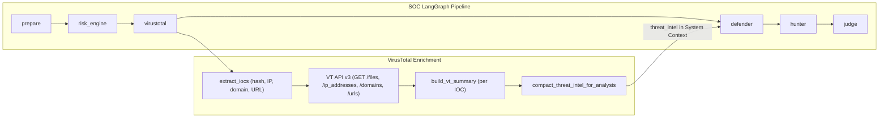
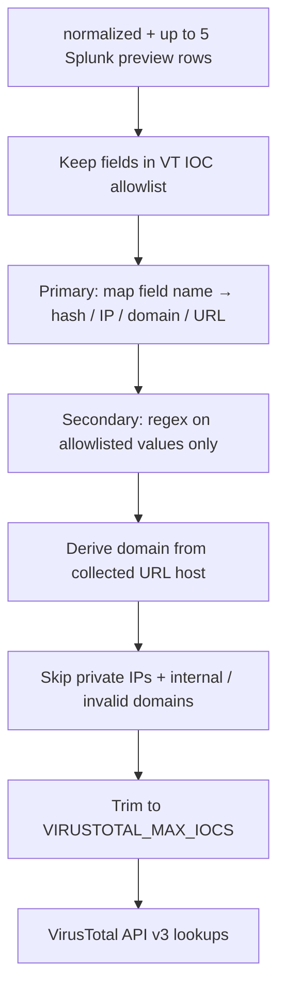

# VirusTotal threat intelligence (SOC analysis)

How ThinkingSOC enriches security alerts with **VirusTotal API v3**, maps responses to the **official object model**, and feeds **compact findings** into the Defender / Hunter / Judge pipeline and the analyst UI.

**Related:** [04-agents-and-pipelines.md](./04-agents-and-pipelines.md) (graph) · [07-lld-low-level-design.md](./07-lld-low-level-design.md) (contracts) · [08-triage-priority-layer.md](./08-triage-priority-layer.md)

## 1. Role in the product

| Stage | Behavior |
|-------|----------|
| **Graph node** `virustotal` | Runs after `risk_engine`, before `defender` |
| **Input** | Normalized alert + Splunk result preview rows |
| **Output** | `threat_intel` on graph state → `SocAnalysisResult.threat_intel` |
| **LLM** | Injected into **System Context** (`canonical_prefix`) as compact JSON |
| **UI** | Threat intel section / tab on investigation views |

VT is **optional**. When disabled or unconfigured, analysis continues without TI.

## 2. Configuration

Environment variables (see `backend/config.py`):

| Variable | Default | Description |
|----------|---------|-------------|
| `VIRUSTOTAL_API_KEY` | *(empty)* | API v3 key (`x-apikey` header). Required for live lookups. |
| `VIRUSTOTAL_ENABLE` | `true` | Set `false` to skip the graph node entirely. |
| `VIRUSTOTAL_BASE_URL` | `https://www.virustotal.com/api/v3` | API base (override only for testing). |
| `VIRUSTOTAL_TIMEOUT_SECONDS` | `15` | Per-request HTTP timeout. |
| `VIRUSTOTAL_MAX_IOCS` | `8` | Max IOCs queried per analysis (0–50). Controls latency and quota. |

Never commit API keys. Use `backend/.env` locally.

## 3. Pipeline placement



Implementation:

| Module | Responsibility |
|--------|----------------|
| `backend/services/threat_intel/virustotal.py` | IOC extraction, HTTP client, `enrich_virustotal()` |
| `backend/services/threat_intel/virustotal_schema.py` | Parse VT v3 envelope; `build_vt_summary()` |
| `backend/services/threat_intel/threat_intel_compact.py` | Analyst-actionable `findings` for LLM + API |
| `backend/services/soc_analysis_graph/nodes_canonical.py` | `make_virustotal_node()` |

## 4. IOC extraction

`extract_iocs(normalized, splunk_results_preview, max_iocs=…)` in `backend/services/threat_intel/virustotal.py` collects IOCs **only from Splunk CIM-style field names** (plus regex inside those same field values). Arbitrary alert fields such as `host`, `Computer`, `_raw`, or `CommandLine` are **not** scanned for domain IOCs.



### 4.1 VT endpoints

| Bucket | VT endpoint | Notes |
|--------|-------------|--------|
| `file_hashes` | `GET /files/{hash}` | MD5 / SHA1 / SHA256 (hex, validated) |
| `ips` | `GET /ip_addresses/{ip}` | **Public** IPs only (`is_public_ip`) |
| `domains` | `GET /domains/{domain}` | Public internet FQDN from domain fields or URL hosts |
| `urls` | `GET /urls/{url_id}` | `url_id` = unpadded base64url(URL) per VT spec |

### 4.2 Allowlisted field names

Field names are matched case-insensitively. Only these groups are considered:

#### IP fields

`src_ip`, `dest_ip`, `client_ip`, `server_ip`, `orig_src_ip`, `orig_dest_ip`, `srcipv4`, `destipv4`, `srcipv6`, `destipv6`, `ip`, `host_ip`, `dvc_ip`, `device_ip`, `answer`, `dns_answer`, `relay_ip`, `forwardedfor`, `xff`, `x_forwarded_for`, `x_forwarded_for_ip`, `true_client_ip`, `src_nat`, `dest_nat`, `src_nat_ip`, `dest_nat_ip`, `vendor_ip`, `remote_ip`, `external_ip`, `internal_ip`

#### Domain fields

`fqdn`, `domain`, `dns_query`, `url_domain`, `http_hostname`, `cs_host`, `mail_from_domain`, `dest_host`, `src_host`, `dest_nt_host`, `src_nt_host`

#### URL / URI fields

`url`, `http_uri`, `cs_uri`, `cs_uri_stem`, `cs_uri_query`, `uri`, `uri_path`, `page_url`, `referer`, `referrer`, `http_referrer`, `http_referer`

#### Hash fields

`md5`, `sha1`, `sha256`, `sha_256`, `sha_1`, `hash`, `hashes`, `file_hash`, `file_md5`, `file_sha1`, `file_sha256`, `process_hash`, `process_md5`, `process_sha256`, `parent_process_hash`, `parent_process_md5`, `parent_process_sha256`, `module_hash`, `certificate_hash`

#### `src` / `dest`

Treated as **IP fields only** when the value parses as a globally routable address. Hostnames in `src` / `dest` are **not** promoted to domain IOCs.

### 4.3 Fields intentionally ignored for VT

These common Splunk / endpoint fields are **not** sent to VT as domains, even when they contain hostnames:

| Ignored field | Example value | Why |
|---------------|---------------|-----|
| `host` | `we8105desk` | Short workstation name, not a public FQDN |
| `Computer` | `we8105desk` | Same as `host` in Sysmon / Windows logs |
| `dvc`, `hostname`, `name`, `query`, `site` | `dc-01`, `SERVER01` | Asset identity, not network IOC context |

Put routable FQDNs in explicit IOC fields such as `domain` or `fqdn` when you want a VT domain lookup.

### 4.4 Regex (secondary pass)

After the primary field-name pass, regex runs **only inside allowlisted field values**:

| Pattern | Extracted as |
|---------|----------------|
| MD5 / SHA1 / SHA256 hex | `file_hashes` |
| `http://` / `https://` URL | `urls` (domain host derived afterward) |
| IPv4 / IPv6 token | `ips` if `is_public_ip` |

Regex is **not** run on unscoped blobs (`_raw`, `CommandLine`, `Image`, `signature`, etc.).

### 4.5 Skip rules (before VT API call)

| Rule | Example | Result |
|------|---------|--------|
| Private / non-global IP | `10.0.0.5`, `192.168.1.1` | Not sent to VT |
| Short hostname (no dot) | `we8105desk`, `dc-01` | Skipped for `/domains` |
| RFC 2606 documentation TLD | `*.example`, `*.test`, `*.invalid`, `*.localhost` | Skipped |
| Internal / AD-style suffix | `*.local`, `*.corp`, `*.internal`, `*.lan`, `*.intranet`, `*.home`, `*.localdomain`, `*.private`, `*.ad` | Skipped |

Private IPs use `ipaddress.is_global`. Documentation nets such as `203.0.113.0/24` and `198.51.100.0/24` are also excluded.

### 4.6 Cap and priority

Total IOCs across all buckets ≤ `VIRUSTOTAL_MAX_IOCS`. When trimming: **hash → ip → url → domain**.

### 4.7 Demo example (BOTSv1 osk.exe sample)

File: `scripts/samples/splunk-webhook-botsv1-osk-sysmon.json`

| Field | Value | VT behavior |
|-------|-------|-------------|
| `host` / `Computer` | `we8105desk` | Ignored (not a domain IOC field) |
| `domain` | `pastebin.com` | Lookup via `GET /domains/pastebin.com` |
| `ParentCommandLine` | `…invoke.ps1` | Ignored (not in allowlist; no regex scan) |

Expected extraction: `domains: ["pastebin.com"]` only.

For a minimal brute-force template with IP + domain IOC fields, see `scripts/samples/splunk-webhook-example.json` (`src_ip`, `domain`).

## 5. VirusTotal API v3 (official shapes)

### 5.1 Response envelope

All object GET responses use:

```json
{ "data": { "id", "type", "links": { "self": "…" }, "attributes": { … } } }
```

Reference: [API responses](https://docs.virustotal.com/reference/api-responses)

### 5.2 Object types (`data.type`)

| IOC bucket | `data.type` | Docs |
|------------|-------------|------|
| IP | `ip_address` | [IP object](https://docs.virustotal.com/reference/ip-object) |
| Domain | `domain` | [Domains](https://docs.virustotal.com/reference/domains-object) |
| URL | `url` | [URL object](https://docs.virustotal.com/reference/url-object) |
| File hash | `file` | [Files](https://docs.virustotal.com/reference/files) |

### 5.3 Attributes used in summaries

We persist a **summary** per IOC (not the full VT payload) using **official attribute names**:

| Attribute | IP / domain / URL | File | Meaning |
|-----------|-------------------|------|---------|
| `last_analysis_stats` | ✓ | ✓ (+ extra keys) | Engine vote counts |
| `reputation` | ✓ | ✓ | Community score (negative → more malicious) |
| `total_votes` | ✓ | ✓ | `{ "harmless", "malicious" }` |
| `tags` | ✓ | ✓ | VT tags list |
| `categories` | domain, URL only | — | Partner categorization dict |
| `last_analysis_date` | ✓ | ✓ | UTC epoch |
| `md5` / `sha256` / … | — | ✓ | File identifiers |

#### `last_analysis_stats` keys

**Network objects** (IP, domain, URL):

- `harmless`, `malicious`, `suspicious`, `timeout`, `undetected` (integers)

**File** (adds):

- `confirmed-timeout`, `failure`, `type-unsupported`

Parsing: `virustotal_schema.normalize_last_analysis_stats()`.

### 5.4 Internal summary shape (`build_vt_summary`)

After each VT HTTP 200, we store:

```json
{
  "id": "<vt object id>",
  "type": "ip_address | domain | url | file",
  "link": "https://www.virustotal.com/api/v3/…",
  "last_analysis_date": 1671691600,
  "last_analysis_stats": { "malicious": 12, "suspicious": 1, "harmless": 2, "undetected": 3, "timeout": 0 },
  "reputation": -50,
  "total_votes": { "harmless": 0, "malicious": 2 },
  "tags": ["malware"]
}
```

Domain/URL may include `categories`. Files may include `md5`, `sha256`, `meaningful_name`, `type_description`.

### 5.5 Raw enrichment blob (`enrich_virustotal` return)

```json
{
  "enabled": true,
  "requested": { "file_hashes": [], "ips": [], "domains": [], "urls": [] },
  "files": { "<hash>": { "error": null, "summary": { } } },
  "ips": { },
  "domains": { },
  "urls": { }
}
```

| `error` | Meaning |
|---------|---------|
| `null` | HTTP 200; `summary` populated |
| `not_found` | HTTP 404 (object unknown to VT) |
| `skipped: …` | Domain filtered before API call (internal hostname, RFC 2606, etc.) |
| `error: …` | Network or HTTP failure |

## 6. Compact threat intel (LLM + API)

`compact_threat_intel_for_analysis()` converts the raw blob into:

```json
{
  "status": "ok | no_significant_hits | unavailable",
  "source": "virustotal",
  "checked_ioc_count": 3,
  "note": "human-readable summary",
  "findings": [
    {
      "ioc": "203.0.113.9",
      "ioc_type": "ip",
      "vt_id": "203.0.113.9",
      "vt_type": "ip_address",
      "verdict": "malicious",
      "last_analysis_stats": { "malicious": 12, "suspicious": 1, "harmless": 2, "undetected": 3, "timeout": 0 },
      "reputation": -50,
      "total_votes": { "harmless": 0, "malicious": 2 },
      "tags": ["malware"]
    }
  ]
}
```

**Inclusion rules** (only actionable IOCs):

- `last_analysis_stats.malicious` or `suspicious` &gt; 0, **or**
- `reputation` &lt; 0, **or**
- `total_votes.malicious` &gt; 0

`verdict` is a **derived** analyst label from stats (`malicious` / `suspicious` / `harmless` / `undetected`); LLM prompts instruct agents to rely on **`last_analysis_stats`** as ground truth.

This compact object is:

1. Added to `canonical_prefix` under `threat_intel`
2. Returned on `SocAnalysisResult.threat_intel`
3. Persisted in Splunk/PostgreSQL audit payloads as part of analysis JSON

## 7. LLM prompts

System prompts for Defender, Hunter, and Judge reference `threat_intel.findings` in System Context:

- **Defender:** adjust urgency when malicious/suspicious hits exist
- **Hunter:** expand SPL around flagged IOCs
- **Judge:** weigh TI in `rationale` alongside `risk_context`

Files: `backend/services/prompts/prompt_defender_system.md`, `prompt_hunter_system.md`, `prompt_judge_system.md`.

## 8. Frontend

| Component | Role |
|-----------|------|
| `frontend/components/structured-data/threat-intel-panel.tsx` | Renders compact findings |
| `soc-analysis-view.tsx` | `ThreatIntelSection` in stack layout |
| `investigation-tabbed-layout.tsx` | **Threat intel** tab when data present |

Displays VT field names: `last_analysis_stats`, `reputation`, `total_votes`, `tags`, `categories` (when present).

## 9. Testing

From `backend/` with venv active:

```bash
.venv/bin/pytest tests/test_virustotal.py tests/test_virustotal_schema.py tests/test_threat_intel_compact.py -q
```

| Test module | Coverage |
|-------------|----------|
| `test_virustotal.py` | `is_public_ip`, IOC extraction, URL id, HTTP client, `enrich_virustotal` |
| `test_virustotal_schema.py` | VT envelope parsing, per-type summaries, official stat keys |
| `test_threat_intel_compact.py` | Significant-finding filter, compact output contract |
| `test_analysis.py` | `extract_iocs` smoke (integration with analysis tests) |

Fixtures: `backend/tests/fixtures/virustotal_api.py` (doc-aligned JSON samples).

## 10. Operational notes

- **Quota / rate limits:** Keep `VIRUSTOTAL_MAX_IOCS` low for demos (default 8).
- **Re-analysis:** Alerts analyzed before this feature may lack `threat_intel`; re-run analysis to populate.
- **No VT in Splunk app:** All TI logic lives in `backend/`; the Splunk app does not call VT.
- **Positive proof:** Prompts warn against treating missing TI as proof of benign activity.

## 11. Code map

```text
backend/services/threat_intel/
  virustotal.py              # IOC extract + client + enrich
  virustotal_schema.py       # VT v3 envelope + summary builder
  threat_intel_compact.py    # findings for LLM/API
backend/services/soc_analysis_graph/
  nodes_canonical.py         # virustotal node
  graph.py                   # edge risk_engine → virustotal → defender
```

## Related documents

- [04-agents-and-pipelines.md](./04-agents-and-pipelines.md) — pipeline overview (VT runs in `virustotal` graph node, after `risk_engine`)  
- [11-environment-configuration.md](./11-environment-configuration.md) — `VIRUSTOTAL_*` env vars
