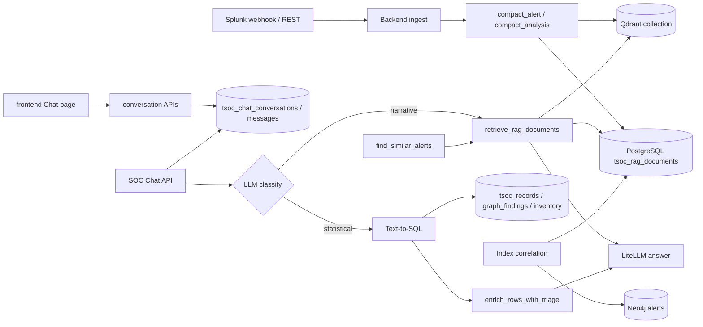
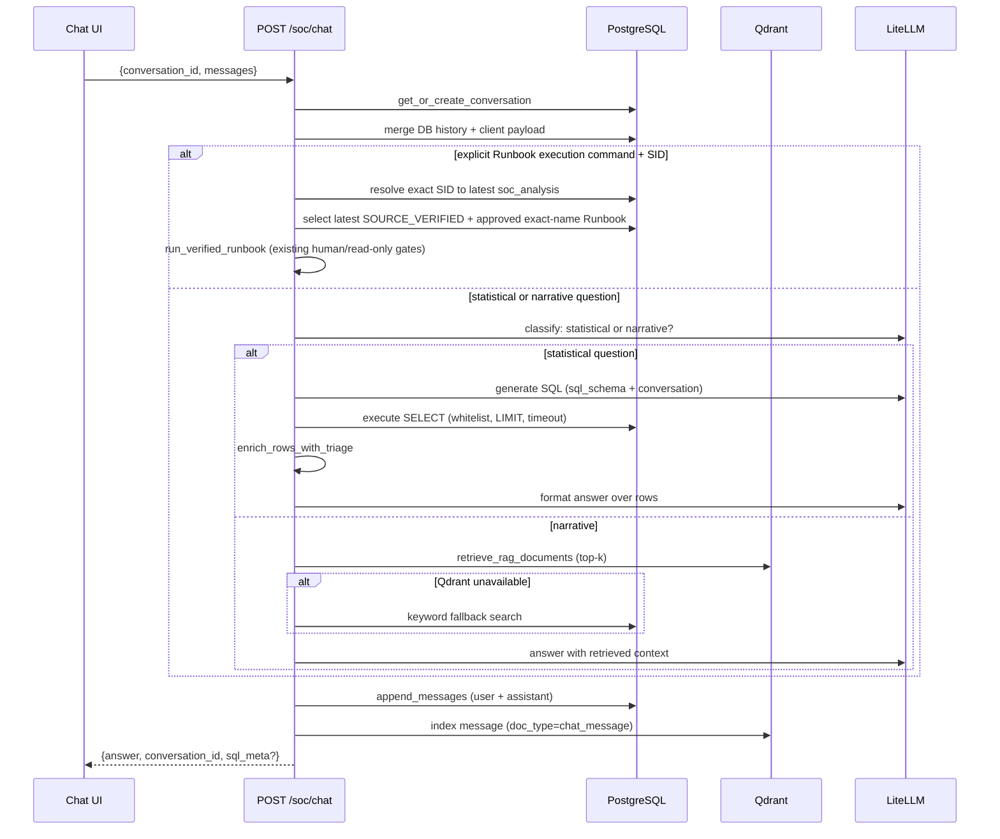
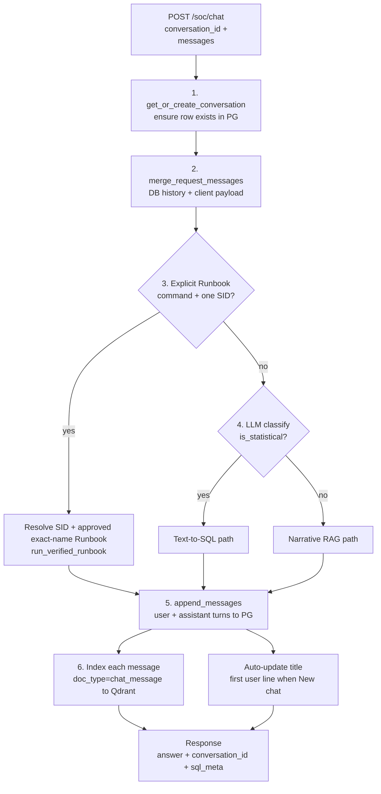
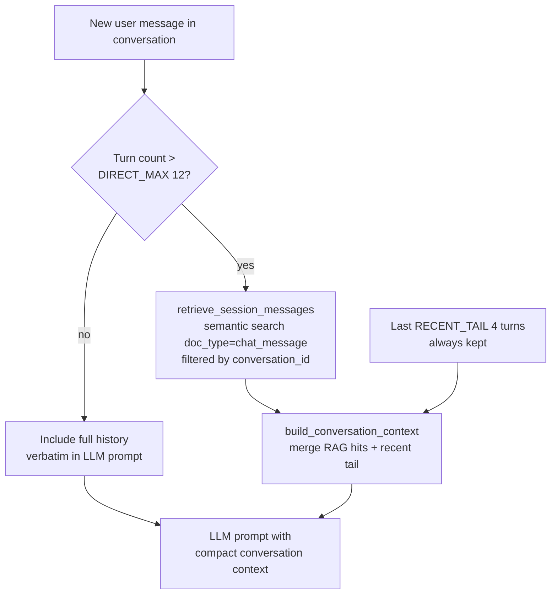
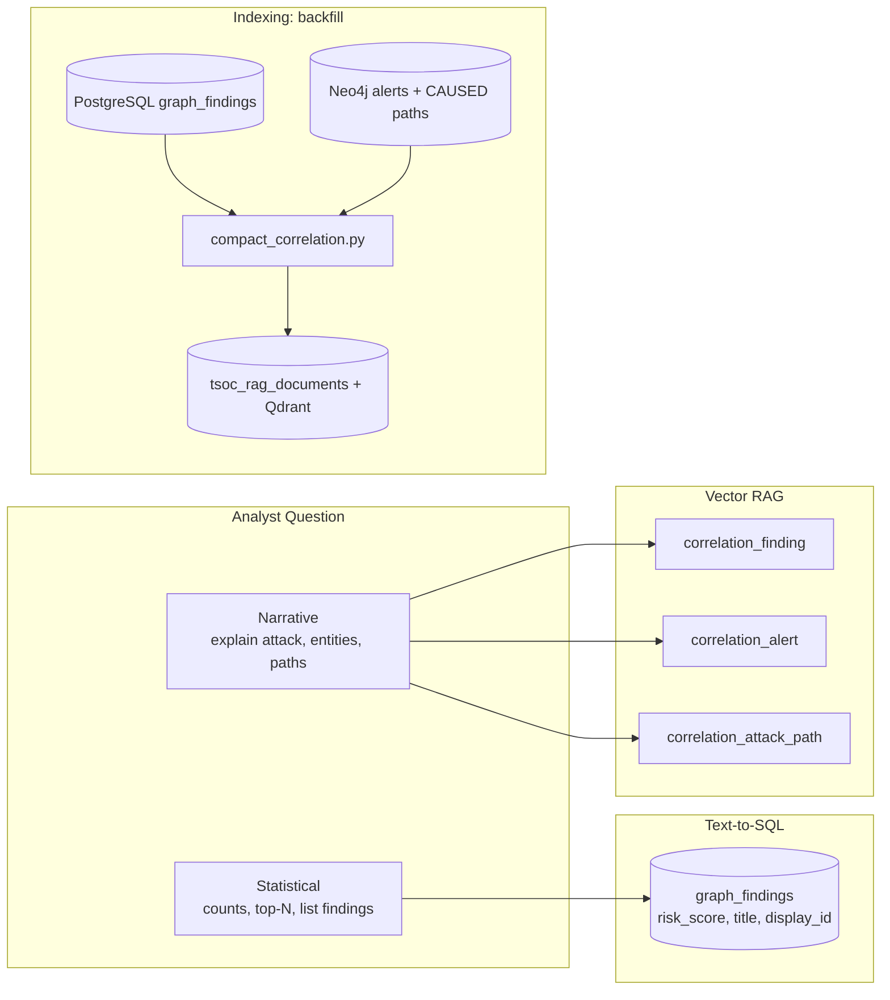
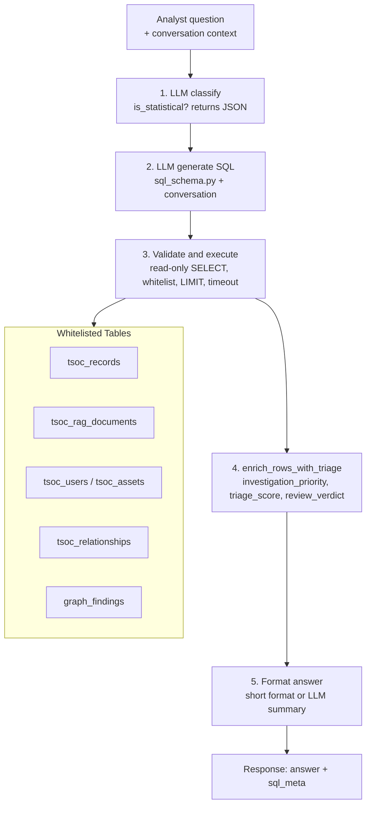

# SOC vector RAG — Splunk chat and similar alerts

Splunk-grounded retrieval for (1) **SOC analyst chat** and (2) **similar past alerts** in the analysis pipeline. Indexes **essential fields only** — not full `_raw` events.

**HLD / LLD:** this document (single source). **Code:** `backend/services/soc_rag/`.

## Stack

| Component | Role |
|-----------|------|
| **PostgreSQL** | Source of truth (`tsoc_rag_documents`, `tsoc_records`) |
| **[Qdrant](https://github.com/qdrant/qdrant)** | Semantic vector search |
| **FastEmbed** | Local embeddings — model selected via `TSOC_EMBEDDING_MODEL` (default `bge-base` / `BAAI/bge-base-en-v1.5`) |
| **LiteLLM** | Chat answers over retrieved context |

## Architecture



Retrieval prefers **Qdrant** when `TSOC_VECTOR_ENABLE=true` and Qdrant is reachable; otherwise **PostgreSQL** keyword scoring.

**Routing:** informational question types do **not** use keyword shortcuts: statistical vs narrative routing and SQL generation are LLM-guided. The one intentional deterministic route is an explicit Runbook execution command containing an execution verb, Runbook context, and SID. This safety-sensitive command is parsed without granting execution authority to an LLM.

## Run locally

```bash
cd backend
docker-compose pull && docker-compose up -d    # postgres + qdrant (v1 or v2 compose)
pip install -r requirements.txt
cp .env.example .env    # see docs/11-environment-configuration.md
python run.py
```

Or: `cd backend && docker compose up -d` (Postgres + Qdrant + Neo4j)

Remove old RAGFlow / unused images (~30GB): `bash scripts/docker-cleanup-unused.sh`

**Upgrade Qdrant 1.12 to 1.18:** storage format changes — reset volume then restart:

```bash
cd backend
docker rm -f tsoc-qdrant 2>/dev/null || true
docker volume rm tsoc_qdrant_data backend_tsoc_qdrant_data 2>/dev/null || true
docker compose up -d qdrant
curl -sf http://127.0.0.1:6333/readyz && echo "Qdrant OK"
```

Check: `GET /api/v1/soc/chat/status` returns `qdrant_reachable: true`.

**`SSL: UNEXPECTED_EOF_WHILE_READING` on a local `http://` Qdrant:** a system proxy (`HTTP_PROXY` / `HTTPS_PROXY` / `ALL_PROXY`, common on hosts where `install.sh` needed a proxy to pull Docker images) is hijacking the `127.0.0.1:6333` connection. The backend now connects with `trust_env=False` (bypasses the proxy), so this is handled automatically. For manual `curl`, use `curl --noproxy '*' http://127.0.0.1:6333/readyz`, or set `NO_PROXY=127.0.0.1,localhost`.

**`backend/docker-compose.yml`:** `postgres` (`16-alpine`, `:5432`) and `qdrant` (`v1.18.0`, `:6333`) — match `qdrant-client` 1.18.x. FastEmbed runs on the **host** (not in Docker).

## Embedding model selection

Set **`TSOC_EMBEDDING_MODEL`** in `backend/.env` (copy from [`backend/.env.example`](../backend/.env.example)). The backend resolves **preset aliases** to full FastEmbed model ids in [`embeddings.py`](../backend/services/soc_rag/embeddings.py).

### Supported values

| `.env` value (preset) | Alias | Resolves to (full id) | ONNX download | Vector dim | When to use |
|----------------------|-------|------------------------|---------------|------------|-------------|
| `bge-small` | `small` | `BAAI/bge-small-en-v1.5` | ~33 MB | 384 | Dev, CI, slow or metered internet |
| `bge-base` | `base` | `BAAI/bge-base-en-v1.5` | ~220 MB | 768 | **Default** — balance between download size and retrieval quality |
| `bge-large` | `large` | `BAAI/bge-large-en-v1.5` | ~1.2 GB | 1024 | Best semantic match (larger download) |

You may also set the **full HuggingFace id** directly (same three models):

- `BAAI/bge-small-en-v1.5`
- `BAAI/bge-base-en-v1.5`
- `BAAI/bge-large-en-v1.5`

Preset names are case-insensitive (`bge-small` and `BGE-SMALL` are equivalent).

### Example `.env` snippets

**Slow network / local testing (small model):**

```env
TSOC_EMBEDDING_MODEL=bge-small
```

**Higher quality (larger download):**

```env
TSOC_EMBEDDING_MODEL=bge-large
```

**Using a full model id instead of a preset:**

```env
TSOC_EMBEDDING_MODEL=BAAI/bge-base-en-v1.5
```

### `TSOC_EMBEDDING_DIM`

Optional and **informational**. At startup the API derives the real dimension from the model and uses it for the Qdrant collection. If `TSOC_EMBEDDING_DIM` does not match, a warning is logged and the model dimension wins.

### After changing the model

1. Restart the backend (`python run.py`).
2. On first run, FastEmbed downloads the ONNX weights into `/opt/.thinking-soc-cache/fastembed` (or `TSOC_FASTEMBED_CACHE_DIR` / `FASTEMBED_CACHE_PATH`).
3. If vector dimension changed, Qdrant deletes and recreates the collection automatically.
4. Re-index vectors: keep `TSOC_RAG_BACKFILL_ON_STARTUP=true` or call `POST /api/v1/soc/rag/backfill`.

### Verify active model

```bash
curl -s http://127.0.0.1:9876/api/v1/soc/chat/status | jq '{embedding_model, embedding_model_config, embedding_dim, embedding_model_options, qdrant_reachable}'
```

`embedding_model_options` lists all supported presets (for UI or ops tooling). `embedding_model_config` is the raw `.env` value; `embedding_model` is the resolved FastEmbed id.

## Environment

| Variable | Default | Purpose |
|----------|---------|---------|
| `TSOC_POSTGRES_DSN` | — | Required for RAG + storage |
| `TSOC_VECTOR_ENABLE` | `true` | Use Qdrant for semantic search |
| `QDRANT_URL` | `http://127.0.0.1:6333` | Qdrant HTTP API |
| `QDRANT_COLLECTION` | `tsoc_soc_rag` | Collection name |
| `TSOC_EMBEDDING_MODEL` | `BAAI/bge-base-en-v1.5` (`bge-base`) | FastEmbed preset or full model id — see [Embedding model selection](#embedding-model-selection) |
| `TSOC_EMBEDDING_DIM` | `768` | Informational; runtime dim is derived from the model |
| `TSOC_FASTEMBED_CACHE_DIR` | `/opt/.thinking-soc-cache/fastembed` | ONNX cache directory |
| `FASTEMBED_CACHE_PATH` | (same) | Alias if `TSOC_FASTEMBED_CACHE_DIR` unset |
| `TSOC_RAG_SIMILAR_MAX` | `3` | Similar alerts injected into analysis |
| `TSOC_RAG_CHAT_TOP_K` | `12` | Chunks for SOC chat (alerts + analysis + inventory) |
| `TSOC_CHAT_SQL_ENABLE` | `true` | Route statistical questions to Text-to-SQL |
| `TSOC_CHAT_SQL_MAX_ROWS` | `500` | Max rows per generated query |
| `TSOC_CHAT_SQL_TIMEOUT_SECONDS` | `5` | PostgreSQL `statement_timeout` for chat SQL |
| `TSOC_CHAT_HISTORY_DIRECT_MAX` | `12` | Full history in LLM prompt when turn count is within this |
| `TSOC_CHAT_HISTORY_RAG_TOP_K` | `8` | Session-RAG hits for long conversations |
| `TSOC_CHAT_HISTORY_RECENT_TAIL` | `4` | Recent turns always kept with session-RAG |

## Persisted conversations

SOC Chat in the UI (`frontend/components/pages/soc-chat-content.tsx`) stores **all conversations in PostgreSQL**, not in the browser. Analysts can start a new chat, switch sessions in the sidebar, and resume later (ChatGPT-style).



### Schema

| Table | Key columns |
|-------|-------------|
| `tsoc_chat_conversations` | `conversation_id` (TEXT PK), `title`, `created_at`, `updated_at` |
| `tsoc_chat_messages` | `conversation_id` FK, `role`, `content`, `seq`, `metadata` (JSONB, e.g. `sql_meta`) |

Bootstrap: `ensure_chat_schema()` in `chat_store.py` runs on first API use (same pool as `tsoc_records`).

### API

| Method | Path | Description |
|--------|------|-------------|
| `GET` | `/api/v1/soc/chat/conversations` | List sessions (`id`, `title`, `message_count`, timestamps) |
| `POST` | `/api/v1/soc/chat/conversations` | Create empty session; optional `{ "title": "..." }` |
| `GET` | `/api/v1/soc/chat/conversations/{id}` | Full thread for UI reload |
| `DELETE` | `/api/v1/soc/chat/conversations/{id}` | Delete session + messages (+ session RAG index rows for that conversation) |
| `POST` | `/api/v1/soc/chat` | Send turns; also accepts explicit English Runbook-by-SID execution commands |

The UI shows **Delete chat** in the header and a trash icon on each sidebar item; a confirmation dialog runs before delete.

### Execute an approved Runbook by SID

Chat understands explicit requests such as:

```text
Run the approved Runbook for SID demo-runbook-target-20260716
```

The command route requires an affirmative English execution phrase, Runbook context, and exactly one explicit SID. Negated phrases (`do not run`), informational questions, missing SIDs, and multiple SIDs never execute. A short follow-up such as `Execute it for SID alert-2` is accepted only when recent conversation turns already establish Runbook context.

Execution reuses `run_verified_runbook()` and therefore retains all existing controls: stored `soc_analysis` target, different source/target SID, exact Alert Name, latest `SOURCE_VERIFIED` revision, explicit human approval, bounded read-only investigation steps, and MCP→Splunk REST fallback. A SAIA-optimized SPL is accepted only after Splunk parser validation; when the optimization is rejected, execution falls back to the parser-valid pre-optimization SPL. It never runs Safe Response actions or containment. The assistant persists a Markdown result and `runbook_run` citation in the conversation; `retrieval_meta.query_mode` is `runbook_execute`.

### Request flow (`POST /soc/chat`)



1. **`get_or_create_conversation`** — if `conversation_id` is set, ensure the row exists (empty sessions have zero messages; do not re-`INSERT` on every send).
2. **Merge history** — `merge_request_messages()` combines DB history with the client payload (handles resend of full thread or append of one new user line).
3. **Command gate** — an explicit Runbook-by-SID request uses the guarded Runbook service; ambiguous or negative language cannot execute.
4. **Question route** — statistical goes to SQL; else RAG + LiteLLM.
5. **Persist** — `append_messages()` writes user + assistant turns; title auto-updates from first user line when still `"New chat"`.
6. **Session index** — each saved message is embedded into `tsoc_rag_documents` as `doc_type = chat_message` for session-scoped retrieval (see below).

`conversation_id` is returned on every chat response so the UI stays in sync.

## Session RAG (long conversations)

When a thread has more than **`TSOC_CHAT_HISTORY_DIRECT_MAX`** turns (default 12), the LLM prompt does **not** include the full transcript. Instead:



1. **`retrieve_session_messages`** — semantic search over `doc_type = chat_message` filtered by `conversation_id` (Qdrant metadata filter, Postgres fallback).
2. **`build_conversation_context`** — merges RAG hits with the last **`TSOC_CHAT_HISTORY_RECENT_TAIL`** turns (default 4).

Narrative RAG (alerts, analyses, inventory, correlation) is unchanged; session RAG only shapes **conversation memory**.

| Module | Role |
|--------|------|
| `chat_history.py` | Index turns, retrieve session hits, build prompt block |
| `chat_store.py` | Postgres CRUD |
| `chat.py` | Orchestration |

## Correlation in SOC Chat

Analysts can ask about **Graph Correlation** (findings, linked alerts, attack paths) in the same Chat UI. Data comes from two layers:



| Layer | Source | Chat path |
|-------|--------|-----------|
| **Structured** | PostgreSQL `graph_findings` (`risk_score`, `title`, `display_id`, ...) | Text-to-SQL when the question is statistical (counts, top-N risk, list findings) |
| **Semantic** | RAG index `doc_type`: `correlation_finding`, `correlation_alert`, `correlation_attack_path` | Narrative / explain / "what entities link these alerts?" |

Indexing: `index_correlation_catalog()` in `index_correlation.py` (called from `backfill.py` and startup backfill when `TSOC_CORRELATION_ENABLED=true`):

- Reads **`graph_findings`** via `graph_crud.findings`
- Reads **Neo4j** alerts (`RELATED_TO` entities) and **`CAUSED`** paths
- Upserts compact documents via `compact_correlation.py` into `tsoc_rag_documents` + Qdrant

**Important — SQL pitfall:** "Which correlation findings have the highest risk?" must query **`graph_findings`** `ORDER BY risk_score DESC`, **not** `tsoc_records` / `soc_analysis` (those are Analysis-page analyses; `payload.analysis.risk_score` is usually NULL). See `sql_schema.py` and [12-correlation-graph-service.md](./12-correlation-graph-service.md#13-soc-chat-integration).

**Prerequisites:** `TSOC_POSTGRES_DSN`, correlation schema seeded (`graph_findings` rows), Neo4j reachable for alert/path indexing. Run **`POST /api/v1/soc/rag/backfill`** after new correlation data.

## API

| Method | Path | Description |
|--------|------|-------------|
| `GET` | `/api/v1/soc/chat/status` | Postgres + Qdrant health, document count, `correlation_enabled` / Neo4j |
| `GET` | `/api/v1/soc/chat/conversations` | List persisted sessions |
| `POST` | `/api/v1/soc/chat/conversations` | Create session |
| `GET` | `/api/v1/soc/chat/conversations/{id}` | Load session + messages |
| `DELETE` | `/api/v1/soc/chat/conversations/{id}` | Delete session |
| `POST` | `/api/v1/soc/chat` | Chat: `messages` + optional `conversation_id`; returns `answer`, `conversation_id`, optional `sql_meta` |
| `POST` | `/api/v1/soc/rag/backfill` | Re-index storage + inventory + correlation into RAG |

### Statistical questions (Text-to-SQL)



When the user asks for counts, totals, lists, filters, or follow-ups that need row facts (e.g. "list SOC alerts", "which of them is high?"), SOC Chat:

1. **Classify** — LiteLLM reads **conversation + latest question** (`sql_chat/prompt_context.py`) and returns `is_statistical` (JSON). Follow-ups with pronouns (*them*, *those*, *which of these*) stay statistical when they need DB rows.
2. **Generate SQL** — LiteLLM chooses tables/filters from **`sql_schema.py`** + **`soc_user_intent.py`** (vocabulary only; not runtime routing). Same conversation context is passed so a bare "which is high?" can refer to the prior list.
3. **Validate & execute** — read-only `SELECT`, whitelisted tables, `LIMIT` cap, `statement_timeout` on PostgreSQL (`asyncpg`).
4. **Enrich** — for queries on `tsoc_records`, `enrich_rows_with_triage()` attaches `investigation_priority`, `triage_score`, and `review_verdict` using the same logic as `GET /api/v1/triage/queue` (`triage_from_stored_payload`), including fetch-by-`id` when the SELECT did not return `payload`.
5. **Answer** — short formatter for 50 rows or fewer; optional LiteLLM answer step for large result sets. Conversation is included in the answer prompt. `sql_meta` is kept for debugging (not shown in the chat UI).

Env: `TSOC_CHAT_SQL_ENABLE` (default `true`), `TSOC_CHAT_SQL_MAX_ROWS`, `TSOC_CHAT_SQL_TIMEOUT_SECONDS`, optional `TSOC_CHAT_SQL_MODEL` (non-thinking instruct model recommended if the main model is a reasoning variant that omits JSON SQL).

#### Analysis page vs Splunk severity (common pitfall)

What analysts see on **`/analysis`** is **investigation priority** (triage), not `payload.normalized.severity`:

| UI / chat wording | Meaning | SQL hint (see `sql_schema.py`) |
|-------------------|---------|--------------------------------|
| "alerts in SOC", list on Analysis page | `tsoc_records` with `tsoc_record_type IN ('soc_analysis','observability_analysis')` | Default for vague "alerts" |
| "high" / "critical" on that list | **`investigation_priority`** in `payload.analysis.triage` or `payload.triage` | Do **not** filter `payload.normalized.severity` on `soc_analysis` — often NULL |
| "indexed" / "RAG" alerts | `tsoc_rag_documents` where `doc_type = 'splunk_alert'` | Vector index only |
| "correlation findings", "highest risk findings" | **`graph_findings`** (`risk_score`) | Correlation UI — **not** `tsoc_records` |
| Correlation narrative (attack path, entities) | RAG `correlation_*` doc types | Use backfill after correlation seed |
| Splunk ingest severity | `payload.normalized.severity` | Mainly `splunk_ingest` rows |

The **triage queue API** (`GET /api/v1/triage/queue`, `build_triage_queue_items` in `services/triage_queue.py`) remains the source of truth for the Analysis UI; SOC Chat SQL is instructed to align with that schema, not duplicate keyword routers.

#### Example flow (follow-up)

| Turn | User | Path |
|------|------|------|
| 1 | "List of SOC Alerts" | SQL: list `tsoc_records` analyses |
| 2 | "Which of them is high?" | SQL + conversation: filter `investigation_priority = 'high'` (not `normalized.severity`) |

#### Narrative questions (RAG)

If classification is **not** statistical (explain verdict, MITRE, how to investigate), SOC Chat uses **vector/keyword retrieval** + LiteLLM with the last 6 messages and retrieved chunks (all default `doc_type` values).

**SOC Chat retrieval** searches these `doc_type` values by default: `splunk_alert`, `soc_analysis`, `observability_analysis`, `inventory_user`, `inventory_asset`, `inventory_relationship`, **`correlation_finding`**, **`correlation_alert`**, **`correlation_attack_path`**, plus ThinkingSOC Lite `runbook_draft`, `runbook_approval`, `runbook_run`, `runbook_shadow_run`, `runbook_response_preview`, `runbook_response_decision`, and `runbook_autopilot`. New analyses, observability runs, and ThinkingSOC Lite artifacts are indexed on completion; inventory, correlation, and historical Runbook artifacts are refreshed through the backfill API.

ThinkingSOC Lite compaction intentionally excludes generated SPL, raw result rows, and credentials. Runbook Autopilot documents retain bounded Agent handoffs, Tool names/results, durations, gate state, and the next recommended action, allowing Chat to explain how a result was reached without exposing executable response payloads.

## Modules (`backend/services/soc_rag/`)

| Module | Responsibility |
|--------|----------------|
| `compact_alert.py` | Essential-field document from Splunk ingest |
| `compact_analysis.py` | SOC analysis (Defender/Hunter/Judge, triage, MITRE, inventory match) |
| `compact_observability.py` | Observability pipeline analyses |
| `compact_inventory.py` | Users, assets, relationships for chat |
| `compact_correlation.py` | Findings, Neo4j alerts, attack paths for chat |
| `compact_runbook.py` | Safe Runbook, response-preview, and Autopilot trace documents for chat |
| `index_correlation.py` | Backfill correlation into RAG |
| `chat_store.py` | `tsoc_chat_*` tables — conversation persistence |
| `chat_history.py` | Session RAG over `chat_message` docs |
| `pg_store.py` | `tsoc_rag_documents` CRUD + keyword search |
| `qdrant_store.py` | Vector upsert + semantic search |
| `embeddings.py` | FastEmbed wrapper |
| `retrieve.py` | Qdrant-first, Postgres fallback |
| `index_writer.py` | Index on ingest / analysis |
| `similar.py` | Top-N similar alerts for LangGraph |
| `chat.py` | SOC chat orchestration (persist, classify, RAG or SQL) |
| `sql_schema.py` | PostgreSQL schema + table selection guide for Text-to-SQL |
| `sql_chat/soc_user_intent.py` | Analyst vocabulary for prompts (not runtime routing) |
| `sql_chat/prompt_context.py` | Conversation + latest question for classify / SQL / answer |
| `sql_chat/enrich.py` | Post-SQL triage fields on `tsoc_records` rows |
| `sql_chat/` | Text-to-SQL (`intent`, `generate`, `validator`, `execute`, `answer`, `run`) |
| `backfill.py` | Rebuild index from storage |

## Hackathon

- **Splunk AI** must remain visible: REST ingest, MCP/SAIA, devtools — vector RAG is a supporting layer.
- Qdrant is Apache-2.0 OSS; attribute in Devpost if required.
- First embedding run downloads the ONNX model once into `/opt/.thinking-soc-cache/fastembed` (not `/tmp` or the repo tree). Size depends on `TSOC_EMBEDDING_MODEL` in `backend/.env` (see [Embedding model selection](#embedding-model-selection)).
- Pre-download without starting the API:

```bash
bash scripts/download-embedding-model.sh           # uses .env (default bge-base ~220MB)
bash scripts/download-embedding-model.sh bge-small   # ~33MB for slow networks
```

- If you see `model.onnx failed: File doesn't exist`, the download was interrupted — re-run the script above or delete the partial cache under `/opt/.thinking-soc-cache/fastembed`.

## Essential fields policy

Allowlist: `sid`, `search_name`, `_time`, `user`, `src`, `dest`, `severity`, `signature`, IOCs, verdict/priority from analysis. Denylist: `_raw`, secrets, high-cardinality noise. See `compact_alert.py` for implementation.
