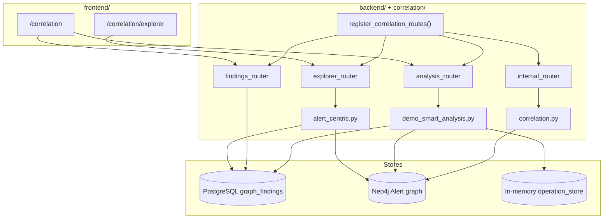
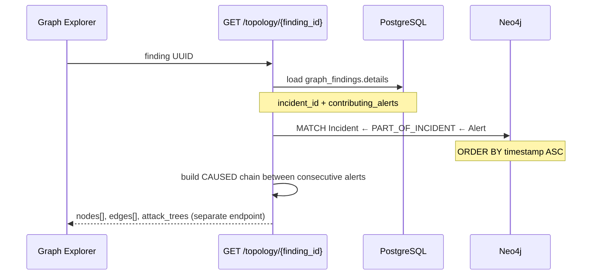
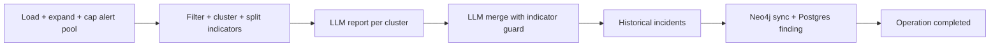

# Correlation — Graph Service and Alert Explorer

This document is the **canonical public reference** for the hackathon **Correlation** feature: how alerts are linked in a graph, how findings are stored, how the Graph Explorer UI works, and how the API is mounted on the unified backend.

**Scope:** hackathon demo — credible alert correlation and incident timeline visualization, not the full commercial ThinkingSOC graph product.

**Related docs:**

| Document | Role |
|----------|------|
| [24-demo-postgresql-data.md](./24-demo-postgresql-data.md) | Demo PostgreSQL backup/snapshot (`backend/data/demo/`) |
| [backend/data/demo/README.md](../backend/data/demo/README.md) | Bundled demo data layout (pg_dump, JSON snapshot, CSV packs) |
| [correlation/README.md](../correlation/README.md) | Run, seed, verify, tests |
| [11-environment-configuration.md](./11-environment-configuration.md) | All `backend/.env` variables |
| [02-integration-boundaries.md](./02-integration-boundaries.md) | Splunk ↔ main application contracts |

---

## Table of contents

1. [Purpose and boundaries](#1-purpose-and-boundaries)
2. [Architecture](#2-architecture)
3. [Data stores](#3-data-stores)
4. [Neo4j graph model](#4-neo4j-graph-model)
5. [Alert-centric correlation](#5-alert-centric-correlation)
6. [Smart Attack Discovery](#6-smart-attack-discovery)
7. [HTTP API reference](#7-http-api-reference)
8. [Frontend UI](#8-frontend-ui)
9. [Configuration and startup](#9-configuration-and-startup)
10. [Demo data](#10-demo-data)
11. [Repository map](#11-repository-map)
12. [SOC Chat integration](#12-soc-chat-integration)
13. [Operational notes](#13-operational-notes)

---

## 1. Purpose and boundaries

### What Correlation does

Correlation answers two analyst questions for a security finding:

1. **Which alerts are related?** — Alerts on the same incident, filtered by `contributing_alerts` when present.
2. **What was the execution order?** — Alerts sorted by `timestamp`, connected by synthetic `CAUSED` edges with time deltas.

The **Graph Explorer** visualizes this as a horizontal alert chain. The side panel shows an **Execution order** timeline (Step 1 → Step 2 → …) with bridge text such as `Sequential Step (+15m)`.

### What it does not do (hackathon scope)

| Out of scope | Notes |
|--------------|-------|
| Action-centric graph (GraphAction / entity expansion in UI) | Removed — explorer is **alert-only** |
| Full Splunk alert ingest into Neo4j | Demo uses seeded graph; production ingest is a separate integration path |
| Redis event stream, RAG, Court validation, composite findings | Not in this demo |
| Product dashboards inside Splunk App | Splunk app remains webhook + index only |

### Relationship to the main SOC pipeline

The main backend (`POST /api/v1/alerts/splunk-ingest`, Security/Observability pipelines) analyzes **individual alerts** and stores verdicts in `tsoc_records`. Correlation is a **parallel graph layer**:

- **PostgreSQL `graph_findings`** — persisted Smart Attack Discovery results (findings list).
- **Neo4j** — alert / entity / incident relationships for correlation queries and explorer topology.

There is no automatic write from every Splunk ingest into Neo4j in the default demo; operators run **Attack Discovery** or load **seed data**.

---

## 2. Architecture

Correlation runs **inside the same FastAPI process** as the main backend. It is not a separate microservice in the hackathon layout.



| Layer | Path | Role |
|-------|------|------|
| Mount / lifecycle | `backend/services/correlation_integration.py` | Startup: Postgres pool, Neo4j driver, schema, optional auto-seed |
| HTTP routers | `correlation/graph_api/` | Findings, explorer, analysis, internal |
| Graph logic | `correlation/graph_crud/` | Alert-centric topology, entity correlation, findings CRUD |
| Pipelines | `correlation/graph_pipelines/` | Demo Smart Analysis (cluster → LLM stub → insert finding) |
| UI | `frontend/components/correlation/` | Findings table, Attack Discovery modal, Graph Explorer |

**API prefix:** `/api/v1/graph`

**OpenAPI:** `http://127.0.0.1:9876/docs` (when backend is running)

---

## 3. Data stores

### PostgreSQL — `graph_findings`

Findings are analyst-facing records produced by Smart Attack Discovery (or seed SQL).

| Column | Type | Purpose |
|--------|------|---------|
| `id` | UUID | Primary key — used as Graph Explorer `finding_id` |
| `finding_type` | varchar | Default filter: `smart_attack_discovery` |
| `title`, `summary` | text | List view |
| `details` | JSONB | Incident metadata, `contributing_alerts`, MITRE steps, etc. |
| `risk_score` | int | Sort key for findings list — **mean** of `contributing_alerts` risk scores (Attack Discovery) |
| `ticket_status`, `owner` | varchar | Lightweight ticket workflow |
| `display_id` | varchar | Human-readable ID (e.g. `GF-0001`) |
| `content_hash` | varchar | Dedup for Smart Analysis reruns |

DDL: `correlation/seed/01_graph_findings.sql`

### Key fields in `details` (JSONB)

| Field | Used by |
|-------|---------|
| `incident_id` | **Required** for alert-centric topology — links finding to Neo4j `Incident` |
| `contributing_alerts[]` | Optional filter on incident timeline; enriches node detail panel |
| `attack_analysis_steps[]` | Finding summary / MITRE phases in list expand row |
| `historical_related_incidents[]` | Populated by Smart Analysis |
| `key_entities` | Identities, assets, IOCs for display |

### Neo4j — alert correlation graph

Stores alerts, entities, incidents, and relationships. Explorer topology is read from here; findings metadata comes from Postgres.

### In-memory — operation store

`POST /analysis/discover-attack-paths` returns immediately with an `operation_id`. Status and logs are held in `graph_core/operation_store.py` until the background task completes.

---

## 4. Neo4j graph model

### Node labels

| Label | Key property | Example |
|-------|--------------|---------|
| `Alert` | `alert_row_id` | `ALERT-101` |
| `Incident` | `incident_id` | `incident-a1b2c3d4` (Attack Discovery: `incident-{hash}`) |
| `Identity` | `primary_identifier` | `username:jdoe@corp.local` |
| `Asset` | `primary_identifier` | `hostname:SERVER01` |
| `IOC` | `primary_identifier` | `ipv4:203.0.113.50` |

Alert properties commonly include: `name`, `status`, `risk_score`, `timestamp`.

### Relationship types

| Type | Meaning |
|------|---------|
| `PART_OF_INCIDENT` | Alert → Incident membership |
| `RELATED_TO` | Alert → Identity / Asset / IOC |
| `CAUSED` | Alert → Alert (demo seed may include explicit edges; explorer also **synthesizes** chronological `CAUSED` between consecutive incident alerts) |

### Entity identifier convention

Correlation APIs use stable string identifiers:

```
username:jdoe@corp.local
hostname:SERVER01
ipv4:203.0.113.50
```

These match `primary_identifier` on graph nodes and are used by `POST /internal/correlate`.

Built at ingest by `backend/services/alert/graph_correlation.py` (`hostname:`, `username:`, public `ipv4:`, …). Attack Discovery classifies each identifier by **prefix** (not alert name) via `correlation/graph_core/entity_taxonomy.py`:

| Role | Neo4j labels | Typical prefixes (configurable) |
|------|--------------|----------------------------------|
| **Anchor** | `Identity`, `Asset` | `username`, `user`, `hostname`, `host`, `asset`, `device`, … |
| **Indicator** | `IOC` | `ipv4`, `domain`, `url`, `sha256`, … |
| **Other** | — | Any unknown `type:value` still joins clusters when it appears on multiple alerts |

Override defaults with Settings `correlation_anchor_entity_prefixes` / `correlation_indicator_entity_prefixes` (comma-separated types **without** colon). See [11-environment-configuration.md](./11-environment-configuration.md).

---

## 5. Alert-centric correlation

This is the **only** Graph Explorer mode in the hackathon demo.

### Flow



### Cypher (incident alerts)

```cypher
MATCH (inc:Incident {incident_id: $incident_id})<-[:PART_OF_INCIDENT]-(a:Alert)
WHERE size($alert_ids) = 0 OR a.alert_row_id IN $alert_ids
RETURN elementId(a), labels(a), properties(a)
ORDER BY a.timestamp ASC
```

Implementation: `correlation/graph_crud/alert_centric.py`

### Topology response shape

**Nodes:** one per alert (`id` = Neo4j `elementId`, `group` = `["Alert"]`, `properties` = alert fields).

**Edges:** synthetic `CAUSED` between consecutive alerts in timestamp order:

| Edge property | Meaning |
|---------------|---------|
| `time_delta_seconds` | Seconds between previous and current alert |
| `confidence` | `chronological_sequence` |
| `narrative` | UI label, e.g. `Sequential Step (+15m)` |

Example graph:

```
ALERT-101 ──CAUSED (+15m)──► ALERT-102 ──CAUSED (+42s)──► ALERT-103
```

### Attack tree endpoint

`GET /attack-tree/{finding_id}` returns flat `GraphTreeNode[]` — one step per alert with `step`, `edge_context`, `risk_score`. The UI uses this for the **Execution order** side panel; the canvas uses **topology** `nodes`/`edges` only.

### Three graph shapes (do not confuse)

| Name | Source | Used in Graph Explorer UI? |
|------|--------|----------------------------|
| **Topology graph** | `GET /topology/{finding_id}` → `nodes[]`, `edges[]` | **Yes** — main canvas (horizontal alert chain + CAUSED edges) |
| **attack_trees** | `GET /attack-tree/{finding_id}` → `GraphTreeNode[]` | **Yes** — Execution order side panel only (not the canvas layout) |
| **attack_analysis_steps** | Postgres `graph_findings.details` | **Yes** — findings list expand row / MITRE phases (not the canvas) |

The canvas is **not** a hierarchical tree widget. Backend “tree” APIs are flat step lists for the side panel; chronological **CAUSED** edges on the topology response define what the canvas draws.

### Failure and empty states

| Condition | Response |
|-----------|----------|
| Finding not found | HTTP 404 |
| No `incident_id` in `details` | Empty nodes + explanatory `message` |
| No alerts on incident in Neo4j | Empty nodes + seed hint in `message` |
| Some `contributing_alerts` missing on timeline | `notifications[]` warning, partial graph |

---

## 6. Smart Attack Discovery

Triggered from the Correlation page (**Attack Discovery** button).

### Pipeline



Implementation: `correlation/graph_pipelines/demo_smart_analysis.py` (orchestration), `attack_alert_filter.py` (clustering), `graph_crud/correlation.py` (Neo4j load).

Steps:

1. **Load pool** — Up to `limit_to_latest_alerts` newest alerts in `smart_analysis_lookback_days` (`load_alerts_from_neo4j`). **Expand** with other in-window alerts sharing anchor entities (Neo4j `Identity` / `Asset`). **Cap** back to `limit`, preferring anchor-linked rows over indicator-only rows (`neo4j_load_cap` log).
2. **Filter** — Attack-indicative alerts (risk + security keywords; noise excluded). No alert IDs or campaign names are hardcoded.
3. **Cluster** — Union-find on **any** shared `entity_identifiers` within `correlation_cluster_window_hours` (default 168h).
4. **Enrich** — Attach filtered pool alerts that share **anchor** entities and fall in the cluster time window.
5. **Campaign merge** — Merge clusters with overlapping anchor entities and overlapping time.
6. **Indicator split** — `split_indicator_only_from_anchor_clusters`: pull indicator-only alerts out of clusters that also have anchor entities (e.g. C2 beacon vs host login chain).
7. **Select** — Up to two meaningful clusters (`max_findings=2`); fallback guarantees at least one finding.
8. **LLM report** per selected cluster (`llm_stub.py`); fixture/heuristic fallback if LLM unavailable.
9. **LLM cluster merge** when 2+ clusters — `correlate_clusters()`; **`apply_indicator_split_merge_guard`** blocks re-merging indicator-only singletons into anchor kill chains (even if LLM suggests merge).
10. **Historical incidents** — `find_historical_related_incidents()` (shared-entity Cypher).
11. **Neo4j sync** — `sync_finding_incident_to_neo4j()` → `incident-{hash}` + `PART_OF_INCIDENT` (Graph Explorer).
12. **Insert finding(s)** — Postgres `graph_findings`; `risk_score` = mean of contributing alert risks; dedup via `content_hash` unless `force_reanalysis`.
13. **Operation status** — `finding_ids` in `result_payload`.

Graph Explorer loads alerts by `incident_id` in Neo4j; if missing, it falls back to `contributing_alerts` alert IDs.

### `limit_to_latest_alerts` semantics

The UI field is **not** “exactly N alerts in one finding.” It bounds the **Neo4j input pool** before clustering:

| Effect | Behavior |
|--------|----------|
| Initial fetch | Newest N alerts in lookback |
| Expand | May add older in-window alerts linked to the same anchors (e.g. phishing before lateral movement) |
| Cap | Pool trimmed to N again; indicator-only rows dropped first when over limit |
| Output | One or two findings; each finding lists alerts from its cluster (often 1–4+ per kill chain) |

For graphs with more in-window alerts than N, use **50** (default) in production; small N (e.g. 4) is for lab demos only.

### Debug logging

Attack Discovery logs under `correlation.discovery` (grep `correlation step=`): `neo4j_load`, `neo4j_load_cap`, `filter_attack`, `group_entity`, `enrich_cluster`, `split_indicator_out`, `select_score`, `llm_merge_blocked`, `neo4j_sync`, etc.

### Async contract

| Step | Method | Path |
|------|--------|------|
| Start | `POST` | `/api/v1/graph/analysis/discover-attack-paths` |
| Poll | `GET` | `/api/v1/graph/analysis/operations/{operation_id}/status` |

Request body (minimal):

```json
{
  "analysis_types": ["smart"],
  "limit_to_latest_alerts": 50,
  "force_reanalysis": true
}
```

Response: `202 Accepted` with `{ "operation_id": "..." }`.

---

## 7. HTTP API reference

Base path: **`/api/v1/graph`**

### Health

| Method | Path | Auth | Description |
|--------|------|------|-------------|
| `GET` | `/health` | None | `{ status, neo4j, postgres }` connectivity flags |

### Findings

| Method | Path | Auth | Description |
|--------|------|------|-------------|
| `GET` | `/findings` | Optional Bearer | Paginated list (`finding_type`, `limit`, `offset`) |
| `GET` | `/findings/{finding_id}` | Optional Bearer | Full finding + `details` JSONB |
| `GET` | `/findings/{finding_id}/graph-data` | Optional Bearer | Same topology as `/topology/{id}`; 404 if no nodes |
| `PATCH` | `/findings/{finding_id}/ticket` | Optional Bearer | Update `ticket_status`, owner, note |

### Graph Explorer

| Method | Path | Auth | Description |
|--------|------|------|-------------|
| `GET` | `/topology/{identifier}` | Optional Bearer | Alert-centric nodes + CAUSED edges |
| `GET` | `/attack-tree/{identifier}` | Optional Bearer | Chronological `attack_trees[]` for side panel |

`identifier` is normally the **finding UUID**. The service reads `details.incident_id` from Postgres and queries Neo4j.

**Note:** `view_mode` and `depth` query parameters were removed — topology is always alert-centric.

### Smart Analysis

| Method | Path | Auth | Description |
|--------|------|------|-------------|
| `POST` | `/analysis/discover-attack-paths` | Optional Bearer | Start background discovery |
| `GET` | `/analysis/operations/{operation_id}/status` | Optional Bearer | Poll status, logs, `result_payload` |

### Internal (demo / MCP-style)

| Method | Path | Auth | Description |
|--------|------|------|-------------|
| `POST` | `/internal/correlate` | `X-Demo-Api-Key` | Find alerts sharing entities with a given alert |

**Correlate request:**

```json
{
  "entity_identifiers": ["hostname:SERVER01"],
  "current_alert_row_id": "ALERT-101",
  "depth": 2,
  "max_questions": 0
}
```

**Correlate response:** `correlated_alerts[]` with `entities_in_common`, ordered by timestamp desc (max 50).

Cypher walks `(Identity|Asset|IOC)-[*1..depth]-(Alert)` excluding the current alert.

### Authentication

Configured in `backend/config.py`:

| Setting | Header | Behavior |
|---------|--------|----------|
| `CORRELATION_BEARER_TOKEN` | `Authorization: Bearer …` | When set, required on findings / explorer / analysis routes |
| `CORRELATION_DEMO_API_KEY` | `X-Demo-Api-Key` | When set, required on `/internal/correlate` |

When unset, routes accept unauthenticated requests (demo default).

### Response schemas (summary)

**GraphExplorationResponse**

```json
{
  "nodes": [{ "id": "...", "label": "Suspicious RDP", "group": ["Alert"], "properties": {} }],
  "edges": [{ "id": "seq_...", "from": "...", "to": "...", "label": "CAUSED", "properties": {} }],
  "highlight_info": { "node_ids": [], "edge_ids": [] },
  "message": "Success.",
  "notifications": null
}
```

**AttackTreeResponse**

```json
{
  "attack_trees": [
    {
      "step": "1",
      "node_id": "...",
      "name": "Alert: Suspicious RDP (75)",
      "type": "Alert",
      "timestamp": "2026-05-20T10:00:00Z",
      "risk_score": 75,
      "edge_context": null,
      "children": []
    }
  ],
  "message": "Success."
}
```

Pydantic models: `correlation/graph_schemas/exploration.py`, `finding.py`, `analysis.py`.

---

## 8. Frontend UI

### Routes

| Route | Component | Purpose |
|-------|-----------|---------|
| `/correlation` | `CorrelationPageContent` | Findings list, filters, Attack Discovery |
| `/correlation/explorer?finding_id={uuid}&identifier={uuid}` | `GraphExplorerPageContent` | Alert chain graph + timeline panel |

### Correlation list page

- **Findings table** — paginated `smart_attack_discovery` findings, risk badge, ticket status filter.
- **Attack Discovery** — modal starts async analysis, polls operation status, links to new finding.
- **Open Graph** — navigates to explorer for selected finding.

API client: `frontend/lib/api/graph/graphCorrelation.ts`, `graphAnalysis.ts`

### Graph Explorer

Data loading: `frontend/hooks/correlation/use-graph-query.ts` stores the **full** topology from the API in `sourceTopology`. Visible nodes and edges are computed client-side via **`GraphFilterBar`** and `applyGraphViewFilters()` (`frontend/lib/api/graph/graph-filters.ts`).

**Default filters (on every load):**

| Filter group | Default enabled |
|--------------|-----------------|
| Node types | **Alerts** only |
| Link types | **Alert → Alert (CAUSED)** only |

Analysts can enable additional node types (Incident, Identity, Asset, IOC) and link types (RELATED_TO, PART_OF_INCIDENT, …) when those elements exist in graph data. Options not present in the current finding are shown disabled. **Reset default** restores alert causation view.

Parallel fetches on mount:

1. `GET /topology/{finding_id}` — canvas
2. `GET /attack-tree/{finding_id}` — execution order panel
3. `GET /findings/{finding_id}` — metadata + `contributing_alerts`

**Canvas** (`graph-canvas.tsx`): horizontal chain layout; alerts ordered by CAUSED chain / timestamp; edge labels show `narrative`.

**Side panel** (`topology-centric-panel.tsx`):

| Tab | Content |
|-----|---------|
| Execution order | Step list from `attack_trees`, bridge text between steps |
| Node details | Selected alert — merged from Neo4j node + `contributing_alerts` |

State: `frontend/components/correlation/explorer/graph-context.tsx`

### Mock mode

Set `NEXT_PUBLIC_USE_MOCK=true` in `frontend/.env.local` to use JSON fixtures under `frontend/lib/api/graph/mock/` without a live backend.

---

## 9. Configuration and startup

### Enable / disable

| Variable | Default | Effect |
|----------|---------|--------|
| `TSOC_CORRELATION_ENABLED` | `true` | When `false`, correlation routes are not mounted |
| `TSOC_CORRELATION_AUTO_SEED` | `true` | On startup, seed demo data if `graph_findings` is empty |

### Data stores

| Variable | Default | Effect |
|----------|---------|--------|
| `TSOC_POSTGRES_DSN` | — | Required for findings (shared with main backend) |
| `NEO4J_URI` | `bolt://127.0.0.1:7687` | Neo4j Bolt URL |
| `NEO4J_USER` | `neo4j` | Neo4j username |
| `NEO4J_PASSWORD` | `tsoc-tsoc` | Neo4j password |

### Auth (optional)

| Variable | Default |
|----------|---------|
| `CORRELATION_DEMO_API_KEY` | `dev-key` |
| `CORRELATION_BEARER_TOKEN` | unset (open) |

### Smart Analysis

| Variable | Default |
|----------|---------|
| `SMART_ANALYSIS_LOOKBACK_DAYS` | `7` |

### Run

```bash
cd backend
docker compose up -d postgres neo4j
python run.py
```

Correlation mounts at startup via `backend/services/correlation_integration.py`.

Manual seed:

```bash
python correlation/seed/seed.py
bash correlation/seed/verify.sh
```

Tests:

```bash
python -m pytest correlation/tests/ -v
```

See also: [correlation/README.md](../correlation/README.md)

---

## 10. Demo data

### Campaign: Operation Shadow Login

Seed scripts populate a coherent story linking phishing (historical incident) to lateral movement on `SERVER01`.

| Store | Content |
|-------|---------|
| Neo4j | Five demo alerts (`ALERT-090`–`102`, `091`); seed incident `demo-incident-1`; anchor + IOC entities |
| Postgres | Seeded finding `GF-0007` (`7fda487b-…4aec`); new Attack Discovery rows use `incident-{hash}` |

Seed files:

- `correlation/seed/neo4j_demo_campaign.cypher`
- `correlation/seed/postgres_demo_findings.sql`

### Verify with curl

```bash
curl -s http://127.0.0.1:9876/api/v1/graph/health | python3 -m json.tool
curl -s http://127.0.0.1:9876/api/v1/graph/topology/7fda487b-c5fe-4b88-b153-0958d74e4aec | python3 -m json.tool
curl -s -X POST http://127.0.0.1:9876/api/v1/graph/internal/correlate \
  -H "X-Demo-Api-Key: dev-key" -H "Content-Type: application/json" \
  -d '{"entity_identifiers":["hostname:SERVER01"],"current_alert_row_id":"ALERT-101","depth":2}'
```

---

## 11. Repository map

| Path | Description |
|------|-------------|
| `backend/services/correlation_integration.py` | Mount routes, startup/shutdown hooks |
| `correlation/graph_api/` | FastAPI routers |
| `correlation/graph_crud/alert_centric.py` | Alert-centric topology + attack trees |
| `correlation/graph_crud/topology.py` | Thin wrapper → alert-centric |
| `correlation/graph_crud/correlation.py` | Entity-based correlate + historical incidents |
| `correlation/graph_crud/findings.py` | Postgres CRUD |
| `correlation/graph_pipelines/demo_smart_analysis.py` | Attack Discovery background job |
| `correlation/graph_pipelines/llm_stub.py` | JSON fixture “LLM” responses |
| `correlation/graph_core/` | Neo4j driver, Postgres pool, operation store |
| `correlation/seed/` | SQL, Cypher, seed script, verify.sh |
| `correlation/tests/` | Pytest (topology, findings, correlate) |
| `frontend/app/(app)/correlation/` | Next.js pages |
| `frontend/components/correlation/` | UI components |
| `frontend/lib/api/graph/` | TypeScript API clients and types |
| `frontend/hooks/correlation/` | Explorer data hooks |

---

## 12. SOC Chat integration

SOC Chat (`/chat` in the UI, `POST /api/v1/soc/chat`) can answer questions about correlation data without opening the Graph Explorer.

### Data paths

| Analyst question type | Mechanism | Source |
|----------------------|-----------|--------|
| “Highest risk correlation findings”, “how many findings”, list `display_id` | **Text-to-SQL** | Table **`graph_findings`** (`risk_score`, `title`, `finding_type`, `ticket_status`) |
| “Explain this attack cluster”, entities, attack path narrative | **Vector RAG** | `tsoc_rag_documents` with `doc_type` ∈ `correlation_finding`, `correlation_alert`, `correlation_attack_path` |

Full chat design (persisted sessions, session RAG, API list): **[10-soc-vector-rag.md](./10-soc-vector-rag.md)**.

### Indexing for chat

After findings exist in Postgres and alerts in Neo4j:

```http
POST /api/v1/soc/rag/backfill
```

(or rely on `TSOC_RAG_BACKFILL_ON_STARTUP=true`). Implementation: `backend/services/soc_rag/index_correlation.py` → `compact_correlation.py`.

| `doc_type` (RAG) | Content |
|------------------|---------|
| `correlation_finding` | Smart Attack Discovery row + `details` (contributing alerts, entities, executive summary) |
| `correlation_alert` | Neo4j `Alert` node + `RELATED_TO` entity identifiers |
| `correlation_attack_path` | Neo4j `CAUSED` edge between two alerts |

### SQL example (correct)

```sql
SELECT display_id, title, summary, risk_score, finding_type, ticket_status
FROM graph_findings
ORDER BY risk_score DESC
LIMIT 10
```

### Common mistake

| Wrong | Right |
|-------|--------|
| Query `tsoc_records` / `soc_analysis` for “correlation findings” | Query **`graph_findings`** or RAG `correlation_finding` |
| Use `payload->'analysis'->>'risk_score'` on analyses | Use **`graph_findings.risk_score`** |

### Related env

| Variable | Role |
|----------|------|
| `TSOC_CORRELATION_ENABLED` | Enables graph service + correlation RAG indexing |
| `TSOC_POSTGRES_DSN` | `graph_findings` + chat tables |
| `NEO4J_URI` / credentials | Alert and path indexing |

---

## 13. Operational notes

### Splunk integration (future / partial)

The hackathon does **not** require Splunk to write directly to Neo4j. A production path would:

1. Ingest alert → normalize entities → upsert Neo4j nodes/edges.
2. Run Smart Analysis or manual correlation → create `graph_findings`.
3. Analyst opens Graph Explorer from finding UUID.

Splunk remains the **source of alert truth** via REST/MCP in the main pipeline; Neo4j is the **correlation view** for this demo.

### Common mistakes

| Mistake | Correct approach |
|---------|------------------|
| Using `display_id` as topology identifier | Use finding **UUID**; backend resolves `incident_id` from Postgres |
| Expecting Asset/IOC nodes on explorer canvas | Explorer shows **alerts only** |
| Missing `incident_id` on finding | Topology returns empty graph with message |
| Missing `PART_OF_INCIDENT` in Neo4j | Seed or ingest must link alerts to incidents |
| Polling discovery without `operation_id` | Use `POST discover-attack-paths` first, then poll status |

### Disabling correlation

Set `TSOC_CORRELATION_ENABLED=false` in `backend/.env`. Main ingest and SOC pipelines are unaffected.

---

## Summary

**Correlation** combines PostgreSQL findings with a Neo4j alert graph. The Graph Explorer is **alert-centric only**: related alerts on an incident, ordered by time, linked by `CAUSED` edges. Smart Attack Discovery creates new findings asynchronously; `/internal/correlate` supports entity-based alert lookup for demos and tooling. **SOC Chat** can query the same findings via SQL (`graph_findings`) and RAG (`correlation_*` doc types) after backfill — see [§12](#12-soc-chat-integration) and [10-soc-vector-rag.md](./10-soc-vector-rag.md).

**See also:** [21-database-schema.md](./21-database-schema.md) (Neo4j node/relationship types, `graph_findings` table) · [19-storage-persistence.md](./19-storage-persistence.md) (storage layer).
