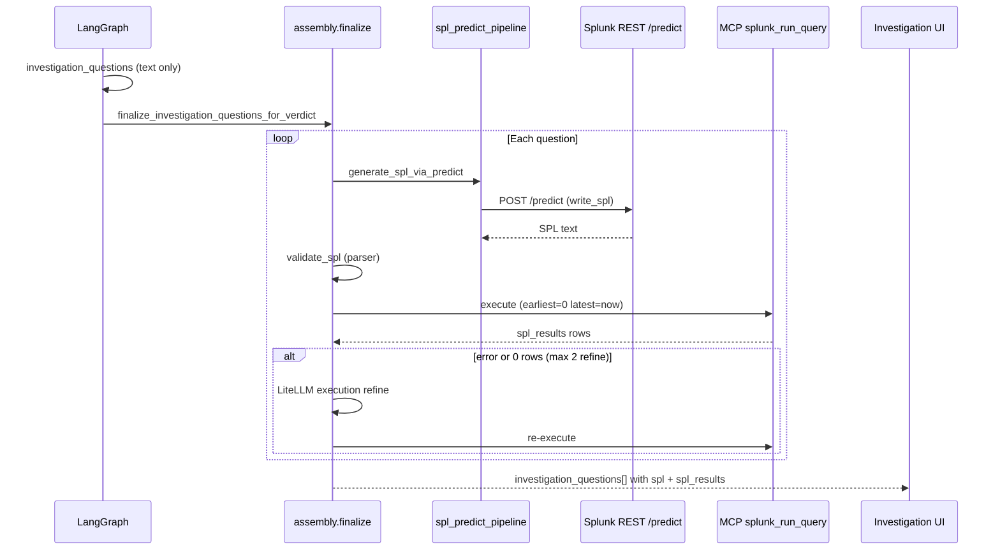
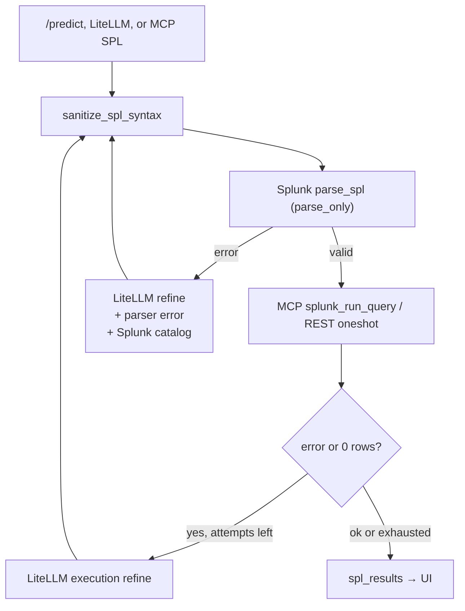
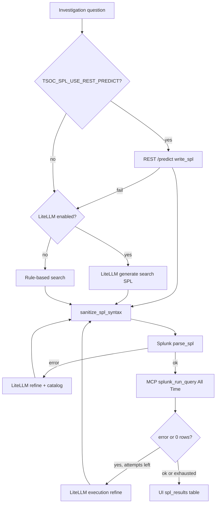

# Investigation SPL (SAIA `/predict` + MCP execute)

**ThinkingSOC** pairs each SOC **investigation question** with runnable Splunk SPL. The **production path** matches the Splunk UI chat: **REST `/predict`** (`write_spl`), then **MCP `splunk_run_query`** to run the SPL and fill **`spl_results`** for the UI. LiteLLM and rule-based `search` are fallbacks.

**Related:** [02-integration-boundaries.md](./02-integration-boundaries.md), [04-agents-and-pipelines.md](./04-agents-and-pipelines.md), [07-lld-low-level-design.md](./07-lld-low-level-design.md).

**Splunk version:** Enterprise or Cloud **10.x+**. Splunk AI Assistant Cloud app + optional Splunk MCP Server.

---

## Goals

| Goal | How |
|------|-----|
| SPL aligned with **Splunk UI** chat | REST **`/predict`** (same `write_spl` path as UI), not MCP `saia_generate_spl` |
| Runnable answers in the product | MCP **`splunk_run_query`** (fallback: REST oneshot) |
| **All Time** for investigation hunts | Default `earliest=0` `latest=now` on execute |
| Quality when SPL is wrong | Splunk **parser** check + LiteLLM refine on error / 0 rows (max 2 attempts) |

**Not in the main path (hackathon):** CIM `tstats` post-process, `apply_cim_tstats_*`, or per-question `datamodelsimple` injection. SPL policy is **`search`** only (no `tstats` / `datamodel` in generated SPL).

---

## End-to-end flow



**Important:** The graph node `root_cause_spl` only forwards **question text**. SPL generation runs **once** in `finalize_investigation_questions_for_verdict`.

---

## SPL generation priority

| Order | Source | `notes` / API `source` |
|-------|--------|-------------------------|
| 1 | **REST `/predict`** (if `TSOC_SPL_USE_REST_PREDICT=true` and credentials set) | `rest_predict_write_spl` |
| 2 | **LiteLLM** per question (when predict fails) | `llm_generated_spl` |
| 3 | **Rule-based `search`** from alert fields | `rule_based_fallback` |

`/assistant/spl-suggest` uses the same order via `suggest_spl_for_alert()` and may attach **`spl_results`** when `TSOC_EXECUTE_INVESTIGATION_SPL=true`.

---

## Execution

| Step | Mechanism |
|------|-----------|
| Preferred | MCP **`splunk_run_query`** (`TSOC_SPL_EXECUTE_VIA_MCP=true`) |
| Fallback | REST oneshot if MCP fails |
| Time range | `TSOC_INVESTIGATION_SPL_TIME_WINDOW` (default **`earliest=0 latest=now`**) |
| Row cap | 50 rows per question in API (MCP `row_limit`) |

Shared module: `backend/services/investigation/spl_predict_pipeline.py` (also used by `backend/scripts/spl_predict_ask.py` for CLI demos).

---

## SPL syntax sanitize + parser-driven refine

Investigation SPL is often produced by **LLM**, **REST `/predict`**, or **MCP SAIA**. Those sources frequently emit **syntax-level** mistakes (markdown backticks, unquoted colon values, duplicate clauses) or **semantic** mistakes (wrong index name, wrong field for the sourcetype). The pipeline separates these two classes deliberately — **no hardcoded index/field mappings** (e.g. no `wineeventlog→wineventlog` or Sysmon-specific rewrites in code).

### Design principle

| Layer | Responsibility | Examples |
|-------|----------------|----------|
| **Syntax sanitize** (`spl_syntax_sanitize.py`) | Mechanical fixes that apply to **any** SPL string | backticks, `field=Foo:Bar` quoting, dedupe `field=`, missing `search`, `by index=foo` → `by index`, path escapes |
| **Splunk parser** (`parse_spl`, parse_only) | Authoritative syntax check | invalid macro names, bad quotes |
| **LLM refine** (`spl_mcp_review.py`) | Semantic fixes using **live context** | wrong index, wrong field name, zero rows |

Semantic corrections use:

- **Splunk parser error text** (exact message from `POST …/search/v2/parser`)
- **Alert / System Context** (normalized fields, sample rows)
- **Splunk catalog block** (indexes, sourcetypes, sources from MCP `splunk_get_indexes` + `splunk_get_metadata` when MCP is configured)

Prompt: `backend/services/prompts/prompt_spl_execution_refine_system.md`.

### Syntax sanitize pipeline

Entry point: `sanitize_spl_draft()` in `spl_tstats_sanitize.py` → `sanitize_spl_syntax()` in `spl_syntax_sanitize.py`.

Applied **before every** parser validation and **after every** LLM refine output.

| Step | Function | What it fixes |
|------|----------|---------------|
| 1 | collapse whitespace | noisy LLM spacing |
| 2 | `strip_time_range_from_spl` | remove `earliest=`/`latest=` (execution applies All Time) |
| 3 | `strip_spl_backticks` | markdown `` ` `` inside SPL |
| 4 | `ensure_search_generating_command` | `index=foo \| stats` → `search index=foo \| stats` |
| 5 | `quote_spl_colon_field_values` | `source=WinEventLog:Security` → `source="WinEventLog:Security"` for **any** field |
| 6 | `dedupe_search_field_clauses` | keep first `index=`, `source=`, … per field in search phase |
| 7 | `strip_redundant_boolean_and` | stray `and` left after dedupe |
| 8 | `fix_field_equals_in_pipe_clauses` | `stats by index=firewall` → `by index`; `table index=foo` → `table index` |
| 9 | `discourage_values_aggregation` | `stats values()` → `dc()` (readable aggregates) |
| 10 | `fix_spl_quoted_string_escapes` | Windows path `\` before closing `"` |
| 11 | strip leading `\| search` | normalize to `search …` |

**Intentionally not in sanitize:** index name typos, `EventID` vs `EventCode`, sourcetype→source mapping — those are handled by **parser + LLM refine + Splunk catalog**.

### Parser + refine loop



| Trigger | Function | Max attempts | Config |
|---------|----------|--------------|--------|
| Parser error after generate | `refine_root_cause_spl_until_valid` | 2 | `TSOC_SPL_LLM_REFINE_ON_ERROR=true` |
| Execute error or 0 rows | `run_investigation_item_execute_refine_loop` | 2 | `TSOC_SPL_EXECUTE_REFINE_MAX_ATTEMPTS` |

Refine notes on the investigation item:

| Note | Meaning |
|------|---------|
| `llm_refine_after_parser_error_1` / `_2` | LiteLLM fixed SPL after Splunk parser rejected it |
| `llm_refine_after_execute_1` / `_2` | LiteLLM fixed SPL after bad execute or zero rows |
| `auto_fallback_after_zero_rows` | Rule-based `search` fallback when refine returned unusable SPL |
| `execute_refine_exhausted` | Max refine attempts used |

### Example (syntax vs semantic)

**LLM output (broken parser):**

```spl
search index=wineventlog sourcetype=`"XmlWinEventLog:Microsoft-Windows-Sysmon/Operational`" and source="WinEventLog:…" EventID=3 host=DESKTOP-BRUCE | stats count
```

**After syntax sanitize (parser OK):**

```spl
search index=wineventlog sourcetype="XmlWinEventLog:…" source="WinEventLog:…" EventID=3 host=DESKTOP-BRUCE | stats count
```

If `EventID` should be `EventCode` for that index, or the index name is wrong, **execute returns 0 rows** → LLM refine uses alert fields + Splunk catalog to fix — not a hardcoded table in Python.

Unit tests: `backend/tests/test_spl_syntax_sanitize.py`, `backend/tests/test_spl_tstats_sanitize.py`.

---

## Post-execute refine (LiteLLM only, max 2)

After the first execute, if `spl_results.error` or `row_count == 0`, `run_investigation_item_execute_refine_loop` runs LiteLLM (`review_spl_after_execution_with_llm`) then re-validates and re-executes. Set **`TSOC_SPL_EXECUTE_REFINE_MAX_ATTEMPTS=0`** to disable.

See **SPL syntax sanitize + parser-driven refine** above for the full sanitize → parse → refine diagram and note tags.

## Optional: MCP `saia_generate_spl` (dev / debug only)

`POST /api/v1/mcp/spl-generate` still calls **`generate_spl_via_mcp`** (`saia_generate_spl` → optional optimize/explain). This is **not** the investigation or `/assistant/spl-suggest` path (main path uses REST `/predict`).

---

## API and UI contract

### `InvestigationQuestionItem`

```json
{
  "question": "Find related PowerShell invoke.ps1 on this host",
  "spl": "search index=botsv1 host=we8105desk ... | table _time Image ParentImage | sort _time",
  "explanation": "Generated via Splunk UI REST /predict path.",
  "time_window": "earliest=0 latest=now",
  "notes": ["rest_predict_write_spl"],
  "validation": { "method": "splunk_parser", "valid": true },
  "spl_results": {
    "row_count": 4,
    "rows": [{ "_time": "...", "host": "we8105desk", "Image": "..." }],
    "truncated": false
  }
}
```

### Endpoints

| Endpoint | Behavior |
|----------|----------|
| `POST /api/v1/assistant/spl-suggest` | `/predict` → optional execute → `spl_results` |
| `POST /api/v1/mcp/spl-generate` | MCP `saia_generate_spl` only (debug) |
| SOC analysis (graph) | `finalize_investigation_questions_for_verdict` |

### UI

| Location | Component |
|----------|-----------|
| Investigation detail → **Questions & SPL** | `InvestigationQuestionsSplList` |
| Per question | SPL `<pre>`, explanation, **results table** from `spl_results` |

---

## Configuration (`backend/.env`)

| Variable | Default | Description |
|----------|---------|-------------|
| `TSOC_SPL_USE_REST_PREDICT` | `true` | Use Splunk REST `/predict` for SPL |
| `TSOC_SAIA_AUTO_REPAIR` | `true` | Auto-repair SAIA `cloud_connected_configurations` on startup and when `/predict` fails with configs errors |
| `SPLUNK_HOME` | `/opt/splunk` | Splunk install path (for `splunk cmd python3` SCS token refresh during auto-repair) |
| `TSOC_SPL_PREDICT_TIMEOUT_SECONDS` | `90` | Poll budget for async `/predict` |
| `TSOC_EXECUTE_INVESTIGATION_SPL` | `true` | Run MCP/REST execute; fill `spl_results` |
| `TSOC_SPL_EXECUTE_VIA_MCP` | `true` | Prefer MCP `splunk_run_query` |
| `TSOC_INVESTIGATION_SPL_TIME_WINDOW` | `earliest=0 latest=now` | Execute time range |
| `TSOC_SPL_LLM_REFINE_ON_ERROR` | `true` | Parser error → LiteLLM |
| `TSOC_SPL_EXECUTE_REFINE_MAX_ATTEMPTS` | `2` | Post-execute refine; `0` disables |
| `TSOC_INVESTIGATION_QUESTIONS_MAX` | `3` | Max questions per alert |
| `TSOC_MCP_ENABLED` | `true` | MCP for execute + optional spl-generate |
| `SPLUNK_MCP_URL` / `SPLUNK_MCP_TOKEN` | — | MCP Bearer |
| `SPLUNK_USERNAME` / `SPLUNK_PASSWORD` | — | REST login for `/predict`, parser, execute |
| `TSOC_MCP_SAIA_OPTIMIZE_SPL` / `EXPLAIN` | `true` | Only for `/mcp/spl-generate` path |
| `TSOC_MCP_TRACE_LOG` / `TSOC_SAIA_TRACE_LOG` | `false` | Full MCP/SAIA trace (see below) |
| `TSOC_TRACE_LOG_FILE` | — | Optional file for trace lines |

**Removed / unused (do not set):** `TSOC_MCP_PREFER_SAIA_SPL`, `TSOC_CIM_*`, `TSOC_CIM_SPL_ENABLED`, `TSOC_CIM_TSTATS_DEFAULT_TIME_WINDOW`, `TSOC_SAIA_PATCH_*`, `SPLUNK_SAIA_APP_PATH`.

Full env reference (backend + frontend): [11-environment-configuration.md](./11-environment-configuration.md).

---

## SAIA cloud config auto-repair

On **Splunk Enterprise (cloud-connected)**, Splunk AI Assistant stores tenant/SCS settings in the KV collection `cloud_connected_configurations` and mirrors them to `splunkaiassistant.conf`. If those fields are empty (for example after a Splunk restart migrates an empty conf stanza into KV), REST `/predict` can fail with:

```json
{"error":"local variable 'configs' referenced before assignment"}
```

ThinkingSOC **auto-repairs** this when `TSOC_SAIA_AUTO_REPAIR=true` (default):

| When | What happens |
|------|----------------|
| **Backend startup** | Reads KV; if required fields are missing, restores them from the existing SCS token (JWT claims) and/or `splunk_ai_assistant.log`, refreshes the SCS token, syncs conf, reloads `Splunk_AI_Assistant_Cloud`. |
| **First `/predict` failure** | On configs-related HTTP 500, runs the same repair once and retries `/predict`. |

Required KV fields: `tenant_name`, `tenant_hostname`, `scs_region`, `service_principal`, `scs_token`, `scs_token_expiry`, `encoded_onboarding_data`.

Implementation:

| Path | Role |
|------|------|
| `backend/splunk/saia_config_repair.py` | Detect, merge, KV/conf update, orchestration |
| `backend/splunk/saia_token_refresh_worker.py` | SCS token refresh via `splunk cmd python3` (Splunk-side SAIA libs) |
| `backend/main.py` | Startup hook `_saia_startup()` |
| `backend/services/investigation/spl_predict_pipeline.py` | Reactive repair + retry on predict failure |

Disable with `TSOC_SAIA_AUTO_REPAIR=false` if you manage SAIA onboarding manually. Auto-repair does **not** replace initial Splunk AI Assistant onboarding (activation code); it only recovers a previously onboarded tenant when KV/conf was wiped or partially cleared.

Debug probe (read-only): `tools/saia-debug/debug_saia_paths.py` — see [tools/saia-debug/README.md](../tools/saia-debug/README.md).

---

## MCP / SAIA trace logging

Full request/response bodies (not truncated) in backend logs:

| Variable | Logger | Content |
|----------|--------|---------|
| `TSOC_MCP_TRACE_LOG=true` | `tsoc.trace.mcp` | JSON-RPC request/response, `tools/call` payloads |
| `TSOC_SAIA_TRACE_LOG=true` | `tsoc.trace.saia` | SAIA pipeline + `/predict` / MCP SAIA tools |
| `TSOC_TRACE_LOG_FILE=...` | (optional file) | Same lines also written to a dedicated file |

Implementation: [`backend/services/full_trace_log.py`](../backend/services/full_trace_log.py).

---

## Prerequisites on Splunk

1. **Splunk_AI_Assistant_Cloud** — `/predict` for SPL generation.
2. **Splunk MCP Server** (app 7931) — `splunk_run_query` for execute when `TSOC_MCP_ENABLED=true`.
3. Management **8089** reachable from backend with search credentials.

---

## Troubleshooting

| Symptom | Likely cause | Action |
|---------|----------------|--------|
| `splunk_rest parse_spl syntax … invalid` | LLM markdown / unquoted colon / duplicate clause | Syntax sanitize runs automatically; if persists, check `llm_refine_after_parser_error_*` notes |
| Wrong index or field in SPL | Semantic LLM mistake | Ensure MCP enabled for catalog hints; refine uses `splunk_get_indexes` + metadata |
| HTTP 500 `configs referenced before assignment` on `/predict` | SAIA KV/conf missing tenant fields | Enable `TSOC_SAIA_AUTO_REPAIR=true` (default); restart backend; or complete SAIA onboarding in Splunk UI |
| `rule_based_fallback` only | `/predict` failed or timed out | Check SAIA license, `TSOC_SPL_PREDICT_TIMEOUT_SECONDS`, UI chat |
| Empty `spl_results`, no error | No matching events (or wrong index/time) | Confirm data; All Time is already default |
| MCP execute error | Token or MCP app | `GET /api/v1/mcp/status` |
| SPL discarded, `tstats` in notes | Old SAIA/MCP path returning tstats | Main path uses `/predict`; policy rejects tstats in review |
| CLI vs UI SPL differ | Different prompts | Use `backend/scripts/spl_predict_ask.py` with same question text |

---

## Code index

| Path | Role |
|------|------|
| `backend/services/investigation/spl_predict_pipeline.py` | `/predict` + MCP execute (All Time) |
| `backend/services/investigation/spl_syntax_sanitize.py` | Generic SPL syntax cleanup (no domain hardcoding) |
| `backend/services/investigation/spl_tstats_sanitize.py` | `sanitize_spl_draft()` facade → syntax sanitize |
| `backend/services/investigation/investigation_questions_spl.py` | `fill_investigation_spl`, `finalize_*`, refine loop |
| `backend/services/investigation/spl_mcp_review.py` | LLM refine on parser/execute errors + Splunk catalog block |
| `backend/services/investigation/investigation_spl_execute.py` | Execute wrapper (MCP → oneshot fallback) |
| `backend/services/splunk_integration/splunk_ai_assistant.py` | `suggest_spl_for_alert()` |
| `backend/splunk/client/rest_client.py` | `predict_spl_via_ui_path()`, `parse_spl()` |
| `backend/splunk/mcp/context_builder.py` | MCP indexes/sources/sourcetypes for refine catalog |
| `backend/splunk/saia_config_repair.py` | SAIA KV/conf auto-repair (startup + predict retry) |
| `backend/splunk/saia_token_refresh_worker.py` | SCS token refresh worker (Splunk Python) |
| `backend/scripts/spl_predict_ask.py` | CLI: predict + table output |
| `backend/splunk/mcp/saia/pipeline.py` | `generate_spl_via_mcp` (debug endpoint only) |
| `backend/tests/test_spl_syntax_sanitize.py` | Syntax sanitize unit tests |
| `backend/tests/test_spl_predict_pipeline.py` | Pipeline unit tests |

---

## Flow summary



## Related documents

- [04-agents-and-pipelines.md](./04-agents-and-pipelines.md) — pipeline overview  
- [15-splunk-mcp-integration.md](./15-splunk-mcp-integration.md) — MCP client and SAIA tools  
- [20-investigation-workflow.md](./20-investigation-workflow.md) — investigation timeline and analyst actions  
- [18-llm-service-layer.md](./18-llm-service-layer.md) — LLM service (SPL review/refine uses this)
