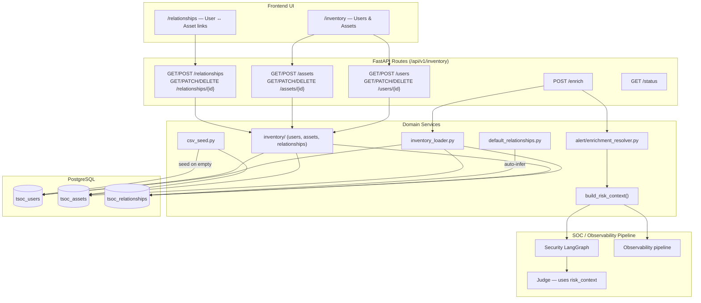
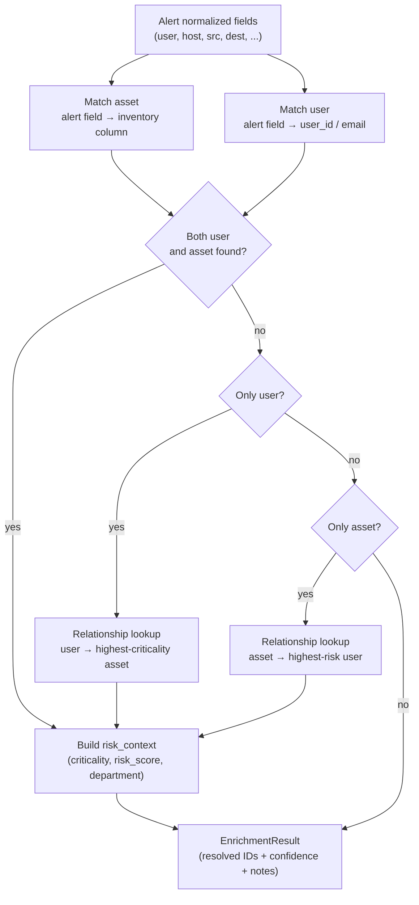

# Inventory service — users, assets, relationships

How ThinkingSOC maintains an **organizational inventory** in PostgreSQL, resolves alert fields to known entities, and feeds **risk context** into the Security and Observability pipelines.

**Related:** [02-integration-boundaries.md](./02-integration-boundaries.md) (inventory boundary) · [07-lld-low-level-design.md](./07-lld-low-level-design.md) (table schemas) · [04-agents-and-pipelines.md](./04-agents-and-pipelines.md) (enrichment in pipelines) · [24-demo-postgresql-data.md](./24-demo-postgresql-data.md) (install / snapshot seed)

---

## Architecture



---

## 1. Data model

### `tsoc_users`

| Column | Type | Required | Description |
|--------|------|----------|-------------|
| `user_id` | varchar PK | yes | Unique user/account identifier |
| `display_name` | varchar | no | Display name |
| `email` | varchar | no | Contact email |
| `department` | varchar | no | Department |
| `risk_score` | int (0–10) | yes | User risk score |
| `description` | text | no | Notes |

### `tsoc_assets`

| Column | Type | Required | Description |
|--------|------|----------|-------------|
| `asset_id` | varchar PK | yes | Unique asset identifier |
| `asset_type` | varchar | yes | `server`, `endpoint`, `app`, `network`, … |
| `hostname` | varchar | conditional | Hostname (for host-based matching) |
| `fqdn` | varchar | conditional | Fully qualified domain name |
| `ip` | varchar | conditional | IP address (for IP-based matching) |
| `owner` | varchar | no | Service owner (feeds default relationships) |
| `criticality` | enum | yes | `low` / `medium` / `high` / `critical` |
| `risk_score` | int (0–10) | yes | Asset risk score |
| `description` | text | no | Notes |

### `tsoc_relationships`

| Column | Type | Required | Description |
|--------|------|----------|-------------|
| `relationship_id` | varchar PK | yes | Unique relationship ID |
| `user_id` | varchar FK | yes | References `tsoc_users.user_id` |
| `asset_id` | varchar FK | yes | References `tsoc_assets.asset_id` |
| `description` | text | no | Notes |

Unique constraint on `(user_id, asset_id)`.

---

## 2. HTTP API (`/api/v1/inventory`)

All endpoints require optional bearer auth when `TSOC_INGEST_TOKEN` is set.

### Status

| Method | Path | Response |
|--------|------|----------|
| `GET` | `/inventory/status` | `{ source: "postgresql", postgres_configured: bool }` |

### Users CRUD

| Method | Path | Body | Response |
|--------|------|------|----------|
| `GET` | `/inventory/users` | — | `UserRecord[]` |
| `POST` | `/inventory/users` | `UserCreate` | `201 UserRecord` |
| `GET` | `/inventory/users/{user_id}` | — | `UserRecord` |
| `PATCH` | `/inventory/users/{user_id}` | `UserUpdate` (partial) | `UserRecord` |
| `DELETE` | `/inventory/users/{user_id}` | — | `204` |

### Assets CRUD

| Method | Path | Body | Response |
|--------|------|------|----------|
| `GET` | `/inventory/assets` | — | `AssetRecord[]` |
| `POST` | `/inventory/assets` | `AssetCreate` | `201 AssetRecord` |
| `GET` | `/inventory/assets/{asset_id}` | — | `AssetRecord` |
| `PATCH` | `/inventory/assets/{asset_id}` | `AssetUpdate` (partial) | `AssetRecord` |
| `DELETE` | `/inventory/assets/{asset_id}` | — | `204` |

### Relationships CRUD

| Method | Path | Body | Response |
|--------|------|------|----------|
| `GET` | `/inventory/relationships` | — | `RelationshipRecord[]` |
| `POST` | `/inventory/relationships` | `RelationshipCreate` | `201 RelationshipRecord` |
| `GET` | `/inventory/relationships/{id}` | — | `RelationshipRecord` |
| `PATCH` | `/inventory/relationships/{id}` | `RelationshipUpdate` (partial) | `RelationshipRecord` |
| `DELETE` | `/inventory/relationships/{id}` | — | `204` |

### Enrichment

| Method | Path | Body | Response |
|--------|------|------|----------|
| `POST` | `/inventory/enrich` | `EnrichRequest` | `EnrichmentResult` |

**`EnrichRequest`:**

```json
{
  "normalized": { "user": "alice", "host": "srv-web01", "src": "10.0.1.5" },
  "users": null,
  "assets": null,
  "relationships": null
}
```

When `users` / `assets` / `relationships` are `null`, data loads from PostgreSQL. When provided inline, they serve as offline test inventory.

**`EnrichmentResult`:**

```json
{
  "resolved_asset_id": "srv-web01",
  "resolved_user_id": "alice",
  "confidence": "high",
  "notes": "Matched asset via alert.host → hostname; Matched user via alert.user → user_id",
  "matched_relationship_ids": []
}
```

### Error codes

| Code | When |
|------|------|
| `400` | Incomplete offline inventory (inline but missing required fields) |
| `404` | Entity not found (CRUD get/update/delete) |
| `409` | Duplicate ID (CRUD create) |
| `503` | `TSOC_POSTGRES_DSN` not configured |

---

## 3. Enrichment flow

The enrichment engine resolves alert `normalized` fields to known users and assets, then fills gaps via relationships.



### Built-in field mappings

**Asset matching** (alert field → inventory column):

| Alert field | Inventory column |
|-------------|------------------|
| `host`, `hostname`, `dest`, `dest_host` | `hostname` |
| `src`, `src_ip`, `dest_ip`, `ip` | `ip` |

**User matching** (alert field → inventory column):

| Alert field | Inventory column |
|-------------|------------------|
| `user`, `username`, `src_user`, `dest_user`, `account` | `user_id` |
| `user`, `username` | `email` |

### Confidence levels

| Scenario | Confidence |
|----------|------------|
| Single exact match (user or asset) | `high` |
| Multiple candidates (picks highest criticality/risk) | `medium` |
| Only resolved via relationship cross-link | `medium` |
| No match | `low` |

### Relationship cross-linking

When only **one side** is resolved:

- **User known, asset unknown:** pick the relationship with the **highest-criticality** asset for that user.
- **Asset known, user unknown:** pick the relationship with the **highest risk_score** user for that asset.

---

## 4. Default relationship generation

When the `tsoc_relationships` table is empty but users and assets exist, the backend infers links from inventory fields.

**Module:** `services/inventory/default_relationships.py`

### Rules (first match per asset)

| Rule | Example |
|------|---------|
| `asset.owner` equals `user.user_id` (case-insensitive) | `owner=jdoe` → user `jdoe` |
| `asset.owner` is a team label mapped to `user.department` | `ops` → IT, `dba` → Finance |

### Merge logic

Explicit CSV rows override auto-generated defaults on the same `(user_id, asset_id)` pair.

---

## 5. Demo data seed

**When:** `install.sh` (Load demo data = Yes), `setup.py`, or API `init_store()` — only when inventory tables are empty.

**Primary source:** `backend/data/demo/postgres_snapshot/` (moment snapshot)

| JSON file | Table | Demo scope |
|-----------|-------|------------|
| `tsoc_users.json` | `tsoc_users` | All rows |
| `tsoc_assets.json` | `tsoc_assets` | All rows |
| `tsoc_relationships.json` | `tsoc_relationships` | All rows |
| `tsoc_identity_rules.json` | `tsoc_identity_rules` | Legacy demo seed only — runtime enrichment uses built-in field maps in `alert/enrichment_resolver.py` |
| `tsoc_records.json` | `tsoc_records` | **Up to 6 newest** by `id` |
| `graph_findings.json` | `graph_findings` | **Newest 1** (Correlation page) |

**Module:** `services/demo/postgres_snapshot.py` (`restore_postgres_snapshot_if_empty`)

**CSV fallback:** `services/inventory/csv_seed.py` — root + scenario CSVs when no snapshot manifest.

**Process (snapshot path):**

1. Check inventory empty.
2. Read `manifest.json` and insert tables in FK-safe order.
3. Skip CSV seed and default-relationship generation (data already in snapshot).

**Process (CSV path):**

1. Load users/assets from merged CSVs.
2. Merge explicit + auto-generated relationships.
3. Insert relationships.

`ensure_default_relationships()` still runs at API startup when inventory exists but relationship rows are missing.

**Full guide:** [24-demo-postgresql-data.md](./24-demo-postgresql-data.md)

---

## 6. Pipeline integration

### Risk context for Judge

After enrichment resolves user/asset IDs, `build_risk_context()` builds a text string fed into the LangGraph pipeline:

```
User: alice (department: Engineering, risk_score: 3)
Asset: srv-web01 (criticality: high, risk_score: 7, type: server)
```

This context is injected into the **Judge** LLM prompt (Security pipeline) and **Ops Judge** (Observability) so verdicts can weigh organizational importance.

### Admin organizational GAP

When enrichment returns `confidence: low` or the asset has no known owner/department, the post-pipeline **admin-org GAP** step may suggest a question for an administrator. See [07-lld-low-level-design.md](./07-lld-low-level-design.md) §5.

### SOC Chat and RAG

Inventory rows (users, assets, relationships) are indexed as `doc_type` values (`inventory_user`, `inventory_asset`, `inventory_relationship`) in the SOC vector RAG for narrative chat queries. See [10-soc-vector-rag.md](./10-soc-vector-rag.md).

---

## 7. Configuration

| Variable | Default | Description |
|----------|---------|-------------|
| `TSOC_POSTGRES_DSN` | — | Required for all inventory operations |

No separate inventory-specific env flags. Inventory is available whenever PostgreSQL is configured.

---

## 8. Frontend UI

| Route | Component | Purpose |
|-------|-----------|---------|
| `/inventory` | Users and assets tables | CRUD management |
| `/relationships` | User–asset mapping | View and manage links |
| Investigation detail | `EnrichmentResult` display | Shows resolved user/asset on analysis |

---

## 9. Code map

| Path | Role |
|------|------|
| `backend/api/routes/inventory.py` | HTTP endpoints |
| `backend/services/inventory/__init__.py` | Package exports |
| `backend/services/inventory/users.py` | User CRUD (PostgreSQL) |
| `backend/services/inventory/assets.py` | Asset CRUD (PostgreSQL) |
| `backend/services/inventory/relationships.py` | Relationship CRUD (PostgreSQL) |
| `backend/services/inventory/loader.py` | Load from PostgreSQL |
| `backend/services/inventory/inventory_loader.py` | Unified loader (PG or inline) |
| `backend/services/demo/postgres_snapshot.py` | Moment demo snapshot export/restore |
| `backend/services/inventory/csv_seed.py` | Demo seed from CSV (fallback) |
| `backend/services/inventory/default_relationships.py` | Auto-generated links |
| `backend/services/inventory/exceptions.py` | `InventoryConflictError`, `InventoryNotFoundError` |
| `backend/services/inventory/_db.py` | Database helpers |
| `backend/services/alert/enrichment_resolver.py` | Alert → inventory matching |
| `backend/models/inventory.py` | Pydantic models |
| `backend/models/enrichment.py` | `EnrichmentResult`, `EnrichRequest` |
| `backend/data/demo/postgres_snapshot/` | Bundled moment demo (primary) |
| `backend/data/demo/*.csv` | CSV fallback + scenario packs |
| `backend/db/schema.sql` | DDL |

---

## 10. Related documents

| Document | Topic |
|----------|-------|
| [02-integration-boundaries.md](./02-integration-boundaries.md) | Inventory boundary |
| [04-agents-and-pipelines.md](./04-agents-and-pipelines.md) | Enrichment in pipeline context |
| [07-lld-low-level-design.md](./07-lld-low-level-design.md) | Table schemas and API surface |
| [10-soc-vector-rag.md](./10-soc-vector-rag.md) | Inventory in SOC Chat RAG |
| [11-environment-configuration.md](./11-environment-configuration.md) | `TSOC_POSTGRES_DSN` reference |
