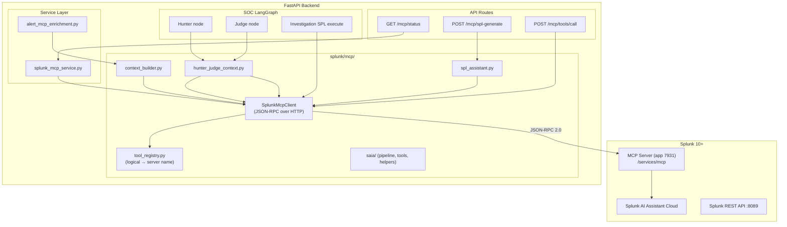
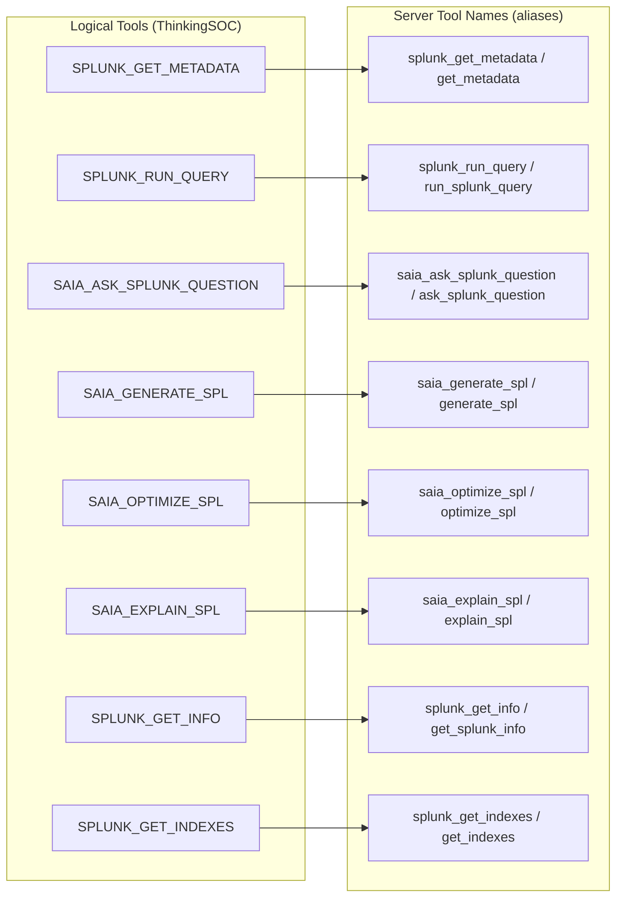
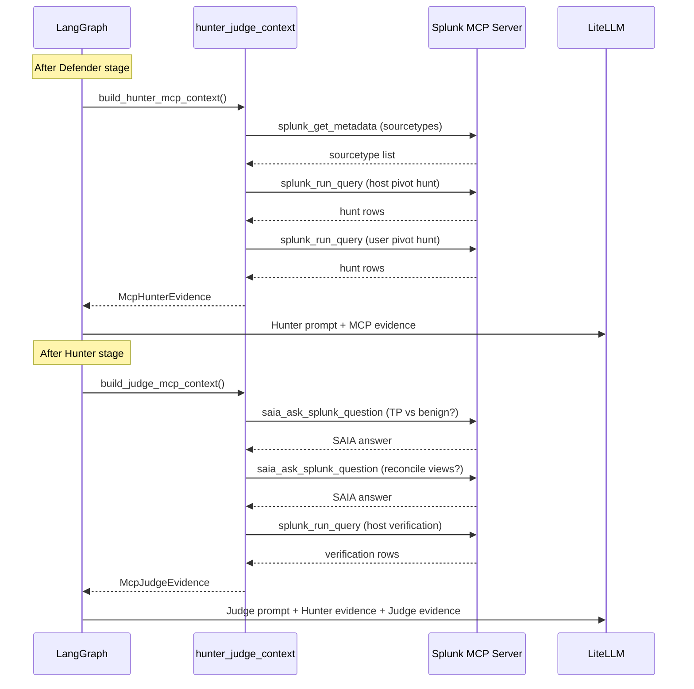

# Splunk MCP integration

How ThinkingSOC uses the **Splunk MCP Server** (Model Context Protocol, Splunkbase app 7931) for live Splunk tool calls: metadata lookups, SPL execution, SAIA question answering, and Hunter/Judge evidence gathering.

**Related:** [02-integration-boundaries.md](./02-integration-boundaries.md) (MCP boundary) · [04-agents-and-pipelines.md](./04-agents-and-pipelines.md) (Hunter/Judge MCP) · [13-cim-investigation-spl-mcp.md](./13-cim-investigation-spl-mcp.md) (investigation SPL)

---

## Architecture



---

## 1. MCP tools

The Splunk MCP Server exposes tools via JSON-RPC `tools/list`. ThinkingSOC maps **logical tool names** to whatever the server reports (with aliases for different MCP Server versions).



### Tool reference

| Logical tool | Primary purpose | Used by |
|-------------|-----------------|---------|
| `SPLUNK_GET_METADATA` | Index metadata (sourcetypes, hosts, sources) | Hunter MCP, classification enrichment |
| `SPLUNK_RUN_QUERY` | Execute SPL (read-only, row limit) | Hunter hunts, Judge verification, investigation execute |
| `SAIA_ASK_SPLUNK_QUESTION` | Natural-language question → Splunk AI answer | Judge MCP (2 pre-verdict questions) |
| `SAIA_GENERATE_SPL` | Natural-language → SPL | `/mcp/spl-generate` debug endpoint |
| `SAIA_OPTIMIZE_SPL` | Improve generated SPL | Post-generate step (debug) |
| `SAIA_EXPLAIN_SPL` | Explain SPL in plain language | Post-generate step (debug) |
| `SPLUNK_GET_INFO` | Splunk instance info | Status check |
| `SPLUNK_GET_INDEXES` | List available indexes | Status, context |

---

## 2. JSON-RPC client

**Module:** `splunk/mcp/client.py` — `SplunkMcpClient`

### Protocol

- **Transport:** HTTP POST to `{SPLUNK_MCP_URL}` (default: `{SPLUNK_MGMT_URL}/services/mcp`)
- **Format:** JSON-RPC 2.0
- **Auth:** `Authorization: Bearer {SPLUNK_MCP_TOKEN}`
- **TLS:** Configurable via `SPLUNK_MCP_VERIFY_SSL`

### Lifecycle

1. **`initialize`** — handshake with protocol version `2024-11-05`, client info
2. **`notifications/initialized`** — notify server (best-effort)
3. **`tools/list`** — cache available tool names
4. **`tools/call`** — invoke a specific tool with arguments

`ensure_ready()` runs steps 1–3 lazily on the first tool call.

### Error hierarchy

| Exception | When |
|-----------|------|
| `McpNotConfiguredError` | `TSOC_MCP_ENABLED=false` or missing URL/token |
| `McpConnectionError` | HTTP failure, non-JSON response, network timeout |
| `McpToolError` | Tool returned `isError`, RPC-level error, unknown tool name |

All MCP errors are **non-fatal** in the pipeline — analysis continues with LLM-only reasoning.

---

## 3. HTTP API (`/api/v1/mcp`)

### Status

| Method | Path | Auth | Response |
|--------|------|------|----------|
| `GET` | `/mcp/status` | None | `McpStatusResponse` |

```json
{
  "configured": true,
  "connected": true,
  "url": "https://127.0.0.1:8089/services/mcp",
  "server_info": { "name": "splunk-mcp", "version": "..." },
  "tools": ["splunk_run_query", "splunk_get_metadata", "saia_ask_splunk_question", "..."],
  "saia_available": true,
  "message": null
}
```

### SPL generation (debug/demo)

| Method | Path | Auth | Response |
|--------|------|------|----------|
| `POST` | `/mcp/spl-generate` | Bearer | `McpSplGenerateResponse` |

Uses `saia_generate_spl` → optional `saia_optimize_spl` / `saia_explain_spl`. This is **not** the main investigation path (that uses REST `/predict`).

### Generic tool call (debug/demo)

| Method | Path | Auth | Response |
|--------|------|------|----------|
| `POST` | `/mcp/tools/call` | Bearer | `McpToolCallResponse` |

Invokes any MCP tool by exact server name. For testing and demos.

---

## 4. Hunter / Judge MCP evidence

**Module:** `splunk/mcp/hunter_judge_context.py`

When `TSOC_MCP_ENABLED=true` and `TSOC_MCP_HUNTER_JUDGE_ENABLED=true`, the Security pipeline runs **live Splunk queries before** the Hunter and Judge LLM stages.



### Hunter MCP

| Step | MCP tool | Purpose |
|------|----------|---------|
| 1 | `splunk_get_metadata` | Sourcetypes available for the alert index |
| 2–3 | `splunk_run_query` (max 2) | Correlation hunts from host/user/src pivots (15 rows each) |

**Output:** `McpHunterEvidence` — `tools_called`, `hunt_queries[]`, `metadata_sourcetypes`, `notes`

### Judge MCP

| Step | MCP tool | Purpose |
|------|----------|---------|
| 1–2 | `saia_ask_splunk_question` (2 questions) | TP vs benign; reconcile Defender/Hunter views |
| 3 | `splunk_run_query` | Host sourcetype verification (10 rows) |

**Output:** `McpJudgeEvidence` — `tools_called`, `saia_answers[]`, `verification_queries[]`, `notes`

### SAIA questions (Judge)

Two alert-specific questions are dynamically constructed:

1. **TP vs benign confirmation:** "For alert `{name}` on host `{host}` and user `{user}`, what Splunk searches best confirm true positive vs benign?"
2. **Reconcile Defender/Hunter:** "Defender view: `{defender_excerpt}`. Hunter view: `{hunter_excerpt}`. What Splunk evidence would most decisively reconcile?"

### Prompt injection

Evidence is injected into the LLM user message via `format_hunter_mcp_for_prompt()` and `format_judge_mcp_for_prompt()`. Prompt section order:

| Stage | Order |
|-------|-------|
| **Hunter** | System Context → Defender output → Hunter MCP hunt evidence |
| **Judge** | System Context → Defender output → Hunter output → Hunter MCP hunt evidence → Judge MCP verdict evidence (SAIA + verification) |

Analyst outputs come **before** MCP evidence so the Judge reads Defender/Hunter positions first, then weighs live Splunk ground truth in the verdict.

### API output

MCP evidence appears on the analysis response:

- `SocAnalysisResult.hunter.mcp_evidence` → `McpHunterEvidence`
- `SocAnalysisResult.judge.mcp_evidence` → `McpJudgeEvidence`

---

## 5. MCP for classification enrichment

**Module:** `services/alert_mcp_enrichment.py` + `splunk/mcp/context_builder.py`

Before classification, the pipeline can optionally call `splunk_get_metadata` to gather index metadata (hosts, sources, sourcetypes) that strengthens Security vs Observability signal separation.

**Output:** `McpAlertContext` — attached to the alert pipeline's enrichment phase.

---

## 6. MCP for SPL execution

**Module:** `services/investigation/spl_predict_pipeline.py` + `services/investigation/investigation_spl_execute.py`

After investigation SPL is generated (via REST `/predict` or LiteLLM), execution prefers MCP:

| Priority | Mechanism | Config |
|----------|-----------|--------|
| 1 | MCP `splunk_run_query` (All Time: SPL `earliest=1 latest=now`; job params `earliest_time=0`) | `TSOC_SPL_EXECUTE_VIA_MCP=true` |
| 2 | REST oneshot (fallback) | When MCP execute fails |

Row limit: 50 rows per investigation question.

Full flow: [13-cim-investigation-spl-mcp.md](./13-cim-investigation-spl-mcp.md).

---

## 7. Configuration

| Variable | Default | Description |
|----------|---------|-------------|
| `TSOC_MCP_ENABLED` | `true` | Master switch for MCP client |
| `SPLUNK_MCP_URL` | `{SPLUNK_MGMT_URL}/services/mcp` | MCP Server endpoint |
| `SPLUNK_MCP_TOKEN` | — | Bearer token (required when MCP enabled) |
| `SPLUNK_MCP_VERIFY_SSL` | `false` | TLS verification |
| `SPLUNK_MCP_TIMEOUT_SECONDS` | `90` | HTTP timeout per MCP request |
| `TSOC_MCP_HUNTER_JUDGE_ENABLED` | `true` | Hunter/Judge live evidence (requires MCP enabled) |
| `TSOC_MCP_CORRELATION_ENABLED` | `false` | MCP tools for cross-alert correlation |
| `TSOC_MCP_SAIA_SPL_ONLY` | `false` | `saia_generate_spl`: return SPL only vs full reply |
| `TSOC_MCP_SAIA_OPTIMIZE_SPL` | `true` | Post-generate: `saia_optimize_spl` |
| `TSOC_MCP_SAIA_EXPLAIN_SPL` | `true` | Post-generate: `saia_explain_spl` |
| `TSOC_SAIA_MCP_PROMPT_MAX_CHARS` | `1000` | Max prompt chars for MCP (Splunk hard limit) |
| `TSOC_SAIA_LLM_PREPARE_PROMPT` | `true` | LiteLLM writes ≤1000-char prompt before MCP generate |
| `TSOC_SPL_EXECUTE_VIA_MCP` | `true` | Prefer MCP for investigation SPL execution |

### Trace logging

| Variable | Logger | Content |
|----------|--------|---------|
| `TSOC_MCP_TRACE_LOG` | `tsoc.trace.mcp` | Full JSON-RPC request/response bodies |
| `TSOC_SAIA_TRACE_LOG` | `tsoc.trace.saia` | SAIA pipeline + `/predict` / MCP SAIA tools |
| `TSOC_TRACE_LOG_FILE` | — | Optional file for MCP + SAIA trace lines |

---

## 8. Resilience and fallback

MCP is **optional** at every integration point. Failures are non-fatal:

| Failure | Behavior |
|---------|----------|
| MCP not configured | Skip MCP; pipeline uses LLM-only reasoning |
| `McpConnectionError` (network) | Log warning; continue without MCP evidence |
| `McpToolError` (tool error) | Log warning; continue without that tool's output |
| MCP execute fails (SPL) | Fall back to REST oneshot |
| SAIA unavailable | Judge runs without SAIA answers |

---

## 9. Splunk prerequisites

1. **Splunk MCP Server** (Splunkbase app 7931) installed and accessible
2. **Splunk AI Assistant Cloud** — for `saia_*` tools (optional but recommended)
3. Management port **8089** reachable from the backend
4. Service account with search permissions, **`mcp_tool_execute`** on its role(s), and MCP bearer token

### Automated setup (hackathon installer)

The post-install wizard runs [scripts/setup_splunk_mcp.py](../scripts/setup_splunk_mcp.py):

- `splunk install app` (Splunkbase 7931 or `TSOC_SPLUNK_MCP_APP_PACKAGE`)
- `splunk enable app Splunk_MCP_Server`
- REST: add `mcp_tool_execute` to the service user's roles
- Mint token → `SPLUNK_MCP_TOKEN` and `SPLUNK_MCP_URL` in `backend/.env`

Then **restart Splunk** and re-run smoke: [23-post-install-integration-wizard.md](./23-post-install-integration-wizard.md).

Manual token only: `backend/.venv/bin/python scripts/mint_splunk_mcp_token.py`

---

## 10. Models

| Model | File | Used for |
|-------|------|----------|
| `McpAlertContext` | `models/mcp.py` | Classification MCP enrichment |
| `McpHunterEvidence` | `models/mcp.py` | Hunter pre-LLM evidence |
| `McpJudgeEvidence` | `models/mcp.py` | Judge pre-LLM evidence |
| `McpQueryEvidence` | `models/mcp.py` | Single `splunk_run_query` result |
| `McpSaiaAnswer` | `models/mcp.py` | Single SAIA question/answer pair |
| `McpStatusResponse` | `models/mcp.py` | `/mcp/status` response |
| `McpToolCallRequest` / `Response` | `models/mcp.py` | Debug tool call |
| `McpSplGenerateRequest` / `Response` | `models/mcp.py` | SPL generate |
| `McpLogicalTool` | `splunk/mcp/tool_registry.py` | Enum of all logical tool names |

---

## 11. Code map

| Path | Role |
|------|------|
| `backend/splunk/mcp/client.py` | JSON-RPC client (`SplunkMcpClient`) |
| `backend/splunk/mcp/tool_registry.py` | Logical tool → server name mapping |
| `backend/splunk/mcp/hunter_judge_context.py` | Hunter/Judge live evidence |
| `backend/splunk/mcp/context_builder.py` | Alert-level MCP enrichment builder |
| `backend/splunk/mcp/spl_assistant.py` | `generate_spl_via_mcp` wrapper |
| `backend/splunk/mcp/errors.py` | `McpNotConfiguredError`, `McpConnectionError`, `McpToolError` |
| `backend/splunk/mcp/saia/` | SAIA pipeline: tools, helpers, prompt, parse, constants |
| `backend/api/routes/mcp.py` | HTTP endpoints |
| `backend/services/splunk_integration/splunk_mcp_service.py` | `get_mcp_status()` |
| `backend/services/alert_mcp_enrichment.py` | Classification MCP enrichment |
| `backend/models/mcp.py` | All Pydantic models |
| `backend/tests/test_hunter_judge_mcp.py` | Mocked JSON-RPC tests |

---

## 12. Related documents

| Document | Topic |
|----------|-------|
| [02-integration-boundaries.md](./02-integration-boundaries.md) | MCP boundary and wire-level contracts |
| [04-agents-and-pipelines.md](./04-agents-and-pipelines.md) | Hunter/Judge MCP in pipeline context |
| [13-cim-investigation-spl-mcp.md](./13-cim-investigation-spl-mcp.md) | Investigation SPL execution via MCP |
| [11-environment-configuration.md](./11-environment-configuration.md) | Full env variable reference |
