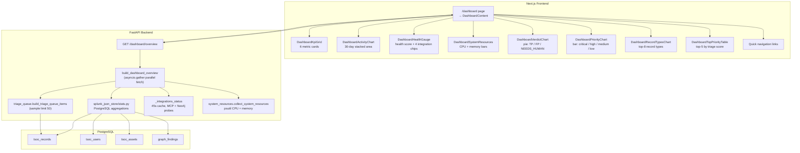

# Dashboard — analyst overview

The **Dashboard** is the default landing page in the analyst UI. It provides a live, at-a-glance view of platform health, pipeline activity, triage distribution, inventory size, and backend host resources.

**Related:** [08-triage-priority-layer.md](./08-triage-priority-layer.md) (triage queue) · [12-correlation-graph-service.md](./12-correlation-graph-service.md) (correlation / Neo4j) · [14-inventory-service.md](./14-inventory-service.md) (inventory) · [20-investigation-workflow.md](./20-investigation-workflow.md) (investigation detail) · [11-environment-configuration.md](./11-environment-configuration.md) (env)

---

## Architecture

---

## 1. API

### `GET /api/v1/dashboard/overview`

**Auth:** the backend route has **no** ingest-token guard. The Next.js UI calls this API through the **frontend proxy** (`/api/backend/...`), which requires a valid **session cookie** (`AUTH_SECRET`). Unauthenticated browser requests get `401` from the proxy, not from `check_ingest_bearer`.

**Response model:** `DashboardOverview`

| Field | Type | Description |
|-------|------|-------------|
| `generated_at` | `str` | ISO-8601 **UTC** timestamp when the overview was built (e.g. `2026-06-11T08:15:30.123456+00:00`) |
| `postgres_configured` | `bool` | Always `true` on success (503 when DSN missing) |
| `system_resources` | `SystemResources` | Backend host CPU and memory via `psutil` |
| `kpis` | `DashboardKpis` | Six headline metrics (see §2) |
| `activity_timeline` | `ActivityTimelinePoint[]` | Daily buckets for the last **30** days (see §3) |
| `record_type_counts` | `CountByType[]` | `COUNT(*)` per `tsoc_record_type` |
| `triage_by_verdict` | `CountByVerdict[]` | Verdict distribution from triage sample |
| `triage_by_priority` | `CountByPriority[]` | Priority distribution from triage sample |
| `track_split` | `TrackSplit` | Security vs observability counts from triage sample (API only — not rendered in the dashboard UI) |
| `integrations` | `DashboardIntegrations` | `postgres`, `llm`, `mcp`, `neo4j` booleans |
| `health_score` | `int` | 0–100 integration readiness score |
| `top_priority` | `TopPriorityItem[]` | Top 5 triage items by score |

### Error codes

| Code | When |
|------|------|
| `401` | Frontend proxy: no valid session cookie (not logged in) |
| `503` | `TSOC_POSTGRES_DSN` not configured |
| `502` | PostgreSQL query failure or overview build error |

### Auto-refresh

The frontend polls `GET /dashboard/overview` every **60 seconds** and provides a manual **Refresh** button. Background refreshes keep the current layout visible and only spin the refresh icon.

---

## 2. KPI cards

Six key metrics displayed in the top grid:

| KPI | Source | Description |
|-----|--------|-------------|
| **Total records** | `COUNT(*) FROM tsoc_records` | All stored records (ingest, analysis, routing, audits, …) |
| **Analyses (24h)** | `tsoc_records WHERE created_at >= NOW()-24h AND type IN (soc_analysis, observability_analysis)` | Recent pipeline activity |
| **Needs review** | Triage sample items where `needs_human_review = true` | Human triage queue indicator |
| **Avg triage score** | Mean of `triage_score` across the triage sample | Overall urgency indicator (0–100) |
| **Users** | `COUNT(*) FROM tsoc_users` | Inventory user count |
| **Assets** | `COUNT(*) FROM tsoc_assets` | Inventory asset count |

Triage-derived KPIs and charts use a **sample of up to 50** items from `build_triage_queue_items(track="all", limit=50)`, not the full queue.

---

## 3. Activity timeline (30 days)

Stacked area chart titled **Pipeline activity** showing daily event counts over the last **30 days** (`fetch_activity_by_day(settings, days=30)`).

| Series (UI) | Source |
|-------------|--------|
| **Security** | `tsoc_record_type IN (soc_analysis, soc_analysis_audit, soc_analysis_batch)` |
| **Observability** | `tsoc_record_type = observability_analysis` |
| **Correlation** | `graph_findings` created per day (query falls back to `0` if the table is missing) |

The API also returns an **Other** bucket (all remaining `tsoc_record_type` values). The chart component does not plot **Other** — only the three series above.

PostgreSQL builds zero-filled day buckets with `generate_series` from `CURRENT_DATE - 29` through `CURRENT_DATE` (inclusive). Event rows are grouped by **UTC calendar day**: `(created_at AT TIME ZONE 'UTC')::date`.

### `ActivityTimelinePoint` fields

| Field | Type | Meaning |
|-------|------|---------|
| `date` | `str` | Bucket key as ISO **date only** — `YYYY-MM-DD` (UTC day from aggregation; no time-of-day) |
| `security` | `int` | Security pipeline events that day |
| `observability` | `int` | Observability pipeline events that day |
| `correlation` | `int` | `graph_findings` rows that day |
| `other` | `int` | Remaining `tsoc_record_type` counts (API only; not charted) |

### Time and date display (charts and header)

| UI element | API / source | How time is shown |
|------------|--------------|-------------------|
| **Pipeline activity** X-axis | `activity_timeline[].date` | Short **locale** label via `toLocaleDateString` — e.g. `Jun 10` (month abbreviation + day). The API date is parsed as local midnight (`YYYY-MM-DDT00:00:00`), so in timezones **west of UTC** the label can appear **one calendar day earlier** than the UTC bucket date. |
| **Pipeline activity** tooltip | Same bucket counts | Series names and counts only — **no clock time** on the chart. |
| Subtitle **Updated …** | `generated_at` | Full **browser-local** date/time via `toLocaleString()` from the UTC ISO timestamp returned by the API. |
| **Analyses (24h)** KPI | `NOW() - INTERVAL '24 hours'` in PostgreSQL | Rolling **24-hour window** in the database session timezone (Docker Postgres is typically UTC), not “since local midnight”. |

Other dashboard charts (verdict pie, priority bar, record types) have **no time axis** — they show distribution counts from the current triage sample or full table aggregates.

---

## 4. Health score and integrations

### Health score (0–100)

Equal-weight sum of four integration probes (25 points each):

| Integration | Points |
|-------------|--------|
| PostgreSQL configured | +25 |
| LiteLLM API key set | +25 |
| Splunk MCP connected | +25 |
| Neo4j reachable | +25 |

Displayed as a radial gauge with four status chips underneath.

### Integration status

| Flag | How checked |
|------|-------------|
| `postgres` | `TSOC_POSTGRES_DSN` is set and pool initialized |
| `llm` | `LITELLM_API_KEY` is non-empty |
| `mcp` | `get_mcp_status()` returns `connected: true` (8 s probe timeout when MCP enabled) |
| `neo4j` | `TSOC_CORRELATION_ENABLED` + PostgreSQL configured + `verify_connectivity()` succeeds (3 s probe timeout) |

Integration probes are cached in-process for **45 seconds** to keep dashboard loads fast. PostgreSQL aggregations and triage data are fetched fresh on every request via `asyncio.gather`.

---

## 5. Triage distribution charts

Both charts derive counts from the **50-item triage sample** (same source as KPIs).

### Verdict pie chart

| Verdict | Color |
|---------|-------|
| `TRUE_POSITIVE` | Red |
| `FALSE_POSITIVE` | Green |
| `NEEDS_HUMAN_REVIEW` | Orange |
| `UNKNOWN` | Gray |

Empty state: *No triage verdicts yet*.

### Priority bar chart

| Priority | Color |
|----------|-------|
| `critical` | Red |
| `high` | Orange |
| `medium` | Yellow |
| `low` / `unknown` | Gray |

Empty state: *No priority data yet*.

---

## 6. Record type counts

Vertical bar chart showing the **top 8** `tsoc_record_type` values by count (full list is in the API response). Typical types: `splunk_ingest`, `soc_analysis`, `observability_analysis`, `agentic_ops_analysis`, `investigation_analyst_action`, `admin_org_gap_suggest`, `llm_chat_audit`.

---

## 7. Top priority table

Top **5** items from the triage sample (already sorted by `triage_score` descending). Each row shows:

| Column | Description |
|--------|-------------|
| Search name | `search_name`, or `sid`, or `Record {id}` |
| Score + track | `triage_score` and `source_track` |
| Verdict badge | `TRUE_POSITIVE` / `FALSE_POSITIVE` / `NEEDS_HUMAN_REVIEW` |
| Priority badge | `critical` / `high` / `medium` / `low` |
| Review badge | Shown when `needs_human_review = true` |

Rows link to investigation detail when a storage record ID is present:

| Track | Route |
|-------|-------|
| Security | `/analysis/investigation/[id]` |
| Observability | `/analysis/ops-investigation/[id]` |

A **View all** link opens `/analysis`.

---

## 8. System resources

Host metrics collected on the **backend process host** via `psutil`:

| Metric | Source |
|--------|--------|
| `hostname` | `socket.gethostname()` |
| `cpu_percent` | `psutil.cpu_percent()` |
| `memory_percent` | `psutil.virtual_memory().percent` |
| `memory_used_bytes` | Used RAM in bytes |
| `memory_total_bytes` | Total RAM in bytes |

The UI renders CPU and memory as percentage bars with GiB detail for memory.

---

## 9. UI error handling

When live metrics fail to load, the page shows a destructive alert with a contextual message:

| Status | Message |
|--------|---------|
| `401` | Not logged in — frontend proxy requires session cookie |
| `503` | PostgreSQL not configured (`TSOC_POSTGRES_DSN`) |
| Other | Generic failure with link to **Splunk & Integrations** (`/splunk-connection`) |

Skeleton placeholder cards appear during the initial load.

---

## 10. Quick navigation

Bottom bar with shortcut links to:

| Link | Route |
|------|-------|
| Inventory | `/inventory` |
| Relationships | `/relationships` |
| Analysis | `/analysis` |
| Integrations | `/splunk-connection` |

---

## 11. Configuration

No dedicated dashboard env vars. The dashboard requires:

| Variable | Required for |
|----------|-------------|
| `TSOC_POSTGRES_DSN` | All metrics (503 without it) |
| `LITELLM_API_KEY` | Health score LLM flag (+25) |
| `TSOC_MCP_ENABLED` + `SPLUNK_MCP_TOKEN` | Health score MCP flag (+25) |
| `TSOC_CORRELATION_ENABLED` + Neo4j DSN | Health score Neo4j flag (+25) and correlation activity series |

---

## 12. Code map

| Path | Role |
|------|------|
| `backend/api/routes/dashboard.py` | `GET /dashboard/overview` endpoint |
| `backend/services/platform/dashboard_overview.py` | `build_dashboard_overview` orchestrator, integration probes, health score |
| `backend/services/platform/system_resources.py` | `psutil` CPU/memory collector |
| `backend/services/splunk_json_store/stats.py` | PostgreSQL aggregation queries |
| `backend/models/dashboard.py` | Pydantic models (`DashboardOverview`, KPIs, timeline, etc.) |
| `backend/tests/test_dashboard_api.py` | API contract tests |
| `backend/tests/test_dashboard_overview_service.py` | Integration cache, MCP timeout, parallel fetch tests |
| `frontend/app/(app)/dashboard/page.tsx` | Next.js page route |
| `frontend/components/pages/dashboard-content.tsx` | Main dashboard component (state, polling, layout, errors) |
| `frontend/components/dashboard/` | 7 chart/table sub-components |
| `frontend/lib/api/dashboard.ts` | `fetchDashboardOverview` + chart data helpers |
| `frontend/lib/api/types.ts` | TypeScript type definitions |
| `frontend/lib/analysis-payload.ts` | `investigationHrefForRow` for top-priority links |

---

## 13. Related documents

| Document | Topic |
|----------|-------|
| [08-triage-priority-layer.md](./08-triage-priority-layer.md) | Triage scoring rules and queue |
| [12-correlation-graph-service.md](./12-correlation-graph-service.md) | Correlation graph and `graph_findings` |
| [14-inventory-service.md](./14-inventory-service.md) | Inventory users/assets |
| [20-investigation-workflow.md](./20-investigation-workflow.md) | Investigation detail pages linked from top priority |
| [07-lld-low-level-design.md](./07-lld-low-level-design.md) | API surface and record types |
| [11-environment-configuration.md](./11-environment-configuration.md) | Environment variables |
