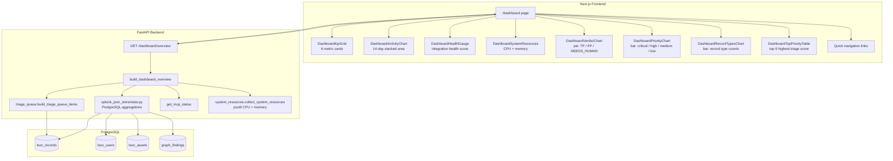

# Dashboard — analyst overview

The **Dashboard** provides a live, at-a-glance view of platform health, analysis activity, triage distribution, inventory size, and system resources. It is the default landing page in the analyst UI.

**Related:** [08-triage-priority-layer.md](./08-triage-priority-layer.md) (triage queue) - [14-inventory-service.md](./14-inventory-service.md) (inventory) - [11-environment-configuration.md](./11-environment-configuration.md) (env)

---

## Architecture

---

## 1. API

### `GET /api/v1/dashboard/overview`

**Auth:** optional bearer (`TSOC_INGEST_TOKEN`)

**Response model:** `DashboardOverview`

```mermaid
flowchart LR
  subgraph response ["DashboardOverview"]
    Meta["generated_at\npostgres_configured"]
    KPIs["kpis\ntotal_records, analyses_24h\nneeds_human_review, avg_triage_score\nusers, assets"]
    Timeline["activity_timeline\n30 days: security, observability\ncorrelation, other"]
    RecordTypes["record_type_counts\ntype + count per tsoc_record_type"]
    TriageVerdict["triage_by_verdict\nTRUE_POSITIVE, FALSE_POSITIVE\nNEEDS_HUMAN_REVIEW counts"]
    TriagePriority["triage_by_priority\ncritical, high, medium, low counts"]
    TrackSplit["track_split\nsecurity vs observability"]
    Integrations["integrations\npostgres, llm, mcp booleans"]
    HealthScore["health_score\n0-100 weighted"]
    SysResources["system_resources\nhostname, cpu_percent\nmemory_percent, bytes"]
    TopPriority["top_priority\ntop-5 items by triage_score"]
  end
```

### Error codes

| Code | When |
|------|------|
| `503` | `TSOC_POSTGRES_DSN` not configured |
| `502` | PostgreSQL query failure |

### Auto-refresh

The frontend polls `GET /dashboard/overview` every **60 seconds** and provides a manual **Refresh** button.

---

## 2. KPI cards

Six key metrics displayed in the top grid:

| KPI | Source | Description |
|-----|--------|-------------|
| **Total records** | `COUNT(*) FROM tsoc_records` | All stored records (ingest, analysis, identity, ...) |
| **Analyses (24h)** | `tsoc_records WHERE created_at >= NOW()-24h AND type IN (soc_analysis, observability_analysis)` | Recent pipeline activity |
| **Needs review** | Triage queue items where `needs_human_review = true` | Human triage queue size |
| **Avg triage score** | Mean of `triage_score` across all triage queue items | Overall urgency indicator (0-100) |
| **Users** | `COUNT(*) FROM tsoc_users` | Inventory user count |
| **Assets** | `COUNT(*) FROM tsoc_assets` | Inventory asset count |

---

## 3. Activity timeline (14-day)

Stacked area chart showing daily event counts over the last 30 days.

| Series | Source |
|--------|--------|
| **Security** | `tsoc_record_type IN (soc_analysis, soc_analysis_audit, soc_analysis_batch)` |
| **Observability** | `tsoc_record_type = observability_analysis` |
| **Correlation** | `graph_findings` created per day (fallback to 0 if table missing) |
| **Other** | All other `tsoc_record_type` values |

Uses PostgreSQL `generate_series` for zero-filled day buckets.

---

## 4. Health score and integrations

### Health score (0-100)

Weighted sum of integration availability:

| Integration | Points |
|-------------|--------|
| PostgreSQL configured | +40 |
| LLM API key set | +35 |
| MCP connected | +25 |

Displayed as a radial gauge in the UI.

### Integration status

| Flag | How checked |
|------|-------------|
| `postgres` | `TSOC_POSTGRES_DSN` is set and pool initialized |
| `llm` | `LITELLM_API_KEY` is non-empty |
| `mcp` | `get_mcp_status()` returns `connected: true` |

---

## 5. Triage distribution charts

### Verdict pie chart

Aggregated from triage queue items:

| Verdict | Color |
|---------|-------|
| `TRUE_POSITIVE` | Red |
| `FALSE_POSITIVE` | Green |
| `NEEDS_HUMAN_REVIEW` | Orange |
| `UNKNOWN` | Gray |

### Priority bar chart

| Priority | Color |
|----------|-------|
| `critical` | Red |
| `high` | Orange |
| `medium` | Yellow |
| `low` | Gray |

---

## 6. Record type counts

Horizontal bar chart showing `COUNT(*)` per `tsoc_record_type` across all `tsoc_records`. Typical types: `splunk_ingest`, `soc_analysis`, `observability_analysis`, `agentic_ops_analysis`, `identity_resolve`, `admin_org_gap_suggest`, `llm_chat_audit`.

---

## 7. Top priority table

Top **5** items from the triage queue sorted by `triage_score` descending. Each row shows:

| Column | Description |
|--------|-------------|
| `id` | PostgreSQL record ID |
| `stored_at` | Timestamp |
| `tsoc_record_type` | Analysis type |
| `sid` | Splunk search job ID |
| `search_name` | Alert name |
| `source_track` | security / observability |
| `triage_score` | 0-100 score |
| `investigation_priority` | critical / high / medium / low |
| `review_verdict` | TRUE_POSITIVE / FALSE_POSITIVE / NEEDS_HUMAN_REVIEW |
| `needs_human_review` | Boolean |

Links to investigation detail.

---

## 8. System resources

Host metrics collected via `psutil`:

| Metric | Source |
|--------|--------|
| `hostname` | `socket.gethostname()` |
| `cpu_percent` | `psutil.cpu_percent()` |
| `memory_percent` | `psutil.virtual_memory().percent` |
| `memory_used_bytes` | Used RAM in bytes |
| `memory_total_bytes` | Total RAM in bytes |

---

## 9. Quick navigation

Bottom bar with shortcut links to:

| Link | Route |
|------|-------|
| Inventory | `/inventory` |
| Relationships | `/relationships` |
| Analysis | `/analysis` |
| Integrations | `/splunk-connection` |

---

## 10. Configuration

No dedicated dashboard env vars. The dashboard requires:

| Variable | Required for |
|----------|-------------|
| `TSOC_POSTGRES_DSN` | All metrics (503 without it) |
| `LITELLM_API_KEY` | Health score LLM flag |
| `TSOC_MCP_ENABLED` + token | Health score MCP flag |

---

## 11. Code map

| Path | Role |
|------|------|
| `backend/api/routes/dashboard.py` | `GET /dashboard/overview` endpoint |
| `backend/services/platform/dashboard_overview.py` | `build_dashboard_overview` orchestrator |
| `backend/services/platform/system_resources.py` | `psutil` CPU/memory collector |
| `backend/services/splunk_json_store/stats.py` | PostgreSQL aggregation queries |
| `backend/models/dashboard.py` | Pydantic models (`DashboardOverview`, KPIs, timeline, etc.) |
| `frontend/app/(app)/dashboard/page.tsx` | Next.js page route |
| `frontend/components/pages/dashboard-content.tsx` | Main dashboard component (state, polling, layout) |
| `frontend/components/dashboard/` | 7 chart/table sub-components |
| `frontend/lib/api/dashboard.ts` | `fetchDashboardOverview` + chart data helpers |
| `frontend/lib/api/types.ts` | TypeScript type definitions |

---

## 12. Related documents

| Document | Topic |
|----------|-------|
| [08-triage-priority-layer.md](./08-triage-priority-layer.md) | Triage scoring rules and queue |
| [14-inventory-service.md](./14-inventory-service.md) | Inventory users/assets |
| [07-lld-low-level-design.md](./07-lld-low-level-design.md) | API surface and record types |
| [11-environment-configuration.md](./11-environment-configuration.md) | Environment variables |
