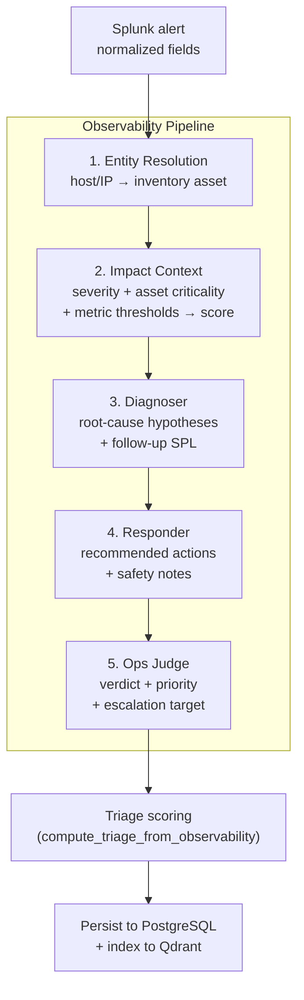
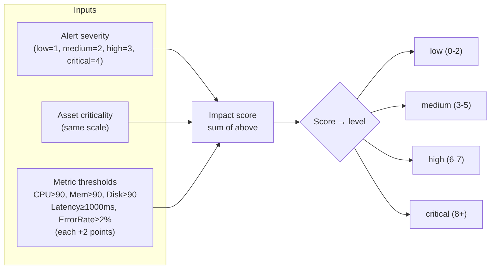
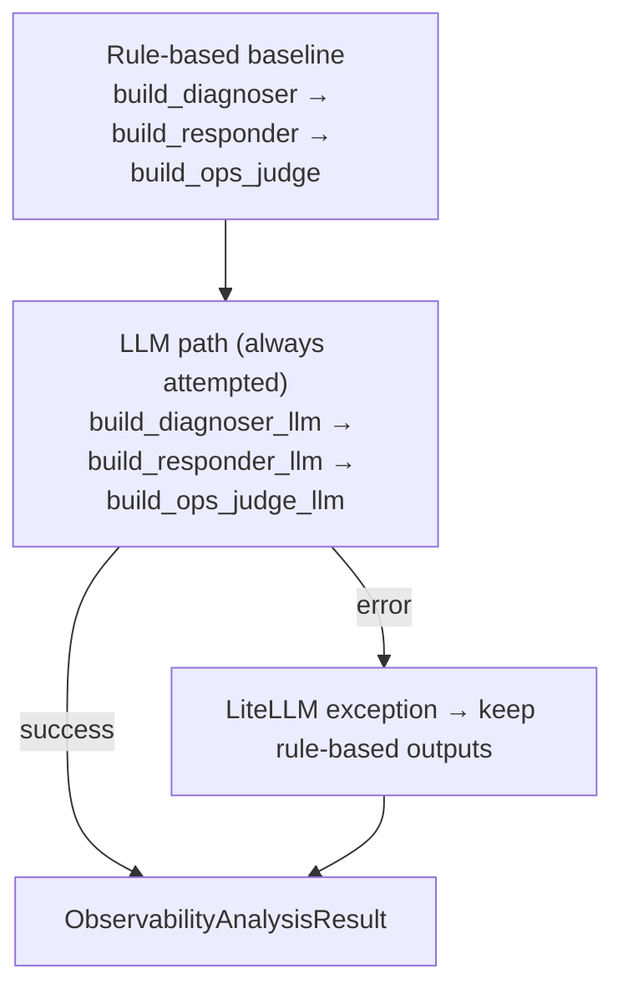

# Observability pipeline

The **Observability pipeline** is the operational-health analysis track, running when the Agentic Ops Router classifies an alert as `observability`. It mirrors the Security pipeline's multi-stage architecture but is purpose-built for infrastructure and service health signals — CPU, memory, disk, latency, error rate, and status codes.

**Related:** [04-agents-and-pipelines.md](./04-agents-and-pipelines.md) (router and Security pipeline) · [08-triage-priority-layer.md](./08-triage-priority-layer.md) (triage scoring) · [14-inventory-service.md](./14-inventory-service.md) (enrichment)

---

## Architecture



---

## 1. Pipeline stages

### 1.1 Entity resolution

Resolves the alert's `host` / `service` fields to an inventory asset.

| Step | Logic |
|------|-------|
| Try inventory enrichment | `enrich_from_inventory(normalized, users, assets, relationships)` |
| Match by hostname or IP | If enrichment misses, scan `tsoc_assets` for matching `hostname` or `ip` |
| Output | `EntityResolution(resolved_host, resolved_service, resolved_asset_id, confidence, notes)` |

Confidence: `high`/`medium` when asset found, `low` when no match.

### 1.2 Impact context

Computes a numeric **impact score** from alert severity, asset criticality, and metric thresholds.



Output: `ImpactContext(impact_level, affected_entities, customer_impact, business_criticality, time_window)`

### 1.3 Diagnoser

Generates **root-cause hypotheses** with confidence levels and suggested follow-up SPL searches.

**Rule-based triggers:**

| Condition | Hypothesis | Confidence |
|-----------|-----------|------------|
| `cpu ≥ 90` | CPU saturation causing degradation | medium |
| `memory ≥ 90` | Memory pressure impacting stability | medium |
| `disk ≥ 90` | Disk capacity causing write failures | medium |
| `latency_ms ≥ 1000` | Elevated application latency | medium/high |
| `status_code ≥ 500` | Server-side error responses | medium |
| No triggers | Insufficient evidence | low |

**LLM mode:** The Diagnoser calls LiteLLM with the observability system prompt and full context (normalized fields, entity resolution, impact, evidence refs). The LLM returns structured JSON with richer hypotheses and targeted SPL; on failure, deterministic fallbacks apply.

**Follow-up searches:** Auto-generated SPL for the alert's host/service:
- Metric correlation: `index=* earliest=-30m host="..." (cpu OR memory OR disk OR latency_ms OR error_rate)`
- Error scan: `index=* earliest=-30m host="..." (status>=500 OR timeout OR unavailable)`

### 1.4 Responder

Plans **recommended operational actions** and **safety notes** based on impact level and diagnosis.

| Impact | Actions |
|--------|---------|
| high/critical | Validate metrics → correlate logs → check deployments → **prepare escalation** → apply remediation after confirmation |
| low/medium | Validate metrics → correlate logs → check deployments → **continue monitoring**, collect evidence |

Safety notes always include:
- Do not perform disruptive actions before validating impact on critical transactions
- Prefer reversible actions first; document each step with timestamp

### 1.5 Ops Judge (verdict)

Final operational verdict derived from the top diagnosis hypothesis and impact context.

| Verdict | When |
|---------|------|
| `probable_resource_saturation` | Hypothesis mentions CPU, memory, or disk |
| `probable_service_degradation` | Hypothesis mentions latency or degradation |
| `probable_dependency_issue` | Hypothesis mentions dependency |
| `needs_more_evidence` | Default / insufficient evidence |

**Priority mapping:** Directly from impact level (`medium` → `medium`, `high` → `high`, `critical` → `critical`).

**Escalation target:** `service owner` by default; `critical service owner + on-call lead` when business criticality is `critical`.

---

## 2. LLM vs rule-based execution



Each LLM stage:
1. Loads its system prompt (`prompt_observability_diagnoser_system.md`, etc.)
2. Sends context JSON as user message
3. Parses structured JSON response
4. Falls back to rule-based on any LLM failure

---

## 3. Data models

### `ObservabilityAnalysisResult`

```
track: "observability"
summary: str
entity_resolution: EntityResolution
impact_context: ImpactContext
diagnoser: DiagnoserSection
responder: ResponderSection
ops_judge: OpsJudgeVerdict
evidence_refs: List[str]
triage: Optional[TriageOutcome]
```

### Key sub-models

| Model | Fields |
|-------|--------|
| `EntityResolution` | `resolved_host`, `resolved_service`, `resolved_asset_id`, `confidence` (high/medium/low), `notes` |
| `ImpactContext` | `impact_level` (low/medium/high/critical), `affected_entities`, `customer_impact`, `business_criticality`, `time_window` |
| `RootCauseHypothesis` | `hypothesis`, `confidence` (high/medium/low), `evidence_refs`, `what_would_confirm` |
| `DiagnoserSection` | `root_cause_hypotheses: List[RootCauseHypothesis]`, `followup_searches: List[str]` |
| `ResponderSection` | `recommended_actions: List[str]`, `safety_notes: List[str]` |
| `OpsJudgeVerdict` | `verdict`, `priority`, `recommended_next_step`, `confidence`, `rationale`, `escalation_target` |

---

## 4. API

### `POST /api/v1/observability/run`

Run observability analysis on a single alert row.

**Request:** `ObservabilityRunRequest` — `normalized`, `search_name`, `sid`, `row_index`, `splunk_results`, optional `enrichment`/`users`/`assets`/`relationships`.

**Response:** `ObservabilityAnalysisResult`

### `POST /api/v1/observability/run-by-sid`

Batch mode: fetch full Splunk job results by `sid`, then run analysis on each row.

---

## 5. Persistence

After analysis:
1. **PostgreSQL** — `persist_observability_analysis_to_splunk` saves the result as `tsoc_record_type = observability_analysis`
2. **Qdrant** — `upsert_observability_document` indexes the analysis for SOC chat RAG retrieval

---

## 6. Security vs Observability comparison

| Aspect | Security pipeline | Observability pipeline |
|--------|------------------|----------------------|
| Stages | Defender → Hunter → Judge | Entity → Impact → Diagnoser → Responder → Ops Judge |
| Focus | Threat detection, IOCs, MITRE ATT&CK | Infrastructure health, resource saturation, service degradation |
| Input signals | Users, IPs, hashes, domains | CPU, memory, disk, latency, error rate, status codes |
| Verdicts | TRUE_POSITIVE / FALSE_POSITIVE / NEEDS_HUMAN_REVIEW | probable_resource_saturation / service_degradation / dependency_issue / needs_more_evidence |
| Investigation SPL | Full MCP + SAIA pipeline | Follow-up searches (simpler) |
| Escalation | Next step recommendation | Explicit escalation target (service owner / on-call lead) |

---

## 7. Code map

| Path | Role |
|------|------|
| `backend/services/observability_analysis/runner.py` | Pipeline orchestrator (`run_observability_analysis`) |
| `backend/services/observability_analysis/entity.py` | Entity resolution (host → asset) |
| `backend/services/observability_analysis/impact.py` | Impact scoring |
| `backend/services/observability_analysis/diagnoser.py` | Rule-based root-cause hypotheses |
| `backend/services/observability_analysis/responder.py` | Operational response planning |
| `backend/services/observability_analysis/judge.py` | Final verdict and priority |
| `backend/services/observability_analysis/llm.py` | LLM-powered stage alternatives |
| `backend/services/observability_analysis/observability_prompts.py` | Prompt template loader |
| `backend/services/observability_analysis/observability_analysis_batch.py` | Batch-by-sid mode |
| `backend/models/observability.py` | Pydantic data models |
| `backend/api/routes/observability.py` | HTTP endpoints |
