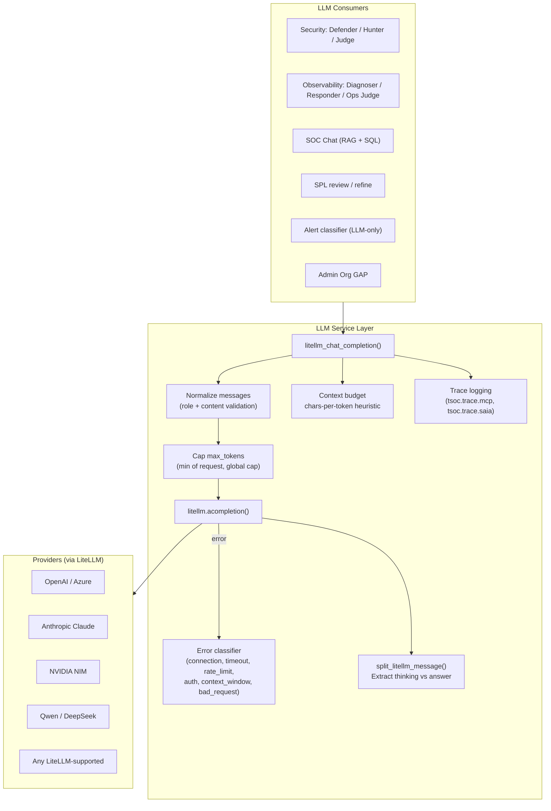
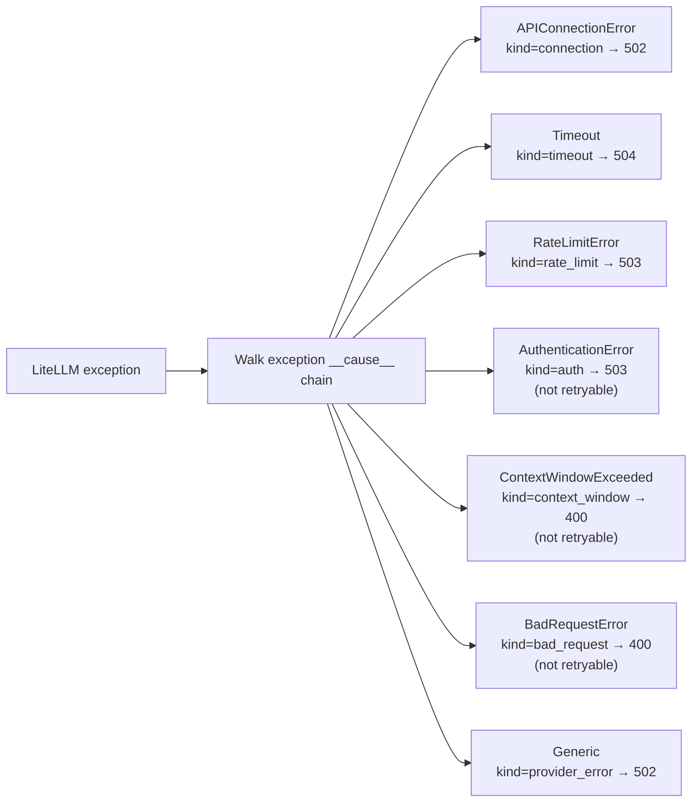

# LLM service layer

The **LLM service layer** is the single integration point between all ThinkingSOC LLM consumers (pipelines, chat, SQL, SPL review) and any upstream LLM provider. It wraps **LiteLLM** with error classification, token budget management, thinking-content extraction, and trace logging.

**Related:** [04-agents-and-pipelines.md](./04-agents-and-pipelines.md) (pipelines) · [10-soc-vector-rag.md](./10-soc-vector-rag.md) (chat) · [11-environment-configuration.md](./11-environment-configuration.md) (env vars)

---

## Architecture



---

## 1. Core function: `litellm_chat_completion`

Single async entry point for all LLM calls.

**Signature:**

```python
async def litellm_chat_completion(
    settings: Settings,
    messages: List[Dict[str, Any]],
    *,
    model: Optional[str] = None,        # override LITELLM_MODEL
    temperature: Optional[float] = None,
    max_tokens: Optional[int] = None,   # capped by LITELLM_MAX_TOKENS
    extra_body: Optional[Dict] = None,  # provider-specific params
) -> Dict[str, Any]
```

**Return shape:**

| Key | Type | Description |
|-----|------|-------------|
| `content` | `str` | Final answer (thinking stripped) |
| `thinking` | `str \| None` | Extracted reasoning/thinking content |
| `raw_content` | `str` | Original unprocessed content |
| `model` | `str` | Model id used |
| `finish_reason` | `str` | `stop`, `length`, etc. |
| `usage` | `dict \| None` | `prompt_tokens`, `completion_tokens`, `total_tokens` |

---

## 2. Error classification

All LiteLLM/provider exceptions are mapped to `LiteLLMProviderError` with a stable `kind` and HTTP status.



Heuristic fallback: if no typed exception matches, scan the combined error text for `"connection"`, `"timeout"`, etc.

---

## 3. Thinking content extraction

Handles extended thinking / chain-of-thought from multiple model families. The `split_litellm_message` function separates reasoning from the final answer.

**Supported formats:**

| Model family | Format | How detected |
|-------------|--------|-------------|
| **Anthropic Claude** | `message.thinking_blocks` (type: `thinking` / `redacted_thinking`) + `provider_specific_fields` | Structured blocks in response |
| **Anthropic Claude** | `message.reasoning_content` or `message.reasoning` | String attribute |
| **DeepSeek / Qwen** | `` backtick-wrapped think blocks `` | Regex extraction |
| **Qwen3** | Answer follows closing `` tag | String partition |
| **Generic** | `<thinking>...</thinking>` XML tags | Regex extraction |
| **Budget** | `<budget:thinking>...</budget:thinking>` tags | Regex extraction |
| **Redacted** | `<redacted_thinking>...</redacted_thinking>` | Regex extraction |

All thinking content is collected, concatenated, and returned separately from the answer. The answer text has all thinking tags stripped.

---

## 4. Context budget system

Token-aware prompt sizing based on `TSOC_LLM_CONTEXT_TOKENS` (default 128k).

| Function | What it calculates |
|----------|-------------------|
| `context_input_char_budget(settings)` | Max input chars = `(context_tokens - 8192 reserved) × 3.5 chars/token` |
| `schema_prompt_max_chars(settings)` | CIM schema block = 45% of input budget (capped by `TSOC_CIM_SCHEMA_PROMPT_MAX_CHARS`) |
| `alert_context_max_chars(settings)` | Alert JSON in SPL prompts = 12% of input budget (capped by `TSOC_SPL_ALERT_CONTEXT_MAX_CHARS`) |
| `saia_aux_context_max_chars(settings)` | SAIA additional context = min(alert budget, 64k) |
| `saia_mcp_prompt_max_chars(settings)` | SAIA MCP prompt field = min(1000, config) — Splunk hard limit |
| `clamp_text(text, max_chars)` | Truncate text to budget |

**Heuristic:** 3.5 chars per token (conservative for JSON + SPL mixed content).

---

## 5. Trace logging

Two dedicated loggers for full request/response capture:

| Logger | Env var | Content |
|--------|---------|---------|
| `tsoc.trace.mcp` | `TSOC_MCP_TRACE_LOG=true` | Full MCP JSON-RPC requests/responses |
| `tsoc.trace.saia` | `TSOC_SAIA_TRACE_LOG=true` | Full SAIA tool request/response |

Optional file output via `TSOC_TRACE_LOG_FILE`.

---

## 6. API endpoints

### `GET /api/v1/llm/status`

Returns current LLM configuration status (model, provider, configured state).

### `POST /api/v1/llm/chat`

Direct LLM proxy endpoint for ad-hoc completions. Used by the frontend for non-RAG direct LLM interactions.

---

## 7. Configuration

| Variable | Default | Description |
|----------|---------|-------------|
| `LITELLM_MODEL` | `gpt-4o-mini` | Model id (LiteLLM format) |
| `LITELLM_API_KEY` | — | Unified API key |
| `LITELLM_API_BASE` | — | Custom API base (NIM, Azure, etc.) |
| `LITELLM_TIMEOUT_SECONDS` | `120` | HTTP timeout per request |
| `LITELLM_RPM` | `30` | Process-local requests-per-minute guard |
| `LITELLM_MAX_RETRIES` | `3` | Retries for transient failures after the initial attempt |
| `LITELLM_RETRY_BASE_SECONDS` | `5` | Initial exponential-backoff delay |
| `LITELLM_RETRY_MAX_SECONDS` | `60` | Retry-delay cap |
| `LITELLM_MAX_TOKENS` | `131072` | Global completion token cap |
| `TSOC_LLM_CONTEXT_TOKENS` | `131072` | Effective context window for budget calc |
| `LITELLM_ANALYSIS_MAX_TOKENS` | `8192` | Structured analysis JSON cap |
| `LITELLM_ANALYSIS_TEMPERATURE` | `0.2` | Analysis stage temperature |

Full reference: [11-environment-configuration.md](./11-environment-configuration.md)

---

## 8. Code map

| Path | Role |
|------|------|
| `backend/services/llm/litellm_service.py` | `litellm_chat_completion`, error classification, message normalization |
| `backend/services/llm/llm_context_budget.py` | Token budget functions |
| `backend/services/llm/thinking_content.py` | `split_thinking_and_answer`, `split_litellm_message` |
| `backend/services/llm/full_trace_log.py` | MCP/SAIA trace logger setup |
| `backend/api/routes/llm.py` | `/llm/status`, `/llm/chat` endpoints |
