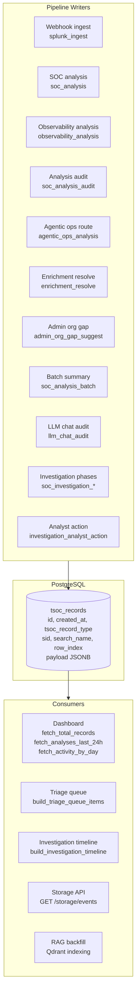

# Storage and persistence layer

The **storage layer** persists all pipeline outputs, audit trails, and analyst actions in **PostgreSQL** using the `tsoc_records` JSONB table. It provides the data foundation for the dashboard, triage queue, investigation timeline, SOC chat, and RAG indexing.

**Related:** [16-dashboard.md](./16-dashboard.md) (dashboard queries) · [08-triage-priority-layer.md](./08-triage-priority-layer.md) (triage queue) · [20-investigation-workflow.md](./20-investigation-workflow.md) (timeline) · [10-soc-vector-rag.md](./10-soc-vector-rag.md) (RAG indexing)

---

## Architecture



---

## 1. Schema

### `tsoc_records` (core table)

```sql
CREATE TABLE IF NOT EXISTS tsoc_records (
    id          BIGSERIAL    PRIMARY KEY,
    created_at  TIMESTAMPTZ  NOT NULL DEFAULT now(),
    tsoc_record_type TEXT    NOT NULL,
    sid         TEXT         NULL,
    search_name TEXT         NULL,
    row_index   INTEGER      NULL,
    payload     JSONB        NOT NULL
);
```

**Indexes:**

| Index | Columns | Purpose |
|-------|---------|---------|
| `idx_tsoc_records_type_created` | `(tsoc_record_type, created_at DESC)` | Dashboard aggregations, type-filtered queries |
| `idx_tsoc_records_sid_created` | `(sid, created_at DESC)` | Lookup all records for a Splunk search job |
| `idx_tsoc_records_sid_row_created` | `(sid, row_index, created_at DESC)` | Per-row investigation timeline |

### Related tables (managed elsewhere)

| Table | Managed by | Doc |
|-------|-----------|-----|
| `tsoc_users`, `tsoc_assets`, `tsoc_relationships` | Inventory service | [14](./14-inventory-service.md) |
| `tsoc_chat_conversations`, `tsoc_chat_messages` | SOC chat | [10](./10-soc-vector-rag.md) |
| `tsoc_rag_documents` | RAG metadata | [10](./10-soc-vector-rag.md) |
| `graph_findings` | Correlation | [12](./12-correlation-graph-service.md) |

---

## 2. Record types

Every row in `tsoc_records` has a `tsoc_record_type` that identifies its origin.

| Record type | Written by | Description |
|-------------|-----------|-------------|
| `splunk_ingest` | `persist_splunk_ingest_summary` | Webhook receive: normalized fields, enrichment, ingest metadata |
| `agentic_ops_analysis` | `persist_agentic_ops_route_to_splunk` | Router classification result (track, pipeline, confidence) |
| `enrichment_resolve` | `persist_enrichment_to_splunk` | Identity resolution: resolved user/asset, confidence |
| `soc_analysis` | `persist_soc_analysis_to_splunk` | Full Security pipeline result: Defender, Hunter, Judge, investigation SPL |
| `observability_analysis` | `persist_observability_analysis_to_splunk` | Full Observability pipeline result: entity, impact, diagnoser, responder, ops judge |
| `soc_analysis_audit` | `persist_soc_analysis_audit` | Metadata audit: timing, tokens, model, errors |
| `soc_analysis_batch` | `persist_analysis_batch_summary_to_splunk` | Batch-by-sid summary (rows processed, timing) |
| `admin_org_gap_suggest` | `persist_admin_org_gap_to_splunk` | Organizational knowledge gap suggestions |
| `llm_chat_audit` | `persist_llm_chat_audit_to_splunk` | Ad-hoc LLM chat usage audit |
| `soc_investigation_*` | `persist_soc_investigation_phases` | Investigation SPL phases (raw_alert, questions, spl, results) |
| `investigation_analyst_action` | `record_analyst_action` | Human acknowledge/escalate decision |

---

## 3. Write path

All writes go through `submit_hec_event`:

```python
async def submit_hec_event(settings, event: Dict) -> bool
```

1. Check `splunk_store_configured` (returns `False` if `TSOC_POSTGRES_DSN` not set)
2. Ensure pool initialized (`init_store` on first call)
3. `INSERT INTO tsoc_records (tsoc_record_type, sid, search_name, row_index, payload) VALUES (...)`
4. Return `True` on success, `False` + log warning on failure

Each persist helper (e.g., `persist_soc_analysis_to_splunk`) assembles the `event` dict with the appropriate `tsoc_record_type` and structured payload, then calls `submit_hec_event`.

---

## 4. Read path

### Query functions

| Function | Returns | Used by |
|----------|---------|---------|
| `search_stored_events(sid, record_type, row_index, limit, order)` | `List[Dict]` — filtered records | Storage API, investigation timeline |
| `get_stored_event_by_id(record_id)` | `Optional[Dict]` — single record by PK | Storage API, investigation detail |

### Aggregation functions (dashboard stats)

| Function | SQL | Used by |
|----------|-----|---------|
| `fetch_total_records` | `COUNT(*) FROM tsoc_records` | Dashboard KPI |
| `fetch_analyses_last_24h` | `COUNT(*) WHERE created_at >= NOW()-24h AND type IN (soc_analysis, observability_analysis)` | Dashboard KPI |
| `fetch_records_last_24h` | `COUNT(*) WHERE created_at >= NOW()-24h` | Dashboard |
| `fetch_record_counts_by_type` | `GROUP BY tsoc_record_type` | Dashboard bar chart |
| `fetch_activity_by_day(days)` | 14-day `generate_series` with security/observability/correlation/other buckets | Dashboard timeline |
| `fetch_inventory_counts` | `COUNT(*) FROM tsoc_users`, `tsoc_assets` | Dashboard KPI |

---

## 5. API endpoints

### `GET /api/v1/storage/events`

Search stored records with optional filters.

| Parameter | Type | Description |
|-----------|------|-------------|
| `sid` | `str?` | Filter by Splunk search job id |
| `record_type` | `str?` | Filter by `tsoc_record_type` |
| `row_index` | `int?` | Filter by Splunk result row index |
| `limit` | `int` | Max results (1–500, default 50) |

**Response:** `{ postgres_configured, count, results: [...] }`

### `GET /api/v1/storage/events/{record_id}`

Fetch a single record by PostgreSQL primary key.

**Response:** Full record with `id`, `created_at`, `tsoc_record_type`, `sid`, `search_name`, `row_index`, `payload`.

---

## 6. Pool management

| Function | Description |
|----------|-------------|
| `init_store(settings)` | Create asyncpg pool, bootstrap schema, restore demo snapshot or CSV seed, ensure relationships |
| `ensure_pool(settings)` | Return pool (init if needed); raise if not configured |
| `close_store()` | Close pool (app shutdown) |
| `splunk_store_configured(settings)` | `True` if `TSOC_POSTGRES_DSN` is set |

Pool config: `min_size=1`, `max_size=10`. JSONB codec registered on each connection for transparent `dict ↔ jsonb` conversion.

---

## 7. Configuration

| Variable | Required | Description |
|----------|----------|-------------|
| `TSOC_POSTGRES_DSN` | Yes | PostgreSQL connection string |

Without `TSOC_POSTGRES_DSN`, all persist functions return `False` / empty results; the dashboard returns `503`.

---

## 8. Code map

| Path | Role |
|------|------|
| `backend/services/splunk_json_store/pg.py` | Pool init, schema bootstrap, `submit_hec_event` |
| `backend/services/splunk_json_store/persist.py` | Per-type persist helpers (12 functions) |
| `backend/services/splunk_json_store/query.py` | `search_stored_events`, `get_stored_event_by_id` |
| `backend/services/splunk_json_store/stats.py` | Dashboard aggregation queries |
| `backend/services/splunk_json_store/__init__.py` | Re-exports all public functions |
| `backend/api/routes/storage.py` | `/storage/events` HTTP endpoints |
| `backend/db/schema.sql` | Full PostgreSQL schema reference |
