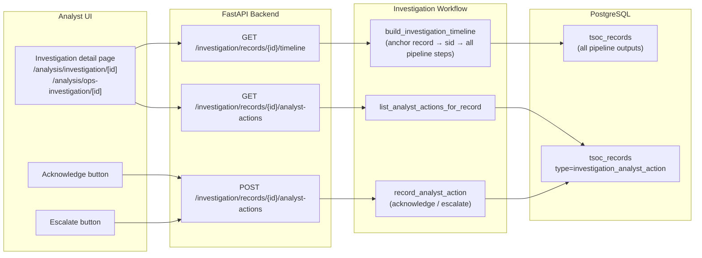
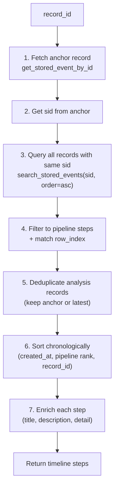

# Investigation workflow and analyst actions

The **investigation workflow** provides the human-in-the-loop layer for SOC analysts. It reconstructs a chronological **timeline** of every pipeline step for a given alert (from ingest to verdict to analyst decision) and supports **acknowledge/escalate** actions that are persisted alongside the automated analysis.

**Related:** [04-agents-and-pipelines.md](./04-agents-and-pipelines.md) (pipelines) · [08-triage-priority-layer.md](./08-triage-priority-layer.md) (triage queue) · [13-cim-investigation-spl-mcp.md](./13-cim-investigation-spl-mcp.md) (investigation SPL) · [19-storage-persistence.md](./19-storage-persistence.md) (storage)

---

## Architecture



---

## 1. Investigation timeline

The timeline reconstructs every pipeline step for a single alert, identified by its PostgreSQL `record_id`.

### How it works



### Pipeline step types included

| Record type | Timeline title | Rank |
|-------------|---------------|------|
| `splunk_ingest` | Splunk ingest | 10 |
| `agentic_ops_analysis` | Classification | 20 |
| `soc_analysis` | SOC analysis | 40 |
| `observability_analysis` | Observability analysis | 40 |
| `admin_org_gap_suggest` | Admin org gap | 50 |
| `investigation_analyst_action` | Analyst decision | 60 |

### Excluded from timeline

| Record type | Why excluded |
|-------------|-------------|
| `soc_analysis_audit` | Internal audit metadata, not a pipeline step |
| `enrichment_resolve` | Sub-step of ingest, not shown separately |
| `llm_chat_audit` | Chat usage audit, unrelated to alert pipeline |
| `soc_investigation_*` | Investigation SPL phases (shown in investigation detail, not timeline) |

### Step detail extraction

Each timeline step includes a `detail` field extracted from the record payload:

| Step | Detail content |
|------|---------------|
| Splunk ingest | Host + user from normalized fields |
| Classification | Track + recommended pipeline |
| SOC/Obs analysis | Verdict + triage priority and score |
| Analyst decision | Action type + analyst note (truncated to 120 chars) |

### Timeline response

```json
{
  "record_id": 42,
  "found": true,
  "sid": "1716840000.123",
  "search_name": "My Alert",
  "row_index": 0,
  "postgres_configured": true,
  "steps": [
    {
      "record_id": 38,
      "record_type": "splunk_ingest",
      "title": "Splunk ingest",
      "description": "Alert received via webhook and normalized",
      "detail": "Fields: web-srv-01, jdoe",
      "created_at": "2025-05-27T00:01:00+00:00",
      "is_current_record": false,
      "is_analyst_action": false
    }
  ]
}
```

---

## 2. Analyst actions

Analysts can record two types of decisions on any investigation record.

### Action types

| Action | Meaning |
|--------|---------|
| `acknowledge` | Analyst has reviewed the alert and accepts the automated verdict |
| `escalate` | Analyst disagrees with the verdict or requires further investigation / team attention |

### Payload persisted

```json
{
  "tsoc_record_type": "investigation_analyst_action",
  "sid": "...",
  "search_name": "...",
  "row_index": 0,
  "investigation_record_id": 42,
  "action": "acknowledge",
  "note": "Confirmed FP after checking source IP reputation",
  "analyst": "analyst",
  "recommended_step_at_action": "Review source IP activity in the last 24h",
  "recorded_at": "2025-05-27T01:15:00+00:00"
}
```

The `recommended_step_at_action` is automatically extracted from the analysis record's Judge verdict (`recommended_next_step`) or triage report (`recommended_action`), preserving what the system recommended at the time the analyst acted.

---

## 3. API endpoints

**Auth:** all three routes use `check_ingest_bearer` — when `TSOC_INGEST_TOKEN` is set in `backend/.env`, requests need `Authorization: Bearer <token>`. The Next.js UI proxy adds this automatically after login.

### `GET /api/v1/investigation/records/{record_id}/timeline`

Chronological pipeline steps for the alert linked to this storage record.

| Code | When |
|------|------|
| `200` | Timeline returned |
| `404` | Record not found |
| `503` | PostgreSQL not configured |

### `GET /api/v1/investigation/records/{record_id}/analyst-actions`

List all analyst acknowledge/escalate entries for this record (newest first, max 20).

**Response:** `{ record_id, count, results: [...] }`

### `POST /api/v1/investigation/records/{record_id}/analyst-actions`

Record a new analyst decision.

**Request body:**

| Field | Type | Required | Description |
|-------|------|----------|-------------|
| `action` | `"acknowledge" \| "escalate"` | Yes | Decision type |
| `note` | `str` | No | Free-text analyst note (max 2000 chars) |
| `analyst` | `str` | No | Analyst identifier (max 128 chars, defaults to "analyst") |

**Response:** `{ record_id, saved, latest, results }` — includes the saved event and updated action list.

---

## 4. Frontend pages

### Security investigation: `/analysis/investigation/[id]`

Full investigation detail for a Security pipeline analysis. Shows:
- Alert metadata (search name, sid, timestamp)
- Analysis result (Defender, Hunter, Judge sections)
- Investigation SPL questions and results
- Investigation timeline (sidebar)
- Acknowledge/Escalate buttons

### Observability investigation: `/analysis/ops-investigation/[id]`

Full investigation detail for an Observability pipeline analysis. Shows:
- Alert metadata
- Entity resolution and impact context
- Diagnoser hypotheses, Responder actions, Ops Judge verdict
- Investigation timeline (sidebar)
- Acknowledge/Escalate buttons

---

## 5. Code map

| Path | Role |
|------|------|
| `backend/services/investigation/investigation_workflow.py` | `build_investigation_timeline`, `record_analyst_action`, `list_analyst_actions_for_record` |
| `backend/api/routes/investigation.py` | HTTP endpoints + `AnalystActionBody` model |
| `frontend/app/(app)/analysis/investigation/[id]/page.tsx` | Security investigation UI page |
| `frontend/app/(app)/analysis/ops-investigation/[id]/page.tsx` | Observability investigation UI page |
