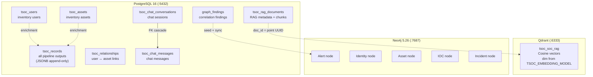
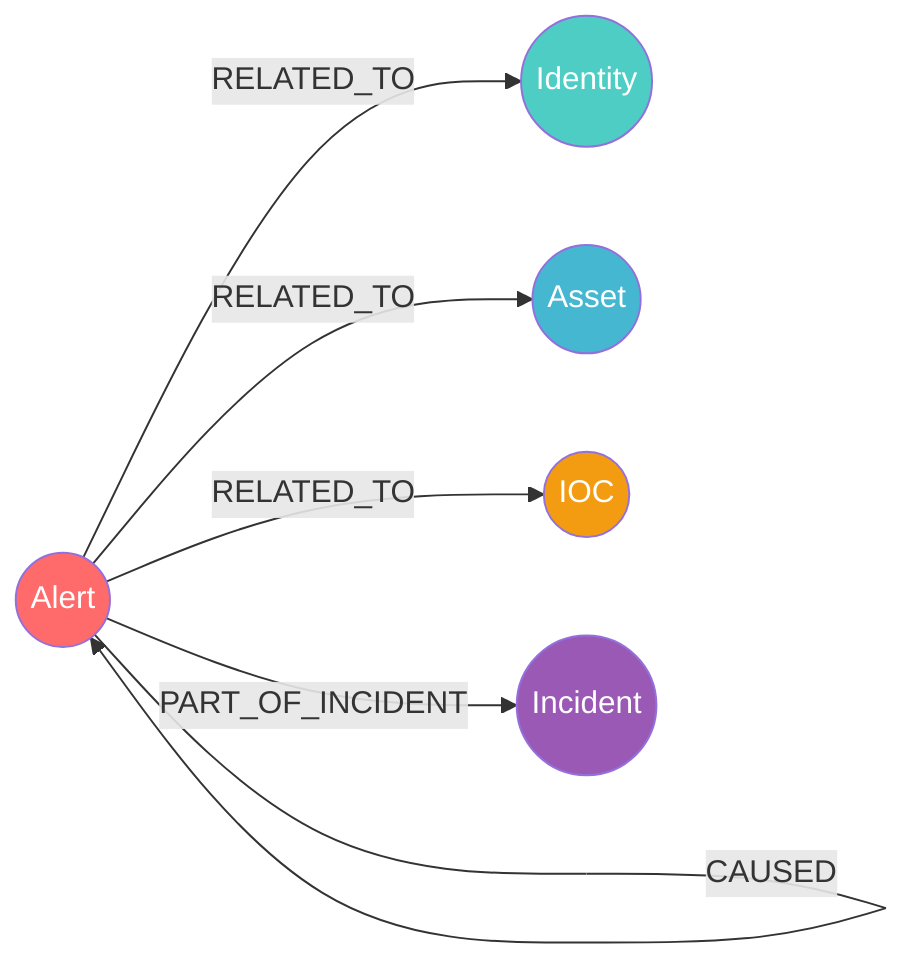
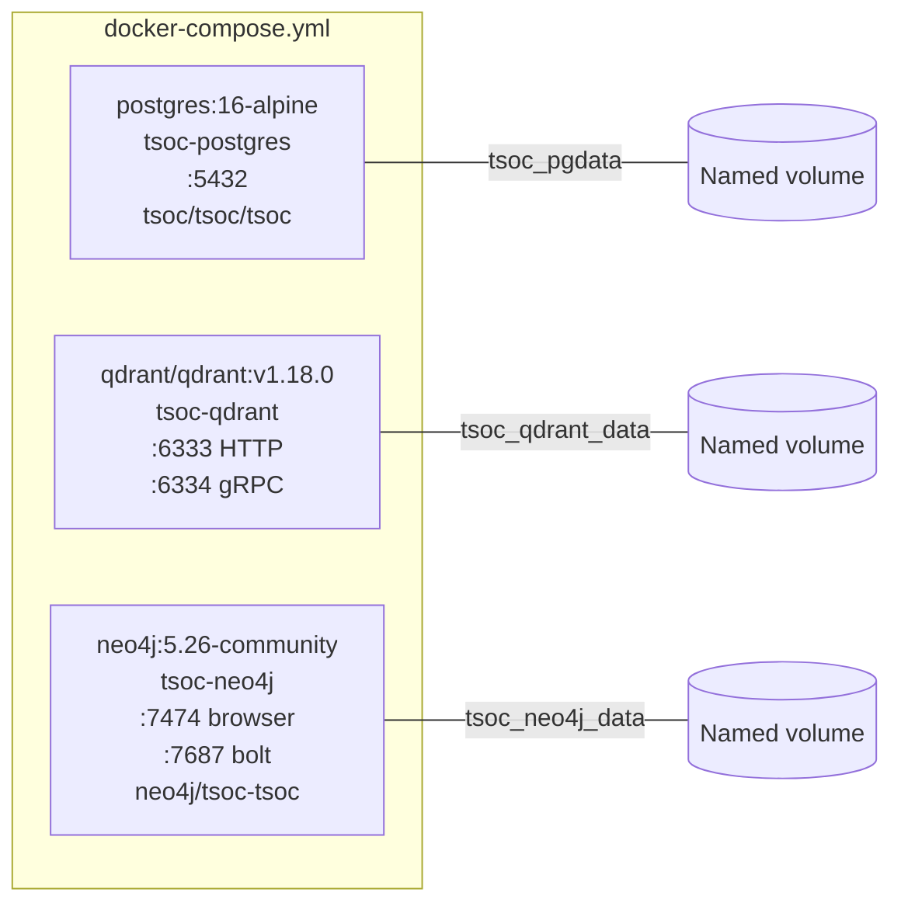
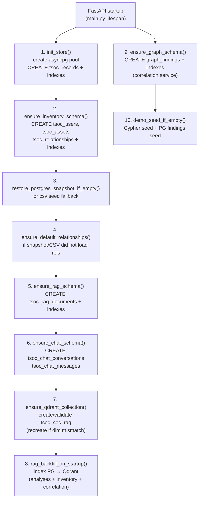

# Database schema

ThinkingSOC uses **three data stores** — PostgreSQL (relational + JSONB), Qdrant (vector embeddings), and Neo4j (graph). This document covers every table, collection, node type, index, and initialization flow.

**Related:** [19-storage-persistence.md](./19-storage-persistence.md) (write/read paths) · [10-soc-vector-rag.md](./10-soc-vector-rag.md) (RAG) · [12-correlation-graph-service.md](./12-correlation-graph-service.md) (correlation) · [14-inventory-service.md](./14-inventory-service.md) (inventory)

---

## Data store overview



---

## 1. PostgreSQL tables

### 1.1 `tsoc_records`

Append-only store for all pipeline outputs. Every ingest, analysis, audit, and analyst action is a row.

```sql
CREATE TABLE IF NOT EXISTS tsoc_records (
    id              BIGSERIAL    PRIMARY KEY,
    created_at      TIMESTAMPTZ  NOT NULL DEFAULT now(),
    tsoc_record_type TEXT        NOT NULL,
    sid             TEXT         NULL,
    search_name     TEXT         NULL,
    row_index       INTEGER      NULL,
    payload         JSONB        NOT NULL
);
```

| Column | Description |
|--------|-------------|
| `id` | Auto-increment primary key |
| `created_at` | Insert timestamp (UTC) |
| `tsoc_record_type` | Discriminator — see record types below |
| `sid` | Splunk search job ID (links all records for one alert) |
| `search_name` | Splunk saved search / alert name |
| `row_index` | Which result row in the Splunk job (0-based; per-row ingest uses `0` with a single-row slice) |
| `sid` | Storage id; multi-row jobs use `{splunk_job_sid}-{n}` suffix (`n` 1-based) when analyzed per row |
| `payload` | Full structured JSON — schema varies by record type |

**Record types:**

| `tsoc_record_type` | Content |
|--------------------|---------|
| `splunk_ingest` | Normalized webhook payload + enrichment |
| `agentic_ops_analysis` | Router classification (track, pipeline, confidence) |
| `enrichment_resolve` | Identity resolution result |
| `soc_analysis` | Full Security pipeline output (Defender/Hunter/Judge) |
| `observability_analysis` | Full Observability pipeline output |
| `soc_analysis_audit` | Pipeline timing, tokens, model metadata |
| `soc_analysis_batch` | Batch-by-sid summary |
| `admin_org_gap_suggest` | Organizational knowledge gap suggestions |
| `llm_chat_audit` | Ad-hoc LLM chat usage audit |
| `soc_investigation_*` | Investigation SPL phases (raw_alert, questions, spl, results) |
| `investigation_analyst_action` | Human acknowledge / escalate decision |

**Indexes:**

| Index | Columns | Used by |
|-------|---------|---------|
| `idx_tsoc_records_type_created` | `(tsoc_record_type, created_at DESC)` | Dashboard aggregations |
| `idx_tsoc_records_sid_created` | `(sid, created_at DESC)` | Lookup by search job |
| `idx_tsoc_records_sid_row_created` | `(sid, row_index, created_at DESC)` | Investigation timeline (per-row) |

---

### 1.2 `tsoc_users`

Inventory users (CMDB-style).

```sql
CREATE TABLE IF NOT EXISTS tsoc_users (
    user_id       TEXT         PRIMARY KEY,
    display_name  TEXT,
    email         TEXT,
    department    TEXT,
    risk_score    INTEGER      NOT NULL DEFAULT 0,
    description   TEXT,
    updated_at    TIMESTAMPTZ  NOT NULL DEFAULT now()
);
```

---

### 1.3 `tsoc_assets`

Inventory assets (servers, endpoints, network devices).

```sql
CREATE TABLE IF NOT EXISTS tsoc_assets (
    asset_id      TEXT         PRIMARY KEY,
    asset_type    TEXT         NOT NULL,
    hostname      TEXT,
    fqdn          TEXT,
    ip            TEXT,
    owner         TEXT,
    criticality   TEXT         NOT NULL DEFAULT 'medium',
    risk_score    INTEGER      NOT NULL DEFAULT 0,
    description   TEXT,
    updated_at    TIMESTAMPTZ  NOT NULL DEFAULT now()
);
```

---

### 1.4 `tsoc_relationships`

User-to-asset links for enrichment cross-referencing.

```sql
CREATE TABLE IF NOT EXISTS tsoc_relationships (
    relationship_id TEXT        PRIMARY KEY,
    user_id         TEXT        NOT NULL,
    asset_id        TEXT        NOT NULL,
    description     TEXT,
    updated_at      TIMESTAMPTZ NOT NULL DEFAULT now(),
    UNIQUE (user_id, asset_id)
);
```

| Index | Columns |
|-------|---------|
| `idx_tsoc_relationships_user` | `(user_id)` |
| `idx_tsoc_relationships_asset` | `(asset_id)` |

---

### 1.5 `tsoc_rag_documents`

RAG metadata — each row is a document chunk that may have a corresponding vector in Qdrant.

```sql
CREATE TABLE IF NOT EXISTS tsoc_rag_documents (
    doc_id        TEXT         PRIMARY KEY,
    doc_type      TEXT         NOT NULL,
    sid           TEXT         NULL,
    search_name   TEXT         NULL,
    row_index     INTEGER      NOT NULL DEFAULT 0,
    essential     JSONB        NOT NULL DEFAULT '{}'::jsonb,
    summary_line  TEXT         NOT NULL DEFAULT '',
    chunk_text    TEXT         NOT NULL DEFAULT '',
    metadata      JSONB        NOT NULL DEFAULT '{}'::jsonb,
    created_at    TIMESTAMPTZ  NOT NULL DEFAULT now(),
    updated_at    TIMESTAMPTZ  NOT NULL DEFAULT now()
);
```

**`doc_type` values:** `splunk_alert`, `soc_analysis`, `observability_analysis`, `inventory_user`, `inventory_asset`, `inventory_relationship`, `correlation_finding`, `correlation_alert`, `correlation_attack_path`, `chat_message`

| Index | Columns |
|-------|---------|
| `idx_tsoc_rag_docs_sid` | `(sid)` |
| `idx_tsoc_rag_docs_type_updated` | `(doc_type, updated_at DESC)` |
| `idx_tsoc_rag_docs_search` | `(search_name)` |

---

### 1.6 `tsoc_chat_conversations`

Chat session headers for SOC Chat.

```sql
CREATE TABLE IF NOT EXISTS tsoc_chat_conversations (
    conversation_id TEXT        PRIMARY KEY,
    title           TEXT        NOT NULL DEFAULT 'New chat',
    created_at      TIMESTAMPTZ NOT NULL DEFAULT now(),
    updated_at      TIMESTAMPTZ NOT NULL DEFAULT now()
);
```

| Index | Columns |
|-------|---------|
| `idx_tsoc_chat_conv_updated` | `(updated_at DESC)` |

---

### 1.7 `tsoc_chat_messages`

Individual chat messages. Foreign key to `tsoc_chat_conversations` with cascade delete.

```sql
CREATE TABLE IF NOT EXISTS tsoc_chat_messages (
    message_id      BIGSERIAL   PRIMARY KEY,
    conversation_id TEXT        NOT NULL
        REFERENCES tsoc_chat_conversations(conversation_id) ON DELETE CASCADE,
    role            TEXT        NOT NULL,
    content         TEXT        NOT NULL,
    seq             INTEGER     NOT NULL,
    metadata        JSONB       NOT NULL DEFAULT '{}'::jsonb,
    created_at      TIMESTAMPTZ NOT NULL DEFAULT now(),
    UNIQUE (conversation_id, seq)
);
```

| Index | Columns |
|-------|---------|
| `idx_tsoc_chat_msg_conv_seq` | `(conversation_id, seq)` |

---

### 1.8 `graph_findings`

Correlation findings from Smart Attack Discovery.

```sql
CREATE TABLE IF NOT EXISTS graph_findings (
    id                        UUID         PRIMARY KEY,
    finding_type              VARCHAR(64)  NOT NULL,
    title                     TEXT         NOT NULL,
    summary                   TEXT         NOT NULL,
    details                   JSONB        NOT NULL DEFAULT '{}'::jsonb,
    risk_score                INTEGER      NOT NULL DEFAULT 0,
    status                    VARCHAR(32)  NOT NULL DEFAULT 'open',
    ticket_status             VARCHAR(32)  NOT NULL DEFAULT 'open',
    owner                     VARCHAR(128) NOT NULL DEFAULT 'unassigned',
    display_id                VARCHAR(32),
    agent_validation_status   VARCHAR(64),
    content_hash              VARCHAR(128),
    created_at                TIMESTAMPTZ  NOT NULL DEFAULT NOW(),
    updated_at                TIMESTAMPTZ  NOT NULL DEFAULT NOW()
);
```

| Index | Columns |
|-------|---------|
| `idx_graph_findings_type` | `(finding_type)` |
| `idx_graph_findings_risk` | `(risk_score DESC)` |
| `idx_graph_findings_content_hash` | `(content_hash)` |

---

## 2. Qdrant vector store

### Collection: `tsoc_soc_rag`

| Setting | Value |
|---------|-------|
| **Dimension** | From `TSOC_EMBEDDING_MODEL` at runtime (`384` / `768` / `1024` for BGE small/base/large) |
| **Distance** | `Cosine` |
| **Embedding model** | FastEmbed local ONNX — preset or full id in `backend/.env` ([doc 10](./10-soc-vector-rag.md#embedding-model-selection)) |
| **Point ID** | Deterministic UUID5 from `tsoc:{doc_id}` |

**Default model (`bge-large`):** `BAAI/bge-large-en-v1.5`, 1024-dim, ~1.2 GB download.

| `TSOC_EMBEDDING_MODEL` | Full id | Dim | Download |
|------------------------|---------|-----|----------|
| `bge-small` (`small`) | `BAAI/bge-small-en-v1.5` | 384 | ~33 MB |
| `bge-base` (`base`) | `BAAI/bge-base-en-v1.5` | 768 | ~220 MB |
| `bge-large` (`large`) | `BAAI/bge-large-en-v1.5` | 1024 | ~1.2 GB |

**Point payload fields:**

| Field | Type | Description |
|-------|------|-------------|
| `doc_id` | string | Matches `tsoc_rag_documents.doc_id` |
| `doc_type` | string | Document type (same as PG) |
| `sid` | string | Splunk job ID |
| `search_name` | string | Alert name |
| `row_index` | int | Result row index |
| `summary_line` | string | Summary (max 500 chars) |
| `chunk_text` | string | Full chunk (max 6000 chars) |
| `essential` | object | Key fields for context |
| `metadata` | object | Additional metadata |
| `updated_at` | float | Epoch timestamp |

The collection is auto-created at startup. If the existing dimension mismatches the configured model, it is recreated (then backfill).

---

## 3. Neo4j graph

### Node types



| Node label | Key property | Other properties |
|------------|-------------|-----------------|
| **Alert** | `alert_row_id` | `name`, `sid`, `search_name`, `status`, `risk_score`, `timestamp` |
| **Identity** | `primary_identifier` (e.g. `username:jdoe@corp.local`) | `name` |
| **Asset** | `primary_identifier` (e.g. `hostname:SERVER01`) | `name` |
| **IOC** | `primary_identifier` (e.g. `ipv4:203.0.113.50`) | `value`, `name` |
| **Incident** | `incident_id` | `title`, `status`, `created_at` |

### Entity ID conventions

| Prefix | Node label |
|--------|-----------|
| `username:` | Identity |
| `hostname:` | Asset |
| `ipv4:` / `domain:` | IOC |

### Relationship types

| Relationship | From → To | Properties |
|-------------|-----------|------------|
| `RELATED_TO` | Alert → Identity / Asset / IOC | _(none)_ |
| `PART_OF_INCIDENT` | Alert → Incident | _(none)_ |
| `CAUSED` | Alert → Alert | `confidence`, `time_delta_seconds` |

Nodes and relationships are created via `MERGE` (upsert) — no upfront DDL. Demo data seeded from `neo4j_demo_campaign.cypher`.

---

## 4. Docker Compose



All containers: `restart: unless-stopped`, with healthchecks.

---

## 5. Schema initialization flow



Demo snapshot details: [24-demo-postgresql-data.md](./24-demo-postgresql-data.md).

---

## 6. Complete index reference

| # | Index | Table | Columns |
|---|-------|-------|---------|
| 1 | `idx_tsoc_records_type_created` | `tsoc_records` | `(tsoc_record_type, created_at DESC)` |
| 2 | `idx_tsoc_records_sid_created` | `tsoc_records` | `(sid, created_at DESC)` |
| 3 | `idx_tsoc_records_sid_row_created` | `tsoc_records` | `(sid, row_index, created_at DESC)` |
| 4 | `idx_tsoc_relationships_user` | `tsoc_relationships` | `(user_id)` |
| 5 | `idx_tsoc_relationships_asset` | `tsoc_relationships` | `(asset_id)` |
| 6 | `idx_tsoc_rag_docs_sid` | `tsoc_rag_documents` | `(sid)` |
| 7 | `idx_tsoc_rag_docs_type_updated` | `tsoc_rag_documents` | `(doc_type, updated_at DESC)` |
| 8 | `idx_tsoc_rag_docs_search` | `tsoc_rag_documents` | `(search_name)` |
| 9 | `idx_tsoc_chat_conv_updated` | `tsoc_chat_conversations` | `(updated_at DESC)` |
| 10 | `idx_tsoc_chat_msg_conv_seq` | `tsoc_chat_messages` | `(conversation_id, seq)` |
| 11 | `idx_graph_findings_type` | `graph_findings` | `(finding_type)` |
| 12 | `idx_graph_findings_risk` | `graph_findings` | `(risk_score DESC)` |
| 13 | `idx_graph_findings_content_hash` | `graph_findings` | `(content_hash)` |

---

## 7. Table-to-service mapping

| Table | Managing service | Doc |
|-------|-----------------|-----|
| `tsoc_records` | `splunk_json_store/pg.py` | [19](./19-storage-persistence.md) |
| `tsoc_users` | `inventory/` | [14](./14-inventory-service.md) |
| `tsoc_assets` | `inventory/` | [14](./14-inventory-service.md) |
| `tsoc_relationships` | `inventory/` | [14](./14-inventory-service.md) |
| `tsoc_rag_documents` | `soc_rag/pg_store.py` | [10](./10-soc-vector-rag.md) |
| `tsoc_chat_conversations` | `soc_rag/chat_store.py` | [10](./10-soc-vector-rag.md) |
| `tsoc_chat_messages` | `soc_rag/chat_store.py` | [10](./10-soc-vector-rag.md) |
| `graph_findings` | `correlation/graph_crud/` | [12](./12-correlation-graph-service.md) |
| Qdrant `tsoc_soc_rag` | `soc_rag/qdrant_store.py` | [10](./10-soc-vector-rag.md) |
| Neo4j nodes | `correlation/graph_crud/` | [12](./12-correlation-graph-service.md) |
