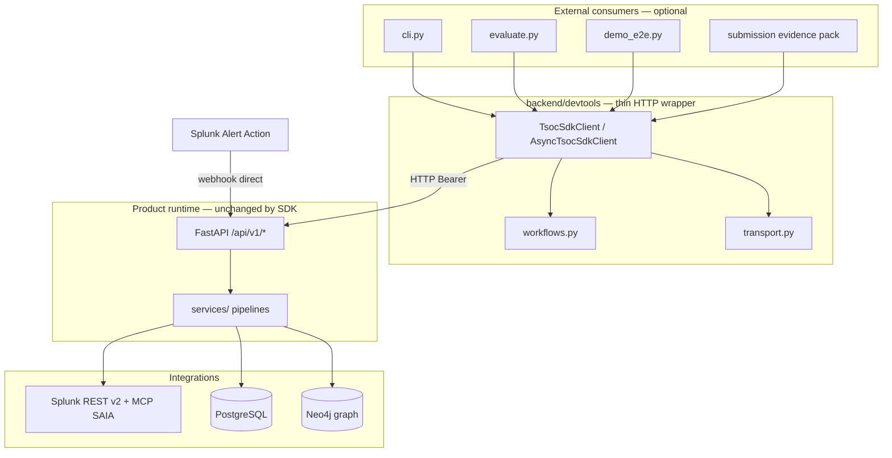
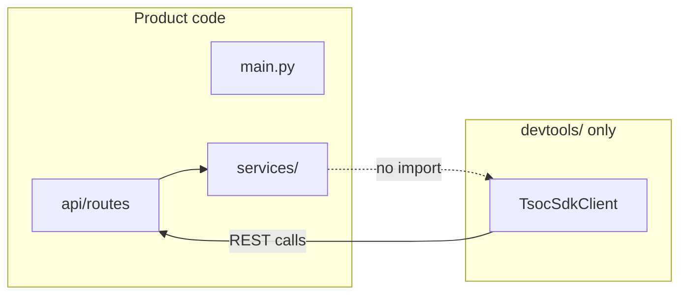
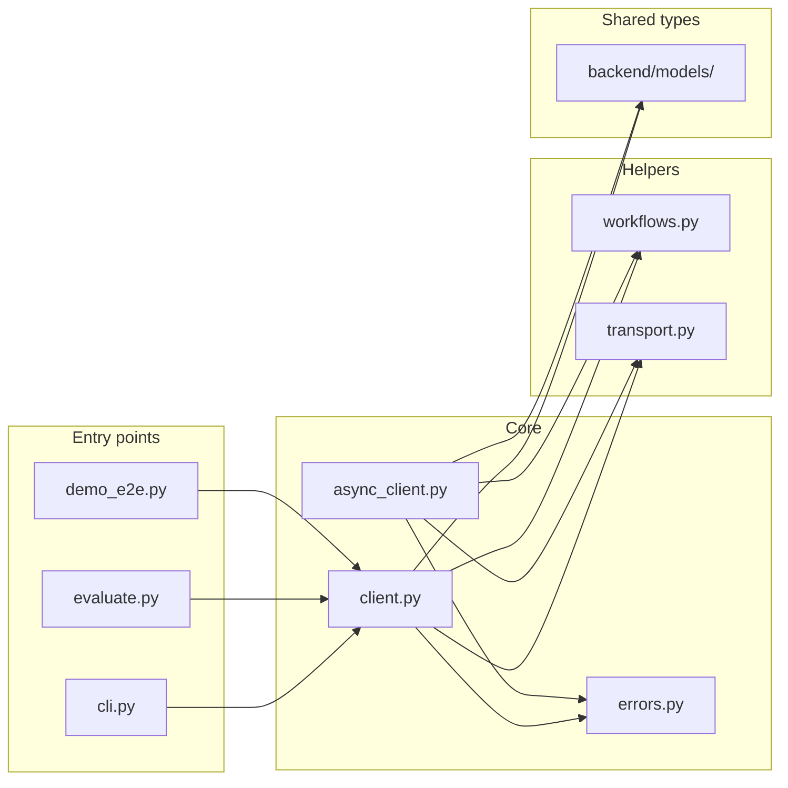
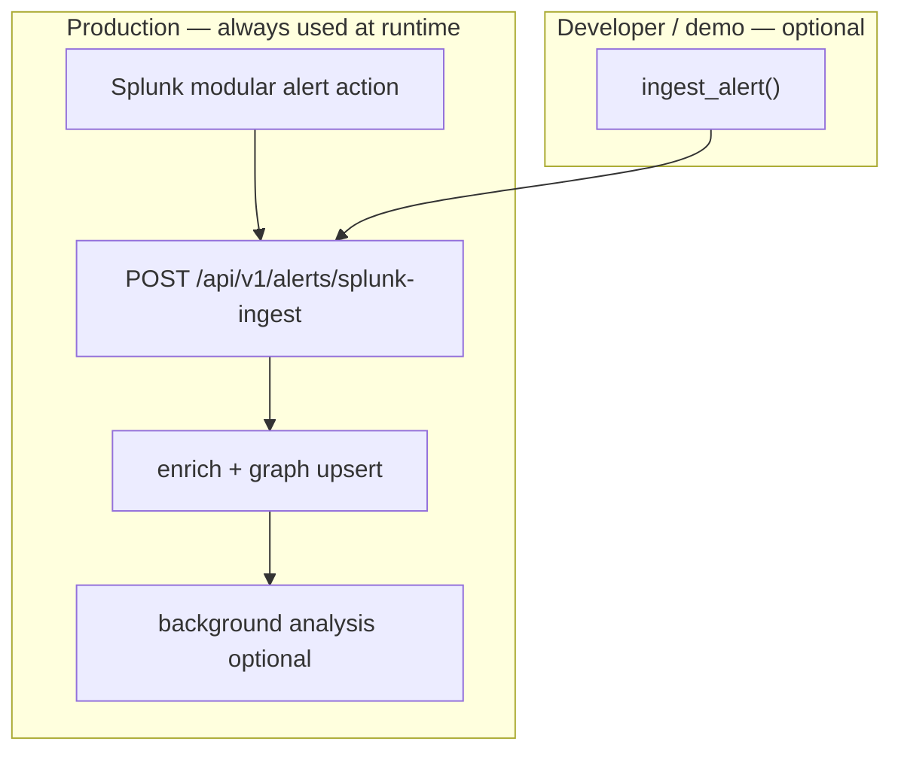
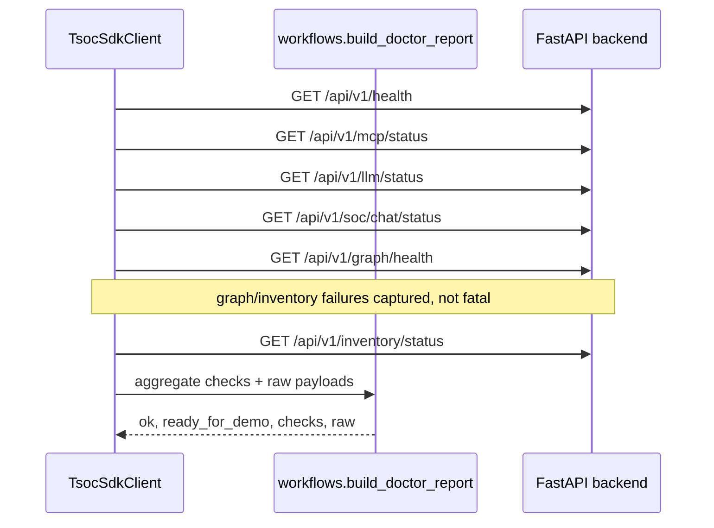
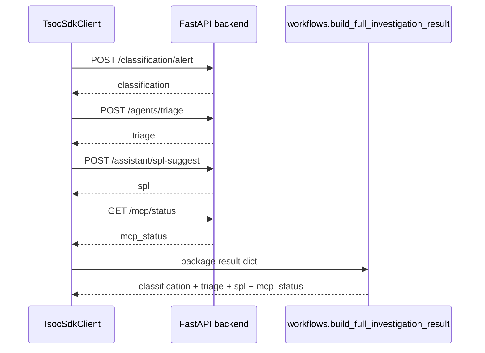
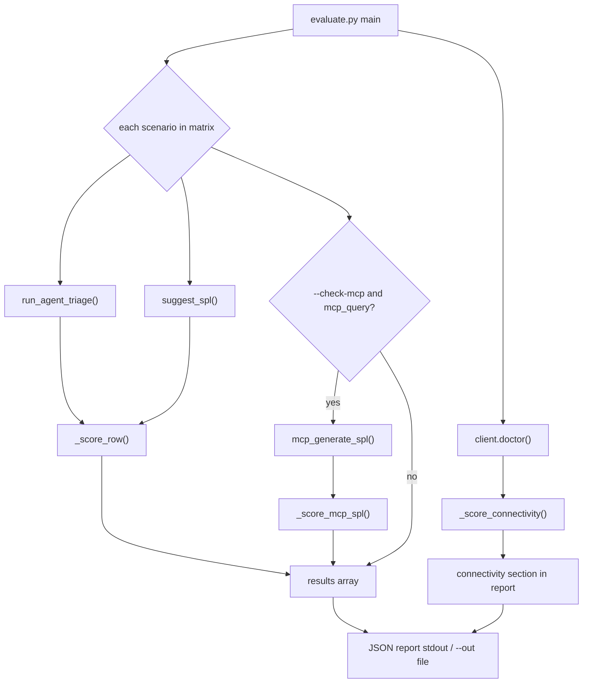
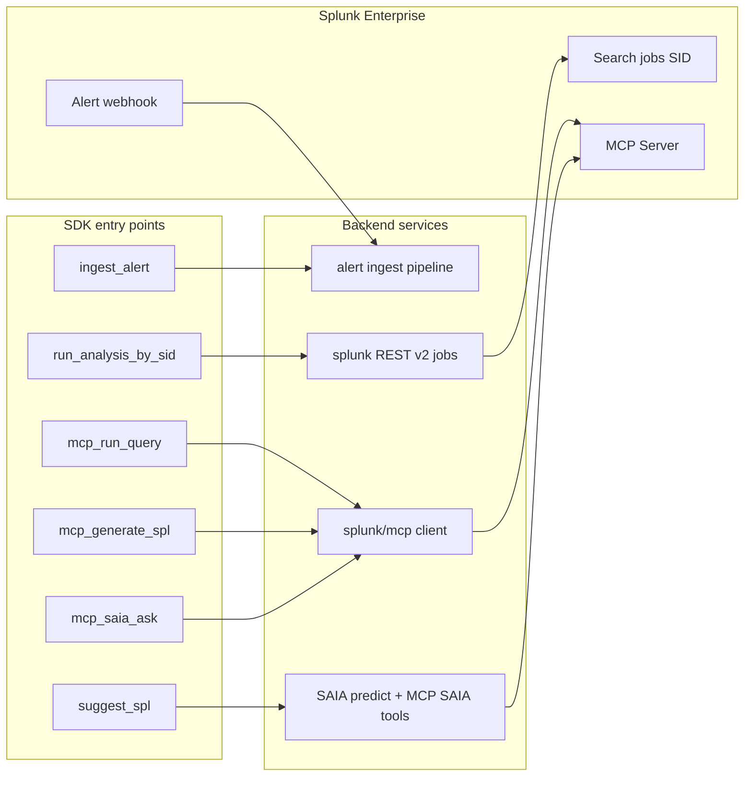

# Developer SDK & CLI

Typed Python SDK, CLI, and evaluation runner for programmatic access to the ThinkingSOC backend. Designed for integrators, CI pipelines, and demo evidence generation.

**Location:** [`backend/devtools/`](../backend/devtools/)

---

## Overview

| Component | File | Purpose |
|-----------|------|---------|
| Sync client | `client.py` | `TsocSdkClient` — blocking HTTP calls with retry |
| Async client | `async_client.py` | `AsyncTsocSdkClient` — `asyncio`-native variant |
| CLI | `cli.py` | Command-line wrapper for all SDK methods |
| Workflows | `workflows.py` | Shared helpers (`doctor` report, full investigation packaging) |
| Transport | `transport.py` | Shared HTTP helpers (list GET, PATCH, DELETE) |
| Evaluation runner | `evaluate.py` | Score agent outputs against a scenario matrix |
| Exceptions | `errors.py` | Typed error hierarchy (`TsocAuthError`, `TsocApiError`, …) |
| Examples | `examples/` | Ready-to-use JSON payloads for each endpoint |

### Architecture position

The SDK is an **external HTTP client**. Product code (`services/`, `api/`, agents) **does not import** `devtools` — only tests, CLI, demos, and evidence scripts do.



**Dependency rule:** SDK → `models/` (types) + HTTP. **Never** `services/` → SDK.



The SDK wraps the same REST endpoints that the analyst UI uses, with **direct access** to Splunk MCP SAIA, MCP tool invocation, and Splunk REST job analysis. It enables external automation, CI testing, and evidence pack generation without the frontend.

### SDK module map



---

## Installation

From the repository root (no separate package install needed):

```bash
cd backend
source .venv/bin/activate
```

Optional — make `devtools` importable from anywhere:

```bash
cd backend/devtools
pip install -e .
```

**Dependencies:** `httpx >= 0.27`, `pydantic >= 2.0` (already in `backend/requirements.txt`).

---

## Authentication

All mutating endpoints accept an optional Bearer token.

```python
client = TsocSdkClient(ingest_token="your-token")
```

Token resolution order:

1. Explicit `ingest_token` parameter
2. `TSOC_INGEST_TOKEN` environment variable
3. No token (requests sent without `Authorization` header)

The token must match the `TSOC_INGEST_TOKEN` configured in `backend/.env`.

**Admin endpoints** (`/integrations/settings`) accept `TSOC_ADMIN_TOKEN` when set; otherwise the same ingest token is used (backend fallback).

**Graph endpoints** (`/api/v1/graph/*`) may require `TSOC_CORRELATION_BEARER_TOKEN` when configured in the correlation service.

---

## Complete method index

Every public backend API used in the hackathon demo is wrapped. Sync and async clients expose the same methods (`await` for async).

| Category | SDK method | HTTP |
|----------|------------|------|
| **Classification** | `classify_alert` | `POST /classification/alert` |
| **Analysis** | `route_analysis`, `run_analysis`, `run_analysis_by_sid` | `/analysis/*` |
| **Observability** | `run_observability`, `run_observability_by_sid` | `/observability/*` |
| **Agents** | `run_agent_triage`, `run_full_investigation` | `/agents/triage` + chain |
| **SPL** | `suggest_spl` | `/assistant/spl-suggest` |
| **Webhook** | `ingest_alert` | `POST /alerts/splunk-ingest` |
| **MCP** | `mcp_status`, `mcp_generate_spl`, `mcp_call_tool`, `mcp_run_query`, `mcp_saia_ask` | `/mcp/*` |
| **LLM** | `llm_status` | `GET /llm/status` |
| **Connectivity** | `doctor`, `health` | multi-endpoint helper |
| **SOC Chat** | `soc_chat`, `soc_chat_status`, `list_soc_chat_conversations`, `create_soc_chat_conversation`, `get_soc_chat_conversation`, `delete_soc_chat_conversation` | `/soc/chat/*` |
| **Investigation** | `investigation_timeline`, `analyst_actions`, `add_analyst_action` | `/investigation/*` |
| **Triage** | `triage_queue` | `GET /triage/queue` |
| **Storage** | `search_events`, `get_event` | `/storage/events` |
| **Dashboard** | `dashboard_overview` | `GET /dashboard/overview` |
| **Admin GAP** | `gap_suggest` | `POST /admin-org/gap-suggest` |
| **Inventory** | `inventory_status`, `list/create/get/update/delete_inventory_*`, `enrich_inventory` | `/inventory/*` |
| **Integrations** | `list/get/create/update/delete_integration` | `/integrations/settings` |
| **Graph** | `graph_health`, `graph_findings`, `graph_get_finding`, `graph_finding_graph_data`, `graph_topology`, `graph_attack_tree`, `graph_discover_attack_paths`, `graph_operation_status` | `/api/v1/graph/*` |

---

## SDK API reference

### Constructor parameters

| Parameter | Type | Default | Description |
|-----------|------|---------|-------------|
| `base_url` | `str` | `http://127.0.0.1:9876` | Backend base URL |
| `ingest_token` | `str \| None` | `None` | Bearer token (falls back to env) |
| `timeout_seconds` | `float` | `120.0` | Per-request HTTP timeout |
| `max_retries` | `int` | `2` | Retry count for transient failures |
| `retry_backoff_seconds` | `float` | `0.4` | Base backoff between retries (exponential) |

### Methods

#### `classify_alert(body) → AlertClassificationResult`

**Endpoint:** `POST /api/v1/classification/alert`

Classifies an alert into Security or Observability track.

**Input fields:**

| Field | Type | Required | Description |
|-------|------|----------|-------------|
| `normalized` | `dict` | Yes | Alert fields (`host`, `user`, `src`, `cpu`, etc.) |
| `search_name` | `str` | No | Splunk saved search name |
| `sid` | `str` | No | Splunk search job ID |

**Output fields:**

| Field | Type | Description |
|-------|------|-------------|
| `track` | `security \| observability \| unknown` | Detected track (exclusive — not `both`) |
| `recommended_pipeline` | `security \| observability \| manual_review` | Pipeline recommendation (not `dual`) |
| `confidence` | `float` (0–1) | Classification confidence |
| `reason` | `str` | Human-readable reasoning |
| `signals` | `list[str]` | Key signals detected |
| `classification_source` | `rules \| llm \| hybrid` | `llm` when LiteLLM classified; `rules` on manual_review fallback |

**Example:**

```python
from devtools import TsocSdkClient

client = TsocSdkClient(base_url="http://127.0.0.1:9876")
result = client.classify_alert({
    "normalized": {"host": "web-prod-01", "cpu": 95, "latency_ms": 1800},
    "search_name": "Host CPU spike with latency",
})
print(result.track, result.confidence)
# observability 0.92
```

---

#### `route_analysis(body) → AnalysisRouteResponse`

**Endpoint:** `POST /api/v1/analysis/route`

Classifies via LLM (full alert payload), runs **one** analysis pipeline (Security **or** Observability — never both), and returns full results.

**Input fields:**

| Field | Type | Required | Description |
|-------|------|----------|-------------|
| `normalized` | `dict` | Yes | Alert fields |
| `search_name` | `str` | No | Saved search name |
| `sid` | `str` | No | Splunk job ID |
| `row_index` | `int` | No | Which Splunk result row to analyze (default 0) |
| `splunk_results` | `list[dict]` | No | Pre-fetched Splunk job rows |
| `users` | `list[dict]` | No | Inventory user records for enrichment |
| `assets` | `list[dict]` | No | Inventory asset records for enrichment |
| `relationships` | `list[dict]` | No | Entity relationships |

**Key output fields:**

| Field | Type | Description |
|-------|------|-------------|
| `track` | `str` | Resolved track |
| `classification` | `AlertClassificationResult` | Full classification |
| `security_result` | `SocAnalysisResult \| null` | Set when track is `security` |
| `observability_result` | `ObservabilityAnalysisResult \| null` | Set when track is `observability` |
| `mcp_used` | `bool` | Whether Splunk MCP was used |

**Example:**

```python
result = client.route_analysis({
    "search_name": "Suspicious auth failed login alert",
    "normalized": {"host": "web-prod-01", "user": "jdoe", "src": "1.2.3.4"},
    "users": [{"user_id": "jdoe", "risk_score": "3", "department": "IT"}],
    "assets": [{"asset_id": "srv-web-01", "hostname": "web-prod-01", "criticality": "high"}],
})
print(result.track, result.mcp_used)
```

---

#### `run_agent_triage(body) → AgentTriageResponse`

**Endpoint:** `POST /api/v1/agents/triage`

Full agentic triage: classify → analyze → triage score → SPL suggestion → next actions.

**Input fields:**

| Field | Type | Required | Description |
|-------|------|----------|-------------|
| `normalized` | `dict` | Yes | Alert fields |
| `search_name` | `str` | No | Saved search name |
| `sid` | `str` | No | Splunk job ID |
| `operator_goal` | `str` | No | Analyst intent (e.g. "confirm lateral movement") |
| `users` | `list[dict]` | No | Inventory users |
| `assets` | `list[dict]` | No | Inventory assets |
| `relationships` | `list[dict]` | No | Entity relationships |

**Key output fields:**

| Field | Type | Description |
|-------|------|-------------|
| `track` | `str` | Resolved track |
| `classification` | `AlertClassificationResult` | Classification details |
| `agent_summary` | `str` | Human-readable triage summary |
| `next_actions` | `list[str]` | Recommended operator actions |
| `security_result` | `SocAnalysisResult \| null` | Security pipeline output |
| `observability_result` | `ObservabilityAnalysisResult \| null` | Observability pipeline output |
| `suggested_spl` | `SplAssistantSuggestResponse \| null` | Investigation SPL |
| `mcp_used` | `bool` | Whether Splunk MCP was used |
| `security_triage` | `TriageOutcome \| null` | Triage priority score (security) |
| `observability_triage` | `TriageOutcome \| null` | Triage priority score (observability) |

**Example:**

```python
result = client.run_agent_triage({
    "search_name": "Suspicious auth failed login alert",
    "operator_goal": "confirm lateral movement path",
    "normalized": {"host": "web-prod-01", "user": "jdoe", "src": "1.2.3.4"},
    "users": [{"user_id": "jdoe", "risk_score": "3"}],
    "assets": [{"asset_id": "srv-web-01", "hostname": "web-prod-01", "criticality": "high"}],
})
print(result.agent_summary)
print(result.next_actions)
```

---

#### `suggest_spl(body) → SplAssistantSuggestResponse`

**Endpoint:** `POST /api/v1/assistant/spl-suggest`

Generates analyst-ready SPL for the next investigation step. Uses SAIA REST `/predict` with optional MCP execute, falling back to LiteLLM or rule-based generation.

**Input fields:**

| Field | Type | Required | Description |
|-------|------|----------|-------------|
| `normalized` | `dict` | Yes | Alert fields |
| `search_name` | `str` | No | Saved search name |
| `sid` | `str` | No | Splunk job ID |
| `objective` | `str` | No | Analyst intent (e.g. "collect root cause timeline") |

**Output fields:**

| Field | Type | Description |
|-------|------|-------------|
| `source` | `str` | Generation method (`llm`, `rule_based`, `rest_predict`, `rest_predict_execute`, …) |
| `root_cause_spl` | `RootCauseSpl` | Generated SPL with metadata |
| `spl_results` | `SplSearchResult \| null` | MCP execute results (when available) |

**Example:**

```python
result = client.suggest_spl({
    "normalized": {"host": "web-prod-01", "user": "jdoe", "src": "1.2.3.4"},
    "search_name": "Suspicious auth activity",
    "objective": "collect root cause timeline",
})
print(result.source)              # "rest_predict" or "rule_based"
print(result.root_cause_spl.spl)  # "search index=... | ..."
```

---

#### `mcp_status() → dict`

**Endpoint:** `GET /api/v1/mcp/status`

Checks Splunk MCP Server connectivity. Does not require an ingest token.

**Output fields:**

| Field | Type | Description |
|-------|------|-------------|
| `configured` | `bool` | MCP settings present in config |
| `connected` | `bool` | MCP server reachable |
| `url` | `str \| null` | MCP server URL |
| `server_info` | `dict` | Server metadata (version, name, etc.) |
| `tools` | `list[str]` | Available MCP tool names |
| `saia_available` | `bool` | SAIA `/predict` available |
| `message` | `str \| null` | Status message or error detail |

**Example:**

```python
status = client.mcp_status()
print(status["configured"], status["connected"])
print(status["tools"])           # ["splunk_run_query", "splunk_get_indexes", ...]
print(status["saia_available"])  # True
```

---

#### `mcp_generate_spl(body) → McpSplGenerateResponse`

**Endpoint:** `POST /api/v1/mcp/spl-generate`

Generates SPL from a natural-language description using Splunk MCP Server SAIA (generate + optimize + explain pipeline).

**Input fields:**

| Field | Type | Required | Description |
|-------|------|----------|-------------|
| `query` | `str` | Yes | Natural-language description of the desired search |
| `index` | `str` | No | Target Splunk index |
| `context` | `str` | No | Additional alert/search context for the Assistant |

**Output fields:**

| Field | Type | Description |
|-------|------|-------------|
| `source` | `splunk_mcp_saia \| unavailable` | Whether SAIA generated the SPL |
| `spl` | `str \| null` | Generated SPL query |
| `explanation` | `str \| null` | Natural-language explanation of the SPL |

**Example:**

```python
result = client.mcp_generate_spl({
    "query": "Show failed login attempts for user jdoe in the last 24 hours",
    "index": "main",
})
print(result.source)       # "splunk_mcp_saia"
print(result.spl)          # "search index=main action=failure user=jdoe ..."
print(result.explanation)  # "This search finds all failed ..."
```

---

#### `mcp_call_tool(body) → McpToolCallResponse`

**Endpoint:** `POST /api/v1/mcp/tools/call`

Invokes any Splunk MCP Server tool by name. Available tools: `splunk_run_query`, `splunk_get_indexes`, `splunk_get_metadata`, `splunk_get_info`, `saia_generate_spl`, `saia_optimize_spl`, `saia_explain_spl`, `saia_ask_splunk_question`.

**Input fields:**

| Field | Type | Required | Description |
|-------|------|----------|-------------|
| `tool_name` | `str` | Yes | MCP tool name |
| `arguments` | `dict` | No | Tool-specific arguments |

**Output fields:**

| Field | Type | Description |
|-------|------|-------------|
| `tool_name` | `str` | Echoed tool name |
| `result` | `any` | Tool-specific result (rows, metadata, etc.) |

**Example:**

```python
# Run a Splunk query via MCP
result = client.mcp_call_tool({
    "tool_name": "splunk_run_query",
    "arguments": {"search_query": "search index=main host=web-prod-01 | stats count by user"},
})
print(result.result)

# List available indexes
indexes = client.mcp_call_tool({"tool_name": "splunk_get_indexes"})
print(indexes.result)
```

---

#### `mcp_run_query(search_query, *, extra_arguments=None) → McpToolCallResponse`

Convenience wrapper around `mcp_call_tool` for `splunk_run_query`.

```python
result = client.mcp_run_query(
    "search index=main host=web-prod-01 | stats count by user"
)
print(result.result)
```

---

#### `mcp_saia_ask(question, *, additional_context=None) → McpToolCallResponse`

Convenience wrapper for MCP `saia_ask_splunk_question` (Splunk AI Assistant Q&A).

```python
answer = client.mcp_saia_ask(
    "What indexes contain authentication events?",
    additional_context="Alert user=jdoe host=web-prod-01",
)
print(answer.result)
```

---

#### `ingest_alert(body) → dict`

**Endpoint:** `POST /api/v1/alerts/splunk-ingest`

Submits the same payload the Splunk modular alert action sends. Triggers enrichment, optional background analysis, graph upsert, and RAG indexing. **Requires Bearer token.**

**Input:** `SplunkAlertIngest` or dict — `sid`, `search_name`, `results`, `normalized`, etc.

**Output (202 when auto-analyze):**

| Field | Description |
|-------|-------------|
| `ok` | Request accepted |
| `status` | `"accepted"` when background job queued |
| `job_id` | Background task UUID |
| `sid` | Splunk job ID |
| `auto_analyze` | Whether analysis pipeline runs async |

**Example:**

```python
result = client.ingest_alert({
    "sid": "1749825600.12345",
    "search_name": "Suspicious auth failed login alert",
    "normalized": {"host": "web-prod-01", "user": "jdoe", "src": "1.2.3.4"},
    "results": [{"host": "web-prod-01", "user": "jdoe", "action": "failure"}],
})
print(result.get("job_id"), result.get("auto_analyze"))
```

Example payload: [`backend/devtools/examples/ingest.json`](../backend/devtools/examples/ingest.json)

**Production vs SDK path** — same endpoint, SDK is optional:



---

#### `llm_status() → dict`

**Endpoint:** `GET /api/v1/llm/status`

Returns LiteLLM configuration (model id, whether API key/base are set). **Never returns secret values.**

```python
status = client.llm_status()
print(status["litellm_model"], status["litellm_api_key_configured"])
```

---

#### `doctor() → dict`

Multi-endpoint connectivity check for demo/CI readiness. Calls `health`, `mcp_status`, `llm_status`, `soc_chat_status`, `graph_health`, and `inventory_status` (graph/inventory failures are captured, not fatal).

**Output fields:**

| Field | Description |
|-------|-------------|
| `ok` | Backend health is `"ok"` |
| `ready_for_demo` | Backend + MCP connected + LLM configured |
| `checks` | Per-subsystem booleans (`backend`, `mcp`, `llm`, `soc_chat`, `graph`, `inventory`) |
| `raw` | Full JSON from each underlying endpoint |

```python
report = client.doctor()
print(report["ready_for_demo"])
print(report["checks"]["mcp"]["saia_available"])
```

CLI equivalent: `python backend/devtools/cli.py doctor`



---

#### `run_full_investigation(body) → dict`

Helper that chains four SDK calls (no new backend endpoint):

1. `classify_alert`
2. `run_agent_triage`
3. `suggest_spl` (objective from `operator_goal`)
4. `mcp_status`

**Input:** Same shape as `run_agent_triage` (`normalized`, `search_name`, `operator_goal`, inventory fields, …).

**Output:**

```python
{
  "classification": { ... },
  "triage": { ... },
  "spl": { ... },
  "mcp_status": { ... }
}
```

```python
result = client.run_full_investigation({
    "search_name": "Suspicious auth failed login alert",
    "operator_goal": "confirm lateral movement path",
    "normalized": {"host": "web-prod-01", "user": "jdoe"},
    "users": [{"user_id": "jdoe", "risk_score": 3}],
})
print(result["classification"]["track"])
print(result["triage"]["agent_summary"])
```



---

#### `run_analysis(body) → SocAnalysisResult`

**Endpoint:** `POST /api/v1/analysis/run`

Runs the SOC security analysis pipeline directly (Defender + Hunter + Judge) without routing. Accepts an `AnalysisRunRequest` or dict.

**Input fields:**

| Field | Type | Required | Description |
|-------|------|----------|-------------|
| `normalized` | `dict` | Yes | Alert fields (`host`, `user`, `src`, etc.) |
| `search_name` | `str` | No | Splunk saved search name |
| `sid` | `str` | No | Splunk search job ID |
| `row_index` | `int` | No | Splunk result row (default 0) |
| `splunk_results` | `list[dict]` | No | Pre-fetched Splunk job rows |
| `enrichment` | `EnrichmentResult` | No | Pre-computed enrichment |
| `users` | `list[dict]` | No | Inventory users (inline) |
| `assets` | `list[dict]` | No | Inventory assets (inline) |

**Key output fields:**

| Field | Type | Description |
|-------|------|-------------|
| `defender` | `str` | Defender assessment narrative |
| `hunter` | `HunterSection` | Threat hunting findings |
| `judge` | `JudgeVerdict` | Final verdict with confidence |
| `investigation_questions` | `list[InvestigationQuestionItem]` | Follow-up questions with SPL |
| `enrichment` | `EnrichmentResult` | Asset identity enrichment |

**Example:**

```python
result = client.run_analysis({
    "normalized": {"host": "web-prod-01", "user": "jdoe", "src": "1.2.3.4"},
    "search_name": "Suspicious auth failed login",
})
print(result.judge.verdict, result.judge.confidence)
```

---

#### `run_analysis_by_sid(body) → AnalysisBatchBySidResponse`

**Endpoint:** `POST /api/v1/analysis/run-by-sid`

Fetches all Splunk job results for a given SID via Splunk REST API v2, then runs SOC analysis on each result row. Direct demonstration of Splunk REST integration.

**Input fields:**

| Field | Type | Required | Description |
|-------|------|----------|-------------|
| `sid` | `str` | Yes | Splunk search job ID |
| `search_name` | `str` | No | Saved search name |
| `normalized` | `dict` | No | Base fields merged with each row |
| `users` | `list[dict]` | No | Inventory users |
| `assets` | `list[dict]` | No | Inventory assets |

**Key output fields:**

| Field | Type | Description |
|-------|------|-------------|
| `sid` | `str` | Echoed job ID |
| `splunk_results_row_count` | `int` | Total rows from Splunk REST |
| `analyzed_row_count` | `int` | Rows analyzed |
| `rows` | `list[RowAnalysisOutcome]` | Per-row analysis results |

**Example:**

```python
result = client.run_analysis_by_sid({
    "sid": "1716800000.12345",
    "search_name": "Suspicious auth failed login alert",
    "users": [{"user_id": "jdoe", "risk_score": "3"}],
})
print(f"Analyzed {result.analyzed_row_count} of {result.splunk_results_row_count} rows")
for row in result.rows:
    print(row.row_index, row.track, row.classification.confidence)
```

---

#### `search_events(...) → dict`

**Endpoint:** `GET /api/v1/storage/events`

Queries stored analysis records from PostgreSQL.

**Parameters (all optional keyword args):**

| Parameter | Type | Description |
|-----------|------|-------------|
| `sid` | `str` | Filter by Splunk job ID |
| `record_type` | `str` | Filter by record type (`soc_analysis`, `observability_analysis`, etc.) |
| `row_index` | `int` | Filter by row index |
| `limit` | `int` | Max results |

**Example:**

```python
result = client.search_events(record_type="soc_analysis", limit=5)
print(f"Found {result['count']} records")
for r in result["results"]:
    print(r["id"], r["tsoc_record_type"])
```

---

#### `get_event(record_id) → dict`

**Endpoint:** `GET /api/v1/storage/events/{record_id}`

Fetches a single stored record by PostgreSQL primary key.

| Parameter | Type | Description |
|-----------|------|-------------|
| `record_id` | `int` | PostgreSQL row ID |

```python
event = client.get_event(42)
print(event["tsoc_record_type"], event["payload"])
```

---

#### `dashboard_overview() → DashboardOverview`

**Endpoint:** `GET /api/v1/dashboard/overview`

Returns SOC dashboard KPIs, triage statistics, activity timeline, and integration status.

**Key output fields:**

| Field | Type | Description |
|-------|------|-------------|
| `kpis.total_records` | `int` | Total stored records |
| `kpis.analyses_24h` | `int` | Analyses in last 24 hours |
| `health_score` | `int` | Integration readiness score (0–100, top-level field) |
| `track_split` | `TrackSplit` | Count by security / observability (legacy `both` may appear in old data) |
| `integrations` | `DashboardIntegrations` | `postgres`, `llm`, `mcp`, `neo4j` booleans |

**Example:**

```python
overview = client.dashboard_overview()
print(f"Health: {overview.health_score}%")
print(f"Postgres: {overview.integrations.postgres}")
print(f"MCP: {overview.integrations.mcp}")
```

---

#### `run_observability(body) → ObservabilityAnalysisResult`

**Endpoint:** `POST /api/v1/observability/run`

Runs the Observability analysis pipeline (Diagnoser + Responder + OpsJudge) without routing.

**Input fields:**

| Field | Type | Required | Description |
|-------|------|----------|-------------|
| `normalized` | `dict` | Yes | Alert fields (`host`, `service`, `cpu`, `latency_ms`, etc.) |
| `search_name` | `str` | No | Splunk saved search name |
| `sid` | `str` | No | Splunk search job ID |
| `row_index` | `int` | No | Splunk result row (default 0) |
| `splunk_results` | `list[dict]` | No | Pre-fetched Splunk job rows |
| `users` | `list[dict]` | No | Inventory users |
| `assets` | `list[dict]` | No | Inventory assets |

**Key output fields:**

| Field | Type | Description |
|-------|------|-------------|
| `diagnoser` | `DiagnoserSection` | Root cause hypotheses + follow-up searches |
| `responder` | `ResponderSection` | Recommended actions + safety notes |
| `ops_judge` | `OpsJudgeVerdict` | Final verdict, priority, confidence, rationale |
| `entity_resolution` | `EntityResolution` | Host/service/asset resolution |
| `impact_context` | `ImpactContext` | Business impact assessment |

**Example:**

```python
result = client.run_observability({
    "normalized": {"host": "web-prod-01", "cpu": 95, "latency_ms": 1800},
    "search_name": "Host CPU spike with latency",
})
print(result.ops_judge.verdict, result.ops_judge.priority)
```

---

#### `run_observability_by_sid(body) → ObservabilityBatchBySidResponse`

**Endpoint:** `POST /api/v1/observability/run-by-sid`

Fetches Splunk job results by SID via REST API v2, then runs Observability analysis on each row. Mirrors `run_analysis_by_sid` for the Observability pipeline.

**Input fields:**

| Field | Type | Required | Description |
|-------|------|----------|-------------|
| `sid` | `str` | Yes | Splunk search job ID |
| `search_name` | `str` | No | Saved search name |
| `normalized` | `dict` | No | Base fields merged with each row |
| `users` | `list[dict]` | No | Inventory users |
| `assets` | `list[dict]` | No | Inventory assets |
| `max_rows` | `int` | No | Max rows to analyze (default 100) |

**Example:**

```python
result = client.run_observability_by_sid({
    "sid": "1716800000.12345",
    "search_name": "Host CPU spike",
})
print(f"Analyzed {result.analyzed_row_count} observability rows")
```

---

#### `soc_chat(body) → SocChatResponse`

**Endpoint:** `POST /api/v1/soc/chat`

AI-powered investigation chat grounded in indexed Splunk alert and analysis data. Uses RAG (Retrieval-Augmented Generation) with PostgreSQL or Qdrant vector search for context.

**Input fields:**

| Field | Type | Required | Description |
|-------|------|----------|-------------|
| `messages` | `list[SocChatMessage]` | Yes | Chat messages (`role` + `content`) |
| `filters` | `SocChatFilters` | No | Filter by SID, record type, etc. |
| `conversation_id` | `str` | No | Continue an existing conversation |

**Key output fields:**

| Field | Type | Description |
|-------|------|-------------|
| `answer` | `str` | AI-generated answer grounded in analysis data |
| `citations` | `list[SocChatCitation]` | Source records cited in the answer |
| `splunk_mcp_used` | `bool` | Whether MCP was used for live data |
| `retrieval_backend` | `str` | `postgres` or `qdrant` |
| `conversation_id` | `str \| null` | Conversation ID for follow-ups |

**Example:**

```python
result = client.soc_chat({
    "messages": [
        {"role": "user", "content": "What are the most critical security findings today?"},
    ],
})
print(result.answer)
print(f"Citations: {len(result.citations)}, Backend: {result.retrieval_backend}")
```

---

#### `soc_chat_status() → dict`

**Endpoint:** `GET /api/v1/soc/chat/status`

RAG backend status: Postgres, Qdrant vector store, document count, active embedding model (`embedding_model`, `embedding_dim`).

```python
status = client.soc_chat_status()
print(status["enabled"], status["document_count"])
print(status["default_retrieval"])  # "qdrant" or "postgres"
print(status.get("embedding_model"), status.get("embedding_dim"))
```

---

print(status.get("embedding_model"), status.get("embedding_dim"))
```

---

#### SOC Chat session methods

| Method | Endpoint |
|--------|----------|
| `list_soc_chat_conversations(limit=100)` | `GET /soc/chat/conversations` |
| `create_soc_chat_conversation(body)` | `POST /soc/chat/conversations` |
| `get_soc_chat_conversation(conversation_id)` | `GET /soc/chat/conversations/{id}` |
| `delete_soc_chat_conversation(conversation_id)` | `DELETE /soc/chat/conversations/{id}` |

```python
conversations = client.list_soc_chat_conversations(limit=20)
new_chat = client.create_soc_chat_conversation({"title": "Failed login investigation"})
detail = client.get_soc_chat_conversation(new_chat.id)

# Continue conversation in soc_chat()
reply = client.soc_chat({
    "conversation_id": new_chat.id,
    "messages": [{"role": "user", "content": "Summarize jdoe activity"}],
})
client.delete_soc_chat_conversation(new_chat.id)
```

---

#### `gap_suggest(body) → AdminOrgGapSuggestResponse`

**Endpoint:** `POST /api/v1/admin-org/gap-suggest`

Detects organizational knowledge gaps and proposes **one question** for an administrator (LiteLLM or rule fallback).

**Input fields:** `normalized`, `sid`, `search_name`, optional SOC excerpts (`defender_text`, `hunter_text`, `judge_verdict`, `inventory_user`, …).

**Output fields:** `should_suggest_question`, `gap_summary`, `question_for_admin`, `notes`.

Example payload: [`gap_suggest.json`](../backend/devtools/examples/gap_suggest.json)

```python
gap = client.gap_suggest({
    "normalized": {"user": "jdoe", "host": "web-prod-01"},
    "judge_verdict": "true_positive",
})
if gap.should_suggest_question:
    print(gap.question_for_admin)
```

---

#### Inventory methods

| Method | Endpoint |
|--------|----------|
| `inventory_status()` | `GET /inventory/status` |
| `list_inventory_users()` | `GET /inventory/users` |
| `create_inventory_user(body)` | `POST /inventory/users` |
| `get_inventory_user(user_id)` | `GET /inventory/users/{id}` |
| `update_inventory_user(user_id, body)` | `PATCH /inventory/users/{id}` |
| `delete_inventory_user(user_id)` | `DELETE /inventory/users/{id}` |
| `list_inventory_assets()` | `GET /inventory/assets` |
| `create_inventory_asset(body)` | `POST /inventory/assets` |
| `get_inventory_asset(asset_id)` | `GET /inventory/assets/{id}` |
| `update_inventory_asset(asset_id, body)` | `PATCH /inventory/assets/{id}` |
| `delete_inventory_asset(asset_id)` | `DELETE /inventory/assets/{id}` |
| `list_inventory_relationships()` | `GET /inventory/relationships` |
| `create_inventory_relationship(body)` | `POST /inventory/relationships` |
| `get_inventory_relationship(relationship_id)` | `GET /inventory/relationships/{id}` |
| `update_inventory_relationship(relationship_id, body)` | `PATCH /inventory/relationships/{id}` |
| `delete_inventory_relationship(relationship_id)` | `DELETE /inventory/relationships/{id}` |
| `enrich_inventory(body) → EnrichmentResult` | `POST /inventory/enrich` |

Typed models: `UserRecord`, `AssetRecord`, `RelationshipRecord`, `EnrichmentResult` from `models/inventory.py` and `models/enrichment.py`.

```python
users = client.list_inventory_users()
enriched = client.enrich_inventory({
    "normalized": {"host": "web-prod-01", "user": "jdoe"},
})
print(enriched.resolved_user_id, enriched.confidence)
```

Example payload: [`inventory_enrich.json`](../backend/devtools/examples/inventory_enrich.json)

---

#### Integration settings methods

| Method | Endpoint |
|--------|----------|
| `list_integrations()` | `GET /integrations/settings` |
| `get_integration(setting_id)` | `GET /integrations/settings/{id}` |
| `create_integration(body)` | `POST /integrations/settings` |
| `update_integration(setting_id, body)` | `PATCH /integrations/settings/{id}` |
| `delete_integration(setting_id)` | `DELETE /integrations/settings/{id}` |

Requires admin bearer when `TSOC_ADMIN_TOKEN` is set. Returns `IntegrationSettingRecord` (secrets may be masked).

```python
settings = client.list_integrations()
for row in settings:
    print(row.id, row.category, row.configured)
```

---

#### Graph / correlation methods

| Method | Endpoint |
|--------|----------|
| `graph_health()` | `GET /graph/health` |
| `graph_findings(limit, offset, finding_type, …)` | `GET /graph/findings` |
| `graph_get_finding(finding_id)` | `GET /graph/findings/{id}` |
| `graph_finding_graph_data(finding_id)` | `GET /graph/findings/{id}/graph-data` |
| `graph_topology(identifier)` | `GET /graph/topology/{id}` |
| `graph_attack_tree(identifier)` | `GET /graph/attack-tree/{id}` |
| `graph_discover_attack_paths(body)` | `POST /graph/analysis/discover-attack-paths` (202) |
| `graph_operation_status(operation_id)` | `GET /graph/analysis/operations/{id}/status` |

```python
health = client.graph_health()
print(health["neo4j"], health["postgres"])

findings = client.graph_findings(limit=10)
op = client.graph_discover_attack_paths({"limit_to_latest_alerts": 5})
status = client.graph_operation_status(op["operation_id"])
```

Example payload: [`graph_discover.json`](../backend/devtools/examples/graph_discover.json)

---

#### `investigation_timeline(record_id) → dict`

**Endpoint:** `GET /api/v1/investigation/records/{record_id}/timeline`

Chronological investigation steps for an alert tied to a stored record. Traces the full lifecycle: ingest → classification → enrichment → analysis → triage.

| Parameter | Type | Description |
|-----------|------|-------------|
| `record_id` | `int` | PostgreSQL record ID |

```python
timeline = client.investigation_timeline(42)
for step in timeline["steps"]:
    print(step["title"], step["record_type"], step.get("created_at"))
```

---

#### `analyst_actions(record_id) → dict`

**Endpoint:** `GET /api/v1/investigation/records/{record_id}/analyst-actions`

Retrieves human-in-the-loop action log (acknowledge/escalate) for a record.

```python
actions = client.analyst_actions(42)
for a in actions["results"]:
    print(a["action"], a.get("analyst"), a.get("note"))
```

---

#### `add_analyst_action(record_id, body) → dict`

**Endpoint:** `POST /api/v1/investigation/records/{record_id}/analyst-actions`

Records an analyst acknowledge or escalate decision (human gate in the agentic workflow).

**Input fields:**

| Field | Type | Required | Description |
|-------|------|----------|-------------|
| `action` | `acknowledge \| escalate` | Yes | Analyst decision |
| `note` | `str` | No | Analyst note (max 2000 chars) |
| `analyst` | `str` | No | Analyst identifier |

```python
result = client.add_analyst_action(42, {
    "action": "escalate",
    "note": "Confirmed lateral movement, escalating to IR",
    "analyst": "analyst-01",
})
print(result["saved"])
```

---

#### `triage_queue(...) → dict`

**Endpoint:** `GET /api/v1/triage/queue`

Priority-sorted analyst review queue. Returns stored analyses ranked by triage score (highest first).

**Parameters (keyword args):**

| Parameter | Type | Description |
|-----------|------|-------------|
| `track` | `all \| security \| observability` | Filter by pipeline track |
| `limit` | `int` | Max results (default 50) |

```python
queue = client.triage_queue(track="security", limit=10)
print(f"{queue['count']} items in queue")
for item in queue["results"]:
    print(item.get("triage_score"), item.get("verdict"))
```

---

#### `health() → dict`

**Endpoint:** `GET /api/v1/health`

Backend liveness check.

```python
assert client.health()["status"] == "ok"
```

---

## Async client

`AsyncTsocSdkClient` provides the same methods as `TsocSdkClient`, but `async`. Constructor parameters are identical.

```python
import asyncio
from devtools import AsyncTsocSdkClient

async def main():
    client = AsyncTsocSdkClient(base_url="http://127.0.0.1:9876")
    result = await client.classify_alert({"normalized": {"cpu": 95}})
    print(result.track)
    status = await client.mcp_status()
    print(status["connected"])

asyncio.run(main())
```

---

## CLI

All SDK methods are available from the command line.

### Global options

```bash
python backend/devtools/cli.py --help
```

| Flag | Default | Description |
|------|---------|-------------|
| `--base-url` | `http://127.0.0.1:9876` | Backend URL |
| `--token` | `TSOC_INGEST_TOKEN` env | Bearer token |
| `--timeout` | `120.0` | HTTP timeout (seconds) |
| `--retries` | `2` | Retry count |

### Commands by category

#### Analysis & triage

```bash
python backend/devtools/cli.py classify --body backend/devtools/examples/classify.json
python backend/devtools/cli.py route --body backend/devtools/examples/route.json
python backend/devtools/cli.py agent --body backend/devtools/examples/agent.json
python backend/devtools/cli.py spl --body backend/devtools/examples/spl.json
python backend/devtools/cli.py run-analysis --body backend/devtools/examples/agent.json
python backend/devtools/cli.py run-by-sid --body backend/devtools/examples/run_by_sid.json
python backend/devtools/cli.py obs-run --body backend/devtools/examples/classify.json
python backend/devtools/cli.py obs-by-sid --body backend/devtools/examples/run_by_sid.json
python backend/devtools/cli.py investigate --body backend/devtools/examples/agent.json
python backend/devtools/cli.py gap-suggest --body backend/devtools/examples/gap_suggest.json
```

#### Webhook, connectivity & LLM

```bash
python backend/devtools/cli.py ingest --body backend/devtools/examples/ingest.json
python backend/devtools/cli.py health
python backend/devtools/cli.py doctor
python backend/devtools/cli.py llm-status
python backend/devtools/cli.py dashboard
```

#### Splunk MCP

```bash
python backend/devtools/cli.py mcp-status
python backend/devtools/cli.py mcp-generate --body backend/devtools/examples/mcp_generate.json
python backend/devtools/cli.py mcp-tool --body backend/devtools/examples/mcp_tool_call.json
python backend/devtools/cli.py mcp-query --spl "search index=main | head 10"
python backend/devtools/cli.py mcp-ask --question "What indexes have auth events?"
```

#### SOC Chat

```bash
python backend/devtools/cli.py soc-chat --body backend/devtools/examples/soc_chat.json
python backend/devtools/cli.py chat-status
python backend/devtools/cli.py chat-conversations
python backend/devtools/cli.py chat-conversation-create --title "Investigation"
python backend/devtools/cli.py chat-conversation-get --conversation-id <uuid>
python backend/devtools/cli.py chat-conversation-delete --conversation-id <uuid>
```

#### Investigation & storage

```bash
python backend/devtools/cli.py timeline --record-id 42
python backend/devtools/cli.py analyst-actions --record-id 42
python backend/devtools/cli.py analyst-action-add --record-id 42 --body action.json
python backend/devtools/cli.py triage --track security --limit 10
python backend/devtools/cli.py search-events --record-type soc_analysis --limit 5
python backend/devtools/cli.py get-event --record-id 99
```

#### Inventory

```bash
python backend/devtools/cli.py inventory-status
python backend/devtools/cli.py inventory-users
python backend/devtools/cli.py inventory-user-get --user-id jdoe
python backend/devtools/cli.py inventory-user-create --body user.json
python backend/devtools/cli.py inventory-user-update --user-id jdoe --body patch.json
python backend/devtools/cli.py inventory-user-delete --user-id jdoe
python backend/devtools/cli.py inventory-assets
python backend/devtools/cli.py inventory-asset-get --asset-id srv-web-01
python backend/devtools/cli.py inventory-relationships
python backend/devtools/cli.py inventory-enrich --body backend/devtools/examples/inventory_enrich.json
```

#### Integrations (admin)

```bash
python backend/devtools/cli.py integrations-list
python backend/devtools/cli.py integration-get --setting-id litellm_model
python backend/devtools/cli.py integration-create --body setting.json
python backend/devtools/cli.py integration-update --setting-id my_key --body patch.json
python backend/devtools/cli.py integration-delete --setting-id my_key
```

#### Graph / correlation

```bash
python backend/devtools/cli.py graph-health
python backend/devtools/cli.py graph-findings --limit 10 --offset 0
python backend/devtools/cli.py graph-finding --finding-id <id>
python backend/devtools/cli.py graph-finding-data --finding-id <id>
python backend/devtools/cli.py graph-topology --identifier <id>
python backend/devtools/cli.py graph-attack-tree --identifier <id>
python backend/devtools/cli.py graph-discover --body backend/devtools/examples/graph_discover.json
python backend/devtools/cli.py graph-operation --operation-id <uuid>
```

All commands output JSON to stdout.

### End-to-end demo script

```bash
cd backend
python devtools/examples/demo_e2e.py
# or: python devtools/examples/demo_e2e.py --base-url http://127.0.0.1:9876 --token "$TSOC_INGEST_TOKEN"
```

Exercises: `doctor()` → `run_full_investigation()` → `mcp_generate_spl()` → `mcp_saia_ask()` → dashboard → triage → SOC chat.

---

## Evaluation runner

Runs predefined scenarios against the backend and produces an objective quality report. Useful for demo evidence and regression testing.

```bash
python backend/devtools/evaluate.py \
  --matrix backend/devtools/examples/eval_matrix.json \
  --check-mcp \
  --out eval_report.json
```

Add `--check-mcp` to score MCP SAIA SPL generation per scenario when `mcp_query` is set in the matrix.



### Scoring rubric (per scenario, 100 points max)

| Check | Points | Condition |
|-------|--------|-----------|
| Track routing | 30 | `track` matches `expected_track` |
| Confidence | 15 | `confidence >= 0.6` |
| Next actions | 15 | At least 3 actions returned |
| Pipeline output | 20 | Expected pipeline result present |
| SPL quality | 20 | Contains `search` keyword, length >= 30 chars |

### Connectivity score (report-level, 100 points max)

Always computed via `client.doctor()`:

| Check | Points |
|-------|--------|
| Backend health | 25 |
| MCP connected | 35 |
| SAIA available | 15 |
| LLM configured | 15 |
| SOC chat enabled | 10 |
| Graph health | 5 |
| Inventory Postgres | 5 |

### MCP SAIA score (`--check-mcp`, per scenario, 100 points max)

| Check | Points |
|-------|--------|
| Source is `splunk_mcp_saia` | 40 |
| Valid SPL returned | 40 |
| Explanation present | 20 |

### Report output

```json
{
  "scenario_count": 2,
  "max_score": 200,
  "total_score": 180,
  "score_percent": 90.0,
  "connectivity": {
    "score": 100,
    "max_score": 100,
    "ready_for_demo": true,
    "details": { "backend_ok": true, "mcp_ok": true, "saia_available": true },
    "doctor": { "ok": true, "checks": { ... } }
  },
  "mcp_saia": {
    "scenario_count": 1,
    "total_score": 100,
    "score_percent": 100.0
  },
  "results": [
    {
      "scenario_index": 0,
      "scenario_name": "security_failed_login",
      "score": 100,
      "details": { "track_match": true, "confidence_ok": true },
      "mcp": { "score": 100, "source": "splunk_mcp_saia" }
    }
  ]
}
```

---

## Exception hierarchy

All exceptions inherit from `TsocSdkError`:

| Exception | HTTP codes | Behavior |
|-----------|------------|----------|
| `TsocAuthError` | 401, 403 | Raised immediately (no retry) |
| `TsocNotFoundError` | 404 | Raised immediately (no retry) |
| `TsocTimeoutError` | — | After all retries exhausted |
| `TsocApiError` | 500+ | Retried up to `max_retries`, then raised |

Transient failures (500, 502, 503, 504, timeout) are retried with exponential backoff.

---

## Example payloads

Ready-to-use JSON files in [`backend/devtools/examples/`](../backend/devtools/examples/):

| File | Endpoint | Scenario |
|------|----------|----------|
| `classify.json` | `/classification/alert` | Observability — CPU spike + latency on `web-prod-01` |
| `route.json` | `/analysis/route` | Security — failed login with user/asset inventory enrichment |
| `agent.json` | `/agents/triage` | Security — full triage with operator goal "confirm lateral movement" |
| `spl.json` | `/assistant/spl-suggest` | Security — root cause timeline for auth activity |
| `ingest.json` | `/alerts/splunk-ingest` | Splunk webhook — failed login alert payload |
| `gap_suggest.json` | `/admin-org/gap-suggest` | Organizational gap question for jdoe failed login |
| `inventory_enrich.json` | `/inventory/enrich` | Match alert host/user to inventory |
| `graph_discover.json` | `/graph/analysis/discover-attack-paths` | Start async attack-path discovery |
| `mcp_generate.json` | `/mcp/spl-generate` | SAIA NL→SPL — "Show failed login attempts for user jdoe" |
| `mcp_tool_call.json` | `/mcp/tools/call` | Raw MCP — run `splunk_run_query` with stats aggregation |
| `run_by_sid.json` | `/analysis/run-by-sid` | Splunk REST — batch-analyze job results by SID |
| `soc_chat.json` | `/soc/chat` | RAG chat — ask about recent security findings |
| `eval_matrix.json` | `evaluate.py` | 2-scenario matrix + optional `mcp_query` for SAIA scoring |
| `demo_e2e.py` | End-to-end | Full pipeline: doctor → investigate → MCP → chat |

---

## Splunk integration context



The SDK provides **direct programmatic access** to Splunk capabilities:

| Splunk capability | SDK method | Integration path |
|-------------------|------------|-----------------|
| **Splunk REST API v2** (job results) | `run_analysis_by_sid()`, `run_observability_by_sid()` | Backend fetches results via `GET /services/search/v2/jobs/{sid}/results` |
| **Splunk MCP Server** (tool execution) | `mcp_call_tool()`, `mcp_run_query()` | JSON-RPC `tools/call` to any registered MCP tool |
| **Splunk MCP SAIA** (NL → SPL) | `mcp_generate_spl()` | `saia_generate_spl` + optimize + explain pipeline |
| **Splunk MCP SAIA** (Q&A) | `mcp_saia_ask()` | `saia_ask_splunk_question` with alert context |
| **SAIA REST `/predict`** | `suggest_spl()` | `POST /servicesNS/.../predict` with MCP execute fallback |
| **Splunk MCP status** | `mcp_status()`, `doctor()` | Connectivity + tool inventory + SAIA availability |
| **Webhook alert action** | `ingest_alert()` | Same path as Splunk modular alert → async analysis |
| **RAG over Splunk data** | `soc_chat()`, chat session CRUD | AI investigation chat grounded in indexed alerts |
| **Investigation lifecycle** | `investigation_timeline()`, `analyst_actions()`, `add_analyst_action()` | Chronological tracing + human-in-the-loop gate |
| **Triage prioritization** | `triage_queue()` | Priority-sorted analyst queue from analyzed Splunk alerts |
| **Inventory enrichment** | `enrich_inventory()`, inventory CRUD | PostgreSQL asset/user/relationship service |
| **Graph correlation** | `graph_*` methods | Neo4j attack paths + Postgres findings |
| **Demo readiness** | `doctor()`, `run_full_investigation()` | One-call CI/demo checks |
| **Separate pipeline endpoints** | `run_analysis()` **or** `run_observability()` | Router selects **one** track per alert; SDK exposes each pipeline separately |

This makes the SDK a **complete programmatic interface** to the ThinkingSOC platform — suitable for **Splunk Developer Tools** bonus evidence: REST API v2, MCP Server, SAIA, webhook ingest, RAG chat, inventory, and graph correlation.

---

## Related documents

- [04-agents-and-pipelines.md](./04-agents-and-pipelines.md) — Agent pipeline details
- [06-hld-high-level-design.md](./06-hld-high-level-design.md) — High-level design
- [13-cim-investigation-spl-mcp.md](./13-cim-investigation-spl-mcp.md) — SPL generation and MCP execution
- [15-splunk-mcp-integration.md](./15-splunk-mcp-integration.md) — Splunk MCP Server integration
- [backend/devtools/README.md](../backend/devtools/README.md) — SDK quickstart
