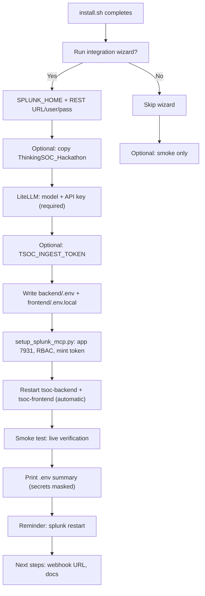

# Post-install integration wizard

After `sudo bash install.sh` finishes (main stack: Docker, backend, frontend), an **optional integration wizard** configures Splunk, LiteLLM, and Splunk MCP for the hackathon demo. It writes `backend/.env` and `frontend/.env.local`, configures Splunk on the instance, **verifies live connectivity** (smoke test), prints editable variables, and reminds you to **restart Splunk**.

**Related:** [11-environment-configuration.md](./11-environment-configuration.md) (full `.env` reference) · [15-splunk-mcp-integration.md](./15-splunk-mcp-integration.md) (MCP runtime) · [install/README.md](../install/README.md) (installer + service modes)

---

## When it runs

| Trigger | Command |
|---------|---------|
| End of `install.sh` (interactive) | Prompt: *Run integration setup wizard now?* (default **Yes**) |
| Any time later | `sudo bash scripts/configure-integration.sh` |
| Verification only | `sudo bash install/smoke-integration-config.sh` or `bash scripts/configure-integration.sh --smoke` |

Skip entirely: `NON_INTERACTIVE=true sudo bash install.sh` — run `configure-integration.sh` later when ready.

---

## End-to-end flow



---

## What you enter (interactive)

| Input | Required? | Default |
|-------|-------------|---------|
| Run wizard | — | Yes |
| `SPLUNK_HOME` | No (Enter = default) | `/opt/splunk` or detected `bin/splunk` |
| `SPLUNK_MGMT_URL` | No | `https://127.0.0.1:8089` |
| Splunk REST username | No (empty = skip REST/MCP) | — |
| Splunk REST password | If username set | hidden |
| Install `ThinkingSOC_Hackathon` | If Splunk binary exists | Yes |
| Replace existing app copy | If dest exists | No |
| Restart Splunk after app copy | — | Yes |
| `LITELLM_MODEL` | Always (LiteLLM required) | Menu (default: current `.env` or `gpt-4o-mini`) |
| `LITELLM_API_KEY` | Always | **Required** (hidden input) |
| `LITELLM_API_BASE` | Always | Optional proxy URL (Enter to skip) |
| Shared ingest token | — | No (auto-generated if Yes) |
| Restart `tsoc-backend` + `tsoc-frontend` | Before smoke | Automatic (no prompt) |

**Not typed by you:** `TSOC_INGEST_TOKEN` (when enabled) and MCP bearer token are generated by scripts.

---

## What runs automatically

| Step | Action |
|------|--------|
| `.env` | Upsert Splunk, `LITELLM_MODEL` / `LITELLM_API_KEY` / `LITELLM_API_BASE`, ingest, MCP flags in `backend/.env`; frontend Splunk hints + ingest |
| Splunk MCP | `scripts/setup_splunk_mcp.py`: install/enable **Splunk_MCP_Server** (7931), grant `mcp_tool_execute` on user roles, mint token into `.env` |
| Backend | Optional `systemctl restart tsoc-backend` or background PID restart |
| **Smoke test** | Live checks (see below) — confirms integration works **now** |
| Summary | Lists post-install keys from disk (passwords/tokens masked) |
| Splunk | Prints **`$SPLUNK_HOME/bin/splunk restart`** (required after app/MCP changes) |

---

## Smoke test (live verification)

Purpose: confirm post-install integration works at the end of the wizard — not only that files exist.

| Check | Pass | Fail / warn |
|-------|------|-------------|
| `backend/.env` exists | ✓ | ✗ missing |
| Backend `GET /health` | ✓ (waits if port open) | ✗ not running |
| `SPLUNK_HOME` path + binary | ✓ / warn | ✗ path missing |
| `ThinkingSOC_Hackathon` under Splunk apps | ✓ / warn if missing | |
| `SPLUNK_MGMT_URL` + frontend host/port match | ✓ | ✗ mismatch |
| Splunk REST login (`services/auth/login`) | ✓ if creds set | ✗ bad creds |
| `TSOC_MCP_ENABLED` | ✓ | warn |
| `SPLUNK_MCP_TOKEN` + `GET /api/v1/mcp/status` | ✓ connected | warn if backend down or MCP not connected |
| `LITELLM_API_KEY` (+ model) | ✓ | ✗ missing |
| `TSOC_INGEST_TOKEN` backend = frontend | ✓ if set | ✗ mismatch |

**Verdict messages:**

- **Passed:** `Verification passed: integration looks good`
- **Passed with warnings:** review warnings (e.g. Splunk restart still needed, MCP not connected yet)
- **Failed:** fix listed failures, then re-run smoke

```bash
sudo bash install/smoke-integration-config.sh
# or
bash scripts/configure-integration.sh --smoke
```

---

## Scripts

| Script | Role |
|--------|------|
| [scripts/configure-integration.sh](../scripts/configure-integration.sh) | Re-run full wizard (root) |
| [install/smoke-integration-config.sh](../install/smoke-integration-config.sh) | Smoke only |
| [scripts/setup_splunk_mcp.py](../scripts/setup_splunk_mcp.py) | Splunk-side MCP: app, enable, RBAC, mint token → `backend/.env` |
| [scripts/mint_splunk_mcp_token.py](../scripts/mint_splunk_mcp_token.py) | Mint token only (app already on Splunk) |
| [scripts/splunk_mcp_lib.py](../scripts/splunk_mcp_lib.py) | Shared REST helpers (not run directly) |

### Optional environment variables (automation)

| Variable | Purpose |
|----------|---------|
| `TSOC_SPLUNK_MCP_APP_PACKAGE` | Local `.spl` / `.tgz` for `splunk install app` (instead of Splunkbase download) |
| `TSOC_SPLUNK_MCP_APP_URL` | Download URL (default: Splunkbase 7931) |
| `NON_INTERACTIVE` | Skip wizard during `install.sh` |

---

## Environment variables written by the wizard

These are the main keys the wizard touches (full reference: [11-environment-configuration.md](./11-environment-configuration.md)).

### `backend/.env`

| Variable | Set by wizard when |
|----------|-------------------|
| `SPLUNK_HOME` | Always (path prompt) |
| `SPLUNK_MGMT_URL` | Always |
| `SPLUNK_USERNAME` / `SPLUNK_PASSWORD` | If you enter REST user |
| `LITELLM_MODEL` | Always (wizard) |
| `LITELLM_API_KEY` | Always (required) |
| `LITELLM_API_BASE` | Optional |
| `TSOC_INGEST_TOKEN` | If you enable shared ingest token (auto-generated; see [11-environment-configuration.md](./11-environment-configuration.md#tsoc_ingest_token-optional-ingest-auth)) |
| `TSOC_INGEST_AUTO_ANALYZE` | `true` on fresh install (`install.sh` / `.env.example`) — auto triage after ingest |
| `TSOC_INGEST_AUTO_ANALYZE_PIPELINE` | `triage` (default) |
| `TSOC_MCP_ENABLED` | Always `true` |
| `SPLUNK_MCP_URL` | After MCP setup (default `{SPLUNK_MGMT_URL}/services/mcp`) |
| `SPLUNK_MCP_TOKEN` | After `setup_splunk_mcp.py` / mint |
| `SPLUNK_MCP_VERIFY_SSL`, `TSOC_SPL_*`, `TSOC_MCP_SAIA_*`, … | Defaults from [mint script](../scripts/mint_splunk_mcp_token.py) / MCP lib |

### `frontend/.env.local`

| Variable | Set by wizard when |
|----------|-------------------|
| `NEXT_PUBLIC_TSOC_SPLUNK_HOST` / `PORT` | Parsed from `SPLUNK_MGMT_URL` |
| `TSOC_INGEST_TOKEN` | Same as backend when ingest token enabled |

At the end of the wizard, a **masked summary** prints every post-install key and the file path so you can edit values manually.

---

## Splunk restart (required)

After copying `ThinkingSOC_Hackathon` and/or installing **Splunk MCP Server (7931)**, restart Splunk so apps and RBAC capabilities load:

```bash
$SPLUNK_HOME/bin/splunk restart
$SPLUNK_HOME/bin/splunk list app | grep -E 'thinking_soc|Splunk_MCP'
```

The wizard prints this block in yellow after the smoke test.

---

## Installer module layout

Loaded by [install/modules/post_configure.sh](../install/modules/post_configure.sh):

| File | Role |
|------|------|
| `helpers.sh` | Prompts, `.env` read, URL parse |
| `litellm.sh` | `LITELLM_MODEL` menu |
| `env_apply.sh` | Write `.env` files |
| `splunk_app.sh` | Copy `ThinkingSOC_Hackathon` |
| `mcp.sh` | Call `setup_splunk_mcp.py` |
| `restart.sh` | Restart `tsoc-backend` + `tsoc-frontend`, verify health/login |
| `smoke_probes.sh` | REST login + MCP API probes |
| `smoke.sh` | `run_integration_configure_smoke` |
| `summary.sh` | Env summary + Splunk restart reminder |
| `wizard.sh` | `run_post_install_configure` |

---

## Troubleshooting

| Symptom | What to do |
|---------|------------|
| Smoke: backend not on 9876 | `sudo systemctl restart tsoc-backend` or `scripts/start-tsoc-services.sh`, rerun smoke |
| Smoke: Splunk REST login failed | Check user/password, `SPLUNK_MGMT_URL`, TLS (`SPLUNK_VERIFY_SSL`) |
| Smoke: MCP not connected | Install Splunkbase app **7931**, restart Splunk, rerun `setup_splunk_mcp.py` |
| `splunk install app` failed | Set `TSOC_SPLUNK_MCP_APP_PACKAGE` to a local package; or install 7931 manually in Splunk UI |
| MCP mint HTTP 404 | App not installed/enabled; restart Splunk |
| LLM features empty | Set `LITELLM_API_KEY` and `LITELLM_MODEL` in `backend/.env` |
| Webhook 401 | Match `TSOC_INGEST_TOKEN` in backend and frontend |
| UI: Missing Authorization bearer token on `/splunk-connection` | Match `TSOC_INGEST_TOKEN` in both env files, then `sudo systemctl restart tsoc-frontend` (and backend) |

**Manual Splunk checklist:** [README.md § Splunk installation guide](../README.md#splunk-installation-guide)
