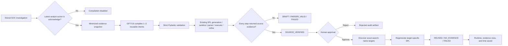

# ThinkingSOC Forge — hackathon product and demo guide

ThinkingSOC Forge is the hackathon addition to the existing ThinkingSOC repository. It turns one analyst-accepted security investigation into a short, executable, evidence-linked procedure that can accelerate a later alert from the same detection family.

The product promise is intentionally narrow:

> Convert accepted investigation work into a reusable, read-only runbook while keeping verification deterministic and approval human-controlled.

This document explains the public product story, the runtime role of GPT-5.6, the frontend/backend workflow, demo evidence, and the boundary between the implemented hackathon scope and future product work. Technical API and persistence details live in [25-verified-runbook-forge.md](./25-verified-runbook-forge.md); the economic model lives in [27-forge-us-soc-economic-impact.md](./27-forge-us-soc-economic-impact.md).

## 1. Problem

The existing product can ingest a Splunk alert, load full job results, enrich entities, generate Defender/Hunter/Judge analysis, propose investigation questions, generate and validate SPL, and present evidence to an analyst. Before Forge, the accepted reasoning from that investigation was not converted into a reusable operational procedure.

The consequence is repeated work:

1. a detection fires;
2. an analyst determines the important questions and evidence sources;
3. the analyst acknowledges the investigation;
4. the same detection fires again;
5. another analyst reconstructs much of the same procedure.

Forge makes the first accepted investigation improve the next one.

## 2. Hackathon product delta

| Existing capability | Forge delta built for the hackathon |
|---|---|
| Stored `soc_analysis` evidence | Eligibility gate and minimized compiler snapshot |
| Analyst acknowledge/escalate | Acknowledgment becomes the compilation gate |
| LiteLLM integration | One strict GPT-5.6 incident-to-runbook compilation call |
| Investigation-question SPL pipeline | Fresh SPL generation, sanitization, parser validation, execution, refinement, and result analysis for every runbook step |
| PostgreSQL `tsoc_records` | Append-only draft, approval, and reuse artifacts without a migration |
| Investigation Overview | Forge panel with statuses, step evidence, approval, compatible-target selection, and time-saved metrics |
| Integration settings | Dedicated **Runbooks → Forge & Policies** Sidebar surface |
| Evidence generator | Live compile, approval, target-run, and metrics artifacts |

Forge does not replace the baseline router or analysis pipeline. It creates a compounding knowledge loop on top of them.

## 3. End-to-end workflow



## 4. Why GPT-5.6 is core functionality

GPT-5.6 is not used merely to generate a summary or marketing text. Its runtime task is to generalize incident-specific evidence and investigation questions into one to three reusable investigation intents with:

- a title and purpose;
- ordered steps;
- expected evidence;
- a stop condition for each step;
- a conservative final decision rule;
- limitations and missing evidence.

The Runbook compiler is forbidden from returning SPL, containment actions, ticket changes, firewall changes, or other state-changing commands. A separate trusted pipeline turns each intent into current-alert SPL. Safe Response Preview uses a different strict prompt and schema for high-level, preview-only manual response options; it still forbids commands, scripts, queries, connector calls, and executable payloads.

The configured and provider-reported model identifiers, prompt/completion token counts, and generation duration are persisted in the draft and captured by the evidence pack. The final submission must configure the GPT-5.6 identifier actually exposed to the entrant account; source code intentionally does not guess or hardcode it.

## 5. Verification and trust boundary

| Status | Deterministic meaning |
|---|---|
| `DRAFT` | Structured output exists, but complete parser evidence does not. |
| `PARSER_VALID` | Every query parsed, but at least one source step returned no evidence. |
| `SOURCE_VERIFIED` | Every step parsed, executed without error, and returned at least one source evidence row. |
| `APPROVED` | A human approved the latest source-verified draft. |
| `REUSED` | Every regenerated target step executed and returned evidence. |
| `NO_EVIDENCE` | Target execution was valid, but at least one step returned zero rows. |
| `FAILED` | Generation, validation, execution, compatibility, or persistence failed. |

The LLM cannot assign these statuses and cannot approve itself. `SOURCE_VERIFIED` is not a claim that a procedure is universally correct; it is proof of bounded execution on the source investigation.

## 6. Safety and privacy controls

- Compilation and reuse are read-only.
- Existing bearer/session authentication protects every route.
- False-positive or benign investigations cannot become runbooks.
- The compiler receives a minimized structured snapshot, not unrelated stored records or credentials.
- Credential-shaped keys are removed before model input.
- The strict compiler schema rejects extra fields.
- Every executable step uses the existing SPL sanitizer and Splunk parser.
- Reuse requires the latest draft, a positive human approval, a different target record, and exact `search_name` equality.
- Compatible-target discovery returns only minimal metadata and never the target payload.
- Rebuild creates a new `runbook_id`, preventing stale approval reuse.
- Errors and zero-evidence outcomes remain visible rather than becoming a green status.
- Response options use an evidence-sensitive action allowlist and deterministic command-text blocking.
- Incomplete source evidence permits only monitoring, evidence collection, or escalation.
- Response approval is append-only, requires a review note for manual action, records that no automatic execution occurred, and has no execution endpoint.

## 7. Frontend product experience

### Investigation Overview

The **ThinkingSOC Forge** panel provides:

- acknowledgment and runtime readiness gates;
- build/rebuild loading and error states;
- honest status badges and verification disclaimer;
- a responsive source-to-reuse execution graph with rectangular, description-bearing nodes, persistent selection details, and subtle hover/focus elevation;
- expandable step cards containing intent, expected evidence, stop condition, SPL, parser status, row count, truncation, errors, result analysis, and provenance;
- approval/rejection note and human decision timestamp;
- automatic exact-match target discovery with manual-ID fallback;
- target-specific evidence and target investigation link;
- runtime, evidence-row, minutes-saved, and savings-percentage cards.
- Safe Response Preview cards containing target, risk, rationale, prerequisites, expected effect, rollback, verification, and a separate manual-action approval gate.

The graph stacks vertically on narrow and medium screens. On wide screens it becomes horizontal; longer paths use an explicit overflow viewport rather than squeezing or clipping node text. All nodes are keyboard-accessible buttons, selected details do not depend on hover, decorative connectors are hidden from assistive technology, and reduced-motion preferences are respected.

### Sidebar settings

**Runbooks → Forge & Policies** exposes:

- enable/disable for new compile, approval, and reuse operations;
- compiler step cap (`1..3`);
- visible default manual baseline (`5..120` minutes);
- append-only artifact scan limit (`50..1000`);
- PostgreSQL, compiler-model, Splunk, and execution readiness;
- fixed, non-configurable trust policies.

## 8. Backend and persistence surface

Public operations remain inside the existing Investigation API:

| Method | Path |
|---|---|
| `GET` | `/api/v1/investigation/runbook-settings` |
| `POST` | `/api/v1/investigation/records/{record_id}/runbook` |
| `GET` | `/api/v1/investigation/records/{record_id}/runbook` |
| `GET` | `/api/v1/investigation/records/{record_id}/runbook/compatible-targets` |
| `POST` | `/api/v1/investigation/records/{record_id}/runbook/approval` |
| `POST` | `/api/v1/investigation/records/{target_record_id}/runbook-runs` |

Artifacts use the existing PostgreSQL JSONB store:

- `verified_runbook_draft`;
- `verified_runbook_approval`;
- `verified_runbook_run`.

No service, queue, worker, table, or migration is introduced for the hackathon implementation.

## 9. Three-minute demo

| Time | Screen and proof |
|---:|---|
| `0:00–0:20` | Explain the repeat-investigation problem and distinguish baseline ThinkingSOC from Forge. |
| `0:20–0:45` | Open a stored source investigation; show verdict, evidence, questions, and acknowledgment. |
| `0:45–1:20` | Build; show GPT-5.6 metadata, generated steps, SPL parser results, execution rows, and `SOURCE_VERIFIED`. |
| `1:20–1:40` | Approve; explain that model output cannot approve or set verification status. |
| `1:40–2:15` | Select an automatically discovered exact-match target and run the approved runbook. |
| `2:15–2:40` | Show target-specific SPL/evidence, `REUSED`, runtime, and editable manual baseline. |
| `2:40–2:55` | Show evidence artifacts, tests, and the hackathon change log. |
| `2:55–3:00` | Close with: “Every accepted investigation can make the next one faster.” |

## 10. Reproducible acceptance evidence

The submission generator writes live, unedited artifacts:

```bash
python submission/generate_evidence_pack.py \
  --forge-source-record-id 582 \
  --forge-target-record-id 583 \
  --forge-manual-minutes 25
```

Required Forge outputs:

| Artifact | Proof |
|---|---|
| `07_forge_source_record.json` | Real stored source shape and eligibility context |
| `08_forge_compile.json` | Model metadata, strict draft, SPL/parser/execution evidence, and source status |
| `09_forge_approval.json` | Separate human decision |
| `10_forge_target_run.json` | Target-specific execution and outcome |
| `11_forge_metrics.json` | Step success, runtime, manual baseline, and time saved |

Passing evidence must never be hand-edited. If Splunk, GPT-5.6, PostgreSQL, compatibility, or execution fails, the artifact must preserve the failure.

## 11. Submission claims that are safe to make

Supported claims:

- Forge converts accepted investigation evidence into reusable structured intent.
- Verification status comes from parser and execution evidence, not model confidence.
- Reuse regenerates and revalidates SPL for the target alert.
- Human approval and exact detection matching remain mandatory.
- The product records observed automated runtime and an explicit manual baseline.
- Safe Response Preview can recommend bounded manual response options while keeping automatic execution technically unavailable.

Claims that require more data and must not be made from one demo:

- universal runbook correctness;
- a guaranteed false-positive reduction;
- a guaranteed breach-cost reduction;
- autonomous incident closure or containment;
- organization-wide savings without measured eligible volume and total operating cost.

## 12. Implemented scope versus future work

The repository-specific hackathon plan still defers statistical precision/recall against a labeled ground-truth cohort, semantic matching, a runbook marketplace, dedicated version tables, a revalidation worker, and autonomous actions. Historical same-name/different-SID Shadow Replay and its technical Evaluation Dashboard are implemented, but they are not represented as a substitute for a labeled accuracy study.

## 13. Related documents

- [Technical implementation and API](./25-verified-runbook-forge.md)
- [U.S. SOC capacity and economic impact](./27-forge-us-soc-economic-impact.md)
- [Investigation workflow](./20-investigation-workflow.md)
- [Investigation SPL pipeline](./13-cim-investigation-spl-mcp.md)
- [Storage and persistence](./19-storage-persistence.md)
- [Submission evidence guide](../submission/README.md)
- [Hackathon change log](../HACKATHON_CHANGELOG.md)
