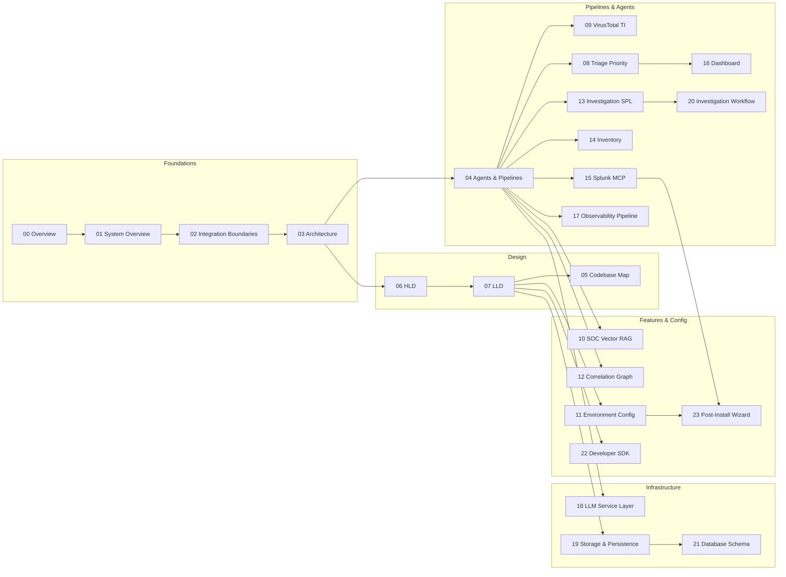

# Documentation — software structure

This folder describes **what the system is and how it is organized**: components, integration boundaries, architecture, agent pipelines, design documents, and a code-level map.

**Start here:** [00-overview.md](./00-overview.md) (reading guide and document index).

| # | Document | Content |
|---|----------|---------|
| 00 | [00-overview.md](./00-overview.md) | Documentation guide and reading order |
| 01 | [01-system-overview.md](./01-system-overview.md) | Problem, components, repository map, deployment |
| 02 | [02-integration-boundaries.md](./02-integration-boundaries.md) | Splunk ↔ application contracts (webhook, REST, MCP) |
| 03 | [03-architecture.md](./03-architecture.md) | Runtime layers, request lifecycle, persistence |
| 04 | [04-agents-and-pipelines.md](./04-agents-and-pipelines.md) | LLM router (exclusive Security/Obs), pipelines, AI stack |
| 05 | [05-codebase-map.md](./05-codebase-map.md) | Code graph, communities, critical flows, navigation |
| 06 | [06-hld-high-level-design.md](./06-hld-high-level-design.md) | **HLD** — services, data flow, pipelines |
| 07 | [07-lld-low-level-design.md](./07-lld-low-level-design.md) | **LLD** — contracts, APIs, schema, sequences |
| 08 | [08-triage-priority-layer.md](./08-triage-priority-layer.md) | **Triage** — post-analysis priority queue, scoring, API, UI |
| 09 | [09-virustotal-threat-intel.md](./09-virustotal-threat-intel.md) | **VirusTotal** — IOC extraction rules (allowlisted fields), API v3 mapping, compact TI |
| 10 | [10-soc-vector-rag.md](./10-soc-vector-rag.md) | **SOC vector RAG** — Qdrant + FastEmbed, persisted chat, session RAG, Text-to-SQL, correlation in chat |
| 11 | [11-environment-configuration.md](./11-environment-configuration.md) | **Environment** — backend/frontend `.env` reference (all `TSOC_*`, LiteLLM, Splunk, RAG) |
| 12 | [12-correlation-graph-service.md](./12-correlation-graph-service.md) | **Correlation** — Neo4j alert graph, findings, Graph Explorer, Smart Attack Discovery API |
| 13 | [13-cim-investigation-spl-mcp.md](./13-cim-investigation-spl-mcp.md) | **Investigation SPL** — SAIA REST `/predict`, MCP execute (All Time), refine loop, UI results |
| 14 | [14-inventory-service.md](./14-inventory-service.md) | **Inventory** — users, assets, relationships, enrichment, risk context, demo seed |
| 15 | [15-splunk-mcp-integration.md](./15-splunk-mcp-integration.md) | **Splunk MCP** — JSON-RPC client, tool registry, Hunter/Judge evidence, SAIA, SPL execute |
| 16 | [16-dashboard.md](./16-dashboard.md) | **Dashboard** — analyst overview, KPIs, triage charts, activity timeline, health score, system resources |
| 17 | [17-observability-pipeline.md](./17-observability-pipeline.md) | **Observability pipeline** — Entity → Impact → Diagnoser → Responder → Ops Judge, LLM vs rule-based |
| 18 | [18-llm-service-layer.md](./18-llm-service-layer.md) | **LLM service** — LiteLLM wrapper, error classification, thinking extraction, context budget |
| 19 | [19-storage-persistence.md](./19-storage-persistence.md) | **Storage** — PostgreSQL `tsoc_records`, record types, persist/query, dashboard stats |
| 20 | [20-investigation-workflow.md](./20-investigation-workflow.md) | **Investigation** — timeline reconstruction, analyst acknowledge/escalate, human-in-the-loop |
| 21 | [21-database-schema.md](./21-database-schema.md) | **Database schema** — PostgreSQL tables, Qdrant collection, Neo4j graph, indexes, init flow |
| 22 | [22-developer-sdk.md](./22-developer-sdk.md) | **Developer SDK** — typed Python SDK, async client, CLI, evaluation runner, API reference |
| 23 | [23-post-install-integration-wizard.md](./23-post-install-integration-wizard.md) | **Post-install wizard** — Splunk / LiteLLM / MCP setup, smoke test, `.env` summary, Splunk restart |
| 24 | [24-demo-postgresql-data.md](./24-demo-postgresql-data.md) | **Demo data** — moment PostgreSQL snapshot, `install.sh` auto-load, export script |

Subfolders (`code-graph/`, etc.) include their own **`README.md`** index. The repository also has per-folder READMEs under `backend/`, `thinking_soc_splunk_app/`, `setup_tool/`, and elsewhere.

**System diagram (repository root):** [architecture_diagram.md](../architecture_diagram.md)

**License:** [Apache License 2.0](../LICENSE)
