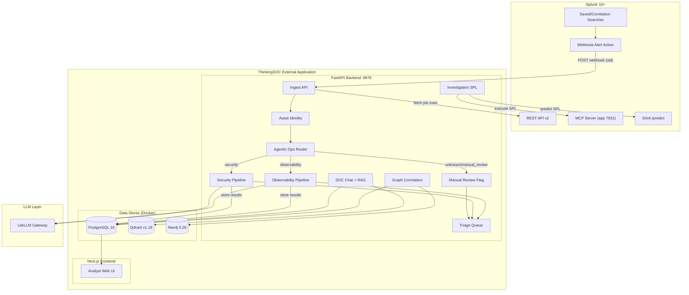
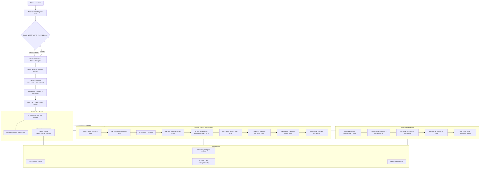
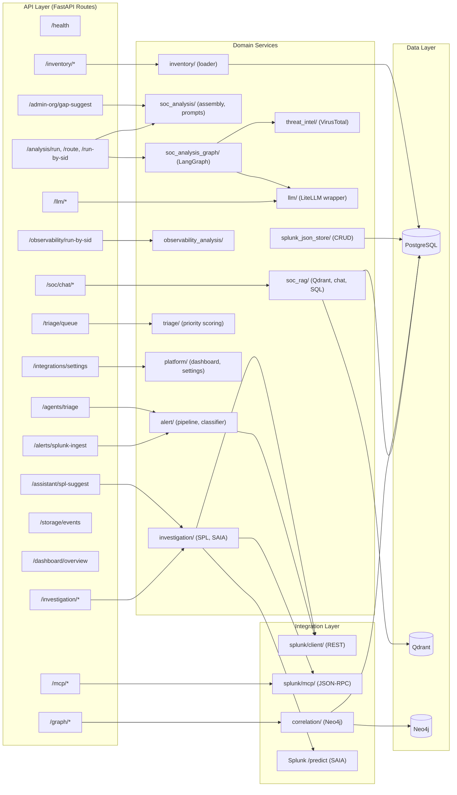
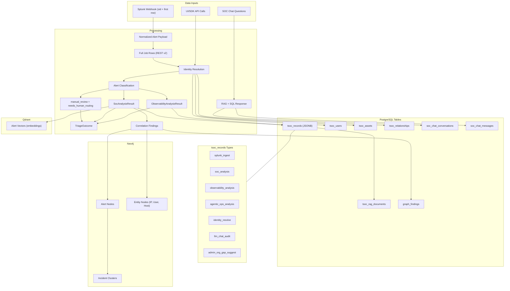
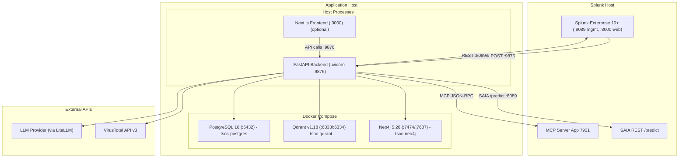
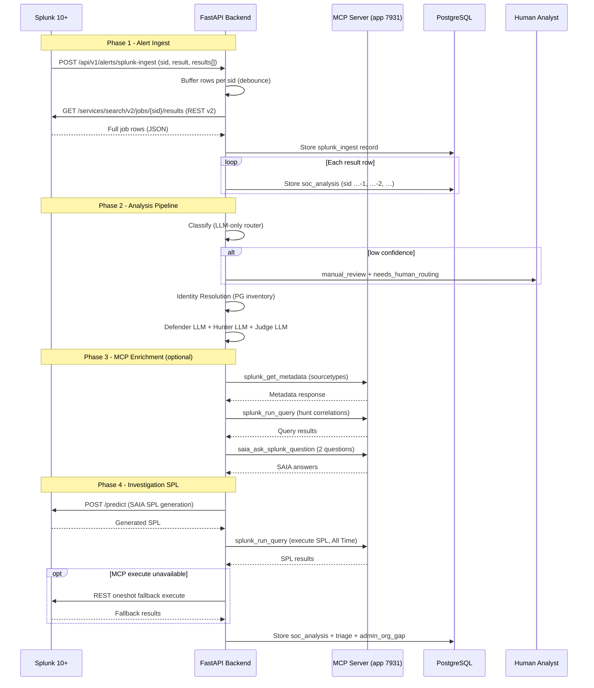

# ThinkingSOC Architecture Diagrams — Multi-View

Eight architectural perspectives of the **ThinkingSOC Agentic Ops Router** hackathon demo.

---

## 1. High-Level System Overview

Bird's-eye view showing the two integration zones (Splunk vs External App) and all major components.

---

## 2. Analytical Pipeline (SOC Analysis Flow)

How an alert is analyzed — from raw webhook to final Judge verdict with all LangGraph nodes.

---

## 3. Backend Service Architecture

Module-level view showing FastAPI routes, domain services, and external integrations.

---

## 4. Data Flow and Persistence

How data moves through the system and what gets stored where.

---

## 5. Infrastructure and Deployment

Physical deployment view of all processes and their ports.

---

## 6. Splunk Integration Boundaries

Wire-level sequence of all communication between Splunk and the external app.

---

## 7. End-to-End Story (Narrative Flow)

What happens from the moment a Splunk alert fires to the final analyst verdict — told as a step-by-step journey.

```mermaid
flowchart TD
  A["1. Splunk saved search or correlation alert fires"]
  B["2. Splunk Webhook posts sid + search_name + first result row"]
  B1{"2.1 TSOC_INGEST_AUTO_ANALYZE=true?"}
  B2["2.2 202 Accepted and background triage starts"]
  C["3. Backend normalizes to SplunkAlertIngest with stable normalized fields"]
  D["4. Backend fetches full rows by sid via Splunk REST v2"]
  E["5. Inventory enrichment resolves user/asset identity"]
  E1["5.1 Reads tsoc_users"]
  E2["5.2 Reads tsoc_assets"]
  E3["5.3 Uses tsoc_relationships to fill missing side"]
  F{"6. Agentic Ops Router decides track"}

  G["7a. SECURITY path starts"]
  H["8a. LangGraph prepare + risk_engine"]
  H1["8a.1 Builds risk_context from user risk, asset criticality, department"]
  I["9a. VirusTotal enrichment for IOC evidence"]
  J["10a. Defender stage (benign / alternative hypothesis)"]
  K["11a. Hunter stage (investigation expansion)"]
  K1["11a.1 MCP hunts Splunk metadata + run_query for extra evidence"]
  L["12a. Judge stage (final verdict)"]
  L1["12a.1 MCP asks SAIA questions and verifies with run_query"]
  M["13a. Framework mapping + investigation questions"]
  N["14a. Investigation SPL chain: /predict -> parser -> execute -> refine"]
  N1["14a.1 Prefer MCP splunk_run_query (All Time)"]
  N2["14a.2 Fallback to REST oneshot when MCP execute fails"]
  N3["14a.3 MCP failures are non-fatal, LLM/rule path continues"]

  O["7b. OBSERVABILITY path starts"]
  P["8b. Diagnoser stage (root-cause hypotheses)"]
  Q["9b. Responder stage (mitigation steps)"]
  R["10b. Ops Judge stage (final operational verdict)"]
  R1["7c. MANUAL_REVIEW path (unknown/low confidence)"]
  R2["8c. Human routing flag for analyst decision"]

  S["15. Triage scoring calculates investigation_priority + triage_score"]
  T["16. Admin Org GAP suggests one org question when needed"]
  U["17. Persist typed records in tsoc_records"]
  U1["17.1 record types: splunk_ingest, soc_analysis, observability_analysis, agentic_ops_analysis, identity_resolve, admin_org_gap_suggest, llm_chat_audit"]
  V["18. SOC Chat reads from Postgres + Qdrant and can query correlation findings"]
  W["19. Correlation layer stores findings in graph_findings and graph relations in Neo4j"]
  X["20. Analyst sees final output in UI: verdict, evidence, triage, SPL, correlation"]

  A --> B --> B1
  B1 -->|"yes"| B2
  B1 -->|"no"| C
  B2 --> C
  C --> D --> E
  E --> E1
  E --> E2
  E --> E3
  E --> F

  F -->|"Security"| G
  F -->|"Observability"| O
  F -->|"Unknown/manual_review"| R1 --> R2 --> S

  G --> H --> H1 --> I --> J --> K --> K1 --> L --> L1 --> M --> N --> N1 --> N2 --> N3 --> S
  O --> P --> Q --> R --> S

  S --> T --> U --> U1 --> V --> W --> X
```

---

## 8. Complete Competition Capability Map (Power View)

This view lists all critical capabilities judges care about: data sources, enrichment, autonomous search, analysis reasoning, storage, and analyst outputs.

```mermaid
flowchart LR
  subgraph inputPlane ["Input Plane"]
    SplunkAlerts["Splunk Alerts (saved/correlation searches)"]
    SplunkWebhook["Webhook Alert Action"]
    ManualAPI["Manual API Calls (/analysis/route, /agents/triage, /analysis/run-by-sid, /observability/run-by-sid)"]
  end

  subgraph ingestionPlane ["Ingestion + Normalization"]
    IngestAPI["POST /api/v1/alerts/splunk-ingest"]
    NormalizePayload["normalize_splunk_ingest_payload"]
    SplunkRESTv2["Splunk REST v2 job results by sid"]
    IngestStore["persist_splunk_ingest_summary"]
  end

  subgraph contextPlane ["Context and Enrichment"]
    InventoryUsers["tsoc_users (identity + risk_score)"]
    InventoryAssets["tsoc_assets (criticality + owner)"]
    InventoryRels["tsoc_relationships (user-asset links)"]
    Resolver["enrichment_resolver (identity confidence + matched rules)"]
    RiskContext["risk_context builder"]
    VTIntel["VirusTotal v3 IOC enrichment"]
  end

  subgraph routingPlane ["Routing Intelligence"]
    LLMRouter["LLM alert classifier (full payload + optional MCP)"]
    ExclusiveGuard["Exclusive track guard (no dual/both)"]
    RouteDecision["recommended_pipeline + confidence + signals"]
    LLMRouter --> ExclusiveGuard --> RouteDecision
  end

  subgraph securityPlane ["Security Analysis Plane"]
    SecGraph["LangGraph nodes: prepare -> risk_engine -> virustotal -> defender -> hunter -> judge -> framework_mapping -> investigation_questions -> root_cause_spl"]
    HunterMCP["Hunter MCP evidence: splunk_get_metadata + splunk_run_query"]
    JudgeMCP["Judge MCP evidence: saia_ask_splunk_question + splunk_run_query"]
    SplPredict["REST /predict for SPL generation"]
    SPLParser["Splunk parser validation"]
    SPLExecute["MCP execute SPL (All Time) + refine loop"]
    SPLFallback["REST oneshot fallback when MCP execute fails"]
    MCPNonFatal["MCP failure handling: continue via LLM/rule path"]
    AdminGap["Admin Org GAP suggestion"]
  end

  subgraph observabilityPlane ["Observability Analysis Plane"]
    ObsPipeline["Entity -> Impact -> Diagnoser -> Responder -> Ops Judge"]
  end

  subgraph aiPlane ["AI and Tooling Plane"]
    LiteLLM["LiteLLM model gateway"]
    SplunkMCP["Splunk MCP JSON-RPC tools"]
    ControlAPI["Control endpoints: /mcp/status, /llm/status, /integrations/settings"]
  end

  subgraph persistencePlane ["Persistence Plane"]
    TSOCRecords["tsoc_records JSONB"]
    RecordTypes["Record types: splunk_ingest, soc_analysis, observability_analysis, agentic_ops_analysis, identity_resolve, admin_org_gap_suggest, llm_chat_audit"]
    TriageQueue["Triage queue (triage_score, investigation_priority, review_verdict)"]
    GraphFindings["graph_findings (correlation findings)"]
    StorageAPI["Storage query endpoint: /storage/events"]
  end

  subgraph knowledgePlane ["Knowledge and Correlation Plane"]
    QdrantStore["Qdrant semantic index"]
    Neo4jGraph["Neo4j alert-entity-incident graph"]
    CorrelationService["Correlation APIs (/api/v1/graph/*)"]
    SOCChat["SOC Chat (RAG + Text-to-SQL)"]
  end

  subgraph outputPlane ["Analyst Output Plane"]
    FrontendUI["Next.js analyst UI"]
    VerdictOutput["Judge/OpsJudge final verdict + rationale + next_step"]
    EvidenceOutput["Evidence refs + MCP evidence + VirusTotal findings"]
    ActionOutput["Investigation SPL + execution results + triage priority"]
  end

  SplunkAlerts --> SplunkWebhook --> IngestAPI
  ManualAPI --> IngestAPI
  IngestAPI --> NormalizePayload --> SplunkRESTv2 --> IngestStore

  NormalizePayload --> Resolver
  InventoryUsers --> Resolver
  InventoryAssets --> Resolver
  InventoryRels --> Resolver
  Resolver --> RiskContext
  RiskContext --> LLMRouter
  VTIntel --> LLMRouter
  RouteDecision -->|"unknown/manual_review"| TriageQueue

  RouteDecision -->|"security only"| SecGraph
  RouteDecision -->|"observability only"| ObsPipeline
  SecGraph --> HunterMCP
  SecGraph --> JudgeMCP
  SecGraph --> SplPredict --> SPLParser --> SPLExecute
  SPLExecute --> SPLFallback
  SecGraph --> MCPNonFatal
  SecGraph --> AdminGap

  HunterMCP --> SplunkMCP
  JudgeMCP --> SplunkMCP
  SPLExecute --> SplunkMCP
  SPLFallback --> SplunkRESTv2
  SecGraph --> LiteLLM
  ObsPipeline --> LiteLLM
  LLMRouter --> LiteLLM
  ControlAPI --> SplunkMCP
  ControlAPI --> LiteLLM

  IngestStore --> TSOCRecords
  SecGraph --> TSOCRecords
  ObsPipeline --> TSOCRecords
  AdminGap --> TSOCRecords
  TSOCRecords --> RecordTypes
  TSOCRecords --> TriageQueue
  TSOCRecords --> StorageAPI

  TSOCRecords --> QdrantStore
  CorrelationService --> GraphFindings
  CorrelationService --> Neo4jGraph
  GraphFindings --> SOCChat
  Neo4jGraph --> SOCChat
  TSOCRecords --> SOCChat
  QdrantStore --> SOCChat

  TSOCRecords --> FrontendUI
  TriageQueue --> FrontendUI
  GraphFindings --> FrontendUI
  SOCChat --> FrontendUI

  FrontendUI --> VerdictOutput
  FrontendUI --> EvidenceOutput
  FrontendUI --> ActionOutput
```

Key competitive strengths captured in this map:

- Full-context enrichment (`sid` -> all rows, not only first row)
- Identity and asset awareness (`tsoc_users`, `tsoc_assets`, `tsoc_relationships`)
- Exclusive single-track routing (Security **or** Observability per alert, plus manual_review path)
- Autonomous Splunk tool use via MCP (metadata/query/SAIA question answering)
- Structured reasoning outputs (Defender/Hunter/Judge and Diagnoser/Responder/Ops Judge)
- Actionable output (generated SPL + parser validation + execution + refine loop + triage priority)
- Resilience behavior (MCP non-fatal continuation + REST oneshot fallback)
- Multi-store intelligence (PostgreSQL + Qdrant + Neo4j) with SOC Chat and Correlation integration

---

## Related documents

- [01-system-overview.md](./01-system-overview.md) — system overview and repository map
- [03-architecture.md](./03-architecture.md) — runtime layers and request lifecycle
- [04-agents-and-pipelines.md](./04-agents-and-pipelines.md) — router and pipeline internals
- [06-hld-high-level-design.md](./06-hld-high-level-design.md) — high-level design
- [07-lld-low-level-design.md](./07-lld-low-level-design.md) — low-level contracts and APIs
- [12-correlation-graph-service.md](./12-correlation-graph-service.md) — graph correlation service
